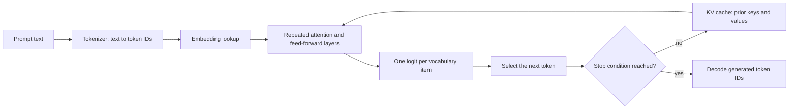

# 000: Start Here: Build an LLM Inference Engine

## What Inference School Studio is

A **large language model (LLM)** is a learned numerical model that receives a
sequence of tokens and produces scores for what token should come next. A
**decoder-only** model predicts using only the tokens at or before the current
position. **Inference** means running an already trained model to produce those
predictions; unlike training, it does not update the model's learned weights.

Inference School Studio is a hands-on course for learning how that inference works from
the arithmetic upward. It combines a lesson reader, editable Swift and Metal
source files, and correctness checks in one macOS app. The repository also
provides the same material as a companion book and command-line project.

This is not a chatbot application and it does not train a language model. You
will implement individual inference operators, measure their behavior, and
then connect them into a small deterministic educational engine. The capstone
uses a seven-token synthetic model: its purpose is to expose the complete
execution path and make every result independently checkable, not to generate
useful prose. Generation in that capstone runs on the readable CPU reference
backend; Metal executes a named verification slice rather than a complete GPU
inference backend.

There are 47 runnable problems after this orientation. They progress from one
dot product through tensors, neural-network operators, attention, KV-cache
engineering, quantization, complete inference, and performance decisions.

## Who the course is for

The course assumes that you can read basic Swift, write loops and functions,
and follow scalar arithmetic. It does not assume prior Metal experience or
prior knowledge of transformer internals. Every required model, math, GPU, and
systems concept is introduced in the course before you are expected to use it.
The math primer is available for extra derivations, but it is part of the
course rather than an external prerequisite.

You are expected to do more than make checks turn green. For each operator,
you should be able to:

1. state what the inputs and outputs mean;
2. predict a small result or performance trend before running code;
3. implement the simplest correct CPU behavior;
4. map that behavior to Metal when the lesson includes a GPU stage;
5. compare results using the lesson's stated numerical tolerance; and
6. explain the tradeoff shown by the evidence you collected.

## How to use the Studio

Select a lesson in the catalog. Runnable lessons show the lesson reader and a
workbench containing the chapter-owned starter files. This orientation is
reader-only, so it deliberately has no editor or Run button.

Use the same loop for each runnable problem:

1. **Read.** Learn the operator's purpose, vocabulary, shape contract, and
   correctness method.
2. **Predict.** Work through the small example and write down what should
   happen before executing anything.
3. **Implement.** Replace the incomplete bodies in the learner source files.
4. **Run.** Use the CPU and Metal checks shown by the workbench. A passing
   check means the implementation met the tested contract; a failure is
   evidence to inspect, not a reason to copy the canonical code.
5. **Explain.** Complete the experiments and state why the implementation is
   correct, where time and memory go, and which tradeoffs the measurements
   support.
6. **Mark progress.** Check the chapter's completion items. Checkboxes persist
   locally, but they are a learning record, not a substitute for executable
   checks or your explanation.

The Text Size menu in the toolbar scales lesson text, controls, source code,
and results from 80% through 200%. The keyboard commands are Command-Plus to
increase, Command-Minus to decrease, and Command-Zero to return to 100%.

If you prefer a terminal, each lesson also gives focused `swift run inference-school`
commands. The app and command line use the same course sources and judges.

## Trust and local execution

Before the first runnable lesson, the packaged Studio asks you to choose a
dedicated build folder through the macOS folder picker. It stores editable
sources, compiler output, and generated learner executables under that folder.
The Studio, separate runner, and learner executable are signed to use App
Sandbox. The Studio host has the client entitlement required by its bundled
WebKit views, and the runner currently inherits the Studio sandbox. Built-in
checks do not send learner code to a remote model or service.

The selected folder remains writable to learner code, and a bad implementation
can consume CPU, memory, or GPU time until cancellation or a timeout takes
effect. Use a dedicated folder and review third-party code before running it.
Command-line checks are not App Sandbox constrained; they use the permissions
of the terminal process that launches them.

## The inference path in plain language

An inference engine takes text that already exists and repeatedly predicts one
next token. After choosing a token, it adds that token to the context and
predicts again. The following concepts name the data and operations along that
path.

### Tokens, vocabulary, and tokenization

A **token** is an integer ID used by the model as one unit of input or output.
A token can represent a word, part of a word, punctuation, a byte, or a special
marker. Text and tokens are not interchangeable: a **tokenizer** applies fixed
rules that encode text into token IDs and decode IDs back into text or bytes.

The **vocabulary** is the complete finite set of token IDs the model supports.
If its size is `V`, valid IDs are `0..<V`. The tokenizer and model must agree on
what every ID means.

### Vectors, tensors, shapes, and weights

A **vector** is an ordered row of numbers. A **matrix** is a rectangular grid
of numbers. A **tensor** generalizes those ideas to any number of dimensions.
Its **shape** lists the size of each dimension, such as `[S,D]` for `S` token
positions whose representations each contain `D` numbers.

Model **weights** are numerical parameters established during training.
Inference treats them as fixed input data. A **projection** is a matrix
multiplication that uses weights to remix an input vector into a new vector;
it may change the vector's width or give the same numbers a new role.

### Embeddings and the residual stream

The model cannot calculate directly with a token ID. An **embedding table**
stores one learned vector per vocabulary item. Looking up a token ID selects
its initial vector representation.

That vector enters the **residual stream**, the main representation carried
from layer to layer. A **layer** is one repeated block of model operations. Its
attention branch and feed-forward branch each compute a change and add that
change back to the stream. This additive route preserves earlier information
while allowing every layer to refine it. **Normalization** rescales a vector
before a branch so values remain in a controlled numerical range.

### Queries, keys, values, and attention

**Attention** lets the representation at one token position gather relevant
information from token positions in its context. It does not consume the
residual stream directly. Three learned projections create a query, key, and
value for each attention head:

- A **query (Q)** represents what the current position is trying to find.
- A **key (K)** represents how one context position can be matched.
- A **value (V)** contains the information that position can contribute.

These descriptions explain the roles of the three vectors; they are not
literal text questions or database keys. The engine takes a **dot product**
between a query and each key. A dot product multiplies corresponding vector
elements and adds the products, producing one similarity score. **Softmax**
turns all visible scores into nonnegative weights that sum to one. The weighted
sum of the corresponding value vectors is the attention output.

A **causal mask** hides positions to the right of the current position, so a
prediction cannot use future tokens. Several **heads** perform this operation
in separate learned subspaces, allowing different matching patterns. Their
outputs are placed side by side and projected back into the residual stream.

Token order also matters. **RoPE**, or rotary position embeddings, rotates
pairs of query and key features according to their positions. Those rotations
make relative position affect query-key scores without adding a separate
position vector to the residual stream.

### Feed-forward branch, logits, and sampling

After attention, a layer's **feed-forward network**, also called an MLP,
transforms each token position independently through learned projections and a
nonlinear activation. Its output is added to the residual stream. Attention
mixes information across positions; the feed-forward branch transforms the
features within each position.

After the final layer, an output projection produces one **logit** for every
vocabulary item. A logit is an unnormalized score: larger means the model ranks
that token more highly, but logits are not probabilities. **Sampling** converts
or adjusts the scores and selects the next token according to a stated rule,
such as taking the largest score or drawing from a probability distribution.

### Prefill, decode, and the KV cache

Generation has two execution stages:

- **Prefill** processes all tokens in the input prompt. Their work can be
  arranged as larger matrix-matrix operations and many positions can be
  evaluated in parallel.
- **Decode** processes one newly generated token at a time. Each step depends
  on the token selected by the previous step, so generation is sequential
  across steps.

Every layer saves the keys and values produced for prior positions in a
**KV cache**. During decode, the new query reads those saved keys and values
instead of recomputing all earlier layers for every token. The cache makes that
reuse possible, but it consumes memory that grows with context length.

## CPU, Metal, and evidence

The **CPU** is the general-purpose processor that runs the Swift reference
implementations. The **GPU** performs large amounts of parallel arithmetic.
On Apple platforms, **Metal** is the programming API used here to submit GPU
work. A **kernel** is a function executed by many GPU threads; each thread owns
part of the data, and some algorithms require threads to synchronize while
combining partial results.

GPU execution is not automatically faster. Launch overhead, memory traffic,
temporary storage, synchronization, and problem size all matter. The course
therefore asks for predictions and measurements with explicit boundaries. A
benchmark supports only the claim it actually measured, on the configuration
it actually ran.

## How the course is organized

The progression is cumulative:

1. Problems 001-006 establish reductions, tensors, matrix operations, and GPU
   execution.
2. Problems 007-012 build normalization, activations, softmax, residual
   precision, and fused neural-network operators.
3. Problems 013-021 construct embeddings, Q/K/V projections, positional
   encoding, causal attention, head mappings, and optimized attention.
4. Problems 022-028 make the KV cache correct, bounded, paged, and measurable.
5. Problems 029-034 introduce quantized weights and kernels while preserving
   independently checked numerical behavior.
6. Problems 035-042 assemble model layers, tokenization, sampling, prefill,
   decode, memory plans, and parity boundaries.
7. Problems 043-047 use evidence to evaluate fusion, profiling, batching,
   speculative decoding, and the connected capstone.

When a later chapter names an earlier concept, use the catalog to revisit its
defining lesson. The appendices provide a one-token execution map and a math
primer, but the runnable sequence remains the source of truth for contracts and
checks.

## Completion checklist

- [ ] I can describe what the Studio, course, and capstone do and do not do.
- [ ] I know the read, predict, implement, run, explain, and mark-progress loop.
- [ ] I have set the text size to a comfortable reading level.
- [ ] I understand the packaged Studio's selected-folder sandbox and the command line's broader permissions.
- [ ] I can trace prompt text through tokens, embeddings, layers, logits, and a selected next token.
- [ ] I can explain the roles of Q, K, V, attention, the causal mask, and the KV cache without outside references.
- [ ] I am ready to begin Problem 001.