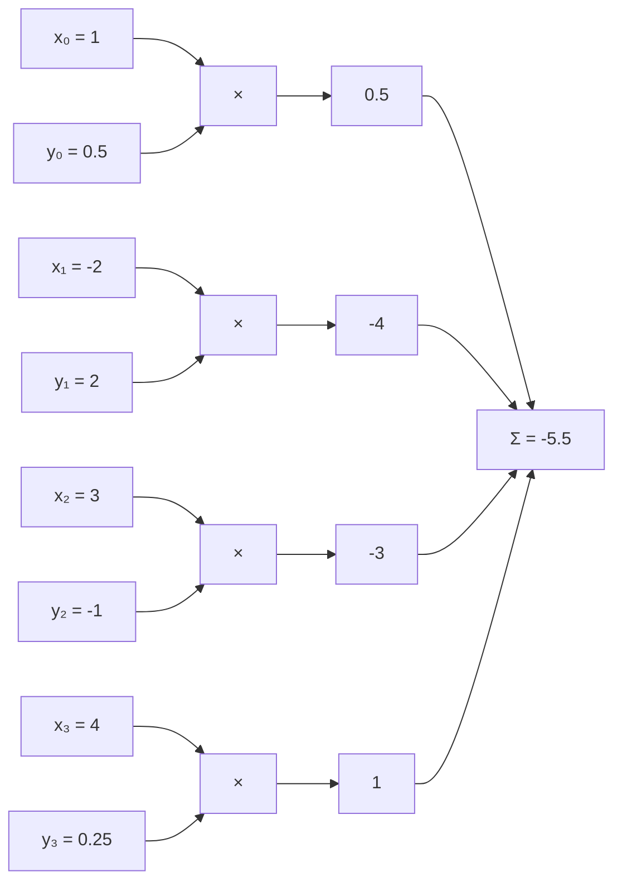
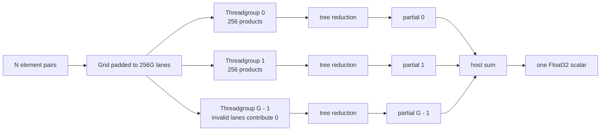

# 001: Vector Dot Product

## Why this exists

A dot product is not included because it is a convenient beginner loop. It is
the inner operation of two important inference paths:

- One output of matrix-vector multiplication is a row of weights dotted with an
  activation vector. Decode is full of these projections.
- One attention score is a query vector dotted with a key vector before scaling
  and softmax.

The equation is tiny, but its GPU implementation immediately exposes the core
systems questions of this course: bounds, work assignment, memory traffic,
parallel reduction, synchronization, floating-point order, launch overhead, and
when the CPU can beat the GPU.

## Learning outcomes

After this problem, you should be able to:

1. Derive a dot product and compute a small case by hand.
2. State its shape contract, operation count, and approximate input traffic.
3. Implement a readable Float32 CPU oracle.
4. Map elements to Metal threads and reduce 256 products per threadgroup.
5. Explain every required threadgroup barrier.
6. Explain why CPU and GPU results need not be bit-identical.
7. Measure size-dependent CPU and GPU behavior without calling one universally
   faster.
8. Connect the reduction to GEMV and attention.

## Prerequisites

- Swift loops, arrays, and thrown errors
- Scalar multiplication and addition
- No prior Metal experience is assumed

Read the dot-product, arithmetic-intensity, and floating-point sections in
[the math primer](../../docs/MATH-PRIMER.md).

## Vocabulary

**Reduction**
: An operation that combines many input values into fewer output values, often
  one. Sum, maximum, and dot product are reductions.

**Grid**
: All threads dispatched for one Metal compute command.

**Threadgroup**
: A group of threads that can synchronize and share fast threadgroup memory.

**Lane or thread index**
: The current thread's position in a grid or threadgroup.

**Barrier**
: A synchronization point that prevents participating threads from continuing
  until earlier accesses in the named memory space are visible as required.

**Partial sum**
: One threadgroup's contribution to the final result.

## Math from first principles

For vectors $\mathbf{x}, \mathbf{y} \in \mathbb{R}^{N}$,

$$
s = \mathbf{x} \cdot \mathbf{y}
  = \sum_{i=0}^{N-1} x_i y_i.
$$

For

$$
\mathbf{x} = [1, -2, 3, 4], \qquad
\mathbf{y} = [0.5, 2, -1, 0.25],
$$

the element products are

$$
[0.5, -4, -3, 1]
$$

and the result is $-5.5$.



Before coding, answer:

1. What should two empty vectors return under the usual empty-sum convention?
2. What should happen if the lengths differ?
3. What is the output shape?

This course uses $0$ for the empty dot product, throws on unequal lengths, and
returns one Float32 scalar.

## Shape, layout, and dtype contract

| Item | Contract |
| --- | --- |
| Left input | Contiguous Float32 vector `[N]` |
| Right input | Contiguous Float32 vector `[N]` |
| Output | One Float32 scalar |
| Accumulation | Float32 in learner and canonical implementations |
| Empty vectors | Return the empty sum, `0` |
| Unequal lengths | Throw `VectorDotError.lengthMismatch` |
| CPU/Metal comparison | Scale-aware relative tolerance |

The arrays are contiguous Swift storage on the CPU and shared Metal buffers on
the GPU. Later tensor problems make shape and stride metadata explicit; this
first problem deliberately begins with the simplest one-dimensional layout.

## Performance model

For length $N$:

- $N$ multiplications
- approximately $N$ additions
- about $2N$ FLOPs by the convention used in this course
- two Float32 input reads per element, or about $8N$ input bytes

Ignoring the scalar output and cache effects,

$$
I \approx \frac{2N}{8N} = 0.25\ \text{FLOP/byte}.
$$

That low arithmetic intensity predicts that a sufficiently large dot product
will usually be constrained by data movement rather than multiply-add capacity.
It does not predict the winner for small $N$, where Metal compilation, command
submission, allocation, and synchronization can dominate.

Write down this prediction before benchmarking:

> Below size ______, I expect ______ to win because ______. Above that size, I
> expect ______ to dominate because ______.

## CPU reference path

Open
[P001VectorDotExercise.swift](../../Sources/InferenceSchoolExercises/P001VectorDotExercise.swift).

Implement this algorithm without using an acceleration framework:

```text
if lengths differ, throw
sum = 0
for each valid index:
    sum += lhs[index] * rhs[index]
return sum
```

The point is to create the clearest executable meaning of the operator. Later
implementations are checked against this behavior.

Run only the CPU stage:

```sh
swift run inference-school check 001 --cpu
```

The judge includes:

- empty inputs;
- one element;
- mixed signs;
- 1,025 elements, which later crosses several 256-thread groups;
- unequal lengths.

### Checkpoint

Do not start the kernel until the CPU check reports `5/5`.

## Correctness method and reduction order

The CPU loop accumulates from left to right:

$$
(((p_0 + p_1) + p_2) + \ldots) + p_{N-1}.
$$

The Metal kernel will use a tree. For eight products, its grouping resembles

```text
level 0: p0  p1  p2  p3  p4  p5  p6  p7
level 1: p0+p4  p1+p5  p2+p6  p3+p7
level 2: (p0+p4)+(p2+p6)  (p1+p5)+(p3+p7)
level 3: one partial sum
```

Floating-point rounding happens after each addition, so different groupings can
produce slightly different low bits. The judge uses relative tolerance rather
than bitwise equality. That tolerance is permission for expected rounding, not
permission to ignore large or systematic differences.

## Metal mapping

The host pipeline dispatches threadgroups of 256 threads. For $N$ elements,

$$
G = \left\lceil \frac{N}{256} \right\rceil
$$

threadgroups are launched. The grid is padded to $256G$ threads, so threads in
the final group may not correspond to an input element.

Each thread performs these stages:

1. Compute its global input index.
2. If the index is valid, multiply `lhs[index] * rhs[index]`; otherwise use zero.
3. Store the product in its threadgroup's 256-element scratch array.
4. Synchronize the group.
5. Repeatedly add the upper half of the remaining values into the lower half.
6. Synchronize after every reduction level.
7. Let local thread zero write one partial sum for the group.

The host waits for completion and adds the $G$ partial sums. This two-stage
design is intentionally simple. Later problems can compare a second GPU pass,
SIMD-group primitives, or atomics.



### Memory spaces in this kernel

| MSL address space | Contents | Visibility and purpose |
| --- | --- | --- |
| `device` | Input vectors and output partial sums | Large buffers visible to the grid and host |
| `constant` | Element count | Small read-only dispatch parameter |
| `threadgroup` | 256 products/partial sums | Fast shared storage for one group |
| Per-thread value | Current product and indices | Private temporary state |

### Why every barrier exists

After products are written to scratch, no thread may read a neighbor's slot
until every thread has written. That requires the first barrier.

At reduction stride 128, threads 0 through 127 update scratch. The next stride
reads values produced by that level. Without a barrier between levels, some
threads could observe old values while others observe new ones.

A barrier outside the conditional is essential. If only the threads performing
an addition reach it, the threadgroup does not converge at the synchronization
point and behavior is invalid.

## Implementation checkpoints

Open
[P001VectorDot.metal](../../Sources/InferenceSchoolExercises/Metal/P001VectorDot.metal).

The host-side command setup is already provided in
[MetalVectorDotPipeline.swift](../../Sources/InferenceSchoolCore/Metal/MetalVectorDotPipeline.swift).
Read it before filling in the kernel. Identify where each buffer index, the
element count, the number of groups, and the 256-thread width are encoded.

Your kernel needs these additional inputs:

```metal
uint globalIndex [[thread_position_in_grid]]
```

and one threadgroup array:

```metal
threadgroup float scratch[256];
```

Use a stride sequence of `128, 64, 32, ..., 1`. Keep every barrier reachable by
all threads in the group.

Run only the Metal stage:

```sh
swift run inference-school check 001 --metal
```

Then run both stages:

```sh
swift run inference-school check 001
```

## Hints

<details>
<summary>Bounds hint</summary>

The padded threads should contribute the additive identity, `0.0f`, to scratch.
They must still participate in every barrier.

</details>

<details>
<summary>Reduction-loop hint</summary>

At each stride, only local indices smaller than the stride add one partner at
`localIndex + stride`. Synchronize after the conditional addition.

</details>

<details>
<summary>Harness check</summary>

To prove the judge and host path independently of your edits, run:

```sh
swift run inference-school check 001 --solution
```

The canonical source is in the `InferenceSchoolSolutions` module.

</details>

## Canonical solution

- [CPU solution](../../Sources/InferenceSchoolSolutions/P001VectorDotSolution.swift)
- [Metal solution](../../Sources/InferenceSchoolSolutions/Metal/P001VectorDot.metal)
- [Shared judge](../../Sources/InferenceSchoolCore/Problems/P001VectorDot.swift)

Read the canonical implementation only after recording what blocked your own
attempt. Then compare reduction order, bounds handling, and synchronization,
not just source syntax.

## Controlled experiments

### Benchmark the operator

Use a release build:

```sh
swift run -c release inference-school benchmark 001
```

The current benchmark measures the canonical implementations so that exercise
edits cannot accidentally change the measurement harness. It reports the median
of repeated synchronous calls.

The `Metal end-to-end` line includes:

- shared-buffer allocation;
- copying Swift array contents into those buffers;
- command encoding and submission;
- GPU execution;
- CPU/GPU synchronization;
- CPU reduction of group partials.

The reported `effective GB/s` counts the two logical input reads, $8N$ bytes.
It is not a hardware memory-bus counter and does not include every host copy or
internal transaction. Its purpose is comparison across controlled runs of this
operator.

Record:

```text
Machine:
OS and Swift version:
Build configuration:
N:
Iterations:
CPU median:
Metal end-to-end median:
Prediction matched? Why or why not?
Largest cost not isolated by this benchmark:
```

### Required size-sweep experiment

Run at least these sizes with enough iterations for stable medians:

```sh
swift run -c release inference-school benchmark 001 --size 64 --iterations 100
swift run -c release inference-school benchmark 001 --size 4096 --iterations 100
swift run -c release inference-school benchmark 001 --size 1048576 --iterations 20
```

Before running, predict the curve. After running, answer:

1. At which tested size does Metal first win, if any?
2. Does CPU time grow approximately linearly once the input is large?
3. Does Metal show a fixed-cost floor at small sizes?
4. Why is the measured Metal path not yet a fair kernel-only comparison?
5. Which next instrument would separate allocation, command submission, and GPU
   execution time?

Do not infer a machine-wide peak bandwidth from this benchmark. It measures one
specific end-to-end path.

## Tradeoffs

1. Why might one Metal thread that loops over all elements be slower for large
   vectors but faster for very small vectors?
2. What extra work and synchronization would a second GPU reduction pass add?
3. When could an atomic add be simpler, and what contention might it create?
4. What changes if inputs are Float16 but accumulation remains Float32?
5. In GEMV, can a loaded activation value be reused across several output rows?
6. In attention decode, how does cache layout affect the key-vector dot products?

## Engine integration

Problem 004 turns this reduction into GEMV:

$$
y_m = W_{m,:} \cdot \mathbf{x}.
$$

Instead of producing one scalar, a grid produces one value per weight row. That
changes the useful parallelism and creates opportunities to reuse parts of the
activation vector.

Problem 016 reuses the same idea for one attention head:

$$
\operatorname{score}_t = \frac{\mathbf{q} \cdot \mathbf{k}_t}{\sqrt{d_h}}.
$$

There, many key vectors come from the KV cache, and the next operation is a
stable softmax reduction. The simple dot product is therefore both a complete
first kernel and a component that survives into the final engine.

## Completion checklist

- [ ] I computed the four-element example by hand.
- [ ] The CPU exercise reports `5/5`.
- [ ] I can draw the 256-to-1 reduction tree.
- [ ] I can justify the bounds mask and each barrier.
- [ ] The Metal exercise reports `5/5`.
- [ ] I wrote a size-sweep prediction before measuring.
- [ ] I recorded release-build measurements and interpreted the crossover.
- [ ] I can derive the approximate `0.25 FLOP/byte` arithmetic intensity.
- [ ] I can identify the exact future GEMV and attention uses.
