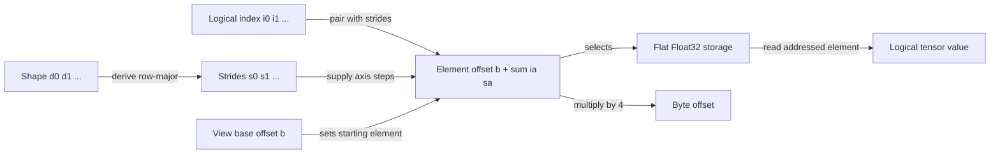

# 002: Tensor Storage and Strides

## Why this exists

An inference equation talks about vectors, matrices, tokens, heads, and channels.
Memory contains a one-dimensional sequence of bytes. A tensor layout is the
contract that connects those two descriptions.

Every later operator depends on this contract. A projection must know which
weights form one row. Attention must distinguish token, head, and feature axes.
A KV cache can have the right element count and still return the wrong values if
its strides use a different axis order. This problem therefore builds checked
row-major tensor storage before adding more arithmetic.

The artifact is `FloatTensor` plus `FloatTensorView` in `InferenceSchoolCore`. The
exercise uses those types to gather values at logical indices. The canonical
and learner implementations run through the same judge.

## Learning outcomes

After this problem, you should be able to:

1. Distinguish rank, shape, element count, storage, offset, and stride.
2. Derive row-major strides for any shape.
3. Convert a logical index into an element and byte offset.
4. Explain why a transpose can be a view while a reshape requires contiguity.
5. State the behavior of scalar and zero-sized tensors.
6. Reject invalid dimensions, storage counts, ranks, and indices before access.
7. Identify which layout metadata a later Metal kernel needs.

## Prerequisites

- Problem 001's use of contiguous vectors
- Integer multiplication and array indexing
- Swift thrown errors

No linear algebra beyond rows and columns is needed.

## Vocabulary

**Rank**
: The number of logical axes. Shape `[2, 3, 4]` has rank three.

**Shape**
: The length of every logical axis.

**Storage**
: The flat `[Float]` that owns physical values.

**Stride**
: The number of storage elements skipped when one logical index on an axis
  increases by one.

**Offset**
: The first storage element addressed by a view, or the result of mapping a
  complete logical index into storage.

**Contiguous**
: A layout whose strides match packed row-major order for its shape.

**View**
: Shape, strides, and a base offset interpreting existing storage without
  rearranging its values.

## Math from first principles

For rank $r$, shape

$$
\mathbf{d} = [d_0, d_1, \ldots, d_{r-1}],
$$

has element count

$$
N = \prod_{a=0}^{r-1} d_a.
$$

Packed row-major order makes the last axis contiguous. Its strides satisfy

$$
s_{r-1}=1, \qquad s_a = d_{a+1}s_{a+1}.
$$

For logical index $\mathbf{i}$ and view base offset $b$, the element offset is

$$
o(\mathbf{i}) = b + \sum_{a=0}^{r-1} i_a s_a.
$$

Every index must obey $0 \le i_a < d_a$ before this sum is used.

### Worked numbers

For shape `[2, 3, 4]`, work from right to left:

```text
axis 2: stride 1
axis 1: 4 * 1  = 4
axis 0: 3 * 4  = 12
```

The strides are `[12, 4, 1]`. Index `[1, 2, 3]` maps to

$$
1(12)+2(4)+3(1)=23.
$$

For Float32, element 23 starts at byte offset

$$
23 \times 4 = 92\ \text{bytes}.
$$

A `[2, 3]` matrix with storage `[0, 1, 2, 3, 4, 5]` has strides `[3, 1]`.
The element at row 1, column 2 is offset $1(3)+2(1)=5$ and value `5`.



## Shape, layout, and dtype contract

This problem uses Float32 storage only.

| Property | Contract |
| --- | --- |
| Shape | Every dimension is nonnegative |
| Element count | Product of dimensions, checked for `Int` overflow |
| Owned tensor | Storage count equals element count exactly |
| Row-major strides | Derived from right to left; final stride is one |
| Index | Rank matches and each coordinate is in bounds |
| View | Base offset is nonnegative and maximum addressed offset is in storage |
| Reshape | Element count is unchanged and source layout is contiguous |
| Transpose view | Rank two; swaps shape and strides without moving values |
| Scalar | Shape `[]`, one value, index `[]` |
| Empty tensor | Any zero dimension gives zero elements |

`FloatTensor` is always owned and row-major. `FloatTensorView` can be
non-contiguous. Swift arrays use copy-on-write, so constructing a view does not
eagerly duplicate the element buffer, but mutating a copied array would create
independent storage. These course views are read-only.

## CPU reference path

Open
[P002TensorStorageExercise.swift](../../Sources/InferenceSchoolExercises/P002TensorStorageExercise.swift).

The starter already constructs a checked tensor and validates every requested
index. It deliberately returns zeros. Replace the placeholder with the readable
semantic path:

```text
tensor = checked FloatTensor(storage, shape)
result = empty array
for logical index in indices:
    append tensor.value(at: logical index)
return result
```

Run:

```sh
swift run inference-school check 002 --cpu
```

The expected completed result is `CPU: 6/6 cases`.

## Correctness method

The judge uses deterministic cases that expose different assumptions:

- corners of a `[2, 3]` matrix;
- rank-three offsets in `[2, 3, 4]`;
- a scalar tensor with shape `[]`;
- a gather from a tensor containing a zero dimension;
- storage-count mismatch;
- an index equal to its dimension, which is out of bounds.

Direct tests also verify `[12, 4, 1]`, offset `23`, contiguous reshape, transpose
strides `[1, 3]`, and rejection of reshaping a transpose view. Integer offset
math is checked for overflow before storage access.

The independent oracle for a row-major matrix is ordinary nested-loop order:
row zero occupies the first `columns` values, row one the next `columns`, and so
on. Do not validate an offset function only by calling the same function twice.

## Performance model

Indexing performs roughly one integer multiply and add per axis. It then reads
four bytes for one Float32 value. For a low-rank tensor this metadata arithmetic
is small, but repeated generic indexing inside an inner numerical loop can be
material.

A contiguous loop can increment one pointer. A generic rank-$r$ loop may load
strides, multiply coordinates, check bounds, and branch for every element.
Later kernels therefore validate shape/layout once on the host and use
specialized address expressions in the hot loop.

A view allocates only small metadata plus the Swift array value. A materialized
layout conversion reads and writes all $N$ values, approximately $8N$ bytes for
Float32. That difference is why views are preferred when consumers support the
strides.

## Metal mapping

Problem 002 has no Metal exercise because layout is a host-side contract, not a
standalone arithmetic kernel. Its consequences on Metal are immediate:

- contiguous vectors need only an element count;
- a generic strided kernel also needs shape, strides, and base offset;
- a rank-two contiguous kernel can specialize offset as `row * columns + col`;
- buffers are byte-addressed by the API, while typed Metal pointers index
  elements;
- bounds validation belongs on the host, while padded-grid bounds checks remain
  in the kernel.

Problem 003 will compare passing a transpose view to a stride-aware consumer
with paying for a materialized, contiguous transpose.

## Implementation checkpoints

1. Derive `[12, 4, 1]` for `[2, 3, 4]` without running code.
2. Inspect `TensorLayout.rowMajor` and identify its overflow check.
3. Make matrix-corner and rank-three gather cases pass.
4. Keep scalar and empty-tensor behavior passing.
5. Confirm invalid storage and invalid indices still throw.
6. Explain why `transposed2D()` changes strides but not storage.
7. Explain why that transpose view cannot be reshaped without copying.

## Controlled experiments

### Experiment 1: offset table

Write down all logical indices and offsets for shape `[2, 2, 3]`. Predict that
the final coordinate changes every element, the middle every three elements,
and the first every six. Verify with `TensorLayout.offset(for:)`.

### Experiment 2: view versus copy

Create a `[2, 3]` tensor, inspect its transpose view, then materialize the same
values in row-major order. Predict:

- both expose shape `[3, 2]` and equal logical values;
- the view has strides `[1, 3]`;
- the copy has strides `[2, 1]`;
- only the copy can reshape directly to `[6]`.

### Experiment 3: traversal locality

For a large row-major matrix, compare summing in row-major order with summing in
column-major logical order. Predict the direction of the result before timing.
The number of values and FLOPs is identical; only access locality changes.

## Engine integration

Problem 003 uses a transpose view to define the logical result and a tiled copy
to materialize it. Problems 004 and 005 require contiguous rank-two tensors and
derive every matrix address from this row-major contract. Later, Q/K/V views add
token and head axes, while KV-cache problems deliberately compare alternative
stride orders.

The checked host types remain the boundary that prevents a correct kernel from
being dispatched with an incorrect interpretation of memory.

## Tradeoffs

1. When is a non-contiguous view cheaper than a contiguous copy?
2. When can the slower downstream access pattern repay the copy cost?
3. Why is shape alone insufficient to describe a transpose view?
4. Should a zero stride be accepted for broadcast views? What would mutation
   mean if many logical indices refer to one value?
5. What metadata would a slice need in addition to shape and strides?
6. Why should overflow be checked before calculating a buffer byte count?
7. When is specializing a kernel for a fixed rank worth the extra code?

## Hints and canonical solution

<details>
<summary>Gather hint</summary>

Construct `FloatTensor` once, then map each requested index through
`tensor.value(at:)`. Do not recompute a layout for every query.

</details>

<details>
<summary>Reshape hint</summary>

A reshape is metadata-only only when linear storage order already matches the
new row-major order. Equal element counts are necessary but not sufficient for
a non-contiguous view.

</details>

<details>
<summary>Canonical check</summary>

```sh
swift run inference-school check 002 --solution
```

The answer is in `Sources/InferenceSchoolSolutions/P002TensorStorageSolution.swift`.

</details>

## Completion checklist

- [ ] I derived row-major strides for rank two and rank three.
- [ ] I computed offset 23 and byte offset 92 by hand.
- [ ] The learner judge reports `6/6`.
- [ ] Invalid storage, rank, and coordinates still throw.
- [ ] I can distinguish scalar shape `[]` from empty shape `[0]`.
- [ ] I can explain why transpose can be a view.
- [ ] I can explain why only contiguous views reshape without a copy.
- [ ] I recorded predictions and results for the three experiments.
- [ ] I can name the layout metadata a generic Metal kernel would require.
