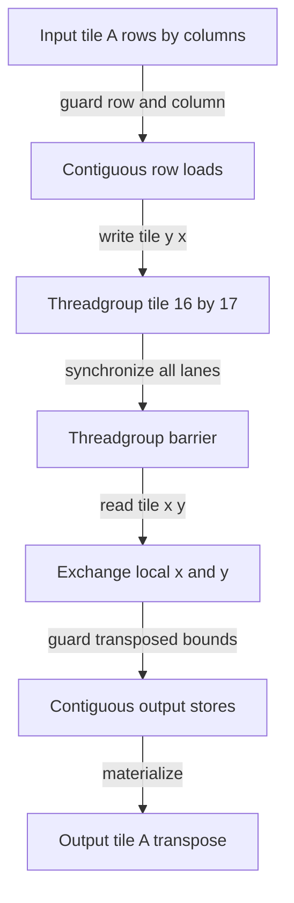

# 003: Transpose and Tiled Copy

## Why this exists

Changing a tensor's logical axes is free when the consumer understands strides.
Changing physical order is not free: every element must be read and written.
Inference systems nevertheless materialize transposes when the new order makes
many later accesses coalesced, enables a specialized matrix kernel, or matches a
model's stored weight format.

This problem makes that tradeoff concrete. The CPU implementation is a readable
layout conversion. The Metal implementation is a real tiled transpose whose
loads and stores are both contiguous at the threadgroup level. Dimensions do
not need to be multiples of the tile width.

## Learning outcomes

After this problem, you should be able to:

1. Derive the index mapping between `[R, C]` and `[C, R]`.
2. Distinguish a transpose view from a materialized transpose.
3. Implement a CPU row-major transpose.
4. Explain why a naive GPU transpose has a strided side.
5. Map a `16x16` tile through threadgroup memory.
6. Justify the `16x17` scratch layout and both barriers.
7. Handle partial tiles without out-of-bounds reads or writes.
8. Decide when repeated downstream reuse can repay the copy.

## Prerequisites

- Problem 002: shape, row-major strides, views, and offsets
- Problem 001: grids, threadgroups, bounds checks, and barriers
- No matrix multiplication is required yet

## Vocabulary

**Transpose**
: A rank-two axis swap. Output element $(c,r)$ equals input element $(r,c)$.

**Materialization**
: Allocating storage and writing values in the logical order of a view.

**Coalesced access**
: Neighboring GPU threads access neighboring addresses so memory transactions
  can be combined efficiently.

**Tile**
: A small rectangular region cooperatively processed by one threadgroup.

**Bank conflict**
: Serialization caused when threads access shared-memory addresses that map to
  the same bank. Padding a square tile's row length changes that mapping.

**Edge tile**
: A tile that overlaps a matrix boundary and contains invalid padded lanes.

## Math from first principles

Let $A \in \mathbb{R}^{R\times C}$. Its transpose
$B=A^T \in \mathbb{R}^{C\times R}$ satisfies

$$
B_{c,r}=A_{r,c}.
$$

In row-major storage:

$$
\operatorname{offset}_A(r,c)=rC+c,
$$

$$
\operatorname{offset}_B(c,r)=cR+r.
$$

For

$$
A=\begin{bmatrix}1&2&3\\4&5&6\end{bmatrix},
$$

the input storage is `[1, 2, 3, 4, 5, 6]` and

$$
A^T=\begin{bmatrix}1&4\\2&5\\3&6\end{bmatrix}
$$

has storage `[1, 4, 2, 5, 3, 6]`.

The element `6` moves from input offset
$1(3)+2=5$ to output offset $2(2)+1=5$. Equal offsets here are accidental;
most elements move.

## Shape, layout, and dtype contract

| Item | Contract |
| --- | --- |
| Input | Contiguous Float32 `FloatTensor`, rank two, shape `[R, C]` |
| Output | Contiguous Float32 tensor, shape `[C, R]` |
| Value rule | `output[c, r] == input[r, c]` |
| Empty axes | `[0, C] -> [C, 0]` and `[R, 0] -> [0, R]` |
| Invalid input | Any rank other than two throws `TensorError.rankMismatch` |
| Metal dimensions | `R` and `C` must fit `UInt32` |
| Numerical tolerance | `1e-6` relative; transpose performs no arithmetic |

A transpose view from Problem 002 has shape `[C, R]` and strides `[1, C]`.
This problem's output instead has row-major strides `[R, 1]` because it owns a
new physical ordering.

## CPU reference path

Open
[P003TransposeExercise.swift](../../Sources/InferenceSchoolExercises/P003TransposeExercise.swift).

The readable algorithm is:

```text
validate rank two
allocate R*C output values
for row in 0..<R:
    for column in 0..<C:
        output[column*R + row] = input[row*C + column]
return tensor(output, shape: [C, R])
```

Run:

```sh
swift run inference-school check 003 --cpu
```

Keeping the input loop row-major gives contiguous reads and strided writes. If
the loops are reversed, writes become contiguous and reads become strided. The
CPU oracle prioritizes clarity; the Metal path fixes the one-strided-side
problem with tiling.

## Correctness method

The shared judge covers:

- the worked `2x3` matrix;
- a single row;
- an empty row dimension;
- `17x19`, which crosses both dimensions of a `16x16` tile;
- rejection of a rank-one input.

Because transpose does no floating-point arithmetic, exact equality would be
reasonable. The shared judge still uses a tiny relative tolerance to retain the
same reporting style as later GPU operators. The independent oracle computes
each destination with the scalar equation $B_{c,r}=A_{r,c}$.

Two useful properties are:

$$
(A^T)^T=A
$$

and preservation of element multiset. Neither property alone proves the layout
is correct: returning the original matrix passes the multiset property, and two
identical wrong transformations can pass the involution property.

## Performance model

Transpose performs no floating-point operations. It reads and writes each
Float32 once, for minimum traffic

$$
4RC + 4RC = 8RC\ \text{bytes}.
$$

Its arithmetic intensity is effectively zero. Performance is governed by
memory traffic, access coalescing, allocation, dispatch, and synchronization.

A materialized transpose also allocates $4RC$ output bytes. A view allocates no
element buffer. If one downstream kernel consumes the result once and supports
strides efficiently, copying is unlikely to win. If many downstream kernels
would otherwise make strided accesses, one copy may amortize its cost.

## Metal mapping

Open
[P003Transpose.metal](../../Sources/InferenceSchoolExercises/Metal/P003Transpose.metal).

The canonical dispatch uses:

- one `16x16` threadgroup per input tile;
- grid groups `ceil(C/16)` by `ceil(R/16)`;
- one input load and one output store per valid thread;
- a threadgroup tile declared as `float tile[16][17]`.

For local position $(x,y)$ in group $(g_x,g_y)$, the load coordinate is

$$
r=16g_y+y, \qquad c=16g_x+x.
$$

Threads load neighboring columns, so loads are contiguous. After a barrier,
thread positions are exchanged when reading scratch. The output coordinate is

$$
r_{out}=16g_x+y, \qquad c_{out}=16g_y+x.
$$

and the value comes from `tile[x][y]`. Neighboring threads now write neighboring
output columns, so stores are contiguous too.

The extra scratch column changes the address stride from 16 to 17. When a wave
reads the tile down columns, this padding avoids the repeated bank mapping that
a square power-of-two row length can create.



### Bounds and barriers

The load checks `inputRow < R && inputColumn < C`. The store independently
checks `outputRow < C && outputColumn < R`. These conditions are not
interchangeable on rectangular edge tiles.

All 256 threads reach the barrier, including threads whose load was out of
bounds. A thread only reads a scratch cell that was written by the corresponding
valid transposed input coordinate before storing a valid output coordinate.

## Implementation checkpoints

1. Compute the `2x3` result by hand.
2. Make the CPU rectangular and empty cases pass.
3. Draw one `4x4` tile and exchange local $x/y$ positions.
4. Add `threadgroup float tile[16][17]` to the starter kernel.
5. Implement guarded contiguous loads.
6. Place one unconditional threadgroup barrier after loads.
7. Implement exchanged scratch reads and guarded stores.
8. Pass the `17x19` Metal fixture.

Run each path independently:

```sh
swift run inference-school check 003 --cpu
swift run inference-school check 003 --metal
swift run inference-school check 003
```

## Controlled experiments

### Experiment 1: shape sweep

Compare square multiples (`16x16`, `256x256`) with partial tiles (`17x19`,
`257x263`). Predict that partial tiles do extra padded-thread and bounds work,
but the fraction falls as matrices grow.

### Experiment 2: skinny matrices

Compare `1x4096`, `16x256`, and `64x64`, all containing 4,096 values. Predict
which shapes waste more lanes and which pay the same total byte traffic but use
different numbers of partially occupied threadgroups.

### Experiment 3: copy amortization

Time a stride-aware consumer over a transpose view, then time materialization
plus one, ten, and one hundred contiguous consumer passes. Predict the reuse
count at which the up-front `8RC` bytes become worthwhile before measuring.

Record build configuration, dimensions, iteration count, and whether timing is
kernel-only or end-to-end. Do not report a universal transpose speed from one
shape.

## Engine integration

Problem 005's GEMM expects row-major contiguous operands. A model loader may
materialize weights once into the preferred orientation rather than transpose
on every token. Attention later changes between token-major and head-major
views; a tiled copy is justified only when repeated kernels benefit from the
new order.

This kernel also establishes the reusable GPU pattern for tiled GEMM: load a
bounded tile cooperatively, synchronize, reuse threadgroup memory, and handle
edge lanes with identity values.

## Tradeoffs

1. When should a consumer accept strides instead of requiring a copy?
2. Why can a transpose be bandwidth-bound even though the GPU has many ALUs?
3. What goes wrong if only valid edge threads reach the barrier?
4. Why are separate load and store bounds needed for rectangular matrices?
5. What does `16x17` cost in threadgroup memory, and what conflict can it avoid?
6. Could `32x8` outperform `16x16` on some hardware or shapes?
7. When should model weights be transposed at conversion time instead of load
   time or inference time?

## Hints and canonical solution

<details>
<summary>CPU hint</summary>

Write the destination offset first: output row is the old column, output column
is the old row, and the output row length is the old row count.

</details>

<details>
<summary>Metal coordinate hint</summary>

Load `tile[localY][localX]`. After the barrier, store
`tile[localX][localY]` using group axes exchanged in the global coordinate.

</details>

<details>
<summary>Canonical check</summary>

```sh
swift run inference-school check 003 --solution
```

Canonical Swift and Metal sources are under `Sources/InferenceSchoolSolutions`.

</details>

## Completion checklist

- [ ] I derived both row-major offset equations.
- [ ] I computed the `2x3` example by hand.
- [ ] CPU reports `5/5`.
- [ ] I can draw the `16x16` load and exchanged store coordinates.
- [ ] I can justify the tile padding and barrier.
- [ ] Metal reports `5/5`, including `17x19`.
- [ ] I recorded predictions before the three experiments.
- [ ] I distinguished transpose view cost from materialization cost.
- [ ] I can name a later engine use that repays a layout conversion.
