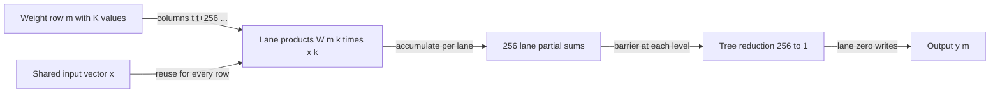

# 004: Matrix-Vector Multiplication

## Why this exists

During one-token decode, each linear layer multiplies a large weight matrix by
one activation vector. Query, key, value, output, gate, up, and down projections
all contain this operation. The arithmetic is a row of dot products; the systems
behavior is dominated by rereading weights for every generated token.

This problem turns Problem 001's scalar reduction into a tensor-shaped GEMV
operator and keeps Problem 002's shape contract at the API boundary. The CPU
path is the semantic oracle. The Metal path assigns one cooperative threadgroup
to each output row and reduces columns in Float32.

## Learning outcomes

After this problem, you should be able to:

1. Derive GEMV from row-wise dot products.
2. State the `[M,K] x [K] -> [M]` shape contract.
3. Implement a scalar Float32 CPU oracle.
4. Count GEMV FLOPs and minimum algorithmic bytes.
5. Explain why large decode projections often have low arithmetic intensity.
6. Map one output row to a Metal threadgroup reduction.
7. Handle `K` smaller than, equal to, or larger than the threadgroup width.
8. Separate kernel arithmetic from allocation, copies, launch, and waiting.

## Prerequisites

- Problem 001: dot products and parallel reductions
- Problem 002: contiguous row-major tensors and rank checking
- Problem 003: memory access and threadgroup coordination

## Vocabulary

**GEMV**
: General matrix-vector multiplication, $\mathbf{y}=W\mathbf{x}$.

**Output row**
: One row of the matrix and therefore one dot product producing one output.

**Projection**
: A learned linear map represented by matrix multiplication, usually followed
  by bias, reshaping, or another neural-network operation.

**Weight streaming**
: Reading matrix values that receive little or no reuse during one invocation.

**Effective bandwidth**
: Logical bytes in the chosen traffic model divided by elapsed time. It is not
  a hardware memory-bus counter.

## Math from first principles

For $W\in\mathbb{R}^{M\times K}$ and
$\mathbf{x}\in\mathbb{R}^{K}$,

$$
\mathbf{y}=W\mathbf{x}, \qquad
y_m=\sum_{k=0}^{K-1}W_{m,k}x_k.
$$

Every output is exactly Problem 001 applied to one matrix row and the shared
vector.

### Worked numbers

Let

$$
W=\begin{bmatrix}
1&2&3\\
-1&0.5&4
\end{bmatrix}, \qquad
\mathbf{x}=\begin{bmatrix}2\\-1\\0.5\end{bmatrix}.
$$

Then

$$
y_0=1(2)+2(-1)+3(0.5)=1.5,
$$

$$
y_1=-1(2)+0.5(-1)+4(0.5)=-0.5.
$$

The result is `[1.5, -0.5]` with shape `[2]`.

## Shape, layout, and dtype contract

| Item | Contract |
| --- | --- |
| Matrix | Contiguous Float32 tensor, rank two, shape `[M, K]` |
| Vector | Contiguous Float32 tensor, rank one, shape `[K]` |
| Output | Contiguous Float32 tensor, shape `[M]` |
| Accumulation | Float32 in learner and canonical paths |
| Shape error | Matrix rank, vector rank, or unequal inner dimensions throws |
| `M == 0` | Empty output with shape `[0]` |
| `K == 0` | Length-`M` output filled with the empty-sum value zero |
| Metal dimensions | `M` and `K` fit `UInt32` |
| Tolerance | `2e-5` relative to an independent Double-accumulation oracle |

Requiring contiguous inputs keeps the first GEMV kernel readable. A later
operator could accept `FloatTensorView` and use explicit strides, but that would
change both address arithmetic and performance.

## CPU reference path

Open
[P004GEMVExercise.swift](../../Sources/InferenceSchoolExercises/P004GEMVExercise.swift).

The starter preserves all validation and returns the correct output shape with
wrong zero values. Replace only the value computation:

```text
validate ranks and K
allocate M zeros
for row in 0..<M:
    sum = 0
    for column in 0..<K:
        sum += matrix[row*K + column] * vector[column]
    output[row] = sum
return tensor(output, shape: [M])
```

Run:

```sh
swift run inference-school check 004 --cpu
```

This loop is intentionally direct. Faster CPU libraries may vectorize,
parallelize rows, block caches, or use specialized matrix routines, but the
oracle should remain easy to audit.

## Correctness method

The judge covers:

- the worked `2x3` projection;
- `K == 0` with three output rows;
- `M == 0`;
- three rows with `K == 257`, crossing a 256-thread reduction boundary;
- bad matrix rank;
- inner-dimension mismatch.

Expected values for the wide fixture use Double multiplication and accumulation,
then convert once to Float. CPU and Metal implementations accumulate Float in
different orders, so the relative tolerance scales with result magnitude.

Shape correctness is checked separately from values. Returning the right count
with the wrong tensor rank is not accepted.

## Performance model

GEMV performs approximately

$$
2MK\ \text{FLOPs}.
$$

A minimum one-invocation Float32 traffic model reads $MK$ matrix values, reads
$K$ vector values, and writes $M$ outputs:

$$
B_{min}=4(MK+K+M)\ \text{bytes}.
$$

Therefore

$$
I_{GEMV}=\frac{2MK}{4(MK+K+M)}.
$$

For large $M$ and $K$, matrix traffic dominates and intensity approaches
$0.5$ FLOP/byte. The vector can be reused across rows in cache or threadgroup
memory, but each weight is normally used once for one token. That low reuse is
why decode projections often behave like bandwidth workloads.

This model omits allocation, Swift-to-buffer copies, cache-line effects,
command submission, and synchronization. Those costs matter especially for
small matrices.

## Metal mapping

Open
[P004GEMV.metal](../../Sources/InferenceSchoolExercises/Metal/P004GEMV.metal).

The host dispatches `M` threadgroups of 256 threads. Group position identifies
the output row. Local thread $t$ accumulates columns

$$
t,\ t+256,\ t+512,\ldots < K.
$$

Each lane writes one partial sum to a 256-element threadgroup array. The group
then uses the same halving reduction as Problem 001:

```text
128, 64, 32, 16, 8, 4, 2, 1
```

Every reduction level ends with a threadgroup barrier. Local thread zero writes
the row result.

When `K < 256`, inactive lanes contribute zero but still participate in every
barrier. When `K > 256`, each lane loops over multiple columns before the shared
reduction. The host handles `K == 0` without dispatching or allocating zero-byte
input buffers.

The vector is read by every row group. This simple kernel relies on device
caches rather than explicitly staging vector tiles. That choice is inspectable,
not universally optimal.



## Implementation checkpoints

1. Compute the worked two-row output by hand.
2. Keep rank and inner-dimension failures passing.
3. Make the CPU small and zero-dimension cases pass.
4. Identify row, column, and matrix offset in the Metal kernel.
5. Add a per-lane strided column loop.
6. Store lane sums in threadgroup scratch and synchronize.
7. Add the 256-to-1 reduction with unconditional barriers.
8. Pass the `K == 257` Metal fixture.

Commands:

```sh
swift run inference-school check 004 --cpu
swift run inference-school check 004 --metal
swift run inference-school check 004
```

## Controlled experiments

### Experiment 1: vary rows only

Hold `K` fixed and sweep `M`. Predict approximately linear matrix bytes and
work. Also predict a fixed launch/allocation floor at small `M`.

### Experiment 2: cross the group width

Compare `K = 255, 256, 257, 512`. Predict that correctness is smooth while work
per lane changes discretely. Explain why one extra column at 257 activates a
second loop iteration in one lane of every row group.

### Experiment 3: same FLOPs, different shape

Compare a tall/narrow and short/wide matrix with similar $MK$. Predict how the
number of threadgroups, reduction occupancy, and vector reuse differ even when
the simple FLOP and byte counts are close.

Before measuring, write which path you expect to win and whether you expect
bandwidth, reduction work, or fixed overhead to dominate. Use release builds.

## Engine integration

For one decode token, a linear layer uses this exact form:

$$
\mathbf{q}=W_q\mathbf{x},\quad
\mathbf{k}=W_k\mathbf{x},\quad
\mathbf{v}=W_v\mathbf{x}.
$$

MLP gate/up/down projections are also GEMV. Later quantization problems reduce
weight traffic by storing fewer bits and fuse unpacking into this projection.
Problem 005 changes the activation from one vector to many token rows, enabling
more weight reuse and a different performance regime.

## Tradeoffs

1. Why can the vector be reused while each matrix weight is used only once?
2. When would one thread per row beat one threadgroup per row?
3. What happens to occupancy when `M` is very small?
4. Would staging vector chunks in threadgroup memory reduce device traffic, or
   duplicate data already served by cache?
5. What numerical behavior changes with Float16 inputs and Float32 accumulation?
6. Why might fusing bias or activation help a bandwidth-bound projection?
7. Which costs in the host pipeline are absent from the minimum-byte model?

## Hints and canonical solution

<details>
<summary>CPU offset hint</summary>

Row `m` begins at `m * K`. Its column `k` is `matrix.storage[m * K + k]`.

</details>

<details>
<summary>Metal loop hint</summary>

Initialize a private `float sum = 0`. Start `column` at `localIndex` and add the
threadgroup width until `column >= K`.

</details>

<details>
<summary>Canonical check</summary>

```sh
swift run inference-school check 004 --solution
```

Canonical Swift, host, and Metal sources live under `Sources/InferenceSchoolSolutions`
and `Sources/InferenceSchoolCore/Metal`.

</details>

## Completion checklist

- [ ] I derived GEMV as `M` row-wise dot products.
- [ ] I computed `[1.5, -0.5]` by hand.
- [ ] CPU reports `6/6`.
- [ ] Metal reports `6/6`, including `K == 257`.
- [ ] I can derive the FLOP, byte, and intensity formulas.
- [ ] I can justify every barrier and inactive lane.
- [ ] I recorded predictions before the three experiments.
- [ ] I can explain why decode GEMV often has low weight reuse.
- [ ] I can identify the Q/K/V and MLP integration points.
