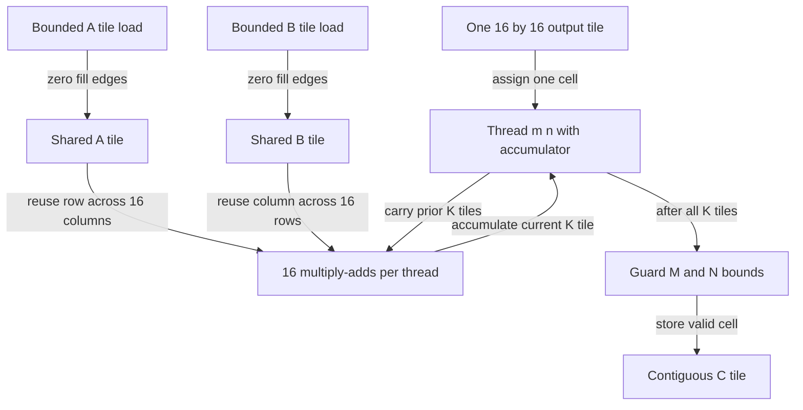

# 005: Matrix-Matrix Multiplication

## Why this exists

Prompt prefill processes many tokens at once. Instead of multiplying one weight
matrix by one activation vector, it can multiply matrices. The same weights are
then reused across token rows, and activation tiles are reused across output
columns. This reuse gives GEMM much higher arithmetic intensity than decode
GEMV and lets the GPU spend more time computing relative to moving data.

This problem implements the readable triple-loop definition and a real tiled
Metal kernel. The edge fixture deliberately makes all three dimensions partial
tiles so correctness cannot depend on convenient multiples.

## Learning outcomes

After this problem, you should be able to:

1. Derive one GEMM output cell as a dot product.
2. State the `[M,K] x [K,N] -> [M,N]` shape contract.
3. Implement and validate a scalar CPU GEMM oracle.
4. Count GEMM FLOPs and minimum algorithmic traffic.
5. Explain why tiling reuses A and B values.
6. Map one output tile to a Metal threadgroup.
7. Zero-fill partial K tiles and guard partial M/N stores.
8. Explain why prefill and decode can favor different kernels.

## Prerequisites

- Problem 002: row-major tensor storage
- Problem 003: tiled loads, barriers, and edge tiles
- Problem 004: row-wise dot products and projection shapes

## Vocabulary

**GEMM**
: General matrix-matrix multiplication, $C=AB$.

**Inner dimension**
: The shared $K$ dimension reduced to form every output cell.

**Data reuse**
: Using a loaded value in more than one multiply before it must be fetched again.

**Output tile**
: A rectangular region of $C$ produced by one threadgroup.

**K tile**
: One chunk of the reduction dimension loaded into shared storage.

**Operational or arithmetic intensity**
: Floating-point work divided by bytes moved under an explicit traffic model.

## Math from first principles

For $A\in\mathbb{R}^{M\times K}$ and
$B\in\mathbb{R}^{K\times N}$,

$$
C=AB\in\mathbb{R}^{M\times N},
$$

$$
C_{m,n}=\sum_{k=0}^{K-1}A_{m,k}B_{k,n}.
$$

Each output cell is a dot product between row $m$ of $A$ and column $n$ of $B$.

### Worked numbers

Let

$$
A=\begin{bmatrix}1&2&3\\4&5&6\end{bmatrix},\qquad
B=\begin{bmatrix}1&2\\0&-1\\3&0\end{bmatrix}.
$$

Then

$$
C_{0,0}=1(1)+2(0)+3(3)=10,
$$

$$
C_{0,1}=1(2)+2(-1)+3(0)=0,
$$

$$
C_{1,0}=4(1)+5(0)+6(3)=22,
$$

$$
C_{1,1}=4(2)+5(-1)+6(0)=3.
$$

Output storage is `[10, 0, 22, 3]` with shape `[2, 2]`.

## Shape, layout, and dtype contract

| Item | Contract |
| --- | --- |
| Left operand | Contiguous Float32, rank two, `[M, K]` |
| Right operand | Contiguous Float32, rank two, `[K, N]` |
| Output | Contiguous Float32, `[M, N]` |
| Accumulation | Float32 |
| Shape errors | Non-matrix rank or unequal inner dimensions throws |
| `M == 0` or `N == 0` | Empty storage with shape `[M, N]` |
| `K == 0` | `M*N` zeros by the empty-sum convention |
| Metal dimensions | `M`, `K`, and `N` fit `UInt32` |
| Tolerance | `4e-5` relative to a Double-accumulation oracle |

The first implementation accepts only row-major `FloatTensor`. A production
GEMM API might support transposed flags or explicit leading dimensions to avoid
materialization, but those options enlarge the contract and kernel set.

## CPU reference path

Open
[P005GEMMExercise.swift](../../Sources/InferenceSchoolExercises/P005GEMMExercise.swift).

Implement the direct definition:

```text
validate ranks and K
allocate M*N zeros
for row in 0..<M:
    for column in 0..<N:
        sum = 0
        for inner in 0..<K:
            sum += lhs[row*K + inner] * rhs[inner*N + column]
        output[row*N + column] = sum
return tensor(output, shape: [M, N])
```

Run:

```sh
swift run inference-school check 005 --cpu
```

This loop repeatedly walks columns of row-major B with stride `N`. It is a
semantic oracle, not an optimized CPU GEMM. Loop interchange, blocking, packed
panels, SIMD instructions, and Accelerate are valid later comparisons.

## Correctness method

The judge includes:

- the worked `2x3` by `3x2` product;
- `K == 0` with a nonempty `2x3` output;
- `M == 0`;
- `17x19` by `19x18`, creating partial M, K, and N tiles;
- bad operand rank;
- unequal inner dimensions.

The independent oracle accumulates each cell in Double and converts once. The
canonical implementations accumulate Float, and tiled reduction order differs
from a scalar loop, so comparison uses scale-aware tolerance.

Useful properties such as identity multiplication and distributivity supplement
fixed fixtures but do not replace them. Shape errors must occur before buffer
allocation or dispatch.

## Performance model

The operation performs approximately

$$
2MKN\ \text{FLOPs}.
$$

If every input is read once and output written once, the minimum Float32 traffic
is

$$
B_{min}=4(MK+KN+MN)\ \text{bytes}.
$$

The idealized intensity is

$$
I_{GEMM}=\frac{2MKN}{4(MK+KN+MN)}.
$$

For square $M=K=N=D$,

$$
I_{GEMM}=\frac{2D^3}{12D^2}=\frac{D}{6}\ \text{FLOP/byte}.
$$

Unlike GEMV's asymptotic intensity near $0.5$, GEMM intensity grows with square
dimension if caches or threadgroup tiles realize reuse. An untiled implementation
may move far more than the minimum because A and B values are reloaded for many
output cells.

## Metal mapping

Open
[P005GEMM.metal](../../Sources/InferenceSchoolExercises/Metal/P005GEMM.metal).

One `16x16` threadgroup produces one `16x16` output tile. Local thread $(x,y)$
owns output

$$
m=16g_y+y,\qquad n=16g_x+x.
$$

For K-tile index $q$, each thread cooperatively loads:

$$
A[m,16q+x]
$$

into `lhsTile[y][x]`, and

$$
B[16q+y,n]
$$

into `rhsTile[y][x]`. Out-of-bounds positions load zero, the additive identity.

After the first barrier, every thread computes 16 multiply-adds from its tile
row and tile column. A second barrier prevents any thread from overwriting
scratch for the next K tile while another thread still reads the current tile.

After all $\lceil K/16\rceil$ tiles, valid M/N threads store one output. The
`17x19` by `19x18` judge case checks:

- a second row tile with only one valid row;
- a second column tile with only two valid columns;
- a second K tile with only three valid inner values.

Each 16-value A row in scratch is reused by 16 output columns. Each B column is
reused by 16 output rows. That is the central benefit of tiling.



## Implementation checkpoints

1. Compute all four worked output cells by hand.
2. Pass small, empty-output, and zero-K CPU cases.
3. Draw one `4x4` output tile and its A/B input tiles.
4. Add two `16x16` threadgroup arrays.
5. Implement bounded A/B loads with zero fill.
6. Add the barrier before tile computation.
7. Accumulate 16 products per K tile.
8. Add the barrier before the next tile load.
9. Guard final M/N stores and pass the edge fixture.

Commands:

```sh
swift run inference-school check 005 --cpu
swift run inference-school check 005 --metal
swift run inference-school check 005
```

## Controlled experiments

### Experiment 1: square size sweep

Sweep $D=8,16,32,64,128$ for `[D,D] x [D,D]`. Predict a fixed-cost floor at
small sizes and rising arithmetic intensity as $D$ grows. Record whether the
measured implementation approaches its modeled trend.

### Experiment 2: decode-like versus prefill-like

Compare `[1,K] x [K,N]` with `[S,K] x [K,N]` for increasing token count $S$.
Predict that larger $S$ reuses each B weight across more output rows and fills
more output tiles. Connect the first shape to GEMV-like decode.

### Experiment 3: edge-tile efficiency

Compare dimensions 63, 64, and 65. Predict that 64 fills every `16x16` group,
while 65 launches an additional mostly empty tile along each expanded axis.
Explain why the numerical work model and actual dispatched lanes diverge.

Use a release build, warm up the pipeline, and label end-to-end versus kernel
timing. Write predictions before collecting times.

## Engine integration

With $S$ prompt tokens arranged as rows, a projection becomes

$$
X_{[S,K]}W_{[K,N]}=Y_{[S,N]}.
$$

Q/K/V and MLP prefill projections use this form. The operation also supplies
the dense components of attention score and weighted-value products before
later attention kernels fuse or stream them.

Problem 006 uses this canonical GEMM as an executable roofline workload and
compares modeled ceilings with measured CPU and Metal throughput.

## Tradeoffs

1. Why does increasing token rows improve weight reuse?
2. What threadgroup-memory budget does a larger tile consume?
3. Why is the second barrier needed even though each thread owns one output?
4. When could a rectangular tile fit a skinny matrix better than `16x16`?
5. What changes if B is stored transposed?
6. Why can the idealized byte count understate actual traffic?
7. When should a production engine call MPS/Accelerate instead of maintaining a
   custom kernel?
8. Which epilogue operations could be fused into the final store?

## Hints and canonical solution

<details>
<summary>CPU hint</summary>

For fixed `(row, column)`, only `inner` changes. A uses `row*K + inner`; B uses
`inner*N + column`.

</details>

<details>
<summary>Edge-tile hint</summary>

Never skip the barriers. Invalid load lanes write zero to scratch and still
participate. Only the final output store can be skipped by invalid M/N lanes.

</details>

<details>
<summary>Canonical check</summary>

```sh
swift run inference-school check 005 --solution
```

Canonical Swift and Metal implementations are in `InferenceSchoolSolutions`.

</details>

## Completion checklist

- [ ] I derived one output cell as a dot product.
- [ ] I computed `[10, 0, 22, 3]` by hand.
- [ ] CPU reports `6/6`.
- [ ] Metal reports `6/6` with partial M/K/N tiles.
- [ ] I can derive `2MKN` and the minimum-byte formula.
- [ ] I can explain A/B reuse within one output tile.
- [ ] I can justify both barriers and zero-filled lanes.
- [ ] I recorded predictions before the three experiments.
- [ ] I can explain why prefill GEMM differs from decode GEMV.
