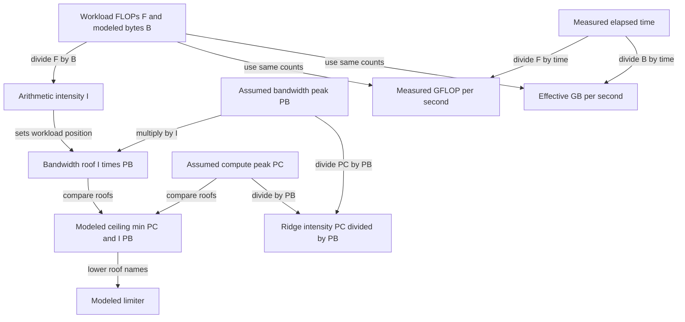

# 006: Build a Roofline Measurement

## Why this exists

An elapsed time says which implementation was faster in one run. It does not
say why, whether the result is close to a plausible machine limit, or which
optimization is justified. The roofline model connects arithmetic intensity to
two assumed ceilings: peak arithmetic throughput and peak memory bandwidth.

This problem makes the model executable and keeps it separate from observations.
`RooflinePrediction` contains only quantities derived from workload counts and
assumed machine peaks. `RooflineMeasurement` contains only quantities derived
from an elapsed duration. `RooflineReport` displays both and explicitly warns
that the model ceiling is not a measurement.

## Learning outcomes

After this problem, you should be able to:

1. Compute arithmetic intensity in FLOP/byte.
2. Derive the bandwidth roof and ridge point.
3. Classify a workload as memory-, compute-, or ridge-limited in the model.
4. Convert an elapsed duration into achieved GFLOP/s and effective GB/s.
5. Distinguish assumed peaks, modeled ceilings, and measured results.
6. Build a reproducible median benchmark report.
7. Explain why algorithmic minimum bytes are not hardware traffic counters.
8. Use a roofline result to choose the next experiment rather than declare a
   universal bottleneck.

## Prerequisites

- Problem 004: GEMV work and byte counts
- Problem 005: GEMM reuse and tiled execution
- Units: seconds, nanoseconds, bytes, FLOP/s, and byte/s

## Vocabulary

**Arithmetic intensity**
: Floating-point operations divided by bytes moved under a stated traffic model.

**Compute peak**
: An assumed maximum arithmetic rate for a machine and precision.

**Bandwidth peak**
: An assumed maximum memory-transfer rate for a machine and memory path.

**Bandwidth roof**
: $I P_B$, the compute rate that available bandwidth could sustain at intensity
  $I$.

**Ridge point**
: The intensity $P_C/P_B$ where compute and bandwidth roofs meet.

**Modeled ceiling**
: The lower of compute peak and bandwidth roof. It is a prediction under model
  assumptions, not an observation.

**Measured throughput**
: Work divided by observed elapsed time for one implementation and benchmark
  boundary.

## Math from first principles

Let workload FLOPs be $F$, modeled bytes be $B$, compute peak be $P_C$ in
GFLOP/s, and bandwidth peak be $P_B$ in GB/s.

Arithmetic intensity is

$$
I=\frac{F}{B}\ \text{FLOP/byte}.
$$

Because GFLOP and GB both use $10^9$, the bandwidth roof is directly

$$
P_{BW}=I P_B\ \text{GFLOP/s}.
$$

The roofline prediction is

$$
P_{model}=\min(P_C,P_{BW}).
$$

The ridge point is

$$
I_{ridge}=\frac{P_C}{P_B}.
$$

Below the ridge, the model calls the workload memory-limited. Above it, the
compute roof is lower. Equality is classified as balanced.

### Worked numbers

Suppose $P_C=1000$ GFLOP/s and $P_B=100$ GB/s. The ridge is

$$
I_{ridge}=1000/100=10\ \text{FLOP/byte}.
$$

A streaming workload with $F=2000$ FLOPs and $B=8000$ bytes has

$$
I=0.25,\qquad P_{BW}=0.25(100)=25\ \text{GFLOP/s}.
$$

The modeled ceiling is 25 GFLOP/s and the model classifies it as memory-limited.

If that workload takes 2 microseconds, the measured rates are

$$
P_{measured}=\frac{2000}{2\times10^{-6}}/10^9=1\ \text{GFLOP/s},
$$

$$
BW_{effective}=\frac{8000}{2\times10^{-6}}/10^9=4\ \text{GB/s}.
$$

The 25 GFLOP/s ceiling remains a model result; the 1 GFLOP/s value is the
observation. The gap could include launch overhead, poor access, insufficient
parallelism, cache behavior, or incorrect peak assumptions.



## Shape, layout, and dtype contract

Problem 006 models metadata rather than returning a tensor, but its inputs still
have a strict contract.

| Item | Contract |
| --- | --- |
| Workload FLOPs | Nonnegative `Double` |
| Workload bytes | Positive `Double`, with the traffic model named |
| GEMV/GEMM dimensions | Nonnegative integers; products are formed as `Double` |
| Machine compute peak | Positive GFLOP/s |
| Machine bandwidth peak | Positive GB/s |
| Measured duration | Positive `UInt64` nanoseconds |
| Benchmark iterations | Positive integer; median selected |
| GEMM workload | Float32 minimum bytes `4(MK + KN + MN)` |
| Report | Model always present; measurement explicitly optional |

The canonical 006 benchmark uses Problem 005 Float32 GEMM. It reports
algorithmic minimum traffic, not cache-line transactions, host copies, or a
hardware counter. CPU and Metal measurements use the same workload counts but
different implementation boundaries.

## CPU reference path

Open
[P006RooflineExercise.swift](../../Sources/InferenceSchoolExercises/P006RooflineExercise.swift).

Implement these four steps:

```text
intensity = FLOPs / bytes
bandwidthCeiling = intensity * peakBandwidth
predictedCeiling = min(peakCompute, bandwidthCeiling)
classify by comparing bandwidthCeiling with peakCompute
```

Run:

```sh
swift run inference-school check 006 --cpu
```

The judge uses memory-bound, compute-bound, and exact-ridge fixtures. Input
validation is enforced by the throwing initializers for `RooflineWorkload` and
`RooflineMachine`, so the prediction function receives valid values.

## Correctness method

Deterministic tests check:

- intensity, bandwidth roof, lower ceiling, and limiter;
- all three limiter classifications;
- rejection of negative FLOPs and nonpositive bytes/peaks;
- exact GEMM FLOP and minimum-byte counts;
- conversion of a fixed 2 ms duration into measured rates;
- report text containing distinct `MODEL` and `MEASURED` labels.

Benchmark timing itself is nondeterministic and is not used as a unit-test
oracle. Tests construct `RooflineMeasurement` from a known duration. This tests
the report arithmetic without pretending elapsed wall time is deterministic.

## Performance model

The roofline model is deliberately simple. It assumes one dominant memory roof,
one compute roof, enough parallelism to approach them, and a known byte count.
Real execution may add:

- host-to-shared-buffer copies;
- cache hits that reduce external traffic;
- cache misses and write allocation that increase traffic;
- command submission and synchronization;
- threadgroup occupancy and instruction dependencies;
- scalar setup and allocation;
- thermal and frequency variation.

For Problem 005 GEMM,

$$
F=2MKN,
$$

$$
B_{min}=4(MK+KN+MN).
$$

For Problem 004 GEMV,

$$
F=2MK,
$$

$$
B_{min}=4(MK+K+M).
$$

The formulas predict why increasing token rows can move projection work toward
the compute side of the roofline, provided the implementation realizes reuse.

## Metal mapping

Problem 006 introduces no new kernel. Its Metal measurement runs the canonical
tiled GEMM from Problem 005. This is important: GPU checking still executes real
Metal work rather than a CPU stand-in.

The CLI constructs the Metal pipeline once, outside timed iterations. Each
timed call currently includes:

- shared-buffer allocation;
- copying both Swift tensors;
- command encoding and submission;
- GPU kernel execution;
- CPU/GPU synchronization;
- copying the output buffer into a Swift array.

The report labels this `Metal canonical GEMM (end-to-end)`. It must not be
compared with a kernel-only GPU peak as though the benchmark boundary contained
only arithmetic. A later profiler can isolate GPU timestamps and counters.

## Implementation checkpoints

1. Compute the worked intensity and 25 GFLOP/s roof by hand.
2. Make the memory-limited judge fixture pass.
3. Add compute and balanced classification.
4. Inspect `RooflineMeasurement` and verify unit conversions.
5. Run the canonical solution check.
6. Choose machine peak assumptions and record their source.
7. Run the release benchmark and retain both CPU and Metal reports.
8. Explain at least one reason each measured value is below its model ceiling.

Commands:

```sh
swift run inference-school check 006
swift run inference-school check 006 --solution
swift run -c release inference-school benchmark 006 \
  --m 64 --k 64 --n 64 --iterations 20 \
  --peak-gflops 1000 --bandwidth-gbps 100
```

The default peak values are examples, not detected properties of the machine.
Replace them with values whose source and precision assumptions you can defend.

## Controlled experiments

### Experiment 1: move across the ridge

Hold `K` and `N` fixed while increasing `M` from 1 to 128. Before running,
predict how minimum-byte intensity changes as B weights are reused across more
rows. Record model classification and measured CPU/Metal rates separately.

### Experiment 2: fixed model, changed boundary

Measure end-to-end Metal as provided, then use GPU timestamps or a profiler to
isolate kernel duration. Predict that removing allocation, copy, and wait costs
matters most for small matrices. Do not change workload counts between the two
reports.

### Experiment 3: peak sensitivity

Keep one measured sample and evaluate it with two defensible peak pairs, such as
conservative sustained values and published theoretical values. Predict which
classifications stay stable. Explain why the measurement does not change when
the assumed roof changes.

### Required report record

```text
Machine and OS:
Swift build configuration:
Operator and shape:
Traffic model:
Peak compute assumption and source:
Peak bandwidth assumption and source:
Predicted intensity and limiter:
CPU measured boundary and median:
Metal measured boundary and median:
Prediction matched the observed trend? Why?
Next measurement that would discriminate between explanations:
```

## Engine integration

Every later operator can carry a `RooflineWorkload` estimate beside its measured
sample. Activations add low-intensity memory passes. Fused kernels attempt to
remove those passes. Attention changes intensity through tiling and online
softmax. Quantized GEMV reduces weight bytes while adding unpacking arithmetic.

The model does not choose optimizations automatically. It narrows the next
question: reduce bytes for a memory-side operator, improve arithmetic execution
for a compute-side operator, or isolate fixed overhead when neither roof explains
the gap.

## Tradeoffs

1. Which memory level does the bandwidth peak represent?
2. When is algorithmic minimum traffic a poor estimate of physical traffic?
3. Can a workload modeled as compute-limited still run slowly from low occupancy?
4. Why does changing an assumed peak not change a measured sample?
5. How would Float16 storage with Float32 accumulation change FLOPs and bytes?
6. Should command submission be included in an operator benchmark used for an
   end-to-end decode decision?
7. What counter or timing boundary would test whether allocation dominates?
8. Why is one roofline point insufficient to characterize an implementation?

## Hints and canonical solution

<details>
<summary>Unit hint</summary>

FLOP/byte times GB/s produces GFLOP/s because both prefixes contribute the same
$10^9$ factor.

</details>

<details>
<summary>Classification hint</summary>

Compare the bandwidth-derived ceiling with compute peak. The smaller roof is
the modeled limiter; exact equality is the ridge case.

</details>

<details>
<summary>Canonical check</summary>

```sh
swift run inference-school check 006 --solution
```

The canonical implementation delegates to `RooflineModel.predict`. The model,
measurement, benchmark, and report types are in `InferenceSchoolCore` for reuse.

</details>

## Completion checklist

- [ ] I computed intensity, bandwidth roof, and ridge point by hand.
- [ ] The learner judge reports `3/3`.
- [ ] I can distinguish assumed, modeled, and measured values.
- [ ] I can derive GEMV and GEMM workload counts.
- [ ] I ran the 006 benchmark in release mode.
- [ ] I recorded the source and precision of peak assumptions.
- [ ] I labeled CPU and Metal benchmark boundaries.
- [ ] I completed all three experiments with predictions written first.
- [ ] I chose one next measurement that discriminates between explanations.
- [ ] I did not describe an effective byte rate as a hardware traffic counter.
