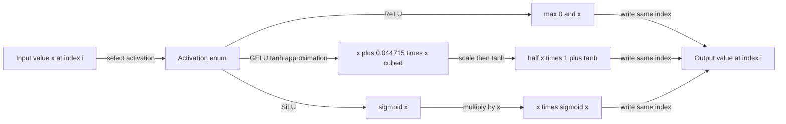

# Problem 007: ReLU, GELU, and SiLU

## Why this exists

A linear layer can rotate, scale, and combine features, but a stack of linear
layers without a nonlinearity is still one linear transformation. Decoder MLPs
therefore place an elementwise activation between projections. This lesson
implements three common choices and separates their arithmetic cost from the
cost of reading and writing another full tensor.

The reusable artifact is `Activation`: later code can name the convention it
expects instead of passing an unlabelled closure. In particular, this lesson
does not use the phrase "GELU" to hide a formula choice.

## Learning outcomes

After completing the problem, you can:

- distinguish exact GELU from the tanh approximation used by this course;
- evaluate ReLU, approximate GELU, and SiLU for positive and negative inputs;
- preserve a `FloatTensor`'s shape while transforming its contiguous storage;
- map an elementwise operation to one Metal thread per element;
- explain when activation latency is math-bound and when it is another memory pass;
- verify a Float32 implementation against an independent Double oracle.

## Prerequisites

- Problem 002 for `FloatTensor`, row-major storage, and shape validation.
- Problem 006 for bytes moved, arithmetic intensity, and launch overhead.
- Exponentials and hyperbolic tangent from the [Math Primer](../../docs/MATH-PRIMER.md).

## Vocabulary

- **Activation**: an elementwise nonlinear function applied after a linear projection.
- **ReLU**: rectified linear unit, `max(0, x)`.
- **CDF**: cumulative distribution function. Exact GELU scales `x` by the
  probability that a standard normal variable is no greater than `x`.
- **Exact GELU**: the error-function definition below.
- **Tanh-approximate GELU**: a commonly used approximation with only `tanh`
  and polynomial arithmetic. It is the GELU convention implemented here.
- **SiLU**: sigmoid linear unit, also called swish with beta equal to one.
- **Elementwise kernel**: a kernel whose output index depends only on the same input index.

## Math from first principles

For scalar input $x$, ReLU is

$$
\operatorname{ReLU}(x) = \max(0, x).
$$

The exact Gaussian error linear unit is

$$
\operatorname{GELU}_{\mathrm{exact}}(x)
= \frac{x}{2}\left(1 + \operatorname{erf}\left(\frac{x}{\sqrt{2}}\right)\right).
$$

This problem deliberately chooses the tanh approximation:

$$
\operatorname{GELU}_{\tanh}(x)
= \frac{x}{2}\left(1 + \tanh\left(\sqrt{\frac{2}{\pi}}
\left(x + 0.044715x^3\right)\right)\right).
$$

Exact and approximate GELU are close, but they are not interchangeable test
or weight-format conventions. `Activation.geluTanhApproximation` makes that
choice visible at the call site.

SiLU multiplies a value by its sigmoid gate:

$$
\operatorname{SiLU}(x) = x\sigma(x) = \frac{x}{1 + e^{-x}}.
$$

Unlike ReLU, GELU and SiLU retain small negative outputs. They suppress rather
than hard-zero every negative feature.



### Worked numerical example

For $x=[-1,0,2]$:

| $x$ | ReLU | GELU tanh approximation | SiLU |
| ---: | ---: | ---: | ---: |
| -1 | 0 | about -0.158808 | about -0.268941 |
| 0 | 0 | 0 | 0 |
| 2 | 2 | about 1.954598 | about 1.761594 |

For the GELU value at $x=-1$, compute the cubic term first:
$x+0.044715x^3=-1.044715$. Multiplying by
$\sqrt{2/\pi}$ gives about $-0.833$, and the final half-scaled gate gives the
negative output above.

## Shape, layout, and dtype contract

`ActivationImplementation` receives a contiguous row-major `FloatTensor` of
any rank and an `Activation`. It returns:

- the same shape, rank, strides, and element count;
- newly computed Float32 storage;
- an empty tensor unchanged when any dimension makes the element count zero.

There is no broadcasting and no shape-dependent formula. The CPU solution
uses Float32 arithmetic. The judge computes expected values with Double and
then rounds once to Float, using absolute tolerance `2e-6` plus relative
tolerance `2e-5`.

## CPU reference path

Start with a storage map, not nested shape loops:

```swift
let output = input.storage.map { value in
    switch activation {
    case .relu:
        return max(0, value)
    case .geluTanhApproximation:
        let cubic = value * value * value
        let inner = sqrt(2 / Float.pi) * (value + 0.044715 * cubic)
        return 0.5 * value * (1 + tanh(inner))
    case .silu:
        return value / (1 + exp(-value))
    }
}
```

Construct the result with `input.shape`; do not flatten the logical contract
to `[N]` merely because the physical storage is flat.

## Correctness method

The shared judge checks signs and zero for ReLU, representative GELU values,
wide SiLU inputs, matrix shape preservation, and an empty tensor. Expected
values come from separate Double formulas in the core target, not from the
solution function.

Pay attention to these failure modes:

- implementing exact GELU while the API names the tanh approximation;
- omitting the cubic term or the factor $\sqrt{2/\pi}$;
- returning sigmoid instead of `x * sigmoid(x)` for SiLU;
- producing the right flat values with the wrong shape;
- branching on signs in a way that turns negative zero into a numerical issue.

Run:

```sh
swift run inference-school check 007 --cpu
swift run inference-school check 007 --metal
swift run inference-school check 007 --solution
```

## Performance model

For $N$ Float32 values, every implementation reads $4N$ bytes and writes
$4N$ bytes, so compulsory traffic is approximately $8N$ bytes. ReLU adds one
comparison. GELU adds a cubic polynomial and a transcendental `tanh`; SiLU
adds an exponential and division.

Arithmetic intensity is therefore activation-dependent, but all three launch
the same number of threads and move the same tensor bytes. For small tensors,
dispatch and synchronization can dominate. For large ReLU tensors, traffic is
likely to dominate. GELU and SiLU give the GPU's math units more work per byte.

A separate activation also writes an intermediate that a later fused
projection or gate could consume in registers. Problem 008 removes one such
pass for SiLU plus multiplication.

## Metal mapping

The Metal grid is one-dimensional with $N$ threads. Thread `i` reads
`input[i]`, evaluates the selected formula, and writes `output[i]`. There is:

- no threadgroup memory;
- no barrier;
- one bounds check for a partial final threadgroup;
- no dependency between elements.

The host passes the element count and the `Activation` raw value as constant
buffers. The canonical shader lives at
[P007Activation.metal](../../Sources/InferenceSchoolSolutions/Metal/P007Activation.metal).
The starter uses the same bindings and compiles, but currently copies input.

## Implementation checkpoints

1. Implement ReLU and make only the ReLU judge case pass.
2. Add SiLU and verify negative values are not all zero.
3. Add the named tanh GELU approximation and compare the worked fixture.
4. Preserve matrix and empty-tensor shapes.
5. Port the same switch to MSL with one thread per element.
6. Run the CPU and Metal paths through the same judge.

## Controlled experiments

### Experiment A: same bytes, different math

Measure ReLU, GELU, and SiLU for the same large $N$. Before running, write a
prediction. A defensible prediction is: ReLU has the lowest arithmetic cost,
while GELU and SiLU take longer because transcendental instructions increase
work without changing bytes moved.

Control tensor size, allocation policy, iteration count, and synchronization.
Report end-to-end and kernel-only timing separately if you add command-buffer timing.

### Experiment B: launch overhead

Sweep $N$ through `32`, `256`, `4096`, and `1_048_576`. Prediction: CPU can win
at the smallest sizes because one Metal dispatch costs more than the arithmetic;
the GPU becomes useful only after enough independent elements amortize launch cost.

### Experiment C: separate versus fused use

Compare standalone SiLU followed by multiplication with Problem 008's fused
`SiLU(gate) * up` kernel. Prediction: fusion saves one intermediate read and
write and one dispatch; the benefit should grow with hidden width.

## Engine integration

Problem 008 reuses SiLU directly in SwiGLU. Later model-loading code must map a
model's declared activation to this enum and reject unsupported conventions.
The elementwise kernel is also a baseline for deciding whether an activation
should remain separate or be fused into a producer or consumer.

## Tradeoffs

- ReLU is cheap and sparse, but hard-zeroing negatives changes model behavior.
- Exact GELU is a clearer mathematical definition; tanh GELU may map to the
  available runtime operations more directly. The model convention decides.
- A standalone kernel is simple and reusable; fusion can remove traffic but
  duplicates formulas and increases kernel specialization.
- Fast-math approximations may improve speed but require a newly measured tolerance.

## Hints

- Compute `value * value * value`; do not call a generic power routine for a cubic.
- Keep all constants as Float in the canonical CPU path to model its actual dtype.
- In MSL, use the global thread index and return when it is outside `count`.
- If only positive cases pass, inspect whether the function should preserve a
  small negative value rather than clamp it.

## Canonical solution

Read the canonical code only after recording your own formulas and prediction:

- [CPU solution](../../Sources/InferenceSchoolSolutions/P007ActivationSolution.swift)
- [Metal solution](../../Sources/InferenceSchoolSolutions/Metal/P007Activation.metal)

## Completion checklist

- [ ] CPU ReLU, tanh-approximate GELU, and SiLU pass the judge.
- [ ] The output preserves arbitrary input shapes and empty storage.
- [ ] The Metal implementation executes actual MSL and passes the same cases.
- [ ] You can state both exact and chosen approximate GELU formulas.
- [ ] You recorded a prediction before one controlled size or activation sweep.
- [ ] You explained the result using math cost, bytes, or launch overhead.
- [ ] You can identify where Problem 008 removes an activation memory pass.