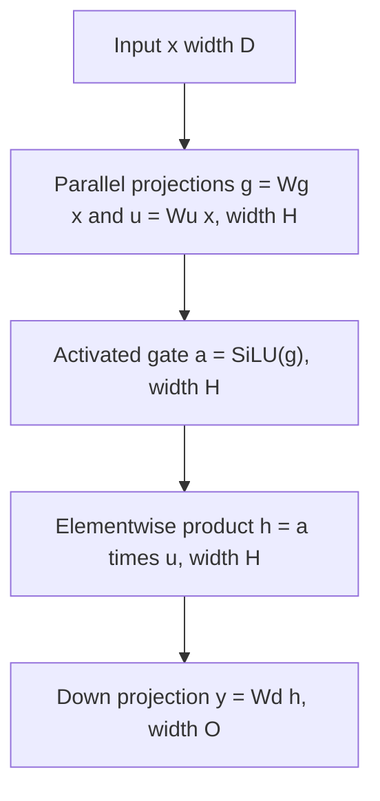

# Problem 008: SwiGLU Feed-Forward Gate

## Why this exists

The feed-forward sublayer in many decoder models is not simply
`down(activation(up(x)))`. SwiGLU computes two independent expansions of the
residual vector: one decides how strongly each hidden feature is gated, while
the other supplies the values being gated. A third projection returns the
expanded hidden representation to the residual width.

This lesson implements the complete readable CPU flow and a useful Metal
fusion for the elementwise middle stage. The Metal path is not a CPU fallback:
actual MSL computes `SiLU(gate) * up` without materializing SiLU separately.

## Learning outcomes

After completing the problem, you can:

- write the gate, up, elementwise product, and down equations with dimensions;
- explain why SwiGLU has three projection matrices;
- validate each inner dimension before indexing flat storage;
- implement the full operator in readable Float32 CPU code;
- fuse SiLU with its elementwise multiplication in Metal;
- identify which intermediates remain and which one the fused stage removes.

## Prerequisites

- Problem 004 for matrix-vector multiplication and row reductions.
- Problem 007 for the SiLU formula and elementwise Metal mapping.
- Problem 002 for contiguous row-major matrix offsets.

## Vocabulary

- **Residual width $D$**: the feature count entering and usually leaving a decoder sublayer.
- **Hidden width $H$**: the expanded MLP feature count.
- **Gate projection**: $W_gx$, whose SiLU output modulates hidden features.
- **Up projection**: $W_ux$, which supplies the values being modulated.
- **Down projection**: $W_dh$, which maps hidden features to output width $O$.
- **Hadamard product**: elementwise multiplication, written $\odot$.
- **Fusion**: computing adjacent operations in one dispatch without writing an intermediate.

## Math from first principles

Let

- $x\in\mathbb{R}^{D}$,
- $W_g\in\mathbb{R}^{H\times D}$,
- $W_u\in\mathbb{R}^{H\times D}$,
- $W_d\in\mathbb{R}^{O\times H}$.

The operator is

$$
g = W_gx,\qquad u = W_ux,
$$

$$
h = \operatorname{SiLU}(g)\odot u,
$$

$$
y = W_dh.
$$

The gate and up matrices cannot generally be merged: their rows learn
different functions, and a nonlinear SiLU lies between the gate projection
and multiplication. The down matrix is also necessary because $h$ lives at
hidden width $H$, while the residual stream expects width $O$ (commonly $O=D$).



### Worked numerical example

Choose $D=2$, $H=2$, $O=2$:

$$
x=\begin{bmatrix}1\\2\end{bmatrix},\quad
W_g=\begin{bmatrix}1&0\\0&-1\end{bmatrix},\quad
W_u=\begin{bmatrix}0&1\\1&1\end{bmatrix}.
$$

Then

$$
g=\begin{bmatrix}1\\-2\end{bmatrix},\qquad
u=\begin{bmatrix}2\\3\end{bmatrix}.
$$

Using `SiLU(1) = 0.731059` and `SiLU(-2) = -0.238406`:

$$
h\approx\begin{bmatrix}1.462118\\-0.715218\end{bmatrix}.
$$

For

$$
W_d=\begin{bmatrix}1&1\\2&-1\end{bmatrix},
$$

the output is approximately

$$
y=\begin{bmatrix}0.746900\\3.639454\end{bmatrix}.
$$

Notice that negative gate values are suppressed but not necessarily zeroed.

## Shape, layout, and dtype contract

`P008SwiGLUExercise.apply` accepts contiguous Float32 tensors:

| Tensor | Shape | Storage offset |
| --- | --- | --- |
| `input` | `[D]` | `column` |
| `gateWeights` | `[H, D]` | `row * D + column` |
| `upWeights` | `[H, D]` | `row * D + column` |
| `downWeights` | `[O, H]` | `row * H + column` |
| result | `[O]` | `row` |

All accumulation and intermediates in the canonical path are Float32. Gate
and up shapes must match; their second dimension must equal `D`; the down
matrix's second dimension must equal `H`. A zero hidden width is valid and
produces an all-zero `[O]` output. Rank and inner-dimension errors are explicit.

The reusable Metal gate API accepts gate and up tensors of any identical shape
and returns that shape.

## CPU reference path

Implement in three visible stages:

1. For each hidden row, compute one gate dot product and one up dot product.
2. Store `(gate / (1 + exp(-gate))) * up` in a hidden array.
3. For each output row, dot the down weights with the hidden array.

Keeping these stages visible makes shape mistakes diagnosable. Do not call the
exercise implementation from the canonical solution, and do not call a CPU
helper from the Metal path.

## Correctness method

The CPU judge includes a hand-sized case with $D=2$, $H=3$, and $O=2$, a zero
input, and zero hidden width. It independently accumulates in Double and rounds
the final values to Float, with relative tolerance `4e-5`. It also rejects input rank, mismatched gate/up
shapes, and an invalid down hidden width.

The Metal gate judge uses negative, zero, and large gate values and checks
shape mismatch. This catches returning `up`, returning sigmoid without the
factor `gate`, and running SiLU without multiplication.

Run:

```sh
swift run inference-school check 008 --cpu
swift run inference-school check 008 --metal
swift run inference-school check 008 --solution
```

## Performance model

Ignoring bias, the three matrix-vector products cost approximately

$$
2HD + 2HD + 2OH
$$

floating-point operations. The middle gate adds $H$ SiLU evaluations and $H$
multiplications. Weights dominate bytes for one-token decode: gate and up each
read $4HD$ bytes, and down reads $4OH$ bytes.

An unfused middle stage writes `SiLU(g)` ($4H$ bytes), then reads it and `u`
before writing `h`. The fused kernel reads `g` and `u` and writes `h`, removing
the SiLU intermediate and one dispatch. It does not fuse any projection; those
weight reads and reductions remain.

For prefill with many tokens, GEMM can reuse weights across token rows. For
single-token decode, the three weight matrices are streamed for every token,
so bandwidth usually matters more than the elementwise gate arithmetic.

## Metal mapping

The implemented Metal stage dispatches one thread per hidden element. Thread
`i` reads `gate[i]` and `up[i]`, computes SiLU and the product, and writes
`hidden[i]`. There is no shared memory or barrier because indices are independent.

This is deliberately a partial fusion with a clear boundary:

```text
gate GEMV ----\
               fused SiLU * up ---> hidden ---> down GEMV
up GEMV ------/
```

The starter and solution bind the same three device buffers and one element
count. The canonical MSL is
[P008SwiGLU.metal](../../Sources/InferenceSchoolSolutions/Metal/P008SwiGLU.metal).

## Implementation checkpoints

1. Validate all four ranks and dimensions.
2. Compute gate projection values and compare them by hand.
3. Compute up values separately; do not accidentally share accumulators.
4. Apply the Problem 007 SiLU convention and multiply elementwise.
5. Implement the down projection and preserve `[O]` shape.
6. Implement the fused Metal gate using one thread per hidden element.
7. Verify CPU full-flow and Metal middle-stage judges independently.

## Controlled experiments

### Experiment A: hidden-width sweep

Keep $D=O$ fixed and sweep $H$ through `D`, `2D`, and `4D`. Prediction: total
time and weight traffic grow roughly linearly with $H$; decode remains dominated
by projection matrix reads rather than the gate kernel.

### Experiment B: separate versus fused gate

Compare two Metal dispatches (`SiLU(g)` then multiply by `u`) against the fused
kernel. Prediction: fusion wins once $H$ is large enough because it removes a
launch and an $H$-element intermediate round trip. At tiny $H$, timing noise and
command overhead can hide the traffic difference.

### Experiment C: output width

Hold $D$ and $H$ fixed, vary $O$. Prediction: only the down projection scales
with $O$; gate and up timings should stay constant. If they change, the
benchmark is measuring allocation or unrelated end-to-end effects.

Record dimensions, release configuration, warm-up, synchronization point, and
whether timing includes buffer creation.

## Engine integration

A decoder MLP will consume an RMS-normalized residual vector, run this SwiGLU
flow, and add the result back to the residual stream. Problems 010 and 011
provide those surrounding operations. Problem 012 investigates fusing the norm
with a projection input, which can be applied to gate and up projections later.

## Tradeoffs

- Materializing `g` and `u` keeps projection and activation kernels reusable;
  fusing projections with gating can remove more traffic but creates a larger specialized kernel.
- Larger $H$ increases model capacity and weight traffic together.
- Float32 intermediates are easy to validate; lower precision can save traffic
  but changes the residual error budget explored in Problem 011.
- Computing gate and up in one matrix kernel may improve weight scheduling, but
  their logical matrices and outputs remain distinct.

## Hints

- Name `D`, `H`, and `O` before writing any index expression.
- Reinitialize both projection accumulators for every hidden row.
- Reuse the SiLU formula, not the Problem 007 solution target.
- The Metal gate accepts tensors of any rank as long as shapes match; use flat
  contiguous storage because the operation is elementwise.

## Canonical solution

- [CPU solution](../../Sources/InferenceSchoolSolutions/P008SwiGLUSolution.swift)
- [Metal gate solution](../../Sources/InferenceSchoolSolutions/Metal/P008SwiGLU.metal)

Inspect them after your hand calculation and experiment prediction are written.

## Completion checklist

- [ ] The full CPU gate/up/down flow passes all value and error cases.
- [ ] You can annotate every matrix with `[rows, columns]`.
- [ ] The Metal stage executes MSL for `SiLU(gate) * up` and passes its judge.
- [ ] You can explain why all three learned projections are needed.
- [ ] You identified which intermediate the fused stage removes.
- [ ] You ran one controlled hidden-width or fusion experiment in release mode.
- [ ] You interpreted the result using weight bytes, intermediate bytes, and dispatch cost.