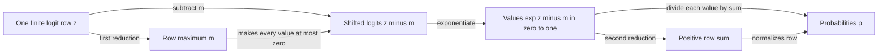

# Problem 009: Numerically Stable Softmax

## Why this exists

Attention produces scores, not probabilities. Softmax converts each score row
into nonnegative values that sum to one, but a literal implementation of
`exp(logit)` can overflow for large positive logits and underflow every term for
large negative logits. Both failures can occur even when the correct
probabilities are ordinary numbers.

This lesson makes stability part of the operator contract and maps the two
required reductions, maximum and exponential sum, to a real Metal threadgroup.

## Learning outcomes

After completing the problem, you can:

- derive why subtracting one constant from every logit leaves softmax unchanged;
- implement stable row-wise softmax with max subtraction;
- test probability sums as an invariant without using them as the only oracle;
- distinguish a zero-row tensor from a row with zero columns;
- implement max and sum reductions with threadgroup memory and barriers;
- explain and test the Metal lesson's explicit 1024-column limit.

## Prerequisites

- Problem 001 for parallel reductions and synchronization.
- Problem 002 for a contiguous `[rows, columns]` tensor.
- Problem 006 for reduction traffic and dispatch overhead.
- Exponentials from the [Math Primer](../../docs/MATH-PRIMER.md).

## Vocabulary

- **Logit**: an unnormalized score before conversion to probabilities.
- **Normalization constant**: the denominator that makes a row sum to one.
- **Shift invariance**: softmax is unchanged when every row element receives the same additive constant.
- **Overflow**: a finite mathematical result exceeds the representable floating-point range.
- **Underflow**: a very small magnitude rounds to zero.
- **Row reduction**: combining all columns of one row into one maximum or sum.
- **Probability simplex**: nonnegative vectors whose elements sum to one.

## Math from first principles

For logits $z_0,\ldots,z_{C-1}$, softmax is

$$
p_i = \frac{e^{z_i}}{\sum_{j=0}^{C-1} e^{z_j}}.
$$

For any constant $c$, multiply numerator and denominator by $e^{-c}$:

$$
\frac{e^{z_i}}{\sum_j e^{z_j}}
= \frac{e^{z_i}e^{-c}}{\sum_j e^{z_j}e^{-c}}
= \frac{e^{z_i-c}}{\sum_j e^{z_j-c}}.
$$

Choose $c=m=\max_j z_j$. Every shifted logit is at most zero, so every
exponential lies in $(0,1]$, and at least one is exactly one:

$$
p_i = \frac{e^{z_i-m}}{\sum_j e^{z_j-m}}.
$$

The denominator cannot underflow to zero for finite, nonempty input because it
contains the maximum term $e^0=1$.



### Worked numerical example

For logits $[1000,1001,999]$, the naive exponentials overflow in Float32.
Subtract the maximum $1001$ to get $[-1,0,-2]$:

$$
e^{-1}\approx0.367879,\quad e^0=1,\quad e^{-2}\approx0.135335.
$$

Their sum is about $1.503214$, producing

$$
p\approx[0.244728,\ 0.665241,\ 0.090031].
$$

The same probabilities result for `[-1000, -999, -1001]`; only relative
differences matter.

## Shape, layout, and dtype contract

Input and output are contiguous Float32 tensors with shape `[R, C]`.

- Rank must be exactly two.
- `C` must be positive because a probability distribution over zero choices is undefined.
- `R` may be zero; `[0, C]` returns an empty tensor of the same shape.
- Every logit must be finite. Infinity and NaN are rejected with row and column.
- Output shape and storage order match input.
- Every nonempty output row must be nonnegative and sum to one within `3e-5`.

The CPU API supports any `C` representable by the tensor. The teaching Metal
kernel supports `C <= MetalSoftmaxPipeline.maximumRowWidth`, currently 1024.
The host rejects wider rows before dispatch.

## CPU reference path

For each row:

1. Scan all columns to find the maximum.
2. Compute and store `exp(logit - maximum)`, accumulating their sum.
3. Divide each stored exponential by the sum.

The canonical path uses Float32 so it models the actual operator. The judge's
oracle performs the same derivation in Double and rounds each final
probability to Float.

Do not test correctness only by checking that the row sums to one. A uniform
distribution also sums to one and is wrong for nonuniform logits.

## Correctness method

The shared judge covers ordinary rows, logits near positive 10,000, logits
near negative 10,000, single-value rows, a width of 257 that crosses the Metal
threadgroup size, and zero rows. It separately checks exact expected values and
the probability-sum invariant.

Error cases cover rank one, `[R, 0]`, and non-finite input. The Metal test also
constructs width 1025 and verifies the public `rowWidthExceedsMaximum` error.

Run:

```sh
swift run inference-school check 009 --cpu
swift run inference-school check 009 --metal
swift run inference-school check 009 --solution
```

## Performance model

For $R$ rows and $C$ columns, the CPU path performs two reductions and a
normalization pass. It computes $RC$ exponentials. Its explicit array writes
the shifted exponentials once and then reads them for division.

The Metal kernel scans input for the maximum, scans it again for the
exponential sum, and scans it a third time to recompute exponentials for output.
Algorithmic global traffic is therefore roughly three input reads plus one
output write, or about $16RC$ bytes, before considering cache. Recomputing the
exponential avoids a separate temporary buffer and dispatch.

Each row is one threadgroup. Small `C` leaves many of 256 threads idle; very
few rows expose little group-level parallelism. Large batches provide
parallelism across rows, while wide rows provide work within each group.

## Metal mapping

The canonical kernel uses 256 threads per row and a 256-Float scratch array.

1. Each thread scans columns `localIndex`, `localIndex + 256`, and so on.
2. A tree reduction finds the row maximum in threadgroup memory.
3. Threads compute shifted exponential partial sums.
4. A second tree reduction finds the denominator.
5. Threads write normalized probabilities for their strided columns.

Every reduction stage requires a threadgroup barrier before another thread
reads a partial value. No thread may return early based on column bounds,
because all 256 threads must reach every barrier; out-of-range threads instead
contribute `-infinity` to max and zero to sum.

The 1024-column cap is pedagogical, not a claim about Metal hardware. It bounds
this first materialized implementation to at most four values per thread and
makes unsupported attention rows fail visibly. Problem 019's online softmax is
the later artifact for unbounded streaming rows.

See [P009Softmax.metal](../../Sources/InferenceSchoolSolutions/Metal/P009Softmax.metal).

## Implementation checkpoints

1. Validate rank, positive column count, and finite values.
2. Implement one stable CPU row and compare the worked example.
3. Extend to multiple and zero rows while preserving shape.
4. Implement only the Metal maximum reduction and inspect it temporarily.
5. Add the shifted exponential sum reduction.
6. Normalize output without allowing any thread to skip a barrier.
7. Test widths 1, 257, 1024, and rejected 1025.

## Controlled experiments

### Experiment A: translation invariance

Generate one row, then add constants `-10000`, `0`, and `10000` to every
element. Prediction: stable outputs agree within tolerance. A naive
implementation will underflow or overflow in the shifted cases.

### Experiment B: reduction boundaries

Measure widths `255`, `256`, `257`, `512`, and `1024` with fixed row count.
Prediction: 257 adds a second loop iteration for one thread but does not double
all work; step changes reflect striding and reduction overhead, not a new grid.

### Experiment C: row parallelism

Fix `C=128` and sweep `R` from `1` to `1024`. Prediction: one row underuses the
GPU, while more independent row threadgroups improve occupancy until memory or
math throughput becomes limiting.

Write predictions before measuring and record whether buffer allocation and
CPU/GPU synchronization are included.

## Engine integration

Attention will apply this operator to one score row per query and head after
masking. A mask represented as negative infinity would conflict with this
lesson's finite-input contract; the later attention operator must either use a
finite sentinel before this API or define a mask-aware softmax contract. Problem
019 replaces materialized score rows with online softmax state.

## Tradeoffs

- Storing exponentials saves recomputation but creates an intermediate write and read.
- Recomputing exponentials saves storage traffic at additional math cost.
- One threadgroup per row is simple; SIMD-group reductions can reduce barriers
  but add hardware-aware structure.
- A fixed width cap gives explicit behavior; streaming or tiled softmax is
  required for larger contexts rather than silently truncating rows.

## Hints

- Initialize a maximum accumulator to negative infinity, not zero; all logits may be negative.
- Subtract the maximum before every exponential, including the final output pass.
- Keep all threads participating in barriers.
- If sums equal one but values are wrong, compare against the independent oracle.

## Canonical solution

- [CPU solution](../../Sources/InferenceSchoolSolutions/P009SoftmaxSolution.swift)
- [Metal solution](../../Sources/InferenceSchoolSolutions/Metal/P009Softmax.metal)

## Completion checklist

- [ ] Large positive and all-negative logits produce finite correct probabilities.
- [ ] Every nonempty row sums to one within tolerance.
- [ ] Empty rows, invalid rank, empty columns, and non-finite values follow the contract.
- [ ] Metal executes both reductions and handles width 257.
- [ ] Width 1025 is rejected explicitly rather than truncated.
- [ ] You recorded and ran one translation, width, or row-count experiment.
- [ ] You can explain every barrier and neutral reduction value.