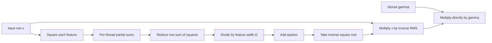

# Problem 010: RMSNorm

## Why this exists

Transformer sublayers repeatedly consume a residual stream whose magnitude can
change across layers. RMSNorm scales each row by its root mean square before a
learned per-feature scale. It does not subtract the mean, so it is cheaper than
LayerNorm and preserves a different invariant.

Normalization conventions are part of model compatibility. This course uses
exactly `x / rms * gamma`. `gamma` is the stored multiplicative scale. There is
no implicit `1 + gamma` transformation.

## Learning outcomes

After completing the problem, you can:

- derive root mean square from a feature row;
- distinguish RMSNorm from LayerNorm and from residual addition;
- state the exact placement of epsilon and gamma;
- use a higher-precision independent oracle to judge Float32 code;
- parallelize sum-of-squares reduction and scaling in one Metal dispatch;
- identify overflow, cancellation, and epsilon-sensitive fixtures.

## Prerequisites

- Problem 001 for reductions.
- Problem 002 for row-major `[rows, width]` tensors.
- Problem 006 for reduction performance.
- Problem 009 for a two-phase row kernel with barriers.

## Vocabulary

- **Root mean square (RMS)**: square root of the average squared values.
- **Gamma**: a learned multiplicative scale with one value per feature.
- **Epsilon**: a positive stabilizer added inside the square root.
- **Centering**: subtracting a row mean. RMSNorm does not center.
- **Oracle**: an independent implementation used to compute expected values.
- **Reduction precision**: the dtype used while accumulating sum of squares.

## Math from first principles

For a row $x\in\mathbb{R}^{D}$ and scale
$\gamma\in\mathbb{R}^{D}$, define

$$
\operatorname{rms}(x)
= \sqrt{\frac{1}{D}\sum_{j=0}^{D-1}x_j^2 + \epsilon}.
$$

The output is

$$
y_i = \frac{x_i}{\operatorname{rms}(x)}\gamma_i.
$$

Epsilon is added to the mean square, before square root. The operator does not
compute a mean, subtract a mean, add a bias, or replace gamma with
$1+\gamma$.

Ignoring epsilon, dividing by RMS gives the normalized row mean square one:

$$
\frac{1}{D}\sum_i\left(\frac{x_i}{\operatorname{rms}(x)}\right)^2 = 1.
$$

Gamma then deliberately changes each feature's scale.



### Worked numerical example

Let $x=[3,4]$, $\gamma=[2,0.5]$, and $\epsilon=10^{-6}$.

$$
\frac{3^2+4^2}{2}=12.5,
\qquad
\operatorname{rms}(x)=\sqrt{12.500001}\approx3.535534.
$$

Before gamma, the normalized row is approximately `[0.848528, 1.131371]`.
After direct multiplication by gamma:

$$
y\approx[1.697056,\ 0.565685].
$$

Using `1 + gamma` would instead produce about `[2.545584, 1.697057]`; that is
a different parameter convention and must fail this lesson's judge.

## Shape, layout, and dtype contract

`RMSNormImplementation` accepts:

- `input`: contiguous Float32 `[R, D]`;
- `gamma`: contiguous Float32 `[D]`;
- `epsilon`: finite and strictly positive;
- result: contiguous Float32 `[R, D]`.

`D` must be positive. `R` may be zero and returns empty storage with shape
`[0, D]`. Gamma rank and width must match exactly. Non-finite input is rejected
with its row and column.

The canonical operator accumulates Float32 to expose the production numerical
path. The judge accumulates squares, divides, square-roots, and scales in
Double, then rounds final values to Float. Tolerance is `4e-5` absolute plus
`5e-5` relative.

## CPU reference path

For each row:

1. Initialize `sumSquares` to Float32 zero.
2. Add `value * value` for every feature.
3. Compute `inverseRMS = 1 / sqrt(sumSquares / Float(D) + epsilon)`.
4. Write `input * inverseRMS * gamma` for every feature.

The second input pass is intentional: the scale is unknown until the whole row
has been reduced. A separate normalized array is unnecessary for RMSNorm alone.

## Correctness method

The judge covers mixed signs and nonuniform gamma, a constant row, a zero row
whose denominator is controlled by epsilon, large finite values, and zero
logical rows. The Double oracle avoids sharing the canonical Float32 reduction.

Errors cover input rank, gamma width, nonpositive epsilon, and zero feature
width. The mixed gamma fixture specifically catches an accidental `1 + gamma`
convention.

Run:

```sh
swift run inference-school check 010 --cpu
swift run inference-school check 010 --metal
swift run inference-school check 010 --solution
```

## Performance model

For $R$ rows of width $D$, RMSNorm performs roughly $RD$ squares and additions,
$R$ reciprocal square roots, and $2RD$ final multiplies. It reads input once
for reduction and again for output, reads $RD$ gamma values logically, and
writes $RD$ outputs.

Ignoring cache, that is approximately three Float32 reads and one write per
element, or $16RD$ bytes. Gamma is shared across rows and may remain cached.
The arithmetic intensity is low enough that large rows are commonly sensitive
to memory traffic, while short rows are sensitive to reduction barriers and launch cost.

Large Float32 values can overflow when squared even if the final normalized
result is modest. This lesson tests large but square-representable values;
production kernels may use scaled sum-of-squares or wider accumulation when
the model's range requires it.

## Metal mapping

One 256-thread threadgroup owns one row. Each thread accumulates squares for
columns separated by 256. A tree reduction in threadgroup memory produces the
row sum. Every thread then reads the shared result, computes the same
`inverseRMS`, and writes its strided output columns.

There is no fixed row-width cap: each thread loops until `column >= D`. All
threads must reach every reduction barrier, including threads with no columns.
Those threads contribute zero.

The kernel combines reduction and scale in one dispatch, but it still reads
input twice. Problem 012 fuses the scaled values directly into a projection so
the normalized output is never written to global memory.

See [P010RMSNorm.metal](../../Sources/InferenceSchoolSolutions/Metal/P010RMSNorm.metal).

## Implementation checkpoints

1. Validate rank, width, gamma, epsilon, and finite input.
2. Compute one row's Float32 sum of squares.
3. Check epsilon placement with an all-zero row.
4. Apply gamma directly and compare the worked example.
5. Port the sum-of-squares tree reduction to Metal.
6. Add the post-reduction scale pass in the same dispatch.
7. Test constant, large, zero-row, and width-over-256 cases.

## Controlled experiments

### Experiment A: epsilon sensitivity

Use rows whose magnitudes are `0`, `1e-4`, `1`, and `1e4`, comparing epsilon
`1e-6` and `1e-3`. Prediction: epsilon materially changes only rows whose mean
square is near or below epsilon.

### Experiment B: accumulation precision

Build a separate Double-accumulating CPU variant and compare it with Float32
for alternating large and small magnitudes. Prediction: output differences
grow when small squared terms are added to a much larger running sum, even
though there is no sign cancellation after squaring.

### Experiment C: row width and row count

Measure widths `64`, `256`, `257`, and `4096` for one row and many rows.
Prediction: one short row underuses the GPU; crossing 256 adds loop iterations,
while many rows expose more independent threadgroups.

Record tolerance as well as time. A faster path that violates the model's
normalization convention is not an optimization.

## Engine integration

Pre-norm decoder blocks apply RMSNorm to the residual stream before attention
and before the SwiGLU MLP. Gamma values come directly from model weights and
must follow the loader's stored convention. Problem 011 studies the dtype of
the residual input; Problem 012 consumes RMS-normalized values inside a GEMV.

## Tradeoffs

- Float32 accumulation is simple and fast; Double or compensated accumulation
  can improve an oracle but may not map efficiently to the GPU.
- Materializing normalized output makes it reusable by several consumers;
  fusion saves traffic when one projection consumes it once.
- One threadgroup per row is readable; SIMD-group reductions can use fewer
  barriers at the cost of more specialized code.
- A larger epsilon improves denominator robustness but changes model outputs.

## Hints

- Divide by `D`, not by `D - 1`; this is a population mean square.
- Add epsilon before square root.
- Gamma is direct multiplication, not an offset from one.
- In Metal, give inactive threads a zero partial rather than returning before barriers.

## Canonical solution

- [CPU solution](../../Sources/InferenceSchoolSolutions/P010RMSNormSolution.swift)
- [Metal solution](../../Sources/InferenceSchoolSolutions/Metal/P010RMSNorm.metal)

## Completion checklist

- [ ] CPU output matches the Double oracle for constant, zero, mixed, and large rows.
- [ ] Gamma is applied as stored, with no implicit `+1`.
- [ ] Epsilon is finite, positive, and inside the square root.
- [ ] Metal performs a real sum-of-squares reduction and scale pass.
- [ ] Zero rows are accepted and zero feature width is rejected.
- [ ] You ran one epsilon, precision, or shape experiment with a written prediction.
- [ ] You can explain which input round trip Problem 012 removes.