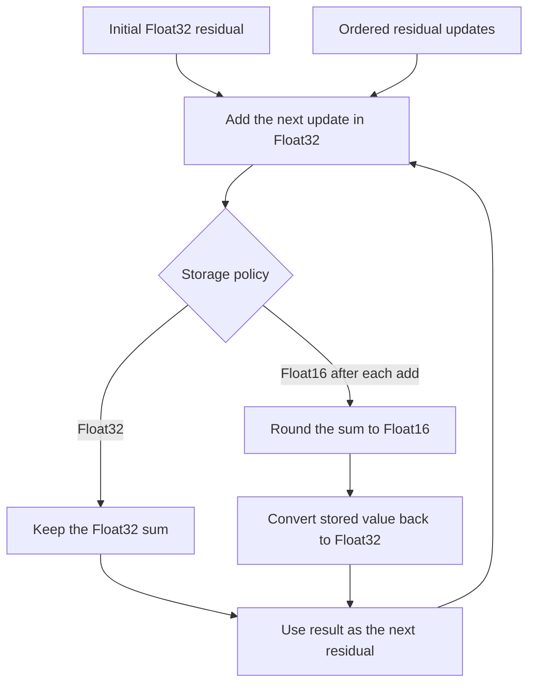

# Problem 011: Residual Streams and Precision

## Why this exists

The residual stream is the long-lived state that carries information through
every decoder block. Attention and MLP outputs are added into it repeatedly.
A rounding decision at this boundary is therefore not local: an update lost
after one layer is absent from every later layer.

This systems lab compares two explicit policies. One keeps each add in
Float32. The other simulates storing the residual as Float16 after every add by
round-tripping the new sum through `Float16`. The point is not that one policy
is universally correct; it is to make downcast placement measurable and reviewable.

## Learning outcomes

After completing the problem, you can:

- describe the residual stream's role across decoder sublayers;
- distinguish Float32 arithmetic from Float16 storage round trips;
- predict when a small update falls below a Float16 unit in the last place;
- implement an explicit, deterministic downcast policy;
- measure maximum absolute divergence between two policies;
- explain why this lesson is CPU-only rather than disguising CPU work as Metal.

## Prerequisites

- Problem 002 for tensor shape contracts.
- Problem 006 for separating numerical and performance questions.
- Problem 010 for the normalized values that consume residual state.

## Vocabulary

- **Residual stream**: the feature tensor updated by adding each sublayer's output.
- **Residual update**: an attention or MLP result added to the stream.
- **Downcast**: conversion from a wider or more precise dtype to a narrower one.
- **Round trip**: convert Float32 to Float16 and back to Float32 so storage loss is observable.
- **ULP**: unit in the last place, the spacing between adjacent representable values near a magnitude.
- **Error propagation**: later computation operating on an already rounded state.
- **Policy boundary**: the precise point at which conversion is required by the API.

## Math from first principles

For initial residual $r^{(0)}$ and updates $u^{(1)},\ldots,u^{(L)}$, idealized
real arithmetic gives

$$
r^{(\ell)} = r^{(\ell-1)} + u^{(\ell)}.
$$

The Float32 policy models

$$
r^{(\ell)}_{32}
= \operatorname{round}_{32}\left(r^{(\ell-1)}_{32}+u^{(\ell)}\right).
$$

The per-add Float16 storage policy models

$$
r^{(\ell)}_{16}
= \operatorname{Float32}\left(
\operatorname{round}_{16}\left(r^{(\ell-1)}_{16}+u^{(\ell)}\right)
\right).
$$

The conversion occurs after every addition. Converting only once after all
updates is a different policy and usually loses different information.



### Worked numerical example

Near 4096, Float16 has an exponent large enough that adjacent representable
values are 4 apart. Start with `4096` and add `0.5` four times.

Float32 retains the updates:

$$
4096 + 0.5 + 0.5 + 0.5 + 0.5 = 4098.
$$

With a Float16 round trip after each addition, each intermediate `4096.5`
rounds back to `4096`, so the final value remains `4096`. The measurable
absolute difference is `2`.

This is not random noise. It follows deterministically from the chosen storage
format and the position of each conversion.

## Shape, layout, and dtype contract

`ResidualAccumulationImplementation` accepts:

- an initial contiguous Float32 tensor of any shape;
- zero or more update tensors;
- one `ResidualPrecisionPolicy`.

Every update must have exactly the initial shape. No broadcasting is allowed.
The result has the same shape and Float32 Swift storage in both policies; for
`float16AfterEachAdd`, each scalar sum is converted to `Float16` and back after
every update. With no updates, the initial tensor is returned unchanged.

`ResidualPrecisionComparison` contains both outputs and their maximum absolute
difference. It is a lab report type, not a claim that maximum error alone
captures model quality.

## CPU reference path

Copy the initial storage, then process updates in order. For each scalar:

```swift
let sum = output[index] + update.storage[index]
output[index] = policy == .float32 ? sum : Float(Float16(sum))
```

Validation happens before mutation so a mismatched update cannot return a
partially accumulated tensor. Do not batch all updates into one sum before the
Float16 conversion; that moves the policy boundary.

## Correctness method

The judge includes the 4096 fixture under both policies, a matrix-shaped
residual, and no updates. Expected values are generated by a separate policy
loop in the core target. It also rejects an update whose shape differs despite
having the same element count.

The dedicated comparison test asserts:

- Float32 result: `4098`;
- per-add Float16 result: `4096`;
- maximum absolute difference: `2`.

Run:

```sh
swift run inference-school check 011 --cpu
swift run inference-school check 011 --solution
```

`check 011 --metal` is rejected because the problem has no Metal stage.

## Performance model

For $L$ updates and $N$ elements, accumulation performs $LN$ additions. A
straight loop reads the current residual and one update and writes the new
residual each time. The per-add Float16 policy also performs two conversions
per element per update in this simulation.

The simulation still stores Swift arrays as Float32, so it does not claim
Float16 memory-bandwidth savings. A real packed Float16 residual would halve
residual bytes but require kernels whose loads, arithmetic promotion, and
stores exactly match that policy. This problem isolates numerical behavior
before making such a performance claim.

Update order can matter in finite precision. Adding a very small update to a
large residual may lose it, while combining small updates first can retain part
of their sum. Decoder execution order is fixed by the model and must not be
rearranged merely to improve a fixture.

## Metal mapping

This lesson is intentionally CPU-only. A one-thread-per-element Metal add would
be easy to write, but it would add dispatch and buffer mechanics without
teaching the central question: exactly where the residual is downcast across a
sequence of layers.

A later integrated decoder can implement either policy on Metal by choosing
the residual buffer dtype and store boundary. Its parity test should reuse the
deterministic fixtures here. Until that integrated buffer exists, a Metal
kernel would be an isolated copy operation rather than evidence about actual
residual storage.

## Implementation checkpoints

1. Validate every update shape before adding values.
2. Implement ordered Float32 accumulation.
3. Add an explicit Float16 round trip after each scalar add.
4. Verify no-update behavior for both policies.
5. Reproduce the 4096 worked example.
6. Build a `ResidualPrecisionComparison` and report maximum difference.
7. Explain why converting only at the end is not equivalent.

## Controlled experiments

### Experiment A: update magnitude

Start at 4096 and repeat updates of `0.25`, `0.5`, `1`, `2`, and `4`.
Prediction: per-add Float16 loses the smallest updates; updates at or above the
local spacing become visible, subject to round-to-nearest behavior.

### Experiment B: layer count

Repeat one small update for `1`, `4`, `32`, and `128` layers. Prediction:
Float32 accumulates it until its own precision limit, while per-add Float16 may
lose every update, so divergence grows with layer count.

### Experiment C: downcast placement

Compare downcast after every add with downcast once after all adds. Prediction:
the final-only conversion preserves the accumulated `2` in the worked example,
demonstrating that dtype name alone does not specify numerical behavior.

### Experiment D: order

Use updates with mixed magnitudes in original and magnitude-sorted order.
Prediction: Float16 results can differ. Treat this as a diagnostic, not
permission to reorder model operations.

## Engine integration

A pre-norm decoder reads the residual for RMSNorm, computes attention or MLP
output, and writes `residual + update`. The eventual engine must choose a
buffer dtype and conversion point that match its parity target. Layer-by-layer
comparisons should inspect the residual immediately after each add to locate
the first policy divergence.

Problem 012 consumes a residual-like vector through RMSNorm and projection but
does not change this addition policy.

## Tradeoffs

- Float32 residual storage uses more bytes but retains more small updates.
- Float16 storage can reduce traffic and capacity, but conversion at every
  layer can erase information before later normalization.
- Maximum absolute error is easy to interpret; relative error, cosine
  similarity, and downstream logits may expose different consequences.
- A deterministic simulation is portable; an integrated GPU benchmark is
  necessary before making speed claims.

## Hints

- Validate shape arrays, not only element counts.
- Convert the sum, not each operand independently, unless defining another policy.
- Keep update order unchanged.
- Use values around a known Float16 spacing to make the effect visible.

## Canonical solution

The independent implementation and comparison helper are in
[P011ResidualPrecisionSolution.swift](../../Sources/InferenceSchoolSolutions/P011ResidualPrecisionSolution.swift).

## Completion checklist

- [ ] Both precision policies pass deterministic judge cases.
- [ ] Shape mismatch is rejected before accumulation.
- [ ] The 4096 fixture produces a measured difference of 2.
- [ ] You can state exactly when the Float16 round trip occurs.
- [ ] You ran one magnitude, layer-count, placement, or order experiment.
- [ ] You did not claim memory savings from the Float32-backed simulation.
- [ ] You can identify the residual store boundary in a future decoder block.