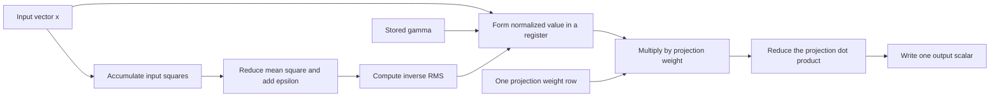

# Problem 012: Fuse Norm, Scale, and Projection Input

## Why this exists

A pre-norm decoder commonly computes RMSNorm and immediately feeds the result
to one or more linear projections. A separate implementation writes the whole
normalized vector to global memory, launches another kernel, then reads that
vector for GEMV. Fusion can remove the intermediate and one dispatch.

This lesson keeps a readable separate CPU baseline and implements an actual
fused Metal RMSNorm+GEMV kernel. It does not call two CPU functions. The kernel
computes the RMS reduction and consumes normalized values directly in each
projection row's dot product.

## Learning outcomes

After completing the problem, you can:

- expand a composed RMSNorm and GEMV equation without changing its semantics;
- compare a materialized baseline against a fused implementation;
- account for the normalized intermediate's bytes and dispatch;
- implement two threadgroup reductions in one Metal kernel;
- identify redundant work introduced by the chosen dispatch mapping;
- decide when saved memory traffic justifies a more specialized kernel.

## Prerequisites

- Problem 004 for GEMV shapes and row reductions.
- Problem 006 for arithmetic intensity and end-to-end timing.
- Problem 010 for the exact `x / rms * gamma` convention.
- Problem 011 for why input dtype and conversion boundaries remain separate decisions.

## Vocabulary

- **Materialization**: writing an intermediate tensor to memory so another operator can read it.
- **Producer**: the operation creating an intermediate, here RMSNorm.
- **Consumer**: the operation reading it, here GEMV.
- **Fused kernel**: one dispatch that computes both while preserving the composed result.
- **Projection row**: one weight row that produces one output scalar.
- **Redundant reduction**: recomputing the same RMS statistic in multiple threadgroups.
- **Dispatch tradeoff**: choosing grid ownership that changes parallelism, synchronization, and repeated work.

## Math from first principles

Let input $x\in\mathbb{R}^{D}$, scale
$\gamma\in\mathbb{R}^{D}$, and projection weights
$W\in\mathbb{R}^{O\times D}$. Define

$$
s = \frac{1}{D}\sum_{j=0}^{D-1}x_j^2,
\qquad
n_j = \frac{x_j}{\sqrt{s+\epsilon}}\gamma_j.
$$

The separate baseline materializes $n$ and computes

$$
y_i = \sum_{j=0}^{D-1} W_{ij}n_j.
$$

Substitute the normalized value directly:

$$
y_i = \sum_{j=0}^{D-1}W_{ij}
\left(\frac{x_j}{\sqrt{\frac{1}{D}\sum_k x_k^2+\epsilon}}\gamma_j\right).
$$

Fusion changes storage and scheduling, not this equation. Gamma is still direct
multiplication, and epsilon stays inside the RMS square root.



### Worked numerical example

Use $x=[3,4]$, $\gamma=[2,0.5]$, $\epsilon=10^{-6}$, and

$$
W=\begin{bmatrix}1&2\\-1&1\end{bmatrix}.
$$

From Problem 010, normalized-and-scaled input is approximately

$$
n=[1.697056,\ 0.565685].
$$

The baseline gives

$$
y_0=1(1.697056)+2(0.565685)\approx2.828426,
$$

$$
y_1=-1(1.697056)+1(0.565685)\approx-1.131371.
$$

The fused kernel must produce these values without allocating storage for `n`.

## Shape, layout, and dtype contract

`FusedRMSNormGEMVImplementation` accepts:

| Value | Shape | Dtype |
| --- | --- | --- |
| `input` | `[D]` | Float32 |
| `gamma` | `[D]` | Float32 |
| `weights` | `[O, D]` row-major | Float32 |
| output | `[O]` | Float32 |

`D` must be positive. `O` may be zero and returns `[0]`. Input, gamma, and
weights must have ranks one, one, and two. Inner widths must match and epsilon
must be finite and positive.

The CPU baseline materializes a Float32 normalized array. The Metal path does
not. The judge computes an independent Double reference and accepts relative
error `8e-5`, including a width-257 fixture that crosses the threadgroup boundary.

## CPU reference path

The baseline intentionally exposes the avoided intermediate:

1. Accumulate Float32 sum of squares over `input`.
2. Compute the inverse RMS.
3. Allocate `[D]` and write `input[j] * inverseRMS * gamma[j]`.
4. Run one readable dot product per weight row.

This is the semantic comparison path, not an attempted CPU fusion. Keeping it
separate makes the memory difference visible and gives the Metal output a
canonical result.

## Correctness method

The judge compares small hand-sized values, width 257, and zero output rows
against a Double oracle. Error cases cover wrong input rank, projection inner
width, gamma width, and epsilon.

The wide case distinguishes a proper strided reduction from a kernel that
processes only the first 256 features. The wrong-path test performs an
unnormalized projection and must fail even though its output shape is correct.

Run:

```sh
swift run inference-school check 012 --cpu
swift run inference-school check 012 --metal
swift run inference-school check 012 --solution
```

## Performance model

The separate baseline writes and later reads the normalized vector, adding at
least $8D$ bytes of intermediate traffic for one consumer, plus a kernel
dispatch. GEMV still reads $4OD$ bytes of weights and performs about $2OD$
floating-point operations.

The implemented fused mapping launches one threadgroup per output row. Every
group first reduces all $D$ input squares, then reduces one projection dot
product. It removes the $D$-element normalized write/read and a dispatch, but
it recomputes the same RMS reduction $O$ times.

Approximate fused work is therefore

$$
O\cdot D\text{ squares/adds} + 2OD\text{ projection FLOPs},
$$

instead of one $D$-element norm reduction plus $2OD$ projection FLOPs. For
large $O$, projection weight traffic may still dominate, but repeated input
reduction is real overhead. This kernel is an inspectable first fusion, not a
universal optimum.

## Metal mapping

One 256-thread threadgroup owns one output row.

1. Threads scan `input` in strides of 256 and accumulate squares.
2. A tree reduction computes the shared sum of squares.
3. Every thread derives the same inverse RMS.
4. Threads scan their projection row, form normalized values in registers, and
   multiply by weights.
5. A second tree reduction produces one output scalar.

No global normalized buffer exists. Threadgroup memory holds only 256 partial
Floats and is reused between reductions. All threads reach all barriers.

Threadgroups cannot directly share the computed inverse RMS. A more advanced
design could dedicate one group to a tile of output rows so it computes RMS
once and reuses it, at the cost of more threadgroup storage and a 2D ownership
scheme. That is the next optimization justified if profiling shows repeated
norm work matters.

See [P012FusedRMSNormGEMV.metal](../../Sources/InferenceSchoolSolutions/Metal/P012FusedRMSNormGEMV.metal).

## Implementation checkpoints

1. Validate `[D]`, `[D]`, and `[O, D]` contracts.
2. Implement the separate CPU baseline and compare the worked fixture.
3. Write only the fused Metal sum-of-squares reduction.
4. Compute inverse RMS after the first barrier sequence.
5. Form normalized values in registers during the weight dot product.
6. Reduce the projection and write one scalar per threadgroup.
7. Verify width 257 and zero output rows.
8. Confirm no normalized Metal buffer is allocated by the host pipeline.

## Controlled experiments

### Experiment A: output-row sweep

Fix $D=4096$ and sweep $O$ through `1`, `8`, `256`, and `4096`. Prediction:
the implemented fusion is attractive at small $O$ because it avoids an
intermediate and launch with little repeated RMS work. As $O$ grows, repeated
norm reduction becomes increasingly wasteful, though weight traffic may mask it.

### Experiment B: feature-width sweep

Fix $O$ and test `D=64`, `256`, `257`, and `4096`. Prediction: reduction and
weight work scale with $D$; width 257 exercises a second strided element without
requiring another threadgroup.

### Experiment C: baseline versus fused traffic

Instrument a separate Metal RMSNorm followed by Metal GEMV and compare it with
the fused kernel. Prediction: fusion removes one dispatch and $8D$ explicit
intermediate bytes. Report kernel-only and end-to-end times because buffer
allocation can overwhelm small shapes.

### Experiment D: parity under scale

Scale input by powers of two while holding weights and gamma fixed. Prediction:
ignoring epsilon, RMSNorm makes projection output approximately scale-invariant;
epsilon causes deviations near zero.

## Engine integration

Pre-norm attention and MLP blocks feed one normalized residual into several
projections. The current kernel models one projection. Gate and up projections
could each use it, but doing so repeats RMS twice as well as once per output
row. A multi-projection fused tile could compute the norm once and feed Q/K/V
or gate/up rows together.

The engine should keep the separate baseline available for parity and fallback.
Fusion is selected by measured shape and reuse, not because fewer source lines
or dispatches are automatically faster.

## Tradeoffs

- Fusion removes an intermediate buffer and dispatch but specializes the kernel.
- One output row per group exposes output parallelism but repeats RMS work.
- A tile of output rows can reuse RMS but needs more complex synchronization
  and may increase register or threadgroup pressure.
- Materialization can win when several consumers reuse the same normalized vector.
- Float32 is the implemented path; changing input or weight dtype requires new parity evidence.

## Hints

- Reuse one scratch array only after the first reduction is completely consumed.
- Do not write normalized values to a device buffer, even temporarily.
- Index weights as `outputRow * D + column`.
- Every thread must participate in both reduction barrier sequences.
- If only the first 256 features affect output, inspect the strided loops.

## Canonical solution

- [Separate CPU baseline](../../Sources/InferenceSchoolSolutions/P012FusedRMSNormGEMVSolution.swift)
- [Fused Metal solution](../../Sources/InferenceSchoolSolutions/Metal/P012FusedRMSNormGEMV.metal)

## Completion checklist

- [ ] The separate CPU baseline passes the independent judge.
- [ ] The fused Metal path passes the same value and error cases.
- [ ] No normalized input tensor is allocated by the fused host path.
- [ ] Width 257 contributes every feature.
- [ ] You can quantify the removed intermediate as approximately `8D` bytes.
- [ ] You can explain the repeated RMS reduction limitation.
- [ ] You ran one output-row, width, traffic, or scale experiment with a prediction.
- [ ] You can name a later multi-row or multi-projection reuse strategy.