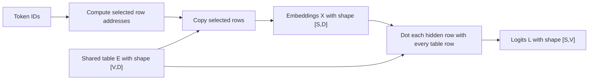

# Problem 013: Embedding Lookup and Tied Output Weights

## Why this exists

A decoder begins with integer token IDs, but every transformer block consumes
vectors. The embedding table supplies that first conversion. At the other end,
the final hidden vector must become one logit per vocabulary item. Many models
tie those two operations to the same parameter table.

The two directions have different execution shapes. Lookup is an indexed
gather of selected rows. Unembedding is a dense projection against every row.
Calling both “an embedding layer” hides the difference that matters to an
inference engine.

## Learning outcomes

After this problem, you can:

- state the `[V,D]` table contract and reject invalid token IDs;
- distinguish a gather from GEMV or GEMM;
- derive tied logits from the same rows used for lookup;
- account separately for lookup traffic and unembedding FLOPs;
- map both operations to real Metal kernels; and
- explain when tying saves parameters without saving output computation.

## Prerequisites

- Problem 002 for row-major offsets and checked shapes.
- Problem 004 for recognizing a dot product over a weight row.
- Problem 005 for the multi-token projection interpretation.

## Vocabulary

- **Token**: integer ID representing one model input or output unit, such as a
	word piece, punctuation mark, byte, or special marker.
- **Vocabulary size `V`**: number of token IDs accepted by the model.
- **Embedding dimension `D`**: width of each token vector.
- **Gather**: reading selected rows by integer index rather than combining all rows.
- **Unembedding**: projecting hidden vectors to vocabulary logits.
- **Weight tying**: using one `[V,D]` table for both input lookup and output projection.
- **Logit**: an unnormalized score for one vocabulary item.

## Math from first principles

Let the table be $E\in\mathbb{R}^{V\times D}$ and token IDs be
$t_0,\ldots,t_{S-1}$. Lookup is

$$
X_{s,d}=E_{t_s,d}.
$$

Nothing is multiplied or added. The token controls an address. Tied
unembedding uses the gathered row as a hidden vector and computes

$$
L_{s,v}=\sum_{d=0}^{D-1}X_{s,d}E_{v,d}.
$$

This is $L=XE^T$, even though the table remains physically `[V,D]`.



### Worked numerical example

Take

$$
E=\begin{bmatrix}1&2\\3&4\\5&6\end{bmatrix},\qquad t=[2,0].
$$

Lookup gathers

$$
X=\begin{bmatrix}5&6\\1&2\end{bmatrix}.
$$

The first logit row is
$[5(1)+6(2),\ 5(3)+6(4),\ 5(5)+6(6)]=[17,39,61]$.
The second is $[5,11,17]$. A solution that gathers correctly but returns zero
logits is incomplete.

## Shape, layout, and dtype contract

| Value | Shape | Layout | Dtype |
| --- | --- | --- | --- |
| table | `[V,D]` | contiguous row-major | Float32 |
| token IDs | `[S]` | Swift array | `Int`, converted to UInt32 for Metal |
| embeddings | `[S,D]` | contiguous row-major | Float32 |
| logits | `[S,V]` | contiguous row-major | Float32 |

`V` and `D` must be positive. `S` may be zero. Every token must satisfy
$0\le t_s<V$. The API rejects a non-matrix table, empty width or vocabulary,
negative IDs, and IDs equal to `V`.

## CPU reference path

For each token, append exactly one contiguous table row. Then, for every
`(sequence,vocabulary)` pair, run a readable length-`D` dot product between the
gathered vector and table row. The canonical CPU path deliberately keeps these
as two loops so gather is not disguised as matrix multiplication.

## Independent correctness method

The judge builds embeddings by row slicing and accumulates tied logits in
Double. It checks gather order, duplicate IDs, mixed signs, empty sequences,
and invalid IDs. Absolute tolerance is `2e-5`; relative tolerance is `4e-5`.
The judge does not call the canonical implementation.

Run:

```sh
swift run inference-school check 013 --cpu
swift run inference-school check 013 --metal
swift run inference-school check 013 --solution
```

## Performance model

Lookup writes and reads approximately $4SD$ bytes each, plus token IDs. It
performs no model FLOPs and has low arithmetic intensity. Random token rows can
defeat locality when the table exceeds cache.

Unembedding performs about $2SVD$ FLOPs and writes $4SV$ bytes. The table is
$4VD$ bytes and is the dominant parameter read. The gathered `[S,D]` tensor is
an explicit intermediate in this lesson. Weight tying removes a second
$4VD$-byte parameter table; it does not remove the $SVD$ projection.

## Metal mapping

`embedding_lookup` dispatches `S*D` threads. A thread derives `(s,d)`, reads
`tokenIDs[s]`, and copies `table[token*D+d]`. There are no barriers.

`tied_unembedding` dispatches `S*V` threads. Each thread owns one logit and
loops over `D`. The host ends the lookup encoder before starting unembedding,
so the second dispatch observes the gathered buffer. This baseline favors a
visible mapping over a tiled GEMM; Problem 005 supplies the optimization path.

See [P013Embedding.metal](../../Sources/InferenceSchoolSolutions/Metal/P013Embedding.metal).

## Implementation checkpoints

1. Reject invalid table ranks and token IDs before allocation.
2. Gather one known token and inspect its exact row.
3. Preserve input token order and duplicates.
4. Compute one tied logit as a row dot product.
5. Extend to `[S,V]`, including `S=0`.
6. Implement the Metal gather grid.
7. Implement the independent unembedding grid and pass the shared judge.

## Controlled experiments

### Token locality

Compare repeated IDs, adjacent IDs, and pseudorandom IDs at fixed `S` and `D`.
Prediction: repeated and nearby rows should reuse more cache; arithmetic work is
unchanged.

### Vocabulary sweep

Fix `S=1,D=1024` and sweep `V`. Prediction: lookup time changes little, while
unembedding grows linearly with `V` and its table traffic dominates.

### Decode versus prefill

Compare `S=1` and larger `S` at fixed `V,D`. Prediction: the simple Metal
unembedding leaves reuse on the table for larger `S`; a tiled GEMM becomes more
attractive.

Write the prediction before recording release-build timings.

## Engine integration

The gathered `[S,D]` tensor is the initial residual stream. After all decoder
layers and final normalization, the same table can project hidden states to
`[S,V]` logits. A production engine may compute only the final row during
decode, but the equation and tied storage remain the same.

## Tradeoffs

- Tying reduces parameters but constrains input and output spaces to share a table.
- A direct gather is clearer than a one-hot GEMM and avoids useless zeros.
- The scalar unembedding kernel is inspectable; tiled GEMM has better reuse for prefill.
- Materializing embeddings aids composition; fusion may save traffic in specialized paths.

## Hints

- Row start is `token * D`.
- Do not transpose the stored table just to express $E^T$.
- Validate `Int` IDs before converting them to UInt32.
- Empty `S` returns `[0,D]` and `[0,V]`, not an error.

## Canonical solution

- [CPU solution](../../Sources/InferenceSchoolSolutions/P013EmbeddingSolution.swift)
- [Metal solution](../../Sources/InferenceSchoolSolutions/Metal/P013Embedding.metal)
- [Shared contract and judge](../../Sources/InferenceSchoolCore/Problems/P013Embedding.swift)

## Completion checklist

- [ ] Lookup and tied logits pass the independent judge.
- [ ] Invalid tokens fail before indexing or dispatch.
- [ ] The Metal check executes both MSL kernels.
- [ ] You can distinguish gather bytes from unembedding FLOPs.
- [ ] You ran a locality, vocabulary, or sequence experiment with a prediction.
- [ ] You can name where both outputs enter the decoder engine.