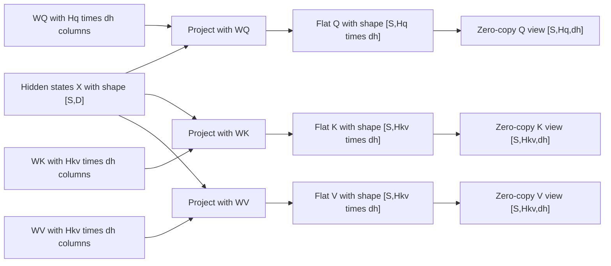

# Problem 014: Q/K/V Projections and Head Views

## Why this exists

Attention does not consume the residual stream directly. It projects each
token into queries, keys, and values, then interprets projection columns as
heads. Model architecture is encoded in these dimensions: query-head count can
differ from key/value-head count, while every head shares one width.

This problem keeps the transformations visible. It does not hide projection,
split, and reshape behind an “attention layer” wrapper.

## What query, key, and value mean

Attention lets each token position gather information from positions in its
visible context. It assigns three different roles to learned projections of
the same residual-stream input:

- A **query (Q)** represents what the receiving position is looking for.
- A **key (K)** represents how one context position can be matched.
- A **value (V)** contains the information that position can contribute.

For one attention head, a query-key dot product produces a match score. Softmax
normalizes the visible scores into weights, and the weighted sum of the value
vectors becomes the gathered context. The Q, K, and V labels describe these
roles in that calculation; they are numerical vectors, not literal questions,
database keys, or stored text.

The next lessons add position information to Q and K, prevent access to future
positions, and perform the score-and-value calculation. This lesson owns the
learned projections and the exact tensor shapes they must hand to those stages.

## Learning outcomes

You will be able to:

- derive Q, K, and V projection matrix dimensions;
- represent separate `Hq` and `Hkv` counts;
- map a flat projection column to `(head,feature)`;
- decide when `[S,H,dh]` is a view and when a copy is required;
- validate all shape contracts before arithmetic; and
- connect decode GEMV and prefill GEMM to the same projection equation.

## Prerequisites

- Problem 002 for shapes, strides, reshape, and contiguity.
- Problems 004 and 005 for matrix-vector and matrix-matrix projection.
- Problem 011 for keeping the residual stream’s precision policy separate.

## Vocabulary

- **Model dimension `D`**: residual-stream width.
- **Head dimension `dh`**: feature width assigned to one attention head.
- **Query vector**: projected features used to score relevant context positions.
- **Key vector**: projected features against which a query is scored.
- **Value vector**: projected features mixed according to the query-key scores.
- **Query head `Hq`**: an independently projected query subspace.
- **KV head `Hkv`**: a key/value subspace, possibly shared by query heads later.
- **Head view**: interpreting contiguous flat columns as `[H,dh]` without moving data.
- **Materialization**: copying values to satisfy a new physical layout.

## Math from first principles

For hidden states $X\in\mathbb{R}^{S\times D}$, choose

$$
W_Q\in\mathbb{R}^{D\times(H_qd_h)},\qquad
W_K,W_V\in\mathbb{R}^{D\times(H_{kv}d_h)}.
$$

The flat projections are

$$Q_f=XW_Q,\quad K_f=XW_K,\quad V_f=XW_V.$$

Column $c$ becomes

$$h=\lfloor c/d_h\rfloor,\qquad f=c\bmod d_h.$$

No data moves if columns for each head are contiguous. The same storage can be
viewed as `Q [S,Hq,dh]` and `K,V [S,Hkv,dh]`.



### Worked numerical example

Let $X=[1,2]$, $H_q=2$, $H_{kv}=1$, and $d_h=1$. Use

$$W_Q=\begin{bmatrix}1&0\\0&2\end{bmatrix},\quad
W_K=\begin{bmatrix}1\\1\end{bmatrix},\quad
W_V=\begin{bmatrix}-1\\2\end{bmatrix}.$$

Then $Q_f=[1,4]$, $K_f=[3]$, and $V_f=[3]$. The head views are
`Q [1,2,1]`, `K [1,1,1]`, and `V [1,1,1]`. The values are unchanged by
reshape; only the indexing interpretation changes.

## Shape, layout, and dtype contract

| Value | Shape | Layout | Dtype |
| --- | --- | --- | --- |
| hidden | `[S,D]` | contiguous row-major | Float32 |
| query weights | `[D,Hq*dh]` | contiguous row-major | Float32 |
| key/value weights | `[D,Hkv*dh]` | contiguous row-major | Float32 |
| queries | `[S,Hq,dh]` | strides `[Hq*dh,dh,1]` | Float32 |
| keys/values | `[S,Hkv,dh]` | strides `[Hkv*dh,dh,1]` | Float32 |

`Hq`, `Hkv`, and `dh` are positive, and `Hq` must be divisible by `Hkv` so
the same configuration remains valid for Problem 018. `S` may be zero. All
inputs must be finite. Weight inner widths are exact contracts, not inferred
from storage count.

## CPU reference path

For each of the three weights:

1. loop over sequence rows;
2. loop over head then feature;
3. map to flat column `head*dh+feature`;
4. accumulate over `D`; and
5. construct the final rank-three tensor directly.

The explicit loop order demonstrates that the head split is not another
mathematical operation.

## Independent correctness method

The judge projects with Double accumulation and independently constructs
`[S,H,dh]`. It includes `Hq != Hkv`, an empty sequence, wrong projection width,
and non-finite hidden states. Tolerance is `2e-5 + 5e-5*abs(expected)`. A starter
that returns correctly shaped zeros fails value cases.

```sh
swift run inference-school check 014 --cpu
swift run inference-school check 014 --solution
```

## Performance model

The three projections perform approximately

$$
2SD(H_qd_h+2H_{kv}d_h)
$$

FLOPs. Weight bytes are
$4D(H_qd_h+2H_{kv}d_h)$. Outputs occupy
$4S(H_qd_h+2H_{kv}d_h)$ bytes. A contiguous reshape allocates zero bytes;
materializing a different head-major layout would read and write every output.

For `S=1`, each projection has GEMV’s low reuse. For larger `S`, GEMM can reuse
weights across tokens. Reducing `Hkv` lowers K/V projection work and storage but
does not lower Q projection work.

## Metal mapping

There is no new Metal stage in this problem. Problems 004 and 005 already own
the canonical projection kernels; this lesson owns the shape transformation.
On GPU, run three GEMV/GEMM projections and preserve flat column order so the
output buffers are already valid `[S,H,dh]` views. A fused Q/K/V projection is a
later optimization and must preserve the same contract.

No barriers are required for a view. A copy kernel would only be justified for
a consumer demanding another physical order.

## Implementation checkpoints

1. Construct and validate an `AttentionConfiguration`.
2. Validate all three weight matrices.
3. Compute one flat query projection row.
4. Map columns to query heads and features.
5. Repeat with the smaller KV width.
6. Verify `[S,H,dh]` strides and `S=0`.
7. Reject a shape-correct but value-zero implementation with the judge.

## Controlled experiments

### Head-count sweep

Fix `D`, `dh`, and `S`; vary `Hq` and `Hkv`. Prediction: Q work follows `Hq`,
while K/V work and bytes follow `Hkv`.

### View versus copy

Compare a contiguous reshape with an explicit reorder to `[H,S,dh]`.
Prediction: reshape is constant-time; copy scales with all projected elements.

### Decode versus prefill

Compare `S=1` against increasing `S`. Prediction: GEMM gains weight reuse and
throughput while GEMV remains bandwidth-oriented.

## Engine integration

Problem 015 rotates Q and K in place conceptually. Problems 016-021 consume the
rank-three tensors directly. Later KV-cache problems store K and V using
`Hkv`, not `Hq`; preserving that distinction here is part of model correctness.

## Tradeoffs

- Separate projections are transparent; fused QKV can reduce dispatches.
- Token-major `[S,H,dh]` matches the current kernels; head-major may help other schedules.
- Views avoid copies but constrain producer column order.
- Fewer KV heads reduce work and storage but change the model architecture.

## Hints

- Query columns are `Hq*dh`; key and value columns are `Hkv*dh`.
- Do not divide the model dimension by a head count unless the architecture says so.
- A contiguous `[S,H*dh]` tensor reshapes to `[S,H,dh]` with no copy.
- Keep query and KV head counts named separately in every loop.

## Canonical solution

- [CPU solution](../../Sources/InferenceSchoolSolutions/P014QKVProjectionSolution.swift)
- [Contract and judge](../../Sources/InferenceSchoolCore/Problems/P014QKVProjection.swift)
- [Tensor view implementation](../../Sources/InferenceSchoolCore/Problems/P002TensorStorage.swift)

## Completion checklist

- [ ] Q, K, and V values and shapes pass the judge.
- [ ] `Hq != Hkv` remains explicit.
- [ ] Invalid weights fail before projection.
- [ ] You can derive the rank-three strides.
- [ ] You measured or reasoned about view versus copy.
- [ ] You can identify decode GEMV and prefill GEMM mappings.