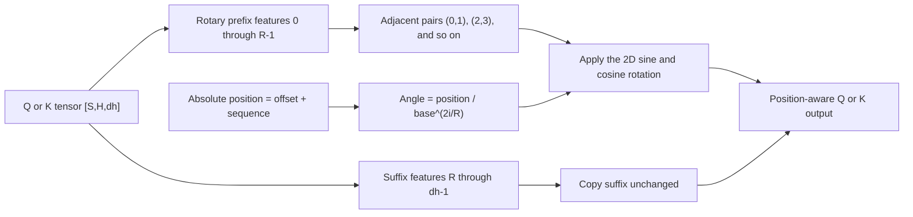

# Problem 015: Rotary Position Embeddings

## Why this exists

Attention scores otherwise depend on token content but not token order. Rotary
position embeddings (RoPE) rotate query and key feature pairs by angles derived
from absolute positions. Their dot products then encode relative displacement.

RoPE has several incompatible conventions in real models. This lesson chooses
one explicitly and makes offsets and partial rotation part of the API.

## Learning outcomes

After completing the lesson, you can:

- apply a two-dimensional rotation to query and key pairs;
- compute frequency-dependent angles from absolute positions;
- validate even and partial rotary dimensions;
- preserve the unrotated suffix exactly;
- use different query and key position offsets; and
- implement the convention as a real Metal elementwise kernel.

## Prerequisites

- Problem 001 for pairwise arithmetic and numerical parity.
- Problem 002 for `[S,H,dh]` row-major indexing.
- Problem 014 for the Q and K tensors being rotated.

## Vocabulary

- **Rotary dimension `R`**: even prefix width that participates in rotation.
- **Adjacent pairing**: pairs `(0,1)`, `(2,3)`, and so on.
- **Frequency pair**: one pair with its own inverse-frequency exponent.
- **Position offset**: absolute position assigned to local sequence index zero.
- **Partial RoPE**: `R < dh`, leaving features `R..<dh` unchanged.
- **Base `B`**: frequency scale, commonly but not universally 10,000.

## Math from first principles and exact convention

This repository uses adjacent pairs. For pair index $i=0,\ldots,R/2-1$ and
absolute position $p$,

$$
\theta_{p,i}=\frac{p}{B^{2i/R}}.
$$

For input pair $(a,b)=(x_{2i},x_{2i+1})$,

$$
x'_{2i}=a\cos\theta-b\sin\theta,
$$

$$
x'_{2i+1}=a\sin\theta+b\cos\theta.
$$

The same formula applies to Q and K, but their absolute offsets can differ.
Features `R..<dh` are copied bit-for-bit. This is not the split-half convention.



### Worked numerical example

Let `R=4`, `B=100`, position `p=1`, and
$x=[1,0,0,2,9,10]$. Pair zero has angle $1$; pair one has angle
$1/100^{1/2}=0.1$. Therefore

$$
x'\approx[0.5403,0.8415,-0.1997,1.9900,9,10].
$$

At position zero every angle is zero, so all rotated pairs are unchanged. A
nonzero offset must change local row zero.

## Shape, layout, and dtype contract

Queries are `[Sq,Hq,dh]`; keys are `[Skv,Hkv,dh]`. Sequence and head counts may
differ, but `dh` must match. Tensors are contiguous row-major Float32. `R` must
be positive, even, and no greater than `dh`. `B` must be finite and greater
than one. Both offsets are nonnegative integers.

The output shapes equal the input shapes. Partial suffixes are preserved. Empty
sequence dimensions are valid, although head and feature dimensions remain
defined by the tensor shape.

## CPU reference path

Copy each input tensor, then loop over sequence, head, and pair. Compute the
absolute position as `offset + sequence`, derive the angle, and overwrite only
the two prefix features. Keeping the suffix copy visible makes partial RoPE
testable.

## Independent correctness method

The judge computes angles and rotations in Double, then casts outputs to Float.
It checks positions zero and one, different Q/K offsets, partial suffixes, odd
`R`, `R > dh`, and negative offsets. Tolerance is
`3e-5 + 5e-5*abs(expected)`. A no-op implementation passes position zero but
fails the offset cases.

```sh
swift run inference-school check 015 --cpu
swift run inference-school check 015 --metal
swift run inference-school check 015 --solution
```

## Performance model

There are $SHR/2$ pair rotations per tensor. Each pair evaluates one angle,
sine, and cosine, then performs four multiplies and two adds/subtracts. The
kernel reads and writes the full tensor because the suffix must survive, for
about $8SHd_h$ bytes per Q or K tensor.

Precomputing sine/cosine tables trades transcendental work for table storage
and reads. Fusing RoPE into Q/K projection or attention can remove a global
round trip but couples conventions and offsets to that kernel.

## Metal mapping

The host allocates each output as a copy of its input. The kernel dispatches one
thread per `(sequence,head,pair)`. A thread computes two feature indices and
overwrites the rotated pair; untouched suffix values remain from the copy.

Q and K use separate dispatches because their sequence lengths, head counts,
and offsets can differ. No thread shares a pair, so no barrier or threadgroup
memory is needed. Bounds are checked against `S*H*(R/2)`.

See [P015RoPE.metal](../../Sources/InferenceSchoolSolutions/Metal/P015RoPE.metal).

## Implementation checkpoints

1. Validate rank, matching `dh`, base, offsets, and even `R`.
2. Rotate one pair at position zero.
3. Rotate one pair at a nonzero position.
4. Add frequency variation across pairs.
5. Preserve a partial suffix.
6. Apply independent Q and K offsets.
7. Match the CPU path with the Metal grid.

## Controlled experiments

### Position sweep

Fix one vector and sweep positions. Prediction: pair norms remain constant,
while components trace circles at different angular rates.

### Base sweep

Fix position and compare bases. Prediction: pair zero is unchanged by the base;
higher pair frequencies rotate more slowly as the base grows.

### Precomputed versus computed angles

Compare on-the-fly `sin/cos` with a table at fixed shapes. Prediction: a table
helps when angles are reused enough to offset extra memory traffic.

### Partial dimension sweep

Sweep `R` while holding `dh`. Prediction: arithmetic grows with `R`, but the
current host still copies all `dh` features.

## Engine integration

RoPE runs after Q/K projection and before any query-key dot product. During
decode, the new query uses its absolute decode position; cached keys must have
been rotated at their own original positions. Position offsets let chunked
prefill and cached decode preserve those semantics.

## Tradeoffs

- Adjacent and split-half pairing are not interchangeable model conventions.
- On-the-fly angles save tables; precomputation saves transcendental work.
- Partial RoPE preserves unrotated capacity but is architecture-specific.
- A standalone kernel is inspectable; fusion can remove traffic.

## Hints

- Pair exponent is `feature / R`, where `feature=2*i`.
- Read both original pair values before writing either output.
- Use absolute `offset + sequence`, not local sequence alone.
- Never rotate the suffix when `R < dh`.

## Canonical solution

- [CPU solution](../../Sources/InferenceSchoolSolutions/P015RoPESolution.swift)
- [Metal solution](../../Sources/InferenceSchoolSolutions/Metal/P015RoPE.metal)
- [Contract and judge](../../Sources/InferenceSchoolCore/Problems/P015RoPE.swift)

## Completion checklist

- [ ] CPU and Metal pass the same independent judge.
- [ ] The adjacent-pair convention is stated and implemented.
- [ ] Odd or oversized rotary dimensions fail.
- [ ] Nonzero Q and K offsets are tested.
- [ ] The suffix is exactly preserved for partial RoPE.
- [ ] You ran a position, base, table, or dimension experiment with a prediction.