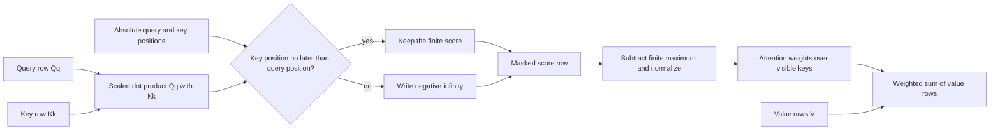

# Problem 016: Causal Attention for One Head

## Why this exists

This is the first complete decoder attention operator. It combines earlier dot
products, stable softmax, and matrix-weighted values with one new rule: a query
may not read a key from the future. The materialized implementation is
deliberately readable and stores the score matrix. Problems 019 and 020 will
optimize against this semantic oracle.

## Learning outcomes

You can:

- derive scaled query-key scores and weighted values;
- place the causal mask before softmax;
- compute mask visibility from absolute positions;
- implement stable row softmax with future entries excluded;
- quantify the quadratic score intermediate; and
- execute a two-stage materialized Metal implementation.

## Prerequisites

- Problem 001 for dot products.
- Problem 009 for stable softmax.
- Problems 014 and 015 for head-shaped, position-aware Q and K.

## Vocabulary

- **Query position**: absolute position requesting context.
- **Key position**: absolute position represented by one K/V row.
- **Causal mask**: rule that permits a key only when `keyPosition <= queryPosition`.
- **Score matrix**: all scaled query-key dot products before softmax.
- **Attention weight**: normalized probability assigned to a visible value.
- **Materialized attention**: an implementation that writes the score matrix.

## Math from first principles

For one head, $Q\in\mathbb{R}^{S_q\times d_h}$ and
$K,V\in\mathbb{R}^{S_{kv}\times d_h}$. The raw score is

$$
s_{qk}=\frac{Q_q\cdot K_k}{\sqrt{d_h}}.
$$

Set $s_{qk}=-\infty$ when the absolute key position exceeds the query position.
For each query row,

$$
p_{qk}=\frac{e^{s_{qk}-m_q}}{\sum_j e^{s_{qj}-m_q}},
\qquad m_q=\max_j s_{qj},
$$

and

$$
O_q=\sum_k p_{qk}V_k.
$$



### Worked numerical example

Let $d_h=1$, $Q=[1,1]$, $K=[1,2]$, and $V=[3,9]$. Query zero can see only key
zero, so its output is exactly `3`. Query one has scores `[1,2]`; stable weights
are approximately `[0.2689,0.7311]`, giving
$0.2689(3)+0.7311(9)\approx7.3866$. If query zero changes when `V[1]` changes,
the causal mask is wrong.

## Shape, layout, and dtype contract

Problem 016 requires `Q [Sq,1,dh]` and `K,V [Skv,1,dh]`, contiguous row-major
Float32. The output is `[Sq,1,dh]`. `dh` is positive; K and V lengths match.
Offsets assign absolute positions: local query `q` is `queryOffset+q`, and local
key `k` is `keyOffset+k`.

Every query must have at least one visible key. Non-finite inputs, wrong ranks,
head counts other than one, mismatched dimensions, and no-visible-key rows are
errors before computation or dispatch.

## CPU reference path

1. Allocate `[Sq,Skv]` scores initialized to negative infinity.
2. Fill visible entries with scaled dot products.
3. For each row, subtract its finite maximum and normalize exponentials.
4. Multiply probabilities by V and sum into `[Sq,1,dh]`.

Keeping scores materialized is the point of this baseline.

## Independent correctness method

The judge owns a Double materialized implementation. Cases cover three causal
rows, large logits that overflow naive exponentiation, and decode with a longer
KV context. It tests wrong query rank and missing visible keys. Tolerance is
`3e-5 + 8e-5*abs(expected)`.

```sh
swift run inference-school check 016 --cpu
swift run inference-school check 016 --metal
swift run inference-school check 016 --solution
```

## Performance model

Score computation performs about $2S_qS_{kv}d_h$ FLOPs. The weighted-value
stage performs another $2S_qS_{kv}d_h$ FLOPs. Softmax adds max, exponential,
sum, and division work per visible score.

The score buffer occupies $4S_qS_{kv}$ bytes and is written then reread. For
self-attention with length $S$, that is quadratic memory independent of `dh`.
Q, K, V, and output occupy linear storage. Causal masking reduces useful
arithmetic to roughly half a square for full prefill, but this baseline still
allocates the whole square.

## Metal mapping

The first kernel dispatches `Sq*Skv` threads. One thread writes one score or
negative infinity. The second dispatch uses one thread per query row, performs
stable softmax over the materialized row, then writes all output features.

Two compute encoders enforce score production before consumption. There is no
threadgroup barrier because rows are processed serially inside the applying
thread. This is correct and inspectable, not yet a throughput-optimized mapping.

See [P016CausalAttention.metal](../../Sources/InferenceSchoolSolutions/Metal/P016CausalAttention.metal).

## Implementation checkpoints

1. Validate one-head shapes and absolute offsets.
2. Compute one scaled dot product.
3. Write future scores as negative infinity.
4. Normalize one row stably.
5. Compute one weighted output feature.
6. Extend across query rows and `dh`.
7. Match the materialized CPU oracle from Metal.

## Controlled experiments

### Sequence-length sweep

Sweep equal Q/KV lengths. Prediction: score storage grows quadratically and
eventually dominates allocations and traffic.

### Head-width sweep

Fix lengths and vary `dh`. Prediction: dot and weighted-value work grows with
`dh`, while score-buffer bytes stay fixed.

### Offset sweep

Hold local shapes fixed and change query offset. Prediction: later queries see
more cached keys and produce different outputs without changing allocation.

## Engine integration

This function is the correctness oracle for multi-head, grouped, online, tiled,
and local attention. The output `[Sq,1,dh]` is one head’s contribution before
head concatenation and output projection.

## Tradeoffs

- Materialization is easy to inspect but has quadratic intermediate memory.
- Negative infinity is a clear mask representation; bounded sentinels can leak probability.
- Serial row application is simple; parallel reductions require synchronization.
- Absolute offsets support cache use but add contract complexity.

## Hints

- Scale scores before softmax by `1/sqrt(dh)`.
- Mask before finding the row maximum.
- Never include a future value with probability zero “after” a softmax that already normalized it.
- Use absolute, not local, positions for decode visibility.

## Canonical solution

- [CPU solution](../../Sources/InferenceSchoolSolutions/P016CausalAttentionSolution.swift)
- [Metal solution](../../Sources/InferenceSchoolSolutions/Metal/P016CausalAttention.metal)
- [Materialized judge](../../Sources/InferenceSchoolCore/Problems/P016CausalAttention.swift)

## Completion checklist

- [ ] CPU and Metal pass the materialized oracle.
- [ ] The first row cannot observe future values.
- [ ] Large logits remain finite.
- [ ] Decode offsets use absolute positions.
- [ ] You can state the exact score-buffer size.
- [ ] You ran a length, width, or offset experiment with a prediction.