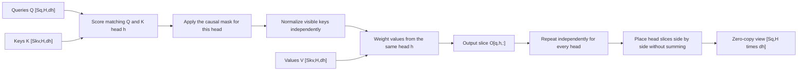

# Problem 017: Multi-Head Attention

## Why this exists

A transformer uses several attention heads so different learned projections can
form different context mixtures. Heads do not attend to one another. Each head
runs the one-head equation independently, and their output features are laid
next to each other for a later output projection.

## Learning outcomes

You can:

- extend causal attention from one head to `H` independent heads;
- index token-major `[S,H,dh]` tensors correctly;
- explain concatenation as layout rather than summation;
- map `(query,head)` pairs to parallel Metal work;
- distinguish head parallelism from feature reduction; and
- detect implementations that accidentally reuse one head’s K/V.

## Prerequisites

- Problem 014 for head views.
- Problem 016 for the complete one-head equation and mask.
- Problem 006 for separating parallelism from total work.

## Vocabulary

- **Head**: one independently projected Q/K/V attention subspace.
- **Head concatenation**: interpreting `[S,H,dh]` as `[S,H*dh]` in head-major feature order.
- **Head parallelism**: evaluating separate `(query,head)` rows concurrently.
- **Output projection**: later matrix multiplication that mixes concatenated heads.
- **Head leakage**: reading K or V from the wrong head.

## Math from first principles

For each head $h$,

$$
s_{qkh}=\frac{Q_{qh}\cdot K_{kh}}{\sqrt{d_h}},\qquad
p_{qkh}=\operatorname{softmax}_{k\le q}(s_{qkh}),
$$

$$
O_{qh}=\sum_{k\le q}p_{qkh}V_{kh}.
$$

There is no reduction over $h$. Concatenation is

$$
O^{flat}_{q,h d_h+f}=O_{q,h,f}.
$$



### Worked numerical example

Use two heads with `dh=1` at one query position. Suppose head zero attends to
values `[2,8]` with weights `[0.75,0.25]`, while head one attends to `[10,-2]`
with weights `[0.1,0.9]`. Outputs are `3.5` and `-0.8`. The concatenated row is
`[3.5,-0.8]`, not `2.7` and not two copies of one head.

## Shape, layout, and dtype contract

Q, K, and V are contiguous Float32 tensors `[Sq,H,dh]`, `[Skv,H,dh]`, and
`[Skv,H,dh]`. Problem 017 requires equal query and KV head counts. Output is
`[Sq,H,dh]` with strides `[H*dh,dh,1]`. Sequence lengths may differ when
offsets describe cached K/V context.

The shared contract rejects wrong ranks, head counts, dimensions, K/V lengths,
non-finite values, and query rows without visible keys.

## CPU reference path

Nest loops as query, head, visible key, and feature. Each head builds and
normalizes its own score list. Write output at
`(query*H+head)*dh+feature`. Keeping the head loop explicit exposes accidental
cross-head indexing.

## Independent correctness method

The Double judge generates deterministic but different values per head. It
tests three heads, decode offsets, and an invalid KV shape. A correctly shaped
zero output and a head-zero broadcast both fail. The judge uses the same
absolute/relative tolerance as the materialized one-head oracle.

```sh
swift run inference-school check 017 --cpu
swift run inference-school check 017 --metal
swift run inference-school check 017 --solution
```

## Performance model

Total score and value work is approximately
$4HS_qS_{kv}d_h$ FLOPs. Q/K/V/output storage grows linearly with `H`; a fully
materialized score tensor would require $4HS_qS_{kv}$ bytes.

Independent heads expose `H` times more parallel rows. That does not reduce
total work. For small `S`, head parallelism can provide enough work to occupy
the GPU; for large `S`, recomputing scores per output feature in this simple
kernel becomes expensive.

## Metal mapping

The solution dispatches one work item per `(query,head)`. Each work item:

1. scans visible keys for the maximum score;
2. scans again for the exponential denominator; and
3. writes each output feature using weighted values.

Heads execute independently on the GPU; no CPU attention function is called.
The baseline recomputes scores while writing features instead of allocating an
`H*S*S` matrix. It uses no barriers or threadgroup memory. Problems 019 and 020
replace that repeated work with streaming state and tiling.

See [P017MultiHeadAttention.metal](../../Sources/InferenceSchoolSolutions/Metal/P017MultiHeadAttention.metal).

## Implementation checkpoints

1. Pass Problem 016 logic for head zero.
2. Add the head stride to Q, K, and V indexing.
3. Keep one independent maximum and denominator per head.
4. Write rank-three output without summing heads.
5. Test head-specific values.
6. Dispatch all `(query,head)` pairs on Metal.

## Controlled experiments

### Head sweep

Fix total width `H*dh` and vary its decomposition. Prediction: total scalar
math stays similar, but the number and width of independent work items change.

### Fixed `dh` sweep

Increase `H` at fixed `dh`. Prediction: work and storage grow linearly while
parallel occupancy may improve until another resource becomes limiting.

### Head isolation

Perturb only one head’s V tensor. Prediction: only that output head changes
before the output projection.

## Engine integration

The output can be viewed as `[Sq,H*dh]` and fed to the attention output
projection. Problem 018 changes only how query heads select KV heads; it must
preserve this query-head output layout.

## Tradeoffs

- More heads provide more learned subspaces but increase Q and output state.
- One work item per head is simple; cooperative rows can use more GPU lanes.
- Recomputing scores saves storage but increases arithmetic.
- Head-major storage can help some kernels but would require layout conversion here.

## Hints

- Compute all offsets with the relevant head count.
- Concatenation is already represented by contiguous `[H,dh]` features.
- Reset maximum, denominator, and output accumulator for every head.
- Use the same causal absolute-position rule for all heads.

## Canonical solution

- [CPU solution](../../Sources/InferenceSchoolSolutions/P017MultiHeadAttentionSolution.swift)
- [Metal solution](../../Sources/InferenceSchoolSolutions/Metal/P017MultiHeadAttention.metal)
- [Contract and judge](../../Sources/InferenceSchoolCore/Problems/P017MultiHeadAttention.swift)

## Completion checklist

- [ ] Every head matches its independent oracle output.
- [ ] Outputs remain `[S,H,dh]`, not head-summed.
- [ ] Metal executes head-parallel MSL.
- [ ] Decode offsets preserve causality.
- [ ] You can derive work and storage as functions of `H`.
- [ ] You ran a head-count or isolation experiment with a prediction.