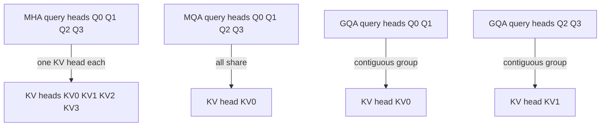

# Problem 018: MHA, MQA, and GQA

## Why this exists

The number of key/value heads is a model architecture choice, not a kernel
detail. Multi-head attention (MHA) uses one KV head per query head. Multi-query
attention (MQA) shares one KV head across all query heads. Grouped-query
attention (GQA) lies between them. Fewer KV heads reduce projection work,
cache size, and decode traffic while preserving the number of query outputs.

## Learning outcomes

You can:

- represent `Hq` and `Hkv` independently;
- enforce `Hq % Hkv == 0`;
- implement `kvHead = queryHead / groupSize` exactly;
- identify MHA and MQA as endpoints of one mapping;
- derive K/V cache bytes; and
- preserve a checkpoint’s architecture semantics on CPU and Metal.

## Prerequisites

- Problem 014 for separate Q and KV projection widths.
- Problem 017 for query-head outputs.
- Problem 002 for head-dependent row-major offsets.

## Vocabulary

- **MHA**: `Hq == Hkv`; each query head owns a KV head.
- **MQA**: `Hkv == 1`; all query heads share one KV head.
- **GQA**: `1 < Hkv < Hq`; contiguous groups share KV heads.
- **Group size**: `Hq/Hkv` query heads per KV head.
- **KV cache**: stored keys and values from previous positions.
- **Architecture semantics**: dimensions and mappings fixed by trained weights.

## Math and mapping

Let

$$
g=\frac{H_q}{H_{kv}}.
$$

For query head $h_q$,

$$
h_{kv}=\left\lfloor\frac{h_q}{g}\right\rfloor.
$$

The attention equation is then

$$
s_{qkh_q}=\frac{Q_{q,h_q}\cdot K_{k,h_{kv}}}{\sqrt{d_h}},
\qquad
O_{q,h_q}=\sum_k p_{qkh_q}V_{k,h_{kv}}.
$$

### Worked mapping example

For `Hq=8,Hkv=2`, `g=4`:

| Query heads | KV head |
| --- | --- |
| `0,1,2,3` | `0` |
| `4,5,6,7` | `1` |

For MHA, `g=1`, so the mapping is identity. For MQA, `g=Hq`, so every query
head maps to zero. Modulo mapping is wrong for this contiguous-group convention.



## Shape, layout, and dtype contract

Q is `[Sq,Hq,dh]`; K and V are `[Skv,Hkv,dh]`; output is `[Sq,Hq,dh]`.
All are contiguous row-major Float32. Counts and `dh` are positive, K/V lengths
match, `Hq` is divisible by `Hkv`, and all values are finite. Batch size remains
one.

Offsets and causal visibility have the same absolute-position semantics as
Problem 016. Reducing `Hkv` never changes the number of output query heads.

## CPU reference path

Loop over `(query,queryHead)`, compute `kvHead` once, and use it for every K/V
read in that row. Softmax state remains private to the query head even when
several query heads share K/V data.

## Independent correctness method

The Double judge covers GQA `4:2`, MQA `4:1`, and MHA `2:2`, using distinct KV
values so wrong mappings fail. `AttentionConfiguration` independently rejects
non-divisible counts. `KVCacheByteModel` tests exact cache-size ratios.

```sh
swift run inference-school check 018 --cpu
swift run inference-school check 018 --metal
swift run inference-school check 018 --solution
```

## Performance and cache model

For sequence length $S$, Float32 K and V cache bytes are

$$
B_{KV}=2S H_{kv}d_h\cdot4.
$$

With another element format, replace `4` by its bytes per element. Relative to
MHA, ideal cache-size reduction is $H_q/H_{kv}=g$. K/V projection output and
decode cache-read traffic shrink by the same head-count factor. Q projection
and output size still depend on `Hq`.

Attention arithmetic for each query head remains: fewer KV heads enable reuse
but do not automatically remove query-head dot products.

## Metal mapping

One GPU work item owns `(query,queryHead)`. It computes
`kvHead=queryHead/groupSize`, then performs stable causal attention with that K/V
slice. This is actual MSL execution and preserves contiguous grouping.

The simple kernel rereads shared K/V for each query head. Hardware caches may
capture some reuse; a cooperative grouped kernel could make it explicit. There
are no barriers in the current mapping.

See [P018GroupedQueryAttention.metal](../../Sources/InferenceSchoolSolutions/Metal/P018GroupedQueryAttention.metal).

## Implementation checkpoints

1. Validate divisibility and rank-three shapes.
2. Print or test the query-to-KV mapping table.
3. Pass MHA with `groupSize=1`.
4. Pass MQA with one KV head.
5. Pass an intermediate GQA ratio.
6. Calculate cache bytes for all three.
7. Match CPU and Metal outputs.

## Controlled experiments

### KV-head sweep

Fix `Hq,S,dh` and sweep divisors for `Hkv`. Prediction: cache bytes and K/V
projection size shrink linearly with `Hkv`; Q/output storage does not.

### Shared-KV reuse

Compare MHA and GQA with equal query-head work. Prediction: GQA can improve
effective K/V cache locality, although the baseline still executes one row per
query head.

### Architecture mismatch

Deliberately replace division mapping with modulo in a local experiment.
Prediction: shapes remain valid but outputs differ, demonstrating why this is
model correctness rather than an interchangeable optimization.

## Engine integration

KV-cache allocation in Problems 022 onward must use `Hkv`. Checkpoint loading
must verify Q projection width against `Hq*dh` and K/V widths against
`Hkv*dh`. The decoder output remains one vector per query head.

## Tradeoffs

- Fewer KV heads reduce memory and traffic but can affect model quality when training choices differ.
- MQA maximizes sharing; GQA retains more KV diversity.
- Per-query-head work is simple; grouped cooperative work can expose reuse.
- The mapping must match trained weights exactly.

## Hints

- Compute `groupSize` once from validated counts.
- Use division, not modulo, for contiguous groups.
- Index Q with `Hq` and K/V with `Hkv`.
- Include both K and V in cache-byte formulas.

## Canonical solution

- [CPU solution](../../Sources/InferenceSchoolSolutions/P018GroupedQueryAttentionSolution.swift)
- [Metal solution](../../Sources/InferenceSchoolSolutions/Metal/P018GroupedQueryAttention.metal)
- [Configuration and cache model](../../Sources/InferenceSchoolCore/Problems/P018GroupedQueryAttention.swift)

## Completion checklist

- [ ] MHA, MQA, and GQA all pass the judge.
- [ ] Non-divisible head counts are rejected.
- [ ] The exact division mapping is tested.
- [ ] Metal uses `Hkv` for K/V offsets.
- [ ] You can derive cache bytes for any dtype.
- [ ] You ran a KV-head or mapping experiment with a written prediction.