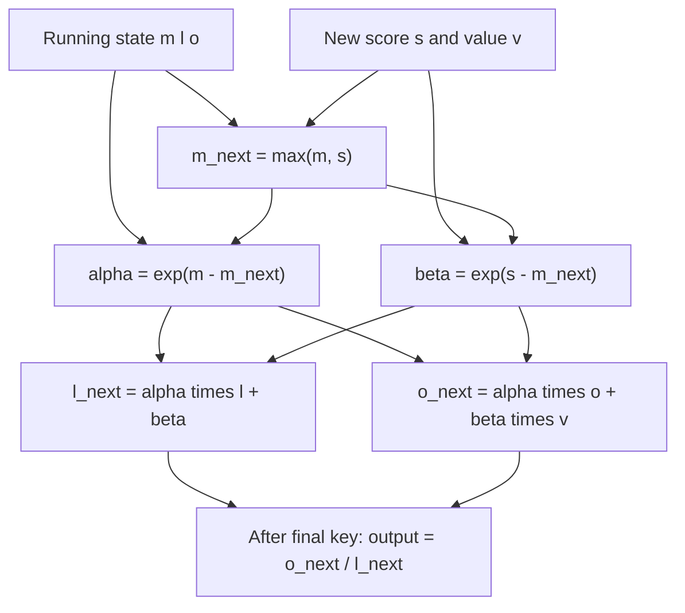

# Problem 019: Online Softmax Attention

## Why this exists

Problem 016 needs an entire score row before stable softmax can normalize it.
Online softmax carries enough state to incorporate one score at a time, including
scores larger than every previous score. Attention can therefore update its
weighted value output while streaming K and V, without storing a score row.

## Learning outcomes

You can:

- derive the running maximum, normalizer, and output recurrence;
- explain why old terms must be rescaled when the maximum changes;
- compute stable causal attention without score storage;
- compare streaming output against the materialized oracle;
- distinguish lower memory from lower arithmetic; and
- implement a real Metal streaming kernel with register/private state.

## Prerequisites

- Problem 009 for max-shifted softmax.
- Problem 016 for the materialized attention oracle.
- Problem 018 for query-to-KV head mapping.

## Vocabulary

- **Online recurrence**: state updated from one input at a time.
- **Running maximum `m`**: largest score processed so far.
- **Running normalizer `l`**: sum of exponentials expressed relative to `m`.
- **Unnormalized output `o`**: weighted value sum expressed relative to `m`.
- **Rescale factor `alpha`**: correction applied to old state when `m` increases.
- **Streaming**: consuming keys and values without retaining all scores.

## Math from first principles

Assume current state $(m,l,o)$ represents processed scores. For new score $s$
and value vector $v$, define

$$
m'=\max(m,s),\qquad
\alpha=e^{m-m'},\qquad
\beta=e^{s-m'}.
$$

For the empty state, treat $m=-\infty$ and $\alpha=0$. Update

$$
l'=\alpha l+\beta,
$$

$$
o'=\alpha o+\beta v.
$$

After all visible keys, normalized output is $o/l$. The rescale is required
because old terms were represented relative to the old maximum.



### Worked numerical example

Process scores `[1,3]` with scalar values `[2,10]`.

First score: `m=1`, `l=1`, `o=2`. For score `3`, new maximum is `3`,
$\alpha=e^{-2}\approx0.1353$, and $\beta=1$. Thus

$$
l'=0.1353+1=1.1353,
$$

$$
o'=0.1353(2)+10=10.2707.
$$

The output is $10.2707/1.1353\approx9.0464$, equal to materialized softmax.
Omitting `alpha` gives the wrong answer.

## Shape, layout, and dtype contract

The shared batch-one contract accepts Q `[Sq,Hq,dh]`, K/V
`[Skv,Hkv,dh]`, and output `[Sq,Hq,dh]`, contiguous Float32. Head counts obey
GQA divisibility. Positions and causality use absolute offsets.

The canonical CPU path supports any positive `dh`. The Metal kernel is
pedagogically bounded to `dh <= 128`, because its output accumulator is a fixed
private array. Invalid shapes, non-finite inputs, no-visible-key rows, and larger
Metal head dimensions are explicit errors.

## CPU reference path

For each `(query,queryHead)`, initialize `m=-infinity`, `l=0`, and a zero
length-`dh` accumulator. Visit visible keys once. Compute one score, update all
three state components, then divide the accumulator by `l`. No score array is
allocated.

## Independent correctness method

The judge compares to Problem 016’s Double materialized oracle, not another
online implementation. Fixtures include five keys, 33 keys, large logits, and
decode offsets. It checks a mismatched value shape and rejects a last-value-only
algorithm. Tolerance is `5e-5 + 1e-4*abs(expected)`.

```sh
swift run inference-school check 019 --cpu
swift run inference-school check 019 --metal
swift run inference-school check 019 --solution
```

## Performance model

Online attention retains the same leading arithmetic as fused attention:
roughly $4H_qS_qS_{kv}d_h$ score/value FLOPs plus exponentials. It removes the
$4H_qS_qS_{kv}$-byte score intermediate and its write/read traffic.

Per active row, state is one maximum, one normalizer, and `dh` output values:
$O(d_h)$ rather than $O(S_{kv})$ memory. K and V are still streamed for every
query row, so this recurrence alone does not guarantee cache reuse or high GPU
occupancy.

## Metal mapping

One work item owns `(query,queryHead)`. It stores `m`, `l`, and a private
`float[128]` accumulator, streams visible K/V rows, and writes one output head.
There is no score buffer in the host pipeline and no CPU fallback inside Metal
checks.

The kernel uses no barriers because all recurrence state belongs to one thread.
That choice is easy to verify but underuses SIMD lanes. Problem 020 distributes
score-tile and output work across a threadgroup while preserving the recurrence.

See [P019OnlineAttention.metal](../../Sources/InferenceSchoolSolutions/Metal/P019OnlineAttention.metal).

## Implementation checkpoints

1. Reproduce materialized output for two scalar scores.
2. Handle the empty-state `alpha=0` case.
3. Rescale both `l` and every component of `o`.
4. Add causal visibility and absolute offsets.
5. Extend to multiple heads and GQA mapping.
6. Remove every score-row allocation.
7. Pass large-logit and 33-key CPU/Metal cases.

## Controlled experiments

### Increasing-score sequence

Feed monotonically increasing scores. Prediction: the maximum changes at every
step, so omitting old-state rescaling produces a growing error.

### Length sweep

Compare materialized and online paths as `Skv` grows. Prediction: outputs remain
within tolerance; online intermediate memory stays constant per row.

### Head-width sweep

Increase `dh` through 128. Prediction: private accumulator pressure grows, and
the Metal path rejects 129 rather than silently spilling beyond its contract.

## Engine integration

Online state is the numerical foundation for tiled attention. During decode it
also provides a natural one-query streaming pass over the KV cache. The output
contract remains identical to materialized attention, allowing direct parity
checks and substitution.

## Tradeoffs

- Online recurrence removes score storage but adds state-update arithmetic.
- A single-thread row is transparent but not a high-throughput GPU schedule.
- Fixed private arrays make constraints explicit but limit `dh`.
- Materialized scores remain useful for debugging and visualization.

## Hints

- Rescale the old output accumulator before adding the new value.
- Keep `o` unnormalized until the end.
- Compute the score scale exactly as Problem 016.
- Search host code for an `Sq*Skv` allocation; there should be none.

## Canonical solution

- [CPU solution](../../Sources/InferenceSchoolSolutions/P019OnlineAttentionSolution.swift)
- [Metal solution](../../Sources/InferenceSchoolSolutions/Metal/P019OnlineAttention.metal)
- [Judge](../../Sources/InferenceSchoolCore/Problems/P019OnlineAttention.swift)

## Completion checklist

- [ ] CPU and Metal match the materialized oracle.
- [ ] Difficult logits remain finite.
- [ ] No score row is allocated.
- [ ] Both `l` and `o` are rescaled when `m` changes.
- [ ] The Metal `dh <= 128` limit is understood.
- [ ] You ran a score, length, or width experiment with a prediction.