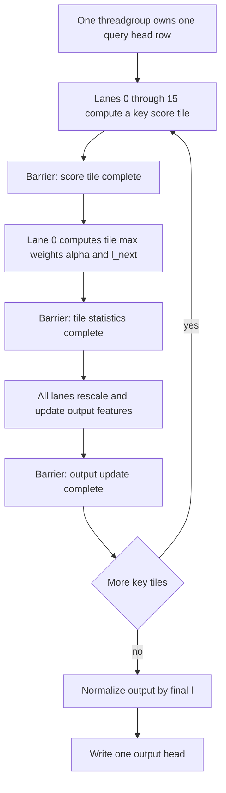

# Problem 020: Tiled Fused Attention

## Why this exists

Online softmax removes score storage, but a one-thread row leaves most GPU lanes
idle. This problem maps the same recurrence to a threadgroup: threads compute a
tile of key scores, one lane updates tile statistics, and threads cooperatively
update the output vector in on-chip memory. No `S x S` score buffer exists.

This is a Flash-style attention lesson because score computation, online
normalization, and value accumulation are fused around on-chip tiles. It does
not dispatch separate score and softmax kernels.

## Learning outcomes

You can:

- combine tile-local and running softmax statistics;
- keep score tiles and output state in threadgroup memory;
- prove that no quadratic intermediate is allocated;
- handle partial key tiles and causal entries safely;
- reason about barriers in a multi-stage threadgroup loop; and
- state the implemented head-width and tile-size limits.

## Prerequisites

- Problem 003 for threadgroup tiles and barriers.
- Problem 009 for stable reduction identities.
- Problem 019 for the `(m,l,o)` recurrence.

## Vocabulary

- **Key tile**: bounded block of K/V rows processed together.
- **Tile maximum**: largest valid score inside the current key tile.
- **Running state**: maximum, normalizer, and output accumulated across tiles.
- **Threadgroup memory**: on-chip storage shared by one Metal threadgroup.
- **Fusion boundary**: operations executed in one dispatch without global intermediates.
- **Partial tile**: final block with fewer valid keys than the tile width.

## Math from first principles

For a tile $T$, compute scores and

$$
m_T=\max_{k\in T}s_k,
\qquad
m'=\max(m,m_T).
$$

Define old-state scale $\alpha=e^{m-m'}$ and tile weights
$w_k=e^{s_k-m'}$. Then

$$
l'=\alpha l+\sum_{k\in T}w_k,
$$

$$
o'=\alpha o+\sum_{k\in T}w_kV_k.
$$

This is the online recurrence applied to a block instead of one key. Masked or
out-of-range tile entries have score $-\infty$ and weight zero.

### Worked tiled example

Suppose prior state is `m=2,l=1,o=[4]`. A new two-key tile has scores `[1,3]`
and values `[10,20]`. New maximum is `3`, so
$\alpha=e^{-1}\approx0.3679$, while tile weights are
$[e^{-2},1]\approx[0.1353,1]$.

$$
l'=0.3679+0.1353+1=1.5032,
$$

$$
o'=0.3679(4)+0.1353(10)+1(20)=22.8246.
$$

Output is approximately `15.184`. Scaling the old accumulator once per tile is
essential; scaling it once per key is wrong.

## Shape, layout, dtype, and bounds contract

Q `[Sq,Hq,dh]`, K/V `[Skv,Hkv,dh]`, and output `[Sq,Hq,dh]` use the shared
contiguous Float32 batch-one contract and GQA mapping. Absolute offsets control
causality.

The implemented Metal kernel has:

- key tile size `16`;
- threadgroup width `128`;
- maximum `dh=128`; and
- arbitrary sequence length representable by UInt32 and host allocation.

Partial tiles and `Skv` not divisible by 16 are valid. Head dimension 129 is an
explicit Metal error. The CPU comparison path is not restricted to 128.

## CPU reference path

The CPU solution mirrors tile semantics: loop over 16-key blocks, build only a
small tile score list, combine tile statistics with running state, and normalize
at the end. The independent judge still uses the materialized Double oracle.

## Independent correctness method

Cases include a five-key partial tile and 17 keys crossing a tile boundary,
with multiple heads in the first case. The judge checks K/V length validation
and compares against materialized attention with
`6e-5 + 1.2e-4*abs(expected)` tolerance. Metal tests execute MSL and assert the
head-width limit.

```sh
swift run inference-school check 020 --cpu
swift run inference-school check 020 --metal
swift run inference-school check 020 --solution
```

## Performance model

Leading arithmetic remains roughly $4H_qS_qS_{kv}d_h$. Global Q/K/V/output
traffic is linear in tensor size per pass; there is no global
$4H_qS_qS_{kv}$ score intermediate.

Per threadgroup, on-chip state is approximately:

- 16 score Floats;
- 16 weight Floats;
- 128 accumulator Floats; and
- 3 state Floats.

That is 652 bytes, excluding compiler-managed registers. This row-tiled kernel
still rereads K/V for different queries. A larger query tile could reuse each
K/V tile across query rows but would require more score and accumulator state.

## Metal grid, memory, and barriers

One 128-thread group owns `(query,queryHead)`. For every 16-key tile:

1. lanes `0..<16` compute one score each into threadgroup memory;
2. all lanes cross a barrier;
3. lane zero computes tile max, weights, new `m`, new `l`, and `alpha`;
4. all lanes cross a barrier;
5. lanes cooperatively rescale and update output features;
6. all lanes cross a barrier before score storage is reused.

All 128 lanes reach every barrier, including lanes without a feature. The host
allocates only Q, K, V, and output buffers. This is one fused MSL dispatch.



See [P020TiledAttention.metal](../../Sources/InferenceSchoolSolutions/Metal/P020TiledAttention.metal).

## Implementation checkpoints

1. Pass the CPU online oracle without tiling.
2. Combine a two-key tile by hand.
3. Implement score loading with invalid entries as negative infinity.
4. Synchronize before lane-zero statistics.
5. Rescale the threadgroup output once per tile.
6. Synchronize before reusing score/weight arrays.
7. Test lengths 5, 16, and 17.
8. Confirm host code never allocates scores.

## Controlled experiments

### Tile-boundary sweep

Test lengths `15,16,17,31,32,33`. Prediction: correctness is continuous;
runtime changes in steps as another key tile is required.

### Head-width sweep

Sweep `dh` from 16 to 128. Prediction: more lanes perform useful accumulator
work; on-chip state and arithmetic grow. `dh=129` must fail explicitly.

### Materialized versus fused traffic

Compare Problem 016 and 020 at increasing `S`. Prediction: the fused path’s
advantage grows as avoided quadratic score traffic grows, though this simple
row schedule may not win at tiny shapes.

### Query-tile thought experiment

Estimate K/V reads if one group owned several query rows. Prediction: K/V reuse
improves, but score and output state multiply by query-tile size.

## Engine integration

The output contract is interchangeable with Problems 016 and 019. A prefill
engine can select the tiled path when its explicit constraints hold and retain
materialized attention for parity. Decode with one query may prefer a different
schedule over cached K/V.

## Tradeoffs

- Fusion removes global intermediates but specializes the kernel.
- One query per group limits K/V reuse across queries.
- Fixed tiles simplify storage bounds but create partial-tile work.
- Threadgroup state reduces traffic but constrains `dh` and occupancy.

## Hints

- Rescale the old accumulator exactly once per tile.
- Give masked lanes score negative infinity and weight zero.
- Place barriers outside lane conditionals.
- Check the host pipeline: separate score or softmax dispatches violate this lesson.

## Canonical solution

- [CPU tiled solution](../../Sources/InferenceSchoolSolutions/P020TiledAttentionSolution.swift)
- [Fused Metal solution](../../Sources/InferenceSchoolSolutions/Metal/P020TiledAttention.metal)
- [Metal pipeline and bounds](../../Sources/InferenceSchoolCore/Metal/MetalTiledAttentionPipeline.swift)

## Completion checklist

- [ ] CPU and Metal match the materialized oracle.
- [ ] Lengths crossing 16 pass.
- [ ] No `S x S` buffer or separate score/softmax dispatch exists.
- [ ] Every lane reaches every tile barrier.
- [ ] `dh <= 128` is enforced and tested.
- [ ] You ran a boundary, width, or traffic experiment with a prediction.