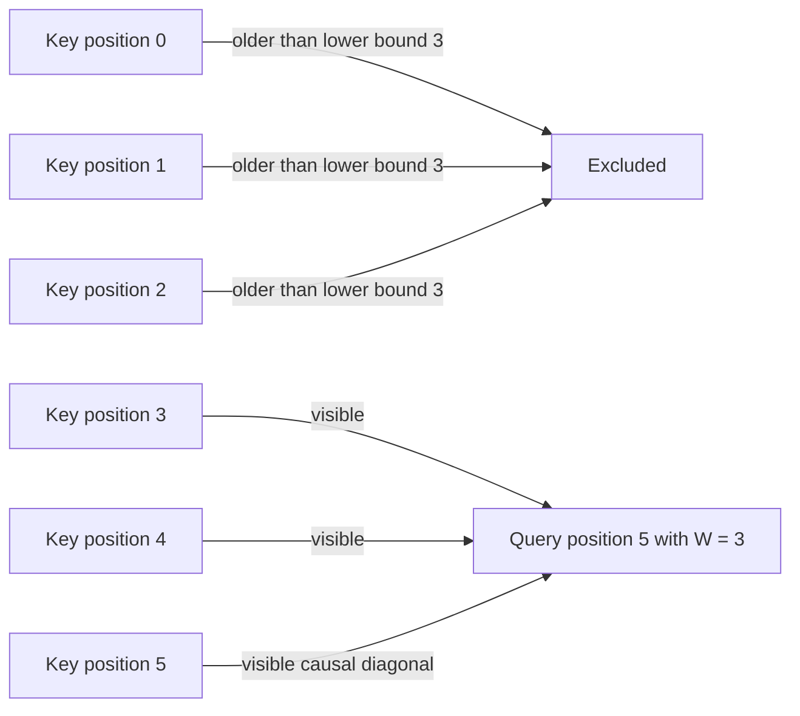

# Problem 021: Sliding-Window Attention

## Why this exists

Full causal attention lets every query read all earlier positions. Sliding-window
attention limits each query to recent context. That bounds computation and KV
reads for long sequences, but it also removes information. The window is a model
policy with quality consequences, not merely a faster implementation of full
attention.

## Learning outcomes

You can:

- define inclusive causal window bounds precisely;
- apply bounds using absolute query and key positions;
- handle window one and windows larger than context;
- implement online local attention on CPU and Metal;
- derive full versus windowed work and visibility; and
- separate quality, cache capacity, and per-query compute effects.

## Prerequisites

- Problem 016 for causal visibility.
- Problem 019 for streaming stable attention.
- Problem 018 for KV-cache dimensions and grouped heads.

## Vocabulary

- **Window `W`**: maximum number of absolute key positions visible to one query.
- **Inclusive bound**: both oldest retained position and current position are visible.
- **Local attention**: attention restricted to a neighborhood rather than all context.
- **Receptive field**: positions that can influence an output directly or through layers.
- **Eviction**: removing KV entries no future layer policy will read.
- **Quality tradeoff**: changed model information flow, not numerical approximation.

## Math and position semantics

For absolute query position $p_q$, a key at $p_k$ is visible exactly when

$$
\max(0,p_q-W+1)\le p_k\le p_q.
$$

The implementation uses offsets, so

$$p_q=q_{offset}+q,\qquad p_k=k_{offset}+k.$$

The score, stable softmax, and weighted-value equations are unchanged; only the
set of keys in their reductions changes.

### Worked numerical example

At query position `5` with `W=3`, visible absolute positions are `[3,4,5]`.
If the local K/V buffer begins at key offset `2`, those correspond to local
indices `[1,2,3]`. Using local query index instead of absolute position would
select the wrong rows.

For `W=1`, only position `5` is visible, so output equals `V[5]` exactly. If
`W` is at least the available causal context, local attention equals full causal
attention.



## Shape, layout, and dtype contract

Q `[Sq,Hq,dh]`, K/V `[Skv,Hkv,dh]`, and output `[Sq,Hq,dh]` are contiguous
Float32 under the shared batch-one GQA contract. `W` is a positive integer.
Offsets are nonnegative absolute positions. Every query must have at least one
key inside both its causal and lower window bounds.

The Metal path shares Problem 019’s explicit `dh <= 128` private-accumulator
limit. Window size may exceed context; it is not clamped because the visibility
predicate naturally selects all available causal keys.

## CPU reference path

For each query, compute absolute lower and upper bounds. Stream only keys whose
absolute positions fall inside them and update online `(m,l,o)` state. Normalize
once at the end. Do not slice by local indices before considering offsets.

## Independent correctness method

The Double materialized oracle applies the same absolute predicate. Tests cover
`W=1`, `W` larger than context, different nonzero Q/K offsets, and `W=0`.
A full-causal implementation fails the window-one and offset cases even though
its shapes and numerical softmax are otherwise valid.

```sh
swift run inference-school check 021 --cpu
swift run inference-school check 021 --metal
swift run inference-school check 021 --solution
```

## Performance and memory model

For long steady-state sequences, each query visits at most `W` keys, so score
and value work is approximately

$$
4H_qS_qWd_h
$$

instead of $4H_qS_qS_{kv}d_h$. Per-query K/V read traffic is bounded by
$2WH_{kv}d_h$ elements when all KV heads are needed.

Windowed computation does not by itself shrink allocated cache. Capacity drops
only if the engine evicts entries that no layer will need. Models can mix local
and global layers, making eviction policy more complex. Lower work, lower live
cache, and changed quality are three separate claims.

## Metal mapping

One work item owns `(query,queryHead)` and keeps online state in private memory.
It computes an absolute lower bound without unsigned underflow, skips keys
outside `[lower,queryPosition]`, and applies the same GQA mapping as Problem 018.

There is no score buffer, threadgroup memory, or barrier. The MSL kernel is real
and independent of the CPU solution. A future tiled local kernel could skip
entire K/V tiles outside the window rather than testing every local key.

See [P021SlidingWindowAttention.metal](../../Sources/InferenceSchoolSolutions/Metal/P021SlidingWindowAttention.metal).

## Implementation checkpoints

1. Validate `W > 0`.
2. Derive bounds for query positions zero and five.
3. Make `W=1` return the current value.
4. Make a large window equal full causal attention.
5. Add independent Q and K offsets.
6. Stream only visible keys with online softmax.
7. Match the same cases on Metal.

## Controlled experiments

### Window sweep

Fix a long context and sweep `W`. Prediction: work grows linearly until the
window covers available context; outputs may continue changing as older
information becomes visible.

### Offset invariance

Shift Q and K offsets by the same constant. Prediction: outputs stay unchanged
because all relative visibility relationships remain the same.

### Cache eviction simulation

Compare retaining full K/V with retaining only the maximum needed local window.
Prediction: computation is identical for purely local layers, but mixed global
layers prevent blanket eviction.

### Layer stacking

Trace which original positions can influence a token after several local
layers. Prediction: indirect receptive field can grow beyond one layer’s window,
but it is not equivalent to direct full attention.

## Engine integration

The decoder scheduler must know each layer’s window before choosing cache read
ranges or eviction. The kernel accepts explicit offsets so a retained cache
slice can begin after absolute position zero. Output remains compatible with
the same concatenation and projection path as full attention.

## Tradeoffs

- Smaller windows bound work and reads but remove direct long-range context.
- Retaining full cache simplifies mixed policies; eviction saves capacity.
- Per-key predicates are simple; tile-range dispatch can avoid skipped work.
- Window policy must match model training and layer configuration.

## Hints

- The oldest visible position is `qPosition - W + 1`, not `qPosition - W`.
- Apply lower and upper bounds to absolute key positions.
- Do not clamp `W` to local K/V length before considering offsets.
- Treat cache allocation and keys visited as separate measurements.

## Canonical solution

- [CPU solution](../../Sources/InferenceSchoolSolutions/P021SlidingWindowAttentionSolution.swift)
- [Metal solution](../../Sources/InferenceSchoolSolutions/Metal/P021SlidingWindowAttention.metal)
- [Judge](../../Sources/InferenceSchoolCore/Problems/P021SlidingWindowAttention.swift)

## Completion checklist

- [ ] Window one, large windows, and nonzero offsets pass.
- [ ] Bounds are inclusive and absolute.
- [ ] CPU and actual Metal agree with the independent oracle.
- [ ] `W=0` is rejected.
- [ ] You can distinguish compute, cache capacity, and quality effects.
- [ ] You ran a window, offset, eviction, or layer experiment with a prediction.