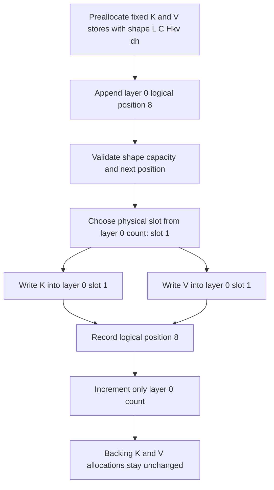

# Problem 022: Preallocate and Append K/V

## Why this exists

Autoregressive decode produces one key vector and one value vector per layer for
each new token. Rebuilding or growing arrays on every step adds allocation,
copying, and pointer instability to the serial decode loop. A decoder instead
reserves its cache budget before generation and writes each token into a known
slot.

This lesson builds that first reusable stateful component. The cache has a fixed
batch size of one, fixed layer and shape metadata, independent progress per
layer, and absolute logical positions that are not confused with storage slots.

## Learning outcomes

You can:

- preallocate separate contiguous K and V stores without append-driven growth;
- derive `[layer,token-slot,KV-head,feature]` offsets;
- enforce capacity, shape, layer, and sequential-position invariants;
- read a token/head vector and materialize a layer for attention;
- distinguish logical token position from physical cache slot; and
- calculate allocated bytes before decode starts.

## Prerequisites

- Problem 002 for row-major offsets and checked shapes.
- Problem 014 for `[token,Hkv,dh]` K/V projections.
- Problem 018 for why cache allocation uses `Hkv`, not `Hq`.

## Vocabulary

- **Capacity `C`**: maximum token slots reserved per layer.
- **Logical position**: absolute token index used by RoPE and attention policy.
- **Physical slot**: zero-based address within one layer's reserved storage.
- **Logical count**: number of initialized slots in one layer.
- **Layer isolation**: appending layer `l` changes no count or value in another layer.
- **Storage identity**: the backing allocation address, which remains stable here.

## Math and worked offsets

K and V each use logical shape `[L,C,Hkv,dh]`. For token-major row-major
storage, the element offset is

$$
o(l,t,h,d)=(((lC+t)H_{kv}+h)d_h+d).
$$

With `L=2,C=3,Hkv=2,dh=2`, element `(1,2,1,1)` has offset

$$
(((1\cdot3+2)\cdot2+1)\cdot2+1)=23.
$$

Each K or V allocation therefore has `2*3*2*2 = 24` Float32 values. Both
together occupy `2*24*4 = 192` bytes.

Logical positions need not begin at zero. If layer zero first appends absolute
position `7`, it writes physical slot `0`; position `8` writes slot `1`.
Position `10` is rejected because this contiguous lesson requires no gaps.



## Shape, layout, and dtype contract

`KVCacheConfiguration` fixes batch size one, `L`, `Hkv`, `dh`, and `C`; all four
dimensions are positive and checked for integer overflow. Append receives K and
V tensors of contiguous Float32 shape `[Hkv,dh]` plus a layer and nonnegative
logical position.

The first position in each layer may be any nonnegative integer. Later appends
must increase by exactly one. Every layer has its own count and position table.
Appending beyond `C`, using an invalid layer/head, passing the wrong vector
shape, or reading an absent position throws an explicit `KVCacheError`.

## CPU reference path

Allocate both arrays at `L*C*Hkv*dh` elements. For an append, validate first,
derive `slot=count[layer]`, copy exactly `Hkv*dh` K elements and V elements into
their fixed ranges, record the logical position, then increment that layer's
count. Never call `Array.append` on K or V storage.

Reads translate a logical position to its initialized slot and return one
`dh`-element head vector. The shared `KVCacheReadable.materialized` helper walks
logical positions and heads to produce `[T,Hkv,dh]` tensors for later oracles.

## Independent correctness method

The judge constructs its expected transcript independently from literal values.
It interleaves appends to two layers, checks layer isolation and readable values,
checks two fixed 24-float allocations and their stable addresses, and requires
errors for capacity overflow, a logical-position gap, and a shape mismatch.

```sh
swift run inference-school check 022 --cpu
swift run inference-school check 022 --solution
```

## Performance, bandwidth, and allocation model

The allocation budget is

$$
B=2LCH_{kv}d_h\cdot4\text{ bytes}.
$$

One append writes `2*Hkv*dh*4` data bytes plus small position/count metadata.
It does not copy earlier tokens and performs no K/V allocation. The fixed budget
can waste unused capacity; that is the explicit tradeoff explored by paging in
Problem 027.

Address stability is an invariant test, not a timing claim. Swift's array
implementation and this machine's allocator are not benchmarked in this lesson.

## Metal mapping

There is no Metal stage. The new behavior is host-side ownership, validation,
and lifetime management, not parallel arithmetic. Copying a tiny new-token
vector with a GPU dispatch would obscure the allocation invariant. Problem 023
passes this storage to an actual MSL decode-attention kernel.

## Implementation checkpoints

1. Validate configuration dimensions and byte-count overflow.
2. Allocate K, V, positions, and per-layer counts once.
3. Append the first nonzero logical position.
4. Append a second token without changing storage addresses.
5. Interleave two layers and verify isolation.
6. Read one head vector and a materialized layer.
7. Reject overflow, gaps, wrong shapes, and absent reads.

## Controlled experiments

### Capacity sweep

Hold `L,Hkv,dh` fixed and sweep `C`. Prediction: allocated bytes grow linearly,
while append work remains constant until capacity is reached.

### Layer interleaving

Append the same positions in layer-major and token-major call order. Prediction:
each layer's final transcript is identical because counts are independent.

### Growth comparison

Compare this fixed store with a local implementation that repeatedly appends to
empty arrays. Prediction: both produce the same values, but only the fixed store
has a pre-decode byte budget and invariant storage identity.

## Engine integration

`KVCacheReadable` and `KVCacheWritable` are the shared batch-one boundary used by
cached attention in Problem 023 and by ring, paged, and quantized alternatives.
The canonical `ContiguousKVCache` is the simplest decoder cache when maximum
context is known and reserving the full budget is acceptable.

## Tradeoffs

- Full preallocation gives simple offsets and stable storage but reserves peak memory.
- Per-layer counts support decoder execution order but add small metadata.
- Sequential positions simplify lookup; arbitrary insertion would require an index.
- Token-major layout makes one append contiguous; other reads may prefer another layout.

## Hints

- Allocate array *count*, not only array capacity.
- Validate both K and V before mutating either store.
- Keep logical positions in their own table; do not infer absolute position from slot.
- Include both K and V in every byte calculation.

## Canonical solution

- [Shared cache contracts](../../Sources/InferenceSchoolCore/Problems/KVCacheTypes.swift)
- [Contiguous implementation](../../Sources/InferenceSchoolSolutions/P022ContiguousKVCacheSolution.swift)
- [Independent judge](../../Sources/InferenceSchoolCore/Problems/P022ContiguousKVCache.swift)
- [Focused tests](../../Tests/InferenceSchoolCoreTests/P022ContiguousKVCacheTests.swift)

## Completion checklist

- [ ] Storage is allocated once at the exact derived size.
- [ ] Nonzero logical positions append and read correctly.
- [ ] Layer counts and values remain isolated.
- [ ] Capacity, shape, position, layer, and read errors are explicit.
- [ ] K/V addresses and element counts remain stable across appends.
- [ ] You ran one capacity, interleaving, or growth experiment with a prediction.
