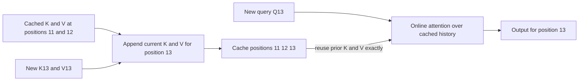

# Problem 023: Cached Single-Token Attention

## Why this exists

During decode, the model receives one new token. Earlier tokens' projected keys
and values have not changed, so recomputing all prior Q/K/V projections would be
wasted work. The decoder projects only the current token, appends its K/V, and
attends the current query over cached history.

This lesson makes that state transition executable on CPU and Metal. The Metal
kernel reads the preallocated cache arrays directly; no CPU attention fallback
is used by the Metal check.

## Learning outcomes

You can:

- order one decode step as append K/V, then read attention history;
- preserve absolute positions while cache slots begin at zero;
- compare cached decode with a materialized attention oracle;
- map query heads to cache heads in a real MSL kernel;
- identify the computation reused exactly from earlier tokens; and
- separate cache allocation, append traffic, and attention-read traffic.

## Prerequisites

- Problem 016 for scaled causal attention and the materialized oracle.
- Problem 019 for stable online softmax.
- Problem 022 for fixed storage and readable cache vectors.

## Vocabulary

- **Decode step**: processing one newly generated or sampled token.
- **Current K/V**: projections for the token whose query is being evaluated.
- **Cached history**: earlier K/V vectors retained without recomputation.
- **Append-then-attend**: ordering that makes the current token visible to itself.
- **Materialized oracle**: independent Double attention over explicit `[T,Hkv,dh]` tensors.
- **Absolute position**: model position used by RoPE and causal policy, not a slot index.

## Math from first principles

For current absolute position $p$, query head $h_q$, and cached positions
$r\le p$,

$$
s_r=\frac{Q_{p,h_q}\cdot K_{r,h_{kv}}}{\sqrt{d_h}},\qquad
O_{p,h_q}=\sum_{r\le p}\operatorname{softmax}(s)_rV_{r,h_{kv}}.
$$

Only $Q_p,K_p,V_p$ are newly projected. Every $K_r,V_r$ for $r<p$ is reused
bit-for-bit from cache storage.

### Worked decode step

Suppose cache positions are `[11,12]` and the new token is position `13`.
Append its K/V into slot `2`, producing logical positions `[11,12,13]`, then
compute one query over all three rows. The materialized oracle uses query offset
`13` and key offset `11`; using local query index zero would incorrectly mask
positions `11` and `12`.



## Shape, layout, and dtype contract

The request is batch one. Query is contiguous Float32 `[Hq,dh]`. Input K/V are
the deterministic append sequence `[T,Hkv,dh]`, including the current token as
the last row. Cache storage is separate contiguous Float32 K and V arrays with
layout `[L,C,Hkv,dh]`, where `T<=C`.

`Hq` must be divisible by `Hkv`; all dimensions are positive and all values are
finite. `queryLogicalPosition` must equal `firstLogicalPosition+T-1`. Layer and
positions are explicit. Output is `[Hq,dh]` Float32.

## CPU reference path

Create the fixed cache, slice each token's `[Hkv,dh]` K/V vectors, and append
them in logical order. For each query head, map its KV head, then stream cached
positions using online `(maximum,denominator,weightedValue)` state. Normalize
once after the last visible position.

The reusable `attend` function accepts any `KVCacheReadable`, which lets later
ring, paged, and quantized caches share attention semantics without sharing
their physical address calculations.

## Independent correctness method

The judge reshapes the one query to `[1,Hq,dh]` and invokes the independent
Double materialized oracle over the original K/V tensor. It covers one-token
self-attention, multiple tokens at nonzero absolute positions and a nonzero
layer, allocation bytes, position transcripts, bad query shape, and a query
position that is not the appended current token.

```sh
swift run inference-school check 023 --cpu
swift run inference-school check 023 --metal
swift run inference-school check 023 --solution
```

## Performance, bytes, and allocation model

The step writes current K/V once:

$$B_{append}=2H_{kv}d_h\cdot4.$$

The semantic minimum for reading all cached K/V is approximately
$2TH_{kv}d_h\cdot4$ bytes when all KV heads are used, plus Q and output. Dot and
weighted-value work is about $4TH_qd_h$ FLOPs. There is no score-matrix
allocation and no cache growth.

The baseline MSL kernel favors clarity: one work item owns one output feature of
one query head and therefore recomputes that head's scores for each output
feature. Its traffic and FLOPs exceed the semantic minimum. This is a correct
decode baseline, not a claim of optimal throughput.

## Metal mapping

The grid is `[dh,Hq]`. Each work item reads the full query head and all cached K
vectors, maintains a stable softmax recurrence, and accumulates one output
feature from V. Cache offsets use `[L,C,Hkv,dh]`; `kvHead=qHead/groupSize`.

All buffers use shared storage for this teaching path. There is no threadgroup
memory or barrier. The command is compiled from MSL at runtime, dispatched, and
checked for completion. The starter kernel also executes MSL but writes an
intentionally wrong zero result.

See [P023CachedAttention.metal](../../Sources/InferenceSchoolSolutions/Metal/P023CachedAttention.metal).

## Implementation checkpoints

1. Validate query/K/V/cache shapes and current absolute position.
2. Append a one-token request and recover its value exactly.
3. Append history plus current K/V at a nonzero starting position.
4. Match the materialized Double oracle on CPU.
5. Bind raw cache arrays, layer, capacity, and count to Metal.
6. Implement stable score and value accumulation in MSL.
7. Match the same judge with actual Metal execution.

## Controlled experiments

### Cached versus recomputed projections

Count projected tokens for one step at context `T`. Prediction: cached decode
projects one token; a recomputing path projects `T`, although attention still
reads `T` K/V rows.

### Context sweep

Sweep `T` with fixed heads and width. Prediction: append traffic stays constant
while attention work and cache reads grow linearly.

### Absolute-position shift

Shift first and query positions by the same constant. Prediction: this causal
decode output is unchanged because ordering is unchanged; RoPE would already
have encoded the shifted positions in Q/K.

### Kernel ownership

Compare the feature-owned baseline with a local head-owned kernel. Prediction:
head ownership avoids repeated score work but needs a bounded accumulator or
another output strategy.

## Engine integration

This is the attention operation used inside a one-token decoder layer after
Q/K/V projection and RoPE. The new K/V are appended once per layer; the output
continues to head concatenation and the output projection. Problem 040 can call
the same cache-readable CPU boundary while selecting a production kernel.

## Tradeoffs

- Cached decode removes prior projection work, not the need to read prior K/V.
- Feature-owned MSL is simple and unbounded in `dh`, but repeats score computation.
- Shared buffers simplify teaching; private GPU storage and persistent buffers reduce setup cost.
- Contiguous cache offsets are cheap; alternative allocation policies need a gather step.

## Hints

- Append current K/V before attention so the diagonal token is visible.
- Use cache logical positions for policy and slots only for addresses.
- Subtract or stream the maximum before exponentiation.
- A Metal stage that calls CPU attention is not a Metal implementation.

## Canonical solution

- [CPU cached attention](../../Sources/InferenceSchoolSolutions/P023CachedAttentionSolution.swift)
- [Metal pipeline](../../Sources/InferenceSchoolCore/Metal/MetalCachedAttentionPipeline.swift)
- [MSL kernel](../../Sources/InferenceSchoolSolutions/Metal/P023CachedAttention.metal)
- [Independent judge](../../Sources/InferenceSchoolCore/Problems/P023CachedAttention.swift)

## Completion checklist

- [ ] Current K/V are appended before the query reads cache.
- [ ] Prior K/V are read, not recomputed.
- [ ] Nonzero absolute positions and layers pass.
- [ ] CPU and actual Metal match the materialized Double oracle.
- [ ] Allocation and per-step byte costs are derived separately.
- [ ] You ran one context, position, projection, or kernel-ownership experiment.
