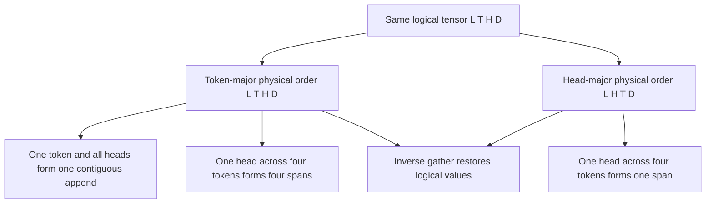

# Problem 024: KV Layout Shootout

## Why this exists

A tensor's logical values do not choose their physical order. Decode appends a
whole token, while attention often reads one KV head across many tokens. Those
two access patterns favor different contiguous dimensions. This systems lab
implements both layouts, proves they round-trip, derives deterministic access
traces, and provides a release benchmark whose result is deliberately local to
its shape and machine.

## Learning outcomes

You can:

- implement token-major `[L,T,H,D]` and head-major `[L,H,T,D]` offsets;
- copy logical values into either physical order and reconstruct them;
- count bytes and contiguous spans for a defined read pattern;
- benchmark one controlled layout variable with a checksum;
- explain why an access trace is not a hardware timing result; and
- choose a layout only for a stated workload and machine.

## Prerequisites

- Problem 002 for logical versus physical tensor layout.
- Problem 003 for the cost and purpose of layout conversion.
- Problems 022-023 for cache append and decode-read patterns.

## Vocabulary

- **Token-major**: physical order `[layer,token,head,feature]`.
- **Head-major**: physical order `[layer,head,token,feature]`.
- **Round-trip**: logical values survive physical copy and inverse gather.
- **Access trace**: deterministic sequence of element offsets touched by a loop.
- **Contiguous span**: maximal run of offsets increasing by one.
- **Benchmark boundary**: exact loop, allocation policy, build, shape, and machine measured.

## Math from first principles: offset derivation

For token-major layout,

$$o_T=(((lT+t)H+h)D+d).$$

For head-major layout,

$$o_H=(((lH+h)T+t)D+d).$$

Use `L=2,T=4,H=2,D=3` and element `(l=1,t=2,h=1,d=2)`:

$$o_T=41,\qquad o_H=44.$$

Reading all features for layer `1`, head `1`, tokens `0...3` yields token-major
offsets

```text
27 28 29 | 33 34 35 | 39 40 41 | 45 46 47
```

or four contiguous spans. Head-major yields `36...47`, one span. Both read
`4*3*4 = 48` Float32 bytes. Span count describes address continuity; it does
not predict a universal latency winner.



## Shape, layout, and dtype contract

Logical input is contiguous Float32 `[L,T,Hkv,dh]`, with `T` equal to the
configuration capacity for this complete-layout experiment. Both physical
stores contain exactly `L*T*Hkv*dh` Float32 values. Layer, slot, head, and
feature indices are bounds checked.

The output contains both reconstructed logical tensors and traces for one
selected `(layer,head)` read. Batch size is one. K and V use the same layout
formula; the fixture uses one generic value tensor so layout behavior is not
confounded with attention arithmetic.

## CPU reference path

For every logical `(l,t,h,d)`, compute its standard logical offset and the
selected physical offset, then copy. The inverse loop computes the same
physical offset and writes back to logical token-major order. Build the trace by
holding layer/head fixed and looping token then feature.

Count a new span at the first offset or whenever `current != previous+1`.

## Independent correctness method

The judge uses sequential values so every incorrect permutation is visible. It
requires exact round-trips for both layouts, literal worked offsets `41` and
`44`, exact trace sequences, four versus one contiguous spans, and equal 48-byte
reads. A fake implementation that labels token-major data as head-major fails
even though its values appear unchanged.

```sh
swift run inference-school check 024 --cpu
swift run inference-school check 024 --solution
swift run -c release inference-school benchmark 024 --layers 16 --tokens 2048 --heads 8 --dimension 64 --iterations 7
```

## Performance, bandwidth, and allocation model

Each layout stores the same bytes:

$$B=LTH_{kv}d_h\cdot4$$

per K or V tensor. Conversion reads and writes every element, so converting one
tensor moves at least `2B` algorithmic bytes. A one-head decode scan reads
`T*dh*4` data bytes in either layout but presents different address runs.

The CLI benchmark prebuilds both stores, changes only the descriptor used by a
layer/head/token/feature read loop, reports median nanoseconds and a checksum,
and states the shape. Its outcome is shape-, machine-, compiler-, cache-, and
loop-specific. Do not turn one result into a hardware-independent claim.

## Metal mapping

This investigation is CPU-only because its required artifact is address and
allocation reasoning plus a controlled host benchmark. A useful future Metal
experiment would bind both layouts to the same cached-attention arithmetic and
measure kernel-only time with persistent buffers. That is not fabricated here.

On GPU, adjacent feature threads naturally favor contiguous `D`; cooperative
heads or token tiles determine whether the `T`/`H` ordering matters. The grid
must be specified before interpreting coalescing.

## Implementation checkpoints

1. Derive both formulas on paper.
2. Check offsets for first, interior, and last elements.
3. Copy and round-trip token-major storage.
4. Copy and round-trip head-major storage.
5. Emit exact one-head traces and span counts.
6. Run the debug judge.
7. Write a prediction, then run the release benchmark with recorded shape.

## Controlled experiments

### Token-count sweep

Fix `L,H,D` and sweep `T`. Prediction: bytes grow linearly; head-major retains
one logical span for the defined head scan while token-major retains `T` spans.

### Head-count sweep

Fix total elements by trading `H` against `D`. Prediction: token-major gaps
between one head's token vectors change with `H*D`; timing need not follow span
count monotonically because cache lines and loop overhead also change.

### Append versus read

Benchmark copying one new `[H,D]` token and scanning one head over `T` tokens
separately. Prediction: token-major favors contiguous append, head-major favors
the defined scan. The engine's weighting of those operations decides the choice.

### Conversion break-even

Measure one conversion plus `N` reads versus retaining the original layout.
Prediction: conversion wins only after enough affected reads repay its full pass.

## Engine integration

`KVLayoutDescriptor` makes the physical formula explicit at the boundary. The
canonical contiguous cache remains token-major because append is simple and the
023 kernel already consumes it. A production engine may select another layout
only together with matching append, gather, and attention kernels.

## Tradeoffs

- Token-major makes one token's all-head append contiguous.
- Head-major makes one head's full-token scan contiguous.
- Duplicating layouts avoids conversion but doubles cache storage.
- Conversion can help repeated reads but adds a full read/write pass.
- Span count is deterministic evidence; measured latency still needs a benchmark.

## Hints

- Write axis order into the formula before substituting numbers.
- Test values that identify every logical coordinate.
- Keep allocation and conversion outside the timed read loop.
- Record build configuration, shape, iterations, machine, and checksum.

## Canonical solution

- [Layout contracts and judge](../../Sources/InferenceSchoolCore/Problems/P024KVLayoutShootout.swift)
- [Copy, trace, and benchmark solution](../../Sources/InferenceSchoolSolutions/P024KVLayoutShootoutSolution.swift)
- [Focused tests](../../Tests/InferenceSchoolCoreTests/P024KVLayoutShootoutTests.swift)

## Completion checklist

- [ ] Both formulas produce the worked offsets.
- [ ] Both physical layouts round-trip exactly.
- [ ] Trace bytes and contiguous spans match the defined loop.
- [ ] The release benchmark reports shape, iterations, and checksum.
- [ ] Your conclusion is limited to the measured machine and workload.
- [ ] You wrote a prediction before one layout experiment.