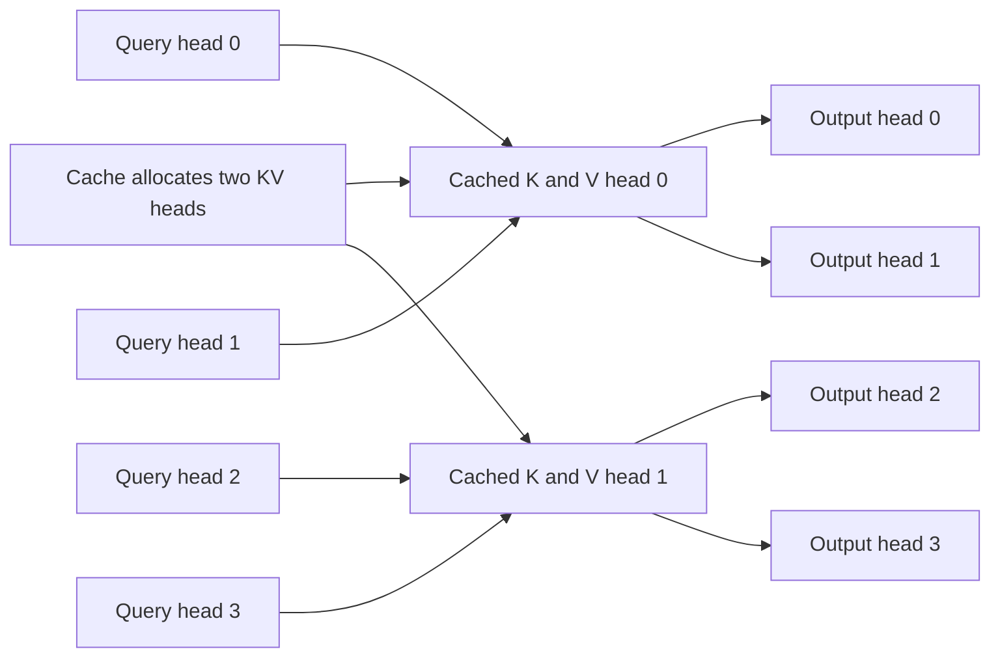

# Problem 025: Shared KV Heads

## Why this exists

Problem 018 introduced MHA, MQA, and GQA as attention shapes. A stateful decoder
must carry that architecture choice into allocation and cached reads. Reserving
one KV head per query head for a GQA checkpoint wastes memory; mapping query
heads with modulo silently reads the wrong learned state.

This lesson applies the exact contiguous-group mapping to a real cache-backed
decode step and compares complete K-plus-V byte budgets for MHA, MQA, and GQA.

## Learning outcomes

You can:

- allocate cache dimensions from `Hkv` while producing `Hq` outputs;
- derive and implement `kvHead=qHead/groupSize`;
- explain why modulo mapping is a semantic bug;
- reject head counts for which `Hq % Hkv != 0`;
- calculate MHA, MQA, and GQA bytes with both K and V; and
- use the same contiguous cache for all three architecture endpoints.

## Prerequisites

- Problem 018 for grouped-query attention semantics.
- Problem 022 for the cache's `[L,C,Hkv,dh]` allocation.
- Problem 023 for cached single-token attention.

## Vocabulary

- **Query head `Hq`**: independently normalized attention output channel.
- **KV head `Hkv`**: stored key/value channel, possibly shared.
- **Group size `g`**: `Hq/Hkv` contiguous query heads per KV head.
- **Division mapping**: `floor(qHead/g)`, the checkpoint convention used here.
- **Modulo mapping**: `qHead % Hkv`; valid arithmetic, wrong grouping semantics.
- **Cache reduction factor**: `Hq/Hkv` relative to an equal-width MHA cache.

## Math from first principles: head mapping and bytes

After validating divisibility,

$$
g=\frac{H_q}{H_{kv}},\qquad h_{kv}=\left\lfloor\frac{h_q}{g}\right\rfloor.
$$

For `Hq=4,Hkv=2`, `g=2`, so the map is `[0,0,1,1]`. Modulo produces
`[0,1,0,1]`; shapes still pass, but heads `1` and `2` read different learned
K/V vectors from the required architecture.

For Float32 cache capacity `T`,

$$
B_{KV}=2LTH_{kv}d_h\cdot4.
$$

With `L=2,T=3,dh=2,Hq=4`, MHA (`Hkv=4`) uses `384` bytes, MQA
(`Hkv=1`) uses `96`, and GQA (`Hkv=2`) uses `192`.



## Shape, layout, and dtype contract

Batch size is one. Query is contiguous Float32 `[Hq,dh]`; cache K/V are
Float32 `[L,C,Hkv,dh]`; output is `[Hq,dh]`. Counts and width are positive,
and `Hq` must be divisible by `Hkv` before group size or offsets are used.

The cache stores only `Hkv` vectors per token. Query heads remain separate
through score normalization and output. Logical positions and layer selection
follow Problem 023's append-then-attend contract.

## CPU reference path

Build the same `ContiguousKVCache` using its configured `Hkv`. For each query
head, calculate its KV head once by integer division, then use that head for
every cached K and V read. Do not share online softmax state between query heads;
sharing stored K/V does not make their queries or probabilities identical.

The canonical solution deliberately reuses the generic cached-attention path so
the architecture is represented by validated configuration, not a separate
cache implementation.

## Independent correctness method

The judge uses `Hq=4,Hkv=2` with strongly distinct value ranges for the two KV
heads. Its Double materialized oracle requires `[0,0,1,1]`; the focused test
passes a modulo implementation and verifies rejection. The judge also checks
the exact `384/96/192` byte fixture and independently verifies that `3:2` head
counts throw.

```sh
swift run inference-school check 025 --cpu
swift run inference-school check 025 --solution
```

## Performance, bandwidth, and allocation model

Cache allocation, current-token append bytes, and semantic K/V read bytes all
scale linearly with `Hkv`. MQA therefore uses `Hq` times fewer cache bytes than
MHA at equal `L,T,dh`; GQA lies between them.

The number of query-head score rows still scales with `Hq`. Sharing creates a
reuse opportunity but does not automatically remove dot products. Whether a
kernel or hardware cache realizes that reuse is a measured implementation
question, separate from the exact storage formula.

## Metal mapping

This problem adds no separate MSL file because Problem 023's actual cached
decode kernel already takes `Hq`, `Hkv`, and `groupSize` and uses division
mapping on raw cache storage. The new artifact is the allocation/mapping policy
and its rejection tests, not a duplicate kernel.

A cooperative future kernel could assign a threadgroup to one KV head and
several query heads, staging K/V once. That mapping would need a benchmark
against the simple feature-owned kernel before claiming lower traffic.

## Implementation checkpoints

1. Reject nonpositive and non-divisible head counts.
2. Print mapping tables for MHA, MQA, and one GQA ratio.
3. Allocate using `Hkv`, never `Hq`.
4. Pass MHA and MQA endpoint reasoning.
5. Make the `4:2` fixture use `[0,0,1,1]`.
6. Make a modulo implementation fail the judge.
7. Derive all three byte totals including K and V.

## Controlled experiments

### KV-head sweep

Fix `Hq,L,T,dh` and sweep divisors of `Hq`. Prediction: allocated bytes and
semantic K/V reads scale with `Hkv`; output shape stays fixed.

### Mapping mutation

Replace division with modulo locally. Prediction: validation and dimensions
still pass, but outputs differ on the judge's distinct KV-head fixture.

### Shared-read locality

Compare simple per-query-head and cooperative grouped kernels at one GQA shape.
Prediction: cooperative staging can reduce repeated K/V reads, but extra
synchronization may dominate at small `T`.

## Engine integration

Checkpoint metadata must provide both head counts. Q projection width is
`Hq*dh`; K and V projection widths and all cache variants use `Hkv*dh`. The
decoder passes the validated group size into cached attention while preserving
one output vector per query head.

## Tradeoffs

- MQA minimizes cache bytes; GQA retains more KV diversity.
- Division mapping is fixed by trained architecture, not selected for speed.
- Shared K/V can improve locality, but query-head arithmetic remains.
- One generic cache reduces code duplication; optimized kernels may specialize by ratio.

## Hints

- Validate divisibility before dividing.
- Map contiguous groups with division, not alternating heads with modulo.
- Keep K/V offsets based on `Hkv` and output offsets based on `Hq`.
- Count K and V and include scalar byte width.

## Canonical solution

- [GQA cache judge and byte model](../../Sources/InferenceSchoolCore/Problems/P025SharedKVHeads.swift)
- [Canonical cached implementation](../../Sources/InferenceSchoolSolutions/P025SharedKVHeadsSolution.swift)
- [Modulo rejection tests](../../Tests/InferenceSchoolCoreTests/P025SharedKVHeadsTests.swift)
- [Shared Metal decode kernel](../../Sources/InferenceSchoolSolutions/Metal/P023CachedAttention.metal)

## Completion checklist

- [ ] `Hq % Hkv == 0` is enforced.
- [ ] `4:2` maps query heads as `[0,0,1,1]`.
- [ ] A modulo implementation fails a focused test.
- [ ] MHA, MQA, and GQA byte totals are exact.
- [ ] Cache allocation uses `Hkv`; output uses `Hq`.
- [ ] You ran a KV-head, mapping, or locality experiment with a prediction.
