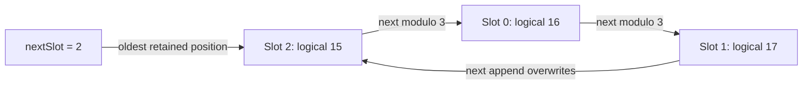

# Problem 026: Ring-Buffer Sliding Cache

## Why this exists

A layer with fixed sliding-window attention never reads arbitrarily old K/V.
Keeping the full history still grows memory with generation length. A ring
cache reserves exactly `C` token slots and overwrites the oldest physical slot
while logical positions continue increasing forever.

The difficulty is not modulo arithmetic alone. Reads must remain chronological,
overwritten positions must become inaccessible, and attention must apply its
window to absolute positions rather than physical slot order.

## Learning outcomes

You can:

- append monotonically increasing logical positions into fixed physical storage;
- derive wraparound and oldest-slot rules;
- return chronological positions after several complete wraps;
- reject reads of overwritten entries and position gaps;
- feed a chronological ring view into windowed cached attention; and
- separate bounded allocation from bounded attention work.

## Prerequisites

- Problem 021 for inclusive sliding-window policy.
- Problem 022 for fixed cache storage and append validation.
- Problem 023 for cache-readable attention.

## Vocabulary

- **Ring capacity `C`**: fixed number of physical token slots per layer.
- **Write cursor**: slot that receives the next append.
- **Oldest slot**: after the ring is full, the write cursor before its next write.
- **Wraparound**: moving the cursor from `C-1` back to zero.
- **Overwrite**: replacing the oldest K/V and logical-position metadata.
- **Chronological view**: logical order reconstructed independently of physical order.

## Wraparound derivation and worked example

For each append,

$$
slot=nextSlot,\qquad nextSlot=(slot+1)\bmod C.
$$

Before full capacity, chronological physical slots are `0..<count`. Once full,
the oldest slot is `nextSlot`, and chronological slot `i` is

$$
(nextSlot+i)\bmod C.
$$

With `C=3`, append logical positions `10...17`. The final physical position
array is `[16,17,15]` and the cursor is slot `2`. Reading from the cursor gives
`[15,16,17]`. Physical sorting or reading slots `0,1,2` would be wrong.



## Shape, layout, and dtype contract

Batch size is one. K and V remain separate fixed Float32 stores with physical
shape `[L,C,Hkv,dh]`. Append vectors are `[Hkv,dh]`. Each layer has independent
count, cursor, last logical position, and fixed position metadata.

The first logical position may be nonzero; each later append must equal
`last+1`. Capacity is not an append error: once full, append overwrites. Reads
address logical position and throw when it has been evicted. Output attention is
Float32 `[Hq,dh]` and uses a positive window.

## CPU reference path

Validate K and V before mutation. Write both vectors and the absolute position
to the cursor slot, cap count at `C`, advance modulo `C`, and update the last
position. To enumerate, choose oldest slot from count/cursor state and walk
exactly `count` entries modulo capacity.

Logical vector reads search the small fixed position table in this teaching
implementation. Windowed attention consumes `KVCacheReadable`, filters logical
positions, and never sees physical order.

## Independent correctness method

The judge appends eight tokens into capacity three, beginning at absolute
position ten. It checks the position history after every append, final K/V
values, stable storage addresses and byte count, and window-two attention
against the materialized Double oracle. Focused tests also reject a position gap
and a read of overwritten position five.

```sh
swift run inference-school check 026 --cpu
swift run inference-school check 026 --solution
```

## Performance, bandwidth, and allocation model

Allocation is still

$$B=2LCH_{kv}d_h\cdot4,$$

but `C` is the retained window capacity rather than maximum generation length.
Append writes constant bytes and allocates nothing. Chronological enumeration is
`O(C)`; the baseline's logical read search can add `O(C)` lookup per vector.

A production ring can derive a direct slot from the first retained position or
maintain an index. That optimization must preserve absolute position checks so
stale overwritten data is never returned.

## Metal mapping

This storage-policy lesson is CPU-only. Problem 021 already executes actual
windowed MSL, and Problem 023 executes actual cache-backed MSL. A ring-aware
kernel would pass cursor/count and derive each chronological physical slot with
modulo before the same attention math.

No Metal speed claim is made here. Modulo cost, split wrapped ranges, and
dispatch strategy require a persistent-buffer kernel benchmark.

## Implementation checkpoints

1. Append fewer than `C` tokens without wrap.
2. Fill exactly `C` and identify the oldest slot.
3. Append once more and reject the overwritten logical position.
4. Cross several wraps and record every chronological view.
5. Start from a nonzero absolute position.
6. Verify another layer remains empty.
7. Match windowed attention to the materialized oracle.

## Controlled experiments

### Wrap-count sweep

Run one, two, and ten full wraps. Prediction: allocated bytes and logical count
stay fixed; newest chronological values remain correct regardless of wrap count.

### Window versus capacity

Use attention window `W<C`, `W=C`, and `W>C`. Prediction: work is bounded by
available visible entries; `W>C` cannot recover overwritten context.

### Split-range read

Compare a physical loop with modulo each token against two contiguous ranges
around the wrap. Prediction: two ranges avoid per-token modulo, but benefit is
shape- and compiler-specific.

## Engine integration

Use the ring only for layers whose model policy guarantees no future read older
than capacity. The decoder still supplies monotonically increasing absolute
positions for RoPE and masking. Mixed local/global models need ring storage for
local layers and a different retention policy for global layers.

## Tradeoffs

- Fixed memory enables unbounded generation for local layers but discards history.
- Searching position metadata is simple; direct indexing is faster but easier to get stale.
- One ring per layer preserves isolation; shared cursors would couple execution order.
- Wrapped reads can use modulo or two physical ranges.

## Hints

- Store the logical position beside every physical slot.
- Once full, the next write cursor is also the oldest slot.
- Enumerate exactly `count` entries, not all capacity before the ring fills.
- Apply attention windows to logical positions after reconstructing chronology.

## Canonical solution

- [Ring request and judge](../../Sources/InferenceSchoolCore/Problems/P026RingKVCache.swift)
- [Ring cache and attention integration](../../Sources/InferenceSchoolSolutions/P026RingKVCacheSolution.swift)
- [Wraparound tests](../../Tests/InferenceSchoolCoreTests/P026RingKVCacheTests.swift)

## Completion checklist

- [ ] Storage size and addresses remain fixed across wraps.
- [ ] Logical positions increase while physical slots wrap.
- [ ] Chronological reads are correct after several wraps.
- [ ] Overwritten positions and position gaps are rejected.
- [ ] Windowed attention matches the absolute-position oracle.
- [ ] You ran a wrap, capacity, or split-range experiment with a prediction.
