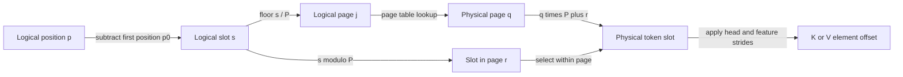

# Problem 027: Paged KV Allocation

## Why this exists

Full contiguous reservation is simple but ties every sequence to its maximum
capacity. Serving systems instead allocate smaller physical pages as sequences
grow and return pages when requests finish. Logical sequence order then lives in
a page table; adjacent logical pages may be far apart physically.

This batch-one systems lab uses a shared physical page pool across layers to make
allocation, exhaustion, free/reuse, fragmentation, and gather behavior
observable without pretending to implement a full batched serving scheduler.

## Learning outcomes

You can:

- allocate sequence pages on page boundaries;
- translate logical token positions through a page table;
- free a layer's pages and reuse their physical IDs;
- gather across noncontiguous and out-of-order physical pages;
- report live tokens, free pages, internal fragmentation, and free runs; and
- feed paged reads into the shared cached-attention path.

## Prerequisites

- Problem 022 for cache contracts and logical positions.
- Problem 023 for attention over `KVCacheReadable`.
- Problem 024 for separating logical order from physical layout.

## Vocabulary

- **Page size `P`**: token slots represented by one physical page.
- **Physical page**: fixed storage block from the shared allocator.
- **Logical page ordinal**: `logicalSlot/P` within one layer's sequence.
- **Page table**: ordered physical page IDs for logical page ordinals.
- **Internal fragmentation**: allocated page slots not holding live tokens.
- **Free run**: consecutive physical page IDs currently available.

## Math from first principles: paged addressing

For a layer whose first logical position is $p_0$,

$$
s=p-p_0,\quad j=\left\lfloor s/P\right\rfloor,\quad r=s\bmod P.
$$

Look up physical page $q=pageTable[layer][j]`. For token/head/feature,

$$
o=(((qP+r)H_{kv}+h)d_h+d).
$$

The judge uses three physical pages of two tokens. Layer zero receives physical
page `0`, layer one receives `1`, and layer zero's second logical page receives
`2`. After freeing layer one, layer two reuses page `1`. Final page tables are

```text
layer 0: [0, 2]
layer 1: []
layer 2: [1]
```

Layer zero's logical positions `10...13` cross pages `0` and `2`; assuming
physical pages `0,1` would read layer two or stale data.



## Shape, layout, and dtype contract

The simplified page model stores all KV heads for `P` tokens in one sequence
page. Physical K and V arrays are contiguous Float32
`[physicalPage,P,Hkv,dh]`. The configuration remains batch one and fixes layer
count, per-layer logical capacity, heads, and width.

Append vectors are `[Hkv,dh]`, logical positions are nonnegative and sequential
per live layer, and append beyond logical capacity throws. A new logical page
requires a free physical page or throws `pageUnavailable`. Free resets that
layer's count and position range and makes its pages unaddressable before reuse.

## CPU reference path

Initialize a deterministic free list and fixed physical K/V arrays. On an
append where `logicalSlot % P == 0`, pop one physical page and append its ID to
the layer's page table. Translate through the page table and copy one K/V token.

On free, return every page ID, clear the table while retaining its array
capacity, and reset logical metadata. Reads derive logical slot, page ordinal,
slot in page, and physical offset. They never assume physical adjacency.

## Independent correctness method

The judge runs the exact allocation/free sequence above. It requires page tables
`[[0,2],[],[1]]`, gathers distinct values across layer zero's page boundary and
layer two's reused page, checks deterministic accounting and 96 allocated bytes,
and compares attention over layer zero with a Double materialized oracle.

Focused tests exhaust a one-page pool, free it, and prove another layer reuses
physical page zero. An implementation that constructs contiguous page IDs fails.

```sh
swift run inference-school check 027 --cpu
swift run inference-school check 027 --solution
```

## Performance, bytes, and fragmentation model

The fixed physical pool uses

$$B=2N_{pages}PH_{kv}d_h\cdot4.$$

The judge's `Npages=3,P=2,Hkv=1,dh=2` pool uses `96` bytes. With `A` allocated
pages and `Nlive` tokens,

$$fragmentSlots=AP-N_{live}.$$

Page-table reads add indirection. Smaller pages reduce worst-case internal
fragmentation but enlarge page tables and increase allocation frequency. The
largest contiguous free run is reported for deterministic allocator analysis;
paged reads do not require such a run.

## Metal mapping

This allocator/gather lesson is CPU-only. A paged Metal attention kernel would
bind a page table and compute `pageOrdinal`, `physicalPage`, and `slotInPage`
inside each K/V load. It would not first concatenate pages on CPU, because that
would erase the behavior under study.

The current CPU gather feeding cached attention proves semantic integration.
GPU page-table caching, vectorized gathers, and page size are later measured
kernel choices, not claims made by this lab.

## Implementation checkpoints

1. Allocate the first page on logical slot zero.
2. Reuse that page for slots inside one page boundary.
3. Allocate another page exactly at the boundary.
4. Exhaust a small pool and throw without partial mutation.
5. Free a layer and reuse its physical page.
6. Gather values through a noncontiguous page table.
7. Run cached attention over the paged reader.

## Controlled experiments

### Page-size sweep

Hold live token patterns fixed and sweep `P`. Prediction: smaller pages reduce
internal fragment slots but increase page-table entries and allocation events.

### Completion-order fragmentation

Free layers in different orders. Prediction: live logical values are unchanged,
while physical page IDs and largest free run can differ under the LIFO allocator.

### Gather versus materialize

Compare direct paged reads with copying pages to one contiguous temporary.
Prediction: direct gather avoids copy allocation; materialization can repay its
cost only if the contiguous result is reused enough times.

## Engine integration

The page allocator is a simplified precursor to per-request paged KV in a
serving engine. The attention boundary already depends on logical cache reads,
so contiguous and paged stores are interchangeable semantically. A batched
extension would give each request/layer its own page table while sharing the
physical pool and scheduler.

## Tradeoffs

- Smaller pages reduce fragmentation but increase metadata and allocation frequency.
- LIFO free lists are deterministic and simple; other policies change locality.
- Direct gather preserves paging; materialization trades a copy for contiguous reads.
- This model shares pages across layers but does not implement multi-request batching.

## Hints

- Allocate a page before writing the first slot in that logical page.
- Use page-table order for chronology, never sort physical page IDs.
- Clear logical metadata on free even if physical bytes are left unchanged.
- Compute fragmentation from allocated slots minus live tokens.

## Canonical solution

- [Paged operations, accounting, and judge](../../Sources/InferenceSchoolCore/Problems/P027PagedKVCache.swift)
- [Page allocator and gather](../../Sources/InferenceSchoolSolutions/P027PagedKVCacheSolution.swift)
- [Exhaustion and reuse tests](../../Tests/InferenceSchoolCoreTests/P027PagedKVCacheTests.swift)

## Completion checklist

- [ ] Appends allocate exactly on page boundaries.
- [ ] Exhaustion throws before corrupting tables.
- [ ] Free pages are reused by another layer.
- [ ] Noncontiguous physical pages gather in logical order.
- [ ] Fragmentation, free-run, and byte reports are exact.
- [ ] Paged reads produce the materialized attention result.
- [ ] You ran a page-size, free-order, or gather experiment with a prediction.
