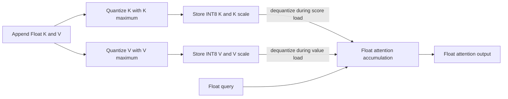

# Problem 028: Quantized KV Cache

## Why this exists

Long-context decode repeatedly reads K/V and can spend more bandwidth on cache
than on arithmetic. Storing INT8 instead of Float32 reduces element bytes, but
requires a precise scale convention, metadata, dequantization work, and an
explicit output-error budget. A smaller allocation alone is not evidence that
the complete path is better.

This lesson implements symmetric INT8 per token/head vector for K and V, keeps
their scales independent, reads dequantized values through the shared cache
contract, and executes a real Metal kernel that dequantizes inside attention.

## Learning outcomes

You can:

- quantize and dequantize one vector with a defined signed INT8 convention;
- store independent scale metadata for every K and V token/head vector;
- derive bytes including metadata rather than only packed elements;
- run cached attention over dequantized reads on CPU;
- dequantize K/V inside actual MSL attention loads; and
- compare output and storage error with Float cache before interpreting discrepancy.

## Prerequisites

- Problem 011 for precision-boundary reasoning.
- Problem 023 for cached decode and its Float oracle.
- Problem 025 for KV-head-dependent cache bytes.

## Vocabulary

- **Symmetric INT8**: signed integer range around zero with no zero-point.
- **Per-vector scale**: one Float32 scale for one token, one KV head, one K or V vector.
- **Quantized element**: stored `Int8` value in `[-127,127]`.
- **Dequantization**: `Float(q)*scale` at read time.
- **Metadata**: scales required to interpret integer elements.
- **Convention check**: verifying layout, scale, range, and attention math before attributing error.

## Quantization derivation and worked example

For vector $x$ with maximum absolute value $a$,

$$
s=\begin{cases}1 & a=0\\a/127 & a>0\end{cases},\qquad
q_i=\operatorname{clamp}(\operatorname{round}(x_i/s),-127,127),
$$

and

$$\hat{x}_i=q_i s.$$

For `[0.5,-1.0]`, `s=1/127`. The integers are approximately `[64,-127]`,
and dequantized values are `[64/127,-1]`. The element error is bounded by about
half a scale when inputs and conventions are valid. An all-zero vector uses
scale `1`, stores zeros, and remains finite.



## Shape, layout, and dtype contract

Batch size is one. Logical append vectors are Float32 `[Hkv,dh]`. Quantized K
and V element arrays use physical `[L,C,Hkv,dh]` token-major order with `Int8`
elements. K scales and V scales are separate Float32 arrays `[L,C,Hkv]`.

Logical positions are sequential as in Problem 022. Dequantized reads return
Float32 head vectors. Query and output are Float32 `[Hq,dh]`; score and online
softmax accumulation are Float32 in learner/canonical paths. Invalid shapes,
capacity, layers, heads, or positions throw before mutation.

## CPU reference path

For each appended token/head, find max absolute K value and V value separately,
store their scales, quantize each feature, then record the logical position.
Readable cache methods locate the token/head vector and multiply each integer by
its corresponding K or V scale.

The generic cached-attention function consumes those dequantized reads without
knowing their physical dtype. The result report materializes dequantized K/V and
computes maximum element error against original Float tensors.

## Independent correctness method

The judge compares quantized attention with the independent Float materialized
Double oracle using explicit absolute/relative tolerances. It checks K/V
round-trip shapes and maximum errors, exact byte accounting, six K scales and
six V scales for `T=3,Hkv=2`, and evidence that K/V metadata are independent.

The fixture uses different K and V ranges so sharing their scale arrays fails.
A focused zero-vector test verifies finite metadata. A wrong implementation that
returns exact Float outputs but reports Float storage bytes still fails.

```sh
swift run inference-school check 028 --cpu
swift run inference-school check 028 --metal
swift run inference-school check 028 --solution
```

## Performance model: bytes, bandwidth, and error

For per-vector Float32 scales, total allocated bytes are

$$
B=2LCH_{kv}d_h\cdot1+2LCH_{kv}\cdot4.
$$

Equivalently, each K/V vector costs `dh` INT8 bytes plus one 4-byte scale. The
judge's `L=1,C=3,Hkv=2,dh=4` cache uses `48` element bytes plus `48` scale bytes,
or `96` total. At this deliberately tiny width, metadata erases much of the
Float32-to-INT8 ratio; larger `dh` amortizes scales better.

Read bandwidth falls only if dequantization is fused with the consumer. CPU
materialization writes Float temporaries; the Metal path does not. Extra integer
conversion and scale loads must be benchmarked against saved bytes.

An output discrepancy is not automatically "quantization noise." First verify
logical positions, head mapping, K/V scale separation, signed range, layout,
softmax scaling, and accumulation dtype against the Float path.

## Metal mapping

The grid is `[dh,Hq]`, matching Problem 023's readable baseline. Each work item
maps its query head by division, reads signed `char` K/V elements from raw cache
storage, loads the token/head K and V scales, dequantizes during dot and weighted
value accumulation, and writes one output feature.

No Float K/V cache or dequantized temporary buffer is created. The runtime
compiles and dispatches the MSL source and checks command completion. Like 023,
feature ownership repeats score work; that limitation is explicit rather than
hidden by a CPU fallback.

See [P028QuantizedKVCache.metal](../../Sources/InferenceSchoolSolutions/Metal/P028QuantizedKVCache.metal).

## Implementation checkpoints

1. Quantize a two-value vector by hand.
2. Handle an all-zero vector with finite scale and exact zeros.
3. Store K and V scales independently per token/head.
4. Dequantize readable vectors and bound element error.
5. Match Float cached attention on CPU within stated tolerance.
6. Include all scale bytes in the allocation report.
7. Bind INT8 arrays and scales to MSL and match the same judge.

## Controlled experiments

### Head-dimension sweep

Sweep `dh` while retaining one scale per vector. Prediction: metadata fraction
`4/(dh+4)` falls as width grows, improving the storage ratio.

### Scale granularity

Compare one scale per vector with smaller feature blocks. Prediction: smaller
blocks can lower element error but add metadata and scale loads.

### Context sweep

Sweep cached token count with persistent buffers. Prediction: quantized bytes
and Float bytes both grow linearly; fused dequantization has more opportunity to
repay overhead as cache reads dominate.

### Convention fault injection

Deliberately share K/V scales or use unsigned bytes. Prediction: errors become
systematic and exceed the per-scale rounding bound, identifying a convention
bug rather than an inherent format limit.

## Engine integration

The quantized cache conforms to the same readable/writable boundary as Float,
ring, and paged caches. A decoder can select it per model/layer policy while
keeping logical positions and attention semantics unchanged. Production use
would retain device buffers across steps and choose scale granularity from
measured error, bandwidth, and latency.

## Tradeoffs

- INT8 reduces element bytes but adds scale metadata and conversion work.
- Per-vector scales are simple; finer blocks can improve fidelity at metadata cost.
- Fused dequantization avoids Float temporaries; feature-owned baseline repeats scores.
- Float accumulation limits one error source but does not recover discarded precision.

## Hints

- Use `[-127,127]` symmetrically; avoid the asymmetric `-128` endpoint here.
- Quantize K and V with separate maxima and scale arrays.
- Treat all-zero vectors explicitly to avoid division by zero.
- Verify conventions and intermediate dequantized values before labeling output error.

## Canonical solution

- [Quantized result contract and judge](../../Sources/InferenceSchoolCore/Problems/P028QuantizedKVCache.swift)
- [INT8 cache and CPU attention](../../Sources/InferenceSchoolSolutions/P028QuantizedKVCacheSolution.swift)
- [Metal pipeline](../../Sources/InferenceSchoolCore/Metal/MetalQuantizedCachedAttentionPipeline.swift)
- [MSL fused dequantization](../../Sources/InferenceSchoolSolutions/Metal/P028QuantizedKVCache.metal)
- [CPU and metadata tests](../../Tests/InferenceSchoolCoreTests/P028QuantizedKVCacheTests.swift)

## Completion checklist

- [ ] Symmetric INT8 quantize/dequantize follows the explicit formula.
- [ ] K and V own independent per-token/head scales.
- [ ] Byte totals include all scale metadata.
- [ ] Dequantized element errors satisfy the stated bounds.
- [ ] CPU and actual Metal attention stay within the Float-oracle tolerance.
- [ ] Convention checks precede any interpretation of discrepancy.
- [ ] You ran a width, granularity, context, or fault experiment with a prediction.