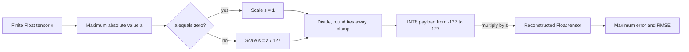

# Problem 029: Symmetric INT8 Quantization

## Why this exists

Model weights are commonly stored with fewer than 32 bits per value, but an
integer array is not a usable weight tensor by itself. The signed range,
rounding rule, scale, zero handling, shape, and reconstruction error are all
part of the representation. If any one differs between conversion and loading,
the model computes with different weights.

This lesson starts weight quantization with one scale for an entire Float32
tensor. It is intentionally CPU-only: there is no useful GPU consumer yet, so a
Metal dispatch would only copy or dequantize data without teaching a real engine
path. Problem 033 will consume packed weights directly in MSL.

## Learning outcomes

You can:

- state the exact symmetric INT8 range and explain why `-128` is excluded;
- compute a finite scale for nonzero and all-zero tensors;
- apply the same deterministic tie rule used by later converters;
- reject NaN and infinity before deriving metadata;
- reconstruct Float32 values and calculate maximum absolute error and RMSE; and
- count integer payload bytes and Float32 scale bytes separately.

## Prerequisites

- Problem 002 for contiguous tensor shape and storage contracts.
- Problem 006 for honest byte accounting.
- Problem 011 for reasoning about deliberate precision boundaries.
- Problem 028 for the distinction between a quantization convention and an
  unexplained output discrepancy.

## Vocabulary

- **Quantization**: mapping a Float32 value to a member of a finite integer set.
- **Dequantization**: reconstructing an approximate Float32 value from an integer and scale.
- **Symmetric range**: integer endpoints with equal magnitude around zero.
- **Scale**: the Float32 step represented by one integer increment.
- **Saturation**: clamping a rounded value to the representable integer range.
- **RMSE**: root mean square element error, which weights all errors rather than only the largest.

## Derivation and worked numbers

The format uses `Int8` values in `[-127, 127]`. The bit pattern for `-128`
exists, but it is rejected so the positive and negative magnitudes share one
denominator. For finite input values $x_i$,

$$
a=\max_i |x_i|,\qquad
s=\begin{cases}1 & a=0\\a/127 & a>0\end{cases}.
$$

Quantization and reconstruction are

$$
q_i=\operatorname{clamp}
\left(\operatorname{round}_{\text{nearest, away on ties}}(x_i/s),-127,127\right),
\qquad \hat{x}_i=q_i s.
$$

Swift spells the tie rule as
`rounded(.toNearestOrAwayFromZero)`. Conversion happens on CPU in this module;
later Metal kernels only decode stored integers, so they cannot silently choose
a different rounding mode.

For `x = [-2,-1,0,1,2]`, $s=2/127$. The two halfway values are
$-1/s=-63.5$ and $1/s=63.5$, so ties move away from zero:

```text
x       -2      -1       0       1       2
q     -127     -64       0      64     127
x_hat -2.0  -128/127     0   128/127    2.0
```

The maximum error is $1/127$. For an all-zero tensor, `scale = 1`, every integer
is zero, and reconstruction is exact. This special case avoids division by zero
without introducing a scale that is NaN or zero.

The reported metrics are

$$
E_{\max}=\max_i |x_i-\hat{x}_i|,
\qquad
E_{\mathrm{RMSE}}=\sqrt{\frac{1}{N}\sum_i(x_i-\hat{x}_i)^2}.
$$



## Shape, layout, and dtype contract

Input and dequantized output are contiguous row-major `FloatTensor` values with
the same arbitrary-rank shape. Quantized storage is a flat `[Int8]` in that same
logical order plus one Float32 scale. Accumulation for judge metrics uses
`Double`; stored metrics are `Float`.

`SymmetricInt8Tensor` validates shape element count, positive finite scale, and
the `[-127,127]` payload range. The operation rejects each non-finite input with
its flat index before computing a maximum.

## CPU reference path

1. Validate every Float32 element is finite.
2. Reduce the maximum absolute value.
3. Select `1` for an all-zero scale or divide the maximum by `127`.
4. Divide, round to nearest with ties away from zero, saturate, and store `Int8`.
5. Multiply each stored integer by the scale into a new Float tensor.
6. Compare source and reconstruction using an independent Double metric pass.

The starter performs all validation and returns correctly shaped storage, but
its zero payload fails the nonzero fixture. That leaves a meaningful computation
to implement while keeping setup errors out of the way.

## Independent correctness

The judge derives expected bytes and reconstructed values independently. Its
halfway fixture rejects truncation, banker's rounding, an asymmetric `-128`
endpoint, or a missing scale. A separate all-zero fixture requires exact zeros
and finite scale `1`; a non-finite fixture must throw. Tests also construct a
format directly and verify that `-128` is invalid.

```sh
swift run inference-school check 029 --cpu
swift run inference-school check 029 --solution
```

## Performance model: bytes and arithmetic intensity

For $N$ values, this format occupies

$$B_{\mathrm{INT8}}=N+4$$

bytes, compared with $B_{\mathrm{FP32}}=4N$. The scale is a real four-byte
metadata cost. At `N=5`, the lesson fixture uses `9` bytes rather than `20`; at
large $N$, the ratio approaches one quarter.

Quantization reads `4N` bytes and writes roughly `N+4`; dequantization reads
`N+4` and writes `4N`. Each pass does only a few operations per element, so it is
traffic-heavy. Persisting quantized weights matters more than repeatedly
converting them during inference.

## Metal mapping

There is no Metal stage in 029. A standalone GPU dequantizer would allocate the
Float32 tensor that quantization is intended to avoid. The first useful Metal
mapping is 033, where unpacking and scaling happen inside GEMV accumulation.

## Implementation checkpoints

1. Reject one NaN and one infinity.
2. Make all-zero input produce scale `1` and exact zeros.
3. Reproduce the `-63.5 -> -64` and `63.5 -> 64` ties.
4. Reject a manually constructed `Int8.min` payload.
5. Match reconstruction shape and values.
6. Match independent maximum error and RMSE.

## Controlled experiments

### Range sweep

Keep tensor length fixed and increase one outlier. Prediction: the scale grows,
so reconstruction error for small values grows even when their values do not.

### Tie-rule injection

Replace the specified rounding with truncation. Prediction: positive and
negative halfway values both fail the byte fixture, and the error has a
directional bias rather than an unexplained random pattern.

### Tensor-size sweep

Measure metadata fraction $4/(N+4)$. Prediction: the scale dominates tiny
tensors and becomes negligible for full weight matrices.

## Engine integration

This format is the conversion primitive used to establish range, rounding,
finite-value, metric, and byte conventions. Problem 030 changes only scale
granularity for `[out,in]` weights. Problems 031-033 change payload width and
when reconstruction occurs, while retaining these validation principles.

## Tradeoffs

- One scale minimizes metadata but lets one outlier set resolution everywhere.
- Excluding `-128` simplifies a symmetric convention but leaves one bit pattern unused.
- Float32 scales are simple and portable; narrower scale types would save metadata with another error source.
- Preconversion saves runtime work; dynamic quantization can adapt to changing activations but is outside this weight lesson.

## Hints

- Compute `abs` only after rejecting non-finite values.
- Handle `maximum == 0` before division.
- Clamp after rounding, even if the maximum-derived scale should already fit.
- Calculate metrics from reconstructed values, not from an assumed half-scale bound.

## Canonical solution

- [Shared weight formats](../../Sources/InferenceSchoolCore/Problems/QuantizedWeightTypes.swift)
- [Judge and result contract](../../Sources/InferenceSchoolCore/Problems/P029SymmetricInt8.swift)
- [Canonical CPU implementation](../../Sources/InferenceSchoolSolutions/P029SymmetricInt8Solution.swift)
- [Focused tests](../../Tests/InferenceSchoolCoreTests/P029SymmetricInt8Tests.swift)

## Completion checklist

- [ ] Stored integers are restricted to `[-127,127]`.
- [ ] Rounding is nearest with ties away from zero.
- [ ] All-zero and non-finite inputs have explicit behavior.
- [ ] Reconstruction preserves shape and logical order.
- [ ] Maximum error and RMSE match an independent pass.
- [ ] Byte totals include the Float32 scale.
- [ ] An experiment prediction was written before measurement.