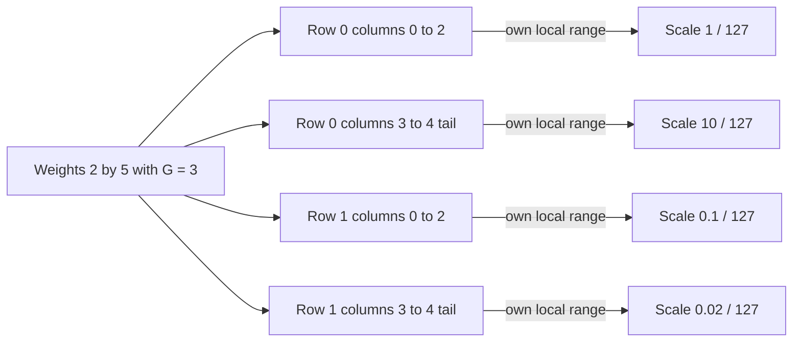

# Problem 030: Per-Channel and Groupwise Scales

## Why this exists

A transformer projection stores weights as `[out,in]`. One tensor-wide scale
lets the largest value in any row determine resolution for every row. Per-output
or smaller input groups preserve local ranges, but every extra scale consumes
bytes and must be indexed exactly like the quantized values.

This lesson defines groupwise symmetric INT8 weights. `groupSize == in` is one
scale per output channel; smaller values split each row along its input axis.
The final group may be shorter and still owns one scale.

## Learning outcomes

You can:

- map a row-major weight coordinate to scale metadata `[out,group]`;
- derive the ceiling group count and handle a short tail group;
- quantize all-zero groups without invalid scales;
- compare reconstruction metrics against one per-tensor scale;
- count payload and metadata bytes for different group sizes; and
- explain why lower error is not a free storage or kernel win.

## Prerequisites

- Problem 004 for the `[out,in]` GEMV orientation.
- Problem 029 for symmetric INT8 range, finite checks, rounding, and metrics.
- Problem 006 for traffic and arithmetic-intensity models.

## Vocabulary

- **Output channel**: one row of `[out,in]`, producing one GEMV output.
- **Per-channel scale**: one scale for an entire output row.
- **Groupwise scale**: one scale for a contiguous segment of a row.
- **Tail group**: the final segment when `in` is not divisible by group size.
- **Metadata shape**: the logical dimensions required to address scales.
- **Granularity**: how many values share one scale.

## Derivation and worked numbers

For weights $W\in\mathbb{R}^{O\times I}$ and group size $G$,

$$
K=\left\lceil\frac{I}{G}\right\rceil,
\qquad
g(c)=\left\lfloor\frac{c}{G}\right\rfloor,
$$

and scale metadata has shape `[O,K]`. Scale index for `(row,column)` is

$$\operatorname{scaleIndex}(r,c)=rK+g(c).$$

Each group independently applies Problem 029's $a/127$ rule and deterministic
rounding. Consider `O=2`, `I=5`, `G=3`:

```text
row 0: [-1.00, -0.50, 0.00 | 10.00, 5.00]
row 1: [ 0.10, -0.10, 0.05 | -0.02, 0.00]
```

There are $K=2$ groups per row. Scales in row-major metadata order are

```text
[1/127, 10/127, 0.1/127, 0.02/127]
```

and integer groups are approximately

```text
[-127, -64, 0 | 127, 64]
[ 127,-127,64 |-127,  0]
```

The two-value tails still own scales. With one tensor-wide scale `10/127`, the
small second row is represented by integers near `[-1,1]`; groupwise scales use
the available range and lower this fixture's RMSE.



## Shape, layout, and dtype contract

Input weights and both reconstructions are contiguous Float32 `[O,I]` in
row-major `[out,in]` orientation. Groupwise payload is `Int8[O*I]` in the same
order. Float32 scales are logically `[O,ceil(I/G)]` and physically flat
row-major. `G` must be positive; `O` and `I` may be zero.

Every scale must be finite and positive. Every payload value is in
`[-127,127]`. Rank, finite inputs, value count, scale count, and overflow are
validated before a format is accepted.

## CPU reference path

The canonical implementation first computes the Problem 029 per-tensor result.
It then walks output rows and groups. For each group it finds the maximum over
`start..<min(start+G,I)`, assigns scale `1` to an all-zero group, quantizes that
slice, and writes metadata at `row*K+group`. A separate pass reconstructs each
value using `column/G` and reports both error sets.

The starter allocates valid payload and metadata shapes and enforces rank,
group-size, and finite-value errors, but leaves integer values at zero.

## Independent correctness

The judge calculates expected scale values and reconstructs payloads without
calling the solution helper. It checks exact metadata count, the short tail,
shape, `26` total bytes for the worked fixture, independent metrics, and the
expected RMSE ordering for this controlled input. Error cases cover rank,
nonpositive group size, and NaN.

```sh
swift run inference-school check 030 --cpu
swift run inference-school check 030 --solution
```

## Performance model: bytes and arithmetic intensity

Payload and scale bytes are

$$
B_{\mathrm{values}}=OI,
\qquad
B_{\mathrm{scales}}=4O\left\lceil\frac{I}{G}\right\rceil,
\qquad
B_{\mathrm{total}}=B_{\mathrm{values}}+B_{\mathrm{scales}}.
$$

For the worked `2x5`, `G=3` fixture, values use `10` bytes and four scales use
`16`, totaling `26`. The tiny shape is metadata-heavy. For `I=4096,G=64`, scale
metadata adds `256` bytes per row to `4096` payload bytes.

During a fused GEMV, each weight contributes about two floating-point
operations. Ignoring input reuse and output writes, idealized intensity is
approximately

$$I_{\mathrm{Q8}}\approx\frac{2OI}{OI+4O\lceil I/G\rceil}.$$

Smaller groups improve local resolution but lower this intensity through more
scale traffic and indexing.

## Metal mapping

Problem 030 remains CPU-only because it establishes conversion and metadata,
not a GPU consumer. A standalone Metal round trip would materialize Float
weights. Problem 033 uses the analogous `[out,group]` metadata in a real fused
Q4 GEMV kernel.

## Implementation checkpoints

1. Derive `groupsPerOutputChannel` with ceiling division.
2. Quantize one full group and one tail by hand.
3. Store scales at `[row,group]`, not one global group stream detached from rows.
4. Make an all-zero tail store scale `1`.
5. Reconstruct using `row*K+column/G`.
6. Report per-tensor and groupwise errors from actual values.
7. Include every Float32 scale in allocated bytes.

## Controlled experiments

### Group-size sweep

Sweep `G = I, 256, 64, 16`. Prediction: metadata rises monotonically; error
usually falls but need not do so for every distribution.

### Row-range imbalance

Multiply one row by `100` without changing others. Prediction: per-tensor error
for untouched rows rises; per-channel error is mostly unchanged.

### Tail placement

Try `I=63,64,65` with `G=64`. Prediction: `I=65` adds a full four-byte scale for
one value, making metadata discontinuous at the group boundary.

## Engine integration

The `[out,in]` orientation and `[out,group]` scale address become the weight
contract for Q4 in 031. A checkpoint converter can choose a group size once,
serialize payload plus scales, and let 032/033 consume exactly those dimensions.

## Tradeoffs

- Per-tensor minimizes metadata but couples unrelated output ranges.
- Per-channel isolates rows while loading one scale for a long dot product.
- Small groups improve local fit but add scales and divisions/indexing.
- Float32 scales avoid another conversion convention at a nontrivial metadata cost.

## Hints

- Use ceiling division only after handling `I == 0`.
- Reset the maximum for every row and group.
- Derive tail `end` with `min`, not an assumption that `I % G == 0`.
- Compare errors from reconstructions; do not assert that one granularity always wins.

## Canonical solution

- [Validated groupwise format](../../Sources/InferenceSchoolCore/Problems/QuantizedWeightTypes.swift)
- [Judge and comparison contract](../../Sources/InferenceSchoolCore/Problems/P030GroupwiseInt8.swift)
- [Canonical CPU comparison](../../Sources/InferenceSchoolSolutions/P030GroupwiseInt8Solution.swift)
- [Focused tests](../../Tests/InferenceSchoolCoreTests/P030GroupwiseInt8Tests.swift)

## Completion checklist

- [ ] Weight orientation is explicitly `[out,in]`.
- [ ] Scale metadata is `[out,ceil(in/groupSize)]`.
- [ ] Tail and all-zero groups are handled.
- [ ] Per-tensor and groupwise reconstructions use actual payloads.
- [ ] Metrics come from an independent comparison pass.
- [ ] Byte totals include all Float32 scales.
- [ ] A granularity experiment has a written prediction.