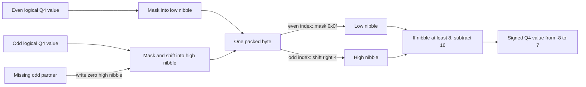

# Problem 031: Pack and Unpack INT4

## Why this exists

Swift and Metal expose byte-addressable buffers, not a portable signed four-bit
scalar array. A Q4 checkpoint therefore needs a byte contract shared by the
converter, loader, CPU oracle, and kernel. "Two values per byte" is incomplete:
nibble order, signed encoding, odd counts, row orientation, and scale alignment
must all agree.

This lesson defines one canonical format in `GroupwiseQ4WeightMatrix`. Problem
032 reads it into Float weights; Problem 033 sends the same packed bytes and
format code to MSL.

## Learning outcomes

You can:

- state the signed Q4 range `[-8,7]`;
- encode a negative nibble with four-bit two's-complement;
- pack the first logical value in the low nibble;
- define and validate zero padding for an odd value count;
- keep `[out,group]` scales aligned when a row ends mid-byte; and
- prove a representation with byte-exact fixtures rather than approximate floats.

## Prerequisites

- Problem 002 for flat row-major indexing.
- Problem 030 for `[out,in]` weights and `[out,group]` scales.
- Familiarity with hexadecimal notation and bit masks.

## Vocabulary

- **Nibble**: four bits, representing an unsigned pattern from `0x0` to `0xf`.
- **Two's-complement**: signed encoding where patterns `0x8...0xf` mean `-8...-1`.
- **Low nibble first**: even logical index uses bits `0...3` of its byte.
- **Padding nibble**: unused high four bits when the logical count is odd.
- **Logical index**: `row*inputChannels+column` before packing.
- **Format code**: the enum value checked by the loader and passed to Metal.

## Derivation and byte-exact example

Four-bit two's-complement represents

```text
decimal:  -8  -7 ... -1   0   1 ...  7
nibble:  0x8 0x9 ... 0xf 0x0 0x1 ... 0x7
```

For logical value index $i$, byte index is $\lfloor i/2\rfloor$. This format
uses

$$
\operatorname{byte}[i/2]=
\begin{cases}
q_i\ \&\ 0xf & i\text{ even}\\
\operatorname{byte}[i/2]\ |\ ((q_i\ \&\ 0xf)\ll4) & i\text{ odd}.
\end{cases}
$$

Pack `[-8,-7,-1,0,1,7,3]`:

```text
logical pair       nibble pair       stored byte
[-8, -7]           [0x8, 0x9]        0x98
[-1,  0]           [0xf, 0x0]        0x0f
[ 1,  7]           [0x1, 0x7]        0x71
[ 3, pad]          [0x3, 0x0]        0x03
```

The unused high nibble must be zero. A nonzero padding nibble is rejected so
two serialized forms cannot claim to represent the same logical matrix.

Unpacking selects low nibble for even $i$, high nibble for odd $i$, then sign
extends: if `nibble >= 8`, the value is `nibble - 16`.



## Shape, layout, dtype, and format contract

Logical weights are signed integers `[O,I]` in row-major `[out,in]` order.
Packing treats all $OI$ values as one continuous stream; it does not restart at
a row boundary. This matters when `I` is odd. Packed storage is
`UInt8[ceil(O*I/2)]`.

Scale metadata remains Float32 `[O,ceil(I/G)]`. It is indexed from logical row
and column, not from byte position. The only accepted `Q4WeightFormat` is
`signedTwosComplementLowNibbleFirst` with raw format code `0`.

The initializer validates dimensions, positive group size, exact packed byte
count, exact scale count, finite positive scales, and zero odd padding.

## CPU reference path

The canonical packer first validates logical count and every integer against
`[-8,7]`. It masks each `Int8` bit pattern with `0x0f`, writes even indices into
low nibbles, ORs odd indices into high nibbles, and constructs the validated
format. The shared format's `quantizedValue(row,column)` performs canonical
unpacking and sign extension.

The starter performs all dimension, range, scale, and byte-count validation but
returns zero bytes. It therefore fails exact fixtures without hiding the missing
bit manipulation behind shape errors.

## Independent correctness

The first judge fixture requires exactly `[0x98,0x0f,0x71,0x03]` and verifies the
round trip. The second uses shape `[2,3]`, so row 0 ends in the low nibble of a
byte and row 1 begins in its high nibble; expected bytes are
`[0x78,0xf1,0xe2]`. It also checks scale index `(row=1,column=2) == 3`.

Error fixtures reject integer `8`, missing scales, and nonzero odd padding. A
test implements high-nibble-first packing and confirms the shared judge fails it.

```sh
swift run inference-school check 031 --cpu
swift run inference-school check 031 --solution
```

## Performance model: bytes and arithmetic intensity

For $O\times I$ values and group size $G$,

$$
B_{\mathrm{Q4}}=\left\lceil\frac{OI}{2}\right\rceil
+4O\left\lceil\frac{I}{G}\right\rceil.
$$

The seven-value fixture uses four payload bytes and three Float32 scales, or
`16` total bytes. Padding occupies four unused bits but no additional byte beyond
the ceiling formula.

Packing performs masks, shifts, and stores but is an offline conversion step.
For inference, Q4 GEMV reads about half a payload byte per multiply plus
amortized scale metadata. The useful arithmetic intensity appears only when a
consumer dequantizes during accumulation, as in 033.

## Metal mapping

There is no separate Metal stage in 031. A GPU pack/unpack round trip would not
be an inference operator. The actual MSL unpack implementation is exercised in
033 against these exact bytes, including odd widths and group tails. Its format
code and indexing are bound from `GroupwiseQ4WeightMatrix`.

## Implementation checkpoints

1. Map every integer in `[-8,7]` to its nibble.
2. Reproduce `[-8,-7] -> 0x98`.
3. Reproduce the complete seven-value fixture.
4. Reject `-9` and `8`.
5. Reject nonzero odd padding.
6. Pack `[2,3]` without restarting at row boundaries.
7. Verify scale indexing is independent from byte indexing.

## Controlled experiments

### Nibble-order fault

Swap low-first to high-first while leaving all other data fixed. Prediction:
byte fixtures fail exactly and later GEMV differences are systematic; this is a
format mismatch, not inherent Q4 error.

### Odd-width matrix

Compare `I=64` and `I=65` for two rows. Prediction: the continuous stream saves
the redundant per-row padding nibble a row-aligned format would require, but
manual row-pointer arithmetic becomes less direct.

### Group-size byte model

Keep payload fixed and sweep group size. Prediction: packed bytes do not change;
only Float32 scale metadata changes at ceiling boundaries.

## Engine integration

A model converter calls the canonical packer, serialized metadata reconstructs
`GroupwiseQ4WeightMatrix`, and both CPU and Metal consumers receive that type.
No consumer accepts an ad hoc byte array without dimensions, group size, scales,
and format code. This is the interchange contract used by 032-034.

## Tradeoffs

- Continuous packing minimizes bytes; row-aligned packing can simplify row starts.
- Two's-complement permits `-8`; a symmetric `[-7,7]` quantizer may leave that endpoint uncommon.
- Zero padding gives one canonical encoding; unspecified padding can leak stale bits.
- Smaller groups improve fit but metadata can dominate tiny matrices.

## Hints

- Use `UInt8(bitPattern: value) & 0x0f` for the nibble.
- Do not shift the first value left.
- Compute byte index from the flat logical index, not `column/2` alone.
- Sign extension can be expressed as `nibble >= 8 ? nibble - 16 : nibble`.

## Canonical solution

- [Q4 format definition and loader validation](../../Sources/InferenceSchoolCore/Problems/QuantizedWeightTypes.swift)
- [Byte-exact judge](../../Sources/InferenceSchoolCore/Problems/P031PackQ4.swift)
- [Canonical converter](../../Sources/InferenceSchoolSolutions/P031PackQ4Solution.swift)
- [Exact-format tests](../../Tests/InferenceSchoolCoreTests/P031PackQ4Tests.swift)
- [MSL consumer introduced in 033](../../Sources/InferenceSchoolSolutions/Metal/P033FusedQ4GEMV.metal)

## Completion checklist

- [ ] Signed Q4 range is exactly `[-8,7]`.
- [ ] Encoding is four-bit two's-complement.
- [ ] Even logical indices occupy low nibbles.
- [ ] Odd-count padding is zero and validated.
- [ ] Packing remains continuous across odd-width rows.
- [ ] Scale metadata stays `[out,group]`.
- [ ] Exact bytes, not only reconstructed floats, pass the judge.