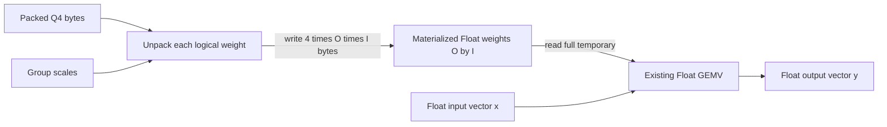

# Problem 032: Dequantize Then GEMV

## Why this exists

Before fusing quantized arithmetic, the engine needs a baseline whose behavior
is easy to inspect. The simplest correct Q4 projection reconstructs every
Float32 weight, materializes an `[out,in]` tensor, and passes that tensor to the
existing GEMV. It spends extra memory and traffic, but it separates format
errors from fused-kernel errors.

This is not presented as an optimization. Its full Float32 temporary is part of
the result contract and must be reported honestly.

## Learning outcomes

You can:

- validate Q4 dimensions, metadata, input rank, and GEMV inner width;
- reconstruct `[out,in]` weights from low-first packed nibbles and group scales;
- call a known Float32 GEMV as a staged correctness baseline;
- calculate the exact temporary allocation and its traffic cost;
- compare staged output against an independent direct Q4 oracle; and
- explain why a slow baseline remains useful after fusion exists.

## Prerequisites

- Problem 004 for Float32 GEMV and `[out,in]` orientation.
- Problem 030 for group-scale indexing.
- Problem 031 for canonical Q4 unpacking and padding.
- Problem 006 for separating algorithm bytes from runtime overhead.

## Vocabulary

- **Staged path**: one operator writes an intermediate consumed by another.
- **Materialization**: allocating and filling all logical Float32 weights.
- **Temporary bytes**: storage live for the operation but absent from the compact checkpoint.
- **Parity baseline**: a clear implementation used to localize errors in an optimized path.
- **Independent oracle**: expected output computed without calling the staged implementation.

## Derivation and worked projection

For packed Q4 weight $q_{r,c}$ and scale $s_{r,\lfloor c/G\rfloor}$,

$$
\hat{W}_{r,c}=q_{r,c}s_{r,\lfloor c/G\rfloor},
\qquad
y_r=\sum_{c=0}^{I-1}\hat{W}_{r,c}x_c.
$$

Use `O=2`, `I=5`, `G=3`, logical Q4 values

```text
row 0: [-8, -4,  0 |  3,  7]  scales [0.25, 0.50]
row 1: [ 1, -1,  2 | -2,  0]  scales [0.10, 0.20]
```

The packed bytes are `[0xc8,0x30,0x17,0x2f,0x0e]`. Continuous packing means
row 1 starts in the high nibble of byte 2. Materialization produces

```text
row 0: [-2.0, -1.0, 0.0,  1.5, 3.5]
row 1: [ 0.1, -0.1, 0.2, -0.4, 0.0]
```

For `x = [1,-2,0.5,1.5,-1]`:

$$
y_0=-2+2+0+2.25-3.5=-1.25,
$$

$$
y_1=0.1+0.2+0.1-0.6+0=-0.2.
$$



## Shape, layout, and dtype contract

Weights are a validated `GroupwiseQ4WeightMatrix` with logical shape `[O,I]`,
packed `UInt8[ceil(O*I/2)]`, Float32 scales `[O,ceil(I/G)]`, and canonical
format code. Input is contiguous Float32 `[I]`. Materialized weights are
contiguous Float32 `[O,I]`; output is Float32 `[O]`.

Input rank and width are checked before indexing. The Q4 initializer has already
validated byte count, padding, scale count, and scale finiteness. Non-finite
input values are rejected. The reported temporary is exactly `4*O*I` bytes.

## CPU reference path

1. Validate input rank, inner width, and finite values.
2. Allocate `O*I` Float32 elements.
3. For every logical `(row,column)`, unpack through the shared Q4 format.
4. Load scale at `row*groupsPerRow+column/groupSize`.
5. Write `Float(q)*scale` to the materialized tensor.
6. Call the canonical Problem 004 GEMV.
7. Return output, the materialized weights, and exact temporary bytes.

The starter validates everything and allocates the required shapes, but leaves
the materialized tensor and output at zero.

## Independent correctness

The judge independently unpacks every value and performs GEMV with `Double`
accumulation. It compares both the intermediate matrix and final output, then
requires exactly `40` temporary bytes for the `2x5` fixture. Rank-2 input and a
short vector must throw. A focused wrong implementation that returns correct
values but reports zero temporary bytes fails.

```sh
swift run inference-school check 032 --cpu
swift run inference-school check 032 --solution
```

## Performance model: bytes and arithmetic intensity

The compact persistent representation occupies

$$
B_Q=\left\lceil\frac{OI}{2}\right\rceil
+4O\left\lceil\frac{I}{G}\right\rceil.
$$

The staged operation additionally writes `4OI` materialized bytes, then GEMV
reads those `4OI` bytes. Ignoring cache effects and small output terms, traffic is

$$
B_{\mathrm{staged}}\approx B_Q+8OI+4I+4O.
$$

GEMV performs about `2OI` model FLOPs. Dequantization adds one multiply per
weight but does not increase the model's useful projection work. The extra
Float32 write/read lowers effective arithmetic intensity and can erase the
bandwidth benefit of compact storage.

## Metal mapping

There is no Metal stage for 032. A staged GPU implementation would need a Q4
dequantization dispatch, a full device Float32 buffer, and a second GEMV
dispatch. That path is valid in a production fallback but adds no new semantic
lesson here. Problem 033 implements the genuinely distinct fused device path.

## Implementation checkpoints

1. Decode the five-value first row from packed bytes.
2. Decode row 1 across the shared byte boundary.
3. Select scales from `[row,column/G]`.
4. Reproduce the worked Float matrix.
5. Reproduce `[-1.25,-0.2]` within tolerance.
6. Report `4*O*I`, not packed bytes, as temporary weight bytes.
7. Reject rank and width mismatches before allocation.

## Controlled experiments

### Width sweep

Measure fixed `O` while doubling `I`. Prediction: both materialization traffic
and GEMV traffic grow linearly, so staged cost becomes increasingly visible.

### Reuse sweep

Materialize once and run several vectors versus materialize for every vector.
Prediction: reuse can amortize conversion for batch/prefill, while single-token
decode receives little amortization.

### Format fault localization

Reverse nibble order and inspect the materialized matrix before GEMV.
Prediction: the first wrong weight identifies a converter/loader convention
issue without needing to reason backward from final output.

## Engine integration

This operation is the parity and fallback implementation for quantized linear
layers. A model loader can validate a Q4 checkpoint by comparing selected staged
projections with Float32 or fused paths. Problem 033 must match it while removing
the full-weight temporary.

## Tradeoffs

- Materialization is readable and debuggable but expensive per decode token.
- Reusing a materialized matrix can help batches but gives up compact working-set benefits.
- Calling existing GEMV reduces implementation risk while adding a dispatch boundary on GPU.
- Keeping the intermediate in reports aids diagnosis but should not become a production API requirement.

## Hints

- Iterate logical values; let the format type own nibble extraction.
- Do not derive scale index from byte index.
- Preserve `[out,in]`; a transpose can produce plausible but wrong output shapes.
- Count the Float32 temporary separately from persistent Q4 bytes.

## Canonical solution

- [Result contract and independent judge](../../Sources/InferenceSchoolCore/Problems/P032DequantizeThenGEMV.swift)
- [Canonical staged implementation](../../Sources/InferenceSchoolSolutions/P032DequantizeThenGEMVSolution.swift)
- [Shared Q4 format](../../Sources/InferenceSchoolCore/Problems/QuantizedWeightTypes.swift)
- [Focused tests](../../Tests/InferenceSchoolCoreTests/P032DequantizeThenGEMVTests.swift)

## Completion checklist

- [ ] Q4 metadata and input dimensions are validated.
- [ ] Materialized weights exactly match the format contract.
- [ ] Existing Float32 GEMV consumes `[out,in]` weights.
- [ ] Output matches the independent Double oracle.
- [ ] Full temporary bytes are reported as `4*O*I`.
- [ ] No GPU work is claimed for this CPU-only baseline.
- [ ] A staged-cost prediction was written before measurement.