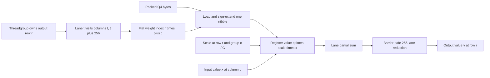

# Problem 033: Fused Q4 GEMV

## Why this exists

Single-token decoder projections are GEMV operations that stream large weight
matrices with little reuse. Q4 can reduce those weight bytes only if the
consumer reads packed values directly. Reconstructing a full Float32 matrix
first reintroduces the traffic Problem 032 measured.

This lesson implements a CPU fused reference and a real Metal kernel. Both read
the same `GroupwiseQ4WeightMatrix`, unpack each nibble, load its group scale, and
accumulate without allocating `Float[O,I]`.

## Learning outcomes

You can:

- fuse Q4 unpacking and group-scale dequantization into GEMV accumulation;
- prove that no full Float32 weight temporary is allocated;
- map one output row to a 256-thread Metal reduction;
- handle odd logical counts, tail groups, widths over 256, and zero rows;
- compare persistent logical bytes and end-to-end timing honestly; and
- distinguish a format mismatch from expected precision loss.

## Prerequisites

- Problem 001 for a barrier-safe Metal reduction.
- Problem 004 for row-wise GEMV.
- Problem 006 for roofline and benchmark boundaries.
- Problems 030-032 for group metadata, Q4 bytes, and the staged baseline.

## Vocabulary

- **Fused dequantization**: reconstructing a weight only in the register that consumes it.
- **Logical weight bytes**: packed payload plus required scale metadata.
- **Full-weight temporary**: an `O*I` Float32 allocation; required count here is zero.
- **Lane-strided loop**: lane `t` handles columns `t, t+256, ...`.
- **End-to-end Metal timing**: host buffer creation, copies, submission, execution, wait, and readback.

## Derivation and worked projection

The fused equation substitutes Q4 reconstruction directly into GEMV:

$$
y_r=\sum_{c=0}^{I-1}
q_{r,c}s_{r,\lfloor c/G\rfloor}x_c.
$$

No mathematical output changes from 032. With bytes
`[0xc8,0x30,0x17,0x2f,0x0e]`, scales
`[0.25,0.5,0.1,0.2]`, and input `[1,-2,0.5,1.5,-1]`, the fused loop still
produces `[-1.25,-0.2]`. The difference is lifetime: each Float weight exists
only while its multiply-add is evaluated.

Quantization itself uses Problem 029's nearest-with-ties-away rule. The Metal
kernel does not quantize or round weights; it decodes exact stored nibbles and
multiplies by the serialized Float32 scale. Swift and MSL therefore agree at the
format boundary rather than depending on two runtime rounding functions.



## Shape, layout, dtype, and format contract

Logical weights are `[O,I]` row-major. Packed bytes are a continuous
`UInt8[ceil(O*I/2)]` low-nibble-first two's-complement stream. Scales are
Float32 `[O,ceil(I/G)]`. Input is Float32 `[I]`; output is Float32 `[O]`.

CPU and Metal accumulation are Float32. The independent judge accumulates in
Double and allows reduction-order tolerance. Format code `0` means
`signedTwosComplementLowNibbleFirst`; the host passes that enum raw value to
MSL. Input rank, width, finite values, and UInt32-sized dispatch dimensions are
validated before encoding.

## CPU fused reference

For each output row, the CPU implementation initializes one Float32 sum. It
walks columns, asks the shared format for the signed nibble, loads scale
`row*K+column/G`, multiplies `Float(q)*scale*input[column]`, and accumulates. It
returns compact logical bytes and `temporaryWeightBytes = 0`.

This reference is separate from 032: it never calls the Q4 materializer and its
API does not return Float weights.

## Independent correctness

The judge directly decodes nibbles and accumulates expected outputs in Double.
Fixtures include `I=5,G=3`, a `3x259` matrix with `G=257`, and zero output rows.
The 259-column case crosses one 256-lane stride and has a two-value tail group.
Rank and width errors must throw.

Every successful result must report exactly `packedValueBytes + scaleBytes` and
zero full-weight temporary bytes. A wrong path that calls 032 can match output
but fails the allocation invariant. Metal runs the identical judge after actual
runtime MSL compilation and dispatch.

```sh
swift run inference-school check 033 --cpu
swift run inference-school check 033 --metal
swift run inference-school check 033 --solution
```

## Bytes and arithmetic intensity

Persistent logical weight bytes are

$$
B_Q=\left\lceil\frac{OI}{2}\right\rceil
+4O\left\lceil\frac{I}{G}\right\rceil.
$$

An ideal fused call additionally reads about `4I` input bytes and writes `4O`
output bytes:

$$
B_{\mathrm{fused}}\approx B_Q+4I+4O.
$$

Using the conventional `2OI` GEMV FLOP count,

$$
\mathcal{I}_{\mathrm{fused}}
=\frac{2OI}{B_Q+4I+4O}.
$$

Nibble extraction, integer conversion, and scaling add instructions but do not
change the model's useful FLOP count. Compared with 032, the fused path removes
approximately `8OI` Float32 intermediate write/read bytes and one allocation.

## Metal grid, unpacking, and reduction

The grid has `O` threadgroups. Each group has exactly 256 threads and owns one
output row. Lane `t` processes columns `t, t+256, ...`, so all groups have the
same barrier behavior even when `I < 256` or `I` is not divisible by 256.

For logical index `row*I+column`, MSL loads byte `index/2`, selects low nibble
when `index` is even and high nibble otherwise, then computes
`nibble >= 8 ? nibble - 16 : nibble`. Scale index is
`row*ceil(I/G)+column/G`. Each lane stores a partial in threadgroup memory; a
binary reduction reaches a barrier at every stride. Lane zero writes one Float.

Only four device buffers are bound: packed Q4 bytes, Float32 scales, Float32
input, and Float32 output. There is no host dequantization and no device Float
weight buffer. The host-side CPU oracle is independent validation, not data fed
to the kernel.

See [P033FusedQ4GEMV.metal](../../Sources/InferenceSchoolSolutions/Metal/P033FusedQ4GEMV.metal).

## Benchmark contract

Run:

```sh
swift run -c release inference-school benchmark 033 \
  --out 1024 --in 1024 --group-size 64 --iterations 20
```

Weights are quantized once before timing. The report prints Float32 logical
bytes, packed bytes, scale bytes, total Q4 bytes, and the staged temporary. CPU
staged and CPU fused measurements include their function work. "Metal
end-to-end" includes shared-buffer allocation, host copies, command submission,
synchronization, and readback. It is not labeled kernel-only.

The current pipeline reallocates buffers each call. That makes it a truthful
course baseline, not a production persistent-buffer benchmark.

## Implementation checkpoints

1. Match 032 on the `2x5` hand fixture without materialization.
2. Report exact packed and scale bytes.
3. Keep full-weight temporary bytes at zero.
4. Unpack an odd logical index correctly in Swift and MSL.
5. Cross 256 columns with all lanes reaching every barrier.
6. Select a short tail group's scale.
7. Pass the real Metal judge and benchmark smoke command.

## Controlled experiments

### Width sweep

Sweep `I=64,255,256,257,1024`. Prediction: tiny widths underutilize the fixed
group; 257 adds a second lane iteration for one column while preserving output.

### Group-size sweep

Hold packed values fixed and vary `G`. Prediction: smaller groups add scale
traffic and may improve reconstruction; timing and accuracy must both be measured.

### Staged versus fused

Predict before running whether saved `8OI` temporary traffic exceeds unpack and
scale overhead on the current machine. Record release timings and the explicit
end-to-end boundary.

### Nibble-order injection

Reverse nibble selection in one implementation. Prediction: byte-level and
output errors become structured immediately. Verify the convention before using
the phrase "quantization noise."

## Engine integration

The kernel is the one-token decode projection path for compact attention and
MLP weights. A loader validates `GroupwiseQ4WeightMatrix` once, retains packed
buffers, and dispatches fused projections for Q/K/V and feed-forward rows.
Problem 034 then checks how representation errors propagate across operators.

## Tradeoffs

- Smaller Q4 traffic competes with unpack, conversion, and scale-load instructions.
- One threadgroup per row is readable; SIMD-group or vectorized kernels may map hardware better.
- Float32 accumulation protects reduction precision but costs registers and bandwidth relative to narrower accumulation.
- Persistent buffers are required for production latency; per-call allocation keeps this baseline inspectable.

## Hints

- Derive nibble selection from the flat logical index, not column parity.
- Do not return early for lanes beyond `I`; they still participate in barriers.
- Compute groups per row with ceiling division.
- Keep quantization outside benchmark timing unless dynamic quantization is the experiment.

## Canonical solution

- [Fused result contract and judge](../../Sources/InferenceSchoolCore/Problems/P033FusedQ4GEMV.swift)
- [CPU fused implementation and converter](../../Sources/InferenceSchoolSolutions/P033FusedQ4GEMVSolution.swift)
- [Metal host pipeline](../../Sources/InferenceSchoolCore/Metal/MetalFusedQ4GEMVPipeline.swift)
- [Canonical MSL kernel](../../Sources/InferenceSchoolSolutions/Metal/P033FusedQ4GEMV.metal)
- [CPU tests](../../Tests/InferenceSchoolCoreTests/P033FusedQ4GEMVTests.swift)
- [Metal runtime tests](../../Tests/InferenceSchoolCoreTests/P033FusedQ4GEMVMetalTests.swift)

## Completion checklist

- [ ] CPU and MSL consume the same validated Q4 format.
- [ ] Output matches the independent Double oracle.
- [ ] Odd counts, tail groups, and widths over 256 pass.
- [ ] No full Float32 weight temporary is allocated or reported.
- [ ] Actual MSL compiles and dispatches in the Metal check.
- [ ] Benchmark output separates bytes and labels end-to-end timing.
- [ ] A performance prediction precedes release measurement.