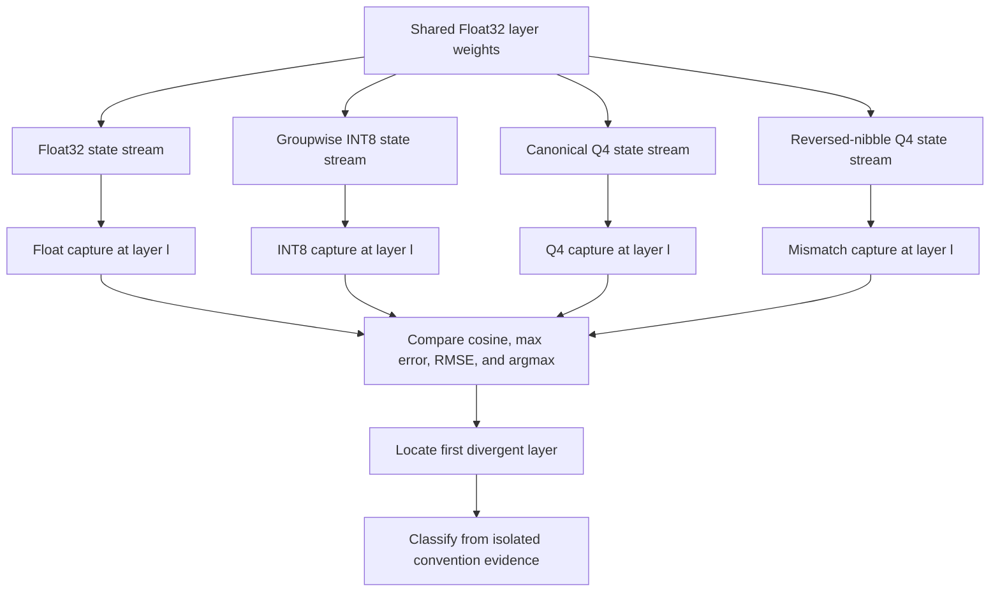

# Problem 034: Quantization Error Propagation

## Why this exists

A final-token difference does not identify its cause. Weight approximation can
accumulate across layers, but wrong nibble order, scale association, matrix
orientation, or normalization convention can create much larger systematic
differences. Calling every discrepancy "quantization noise" hides conversion
bugs behind a precision label.

This CPU investigation runs the same deterministic operator pipeline with
Float32, groupwise INT8, groupwise Q4, and one deliberately mismatched Q4
decoder. It captures every layer before classifying evidence.

## Learning outcomes

You can:

- capture corresponding intermediate outputs across four execution variants;
- calculate cosine similarity, maximum absolute error, RMSE, and argmax agreement;
- locate the first layer whose argmax diverges;
- inject one known format fault while holding topology and scales fixed;
- classify a controlled convention mismatch from structural evidence rather than one threshold; and
- describe what evidence remains before making a model-quality claim.

## Prerequisites

- Problem 010 for normalization-convention discipline.
- Problem 011 for precision-boundary experiments.
- Problems 029-031 for INT8/Q4 conversion and byte conventions.
- Problems 032-033 for staged and fused projection parity.

## Vocabulary

- **Layer capture**: the complete output vector recorded at an operator boundary.
- **Cosine similarity**: directional agreement normalized by vector magnitudes.
- **Argmax agreement**: whether two vectors select the same maximum index.
- **First divergent layer**: earliest captured layer with argmax disagreement.
- **Controlled intervention**: changing one known convention while holding other variables fixed.
- **Convention mismatch**: producer and consumer interpret the same bytes or parameters differently.
- **Inconclusive**: evidence does not isolate a cause.

## Pipeline and worked metric example

The deterministic investigation uses width-five states and three square weight
matrices. Each layer computes

$$
h^{(l+1)}=\tanh\left(W^{(l)}h^{(l)}\right).
$$

Four states advance independently:

1. Float32 weights.
2. Groupwise INT8 weights with the requested group size.
3. Canonical low-nibble-first groupwise Q4 weights.
4. The same Q4 bytes and scales decoded high-nibble-first.

Suppose one Float capture is `a=[1,2]` and a candidate is `b=[1,1]`.

$$
\cos(a,b)=\frac{a\cdot b}{\|a\|_2\|b\|_2}
=\frac{3}{\sqrt{5}\sqrt{2}}\approx0.9487,
$$

$$
E_{\max}=1,
\qquad
E_{\mathrm{RMSE}}=\sqrt{(0^2+1^2)/2}\approx0.7071.
$$

Both vectors have argmax index `1`, so argmax agreement is true despite
nonzero error. No single metric tells the whole story.

## Shape, layout, and dtype contract

Initial state is finite contiguous Float32 `[D]`. Every layer weight is finite
contiguous Float32 `[D,D]` in `[out,in]` orientation. Group size is positive.
The request initializer rejects rank, shape, finite-value, and group errors.

All four state streams and captures are Float32 `[D]`. Weight quantization uses
Problem 029's deterministic rounding. Metric reductions use Double and are
stored as Float. Layer indices are zero-based. First divergence is derived from
argmax disagreement and may be `nil`; absence of argmax divergence does not mean
the vectors are identical.

## CPU investigation path

For each layer, the canonical implementation quantizes the Float weights to
groupwise INT8 and Q4. It computes four GEMVs from the four incoming states,
applies `tanh`, stores all output tensors, then calculates three metric sets
against the Float capture. It does not reset quantized states to the Float state,
so earlier differences can propagate.

For the mismatch stream, only nibble selection changes. Packed bytes, scales,
group size, matrix orientation, input state topology, activation, and
accumulation dtype remain fixed. The report counts decoded logical values that
change under this intervention.



## Independent correctness

The judge owns a separate three-layer fixture and oracle. It independently
quantizes weights, reconstructs INT8/Q4 values, runs Double-accumulated GEMV,
applies `tanh`, calculates all metrics, and derives divergence indices. It
compares every captured vector rather than accepting only summary numbers.

A test returns correct numerical captures but labels the known intervention
`inconclusive`; the judge rejects it. This prevents a hardcoded metric threshold
from replacing the causal evidence in the controlled experiment.

```sh
swift run inference-school check 034 --cpu
swift run inference-school check 034 --solution
```

## Convention-mismatch diagnostic

Canonical Q4 stores even logical values in low nibbles. The deliberate fault
reads even values from high nibbles and odd values from low nibbles. For an odd
logical count, the last value reads the required zero padding nibble.

Classification is `conventionMismatch` because two pieces of structural
evidence are available:

- the intervention is known and isolated to nibble order; and
- at least one decoded integer changed.

RMSE, cosine, and argmax results show consequences, but no fixed threshold makes
the classification. If the intervention changed no decoded value, the report
would be `inconclusive` regardless of a chosen numerical cutoff.

In a real conversion investigation, replace the deliberate intervention with
verified producer/consumer evidence: inspect upstream format code, capture
pre-normalization states, and compare layer by layer before blaming precision.

## Bytes and arithmetic-intensity model

For $L$ square layers of width $D$, persistent Float32 weights use

$$B_{32}=4LD^2.$$

Groupwise INT8 and Q4 use

$$
B_8=LD^2+4LD\left\lceil\frac{D}{G}\right\rceil,
$$

$$
B_4=L\left\lceil\frac{D^2}{2}\right\rceil
+4LD\left\lceil\frac{D}{G}\right\rceil.
$$

The investigation executes all variants and stores layer captures, so it is not
a performance benchmark. Each variant still performs about `2LD^2` useful GEMV
FLOPs. Capture bytes are evidence overhead accepted for diagnosis and should not
be confused with production inference traffic.

## Metal mapping

Problem 034 is CPU-only because its purpose is synchronized capture and causal
comparison, not a new kernel. Problem 033 already validates actual MSL Q4
unpacking. A production investigation can instrument both CPU and Metal at the
same named boundaries, but adding an uninstrumented GPU path here would make
the evidence harder to inspect.

## Implementation checkpoints

1. Run one Float layer and record its complete output.
2. Quantize the same weights to INT8 and Q4 with identical grouping.
3. Carry each variant's own state into the next layer.
4. Calculate all four requested metrics from captures.
5. Derive first argmax divergence without inventing a tolerance.
6. Reverse only nibble order and count changed decodes.
7. Classify from intervention evidence, then inspect numerical consequences.

## Controlled experiments

### Depth sweep

Repeat a deterministic layer family for increasing depth. Prediction: RMSE can
grow, shrink, or saturate through `tanh`; it is not guaranteed to increase
monotonically.

### Group-size sweep

Compare `G=D`, `G=64`, and smaller groups. Prediction: metadata rises and local
weight error often falls, but argmax can remain unchanged even when RMSE moves.

### Convention intervention

Inject nibble order, scale-row association, transpose, or RMSNorm gamma
convention one at a time. Prediction: the first affected capture and directional
error pattern localize the boundary better than final output alone.

### Near-tie logits

Construct a final vector with two nearly equal maxima. Prediction: argmax can
flip while cosine remains high; report both facts without declaring the entire
representation invalid from one sample.

## Engine integration

Use this report when qualifying converted checkpoints or new quantized kernels.
Capture residual or projection states at stable layer boundaries, compare them
with a trusted path, and route the first divergence to format, normalization,
layout, or arithmetic checks. Only after conventions agree should aggregate
precision metrics inform model-quality and deployment decisions.

## Tradeoffs

- Full captures localize faults but consume memory and synchronization time.
- Cosine is scale-insensitive; maximum error is outlier-sensitive; RMSE summarizes energy; argmax reflects one decision.
- Deterministic fixtures are reproducible but do not replace representative model evaluation.
- A controlled mismatch proves diagnostic machinery, not that every large error is a convention bug.

## Hints

- Keep variant states separate after layer zero.
- Define one stable tie behavior for argmax by using the first maximum index.
- Handle zero-norm cosine explicitly.
- Do not infer the cause from a metric threshold when intermediate evidence is available.
- Verify format, scale, orientation, normalization, and downcast boundaries in that order.

## Canonical solution

- [Report types and independent judge](../../Sources/InferenceSchoolCore/Problems/P034QuantizationPropagation.swift)
- [Canonical investigation](../../Sources/InferenceSchoolSolutions/P034QuantizationPropagationSolution.swift)
- [Shared quantized formats](../../Sources/InferenceSchoolCore/Problems/QuantizedWeightTypes.swift)
- [Diagnostic tests](../../Tests/InferenceSchoolCoreTests/P034QuantizationPropagationTests.swift)

## Completion checklist

- [ ] Float32, INT8, Q4, and mismatched states are captured per layer.
- [ ] Cosine, maximum absolute error, RMSE, and argmax agreement are all reported.
- [ ] First divergent layer is derived from captures.
- [ ] The deliberate mismatch changes only nibble interpretation.
- [ ] Classification uses controlled structural evidence, not one threshold.
- [ ] No arbitrary output difference is named quantization noise.
- [ ] An experiment records predictions and retains intermediate evidence.