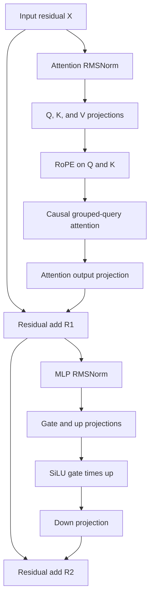

# Problem 035: One Decoder Transformer Block

## Why this exists

A decoder layer is not a bag of operators. Its order is part of the checkpoint
contract. Normalizing the wrong residual, adding a branch too early, omitting
RoPE, or mapping a query head to the wrong KV head can produce finite,
plausible-looking output while implementing a different model.

This lesson assembles the earlier operators into one readable pre-norm block.
It deliberately captures every semantic boundary. Problem 039 will choose
prefill dispatches for this block, Problem 040 will replace full-sequence
attention with cache-aware one-token attention, and Problem 043 will decide
which intermediate tensors evidence justifies fusing.

## Learning outcomes

You can:

- state and implement the exact order of a pre-norm decoder block;
- derive every Q/K/V, head, attention, and MLP shape from one configuration;
- distinguish P014's `[input,output]` teaching matrix from this checkpoint-facing
  `[output,input]` convention;
- apply adjacent-pair RoPE at an explicit absolute position offset;
- map `Hq` query heads onto `Hkv` shared KV heads;
- identify both residual sources and both normalization inputs; and
- use captured intermediates to localize an order or convention defect.

## Prerequisites

- Problems 002, 004, and 005 for contiguous tensors and dense projections.
- Problems 008 and 010 for direct-gamma SwiGLU and RMSNorm.
- Problems 014-018 for head shapes, RoPE, causal attention, and GQA.
- Problems 022-028 for the cache contracts that Problem 040 will connect.
- Problems 029-034 for checkpoint-oriented `[out,in]` weight storage and
  convention diagnosis.

## Vocabulary

- **Residual stream**: the shared `[S,D]` state updated by attention and MLP branches.
- **Pre-norm**: normalize a residual before computing its branch.
- **Attention branch**: Q/K/V projection, RoPE, causal GQA, head concatenation,
  and output projection.
- **MLP branch**: gate/up projection, SiLU gate, elementwise product, and down projection.
- **Position offset**: absolute position of sequence row zero.
- **Capture**: a named intermediate retained so correctness can be checked before
  the final residual hides the first divergence.

## Math and exact order

Let `X` be the incoming residual `[S,D]`. RMSNorm uses the direct gamma
convention from Problem 010:

$$
N(x)_j = \frac{x_j}{\sqrt{D^{-1}\sum_i x_i^2+\epsilon}}\gamma_j.
$$

The attention branch is

$$
A_0=N_{attn}(X),
\quad Q=A_0W_Q^T,
\quad K=A_0W_K^T,
\quad V=A_0W_V^T,
$$

$$
(\widetilde Q,\widetilde K)=\operatorname{RoPE}(Q,K,p_0),
$$

$$
C=\operatorname{CausalGQA}(\widetilde Q,\widetilde K,V),
\quad R_1=X+CW_O^T.
$$

For query row `i`, query head `h`, and visible key row `j <= i`,

$$
s_{i,h,j}=\frac{\widetilde q_{i,h}\cdot
\widetilde k_{j,\lfloor h/(H_q/H_{kv})\rfloor}}{\sqrt{d_h}}.
$$

Softmax is applied only over visible keys. The MLP branch is

$$
M_0=N_{mlp}(R_1),
\quad G=M_0W_G^T,
\quad U=M_0W_U^T,
$$

$$
Z=\operatorname{SiLU}(G)\odot U,
\quad R_2=R_1+ZW_D^T.
$$

`R2` is the block output. Neither norm is applied after its residual add.

### Worked values

For one row `x=[3,4]`, `gamma=[1,1]`, and negligible positive epsilon,

$$
\operatorname{rms}(x)=\sqrt{(9+16)/2}=\sqrt{12.5}\approx3.5355,
$$

so the normalized row is approximately `[0.8485, 1.1314]`. With one token,
causal attention has one visible key, so its softmax weight is exactly `1` and
the head output equals `V[0]`. The output projection is still required: a
one-token sequence simplifies the mask, not the learned projection or either
residual add.

## Shape, layout, and dtype contract

Batch size is exactly one and is omitted from shapes. Sequence length `S >= 1`.
All tensors are contiguous row-major Float32 and all projection accumulations in
the learner path are Float32.

| Value | Shape | Stored order |
| --- | --- | --- |
| residual | `[S,D]` | token, model feature |
| attention/MLP gamma | `[D]` | model feature |
| `Wq` | `[Hq*dh,D] = [D,D]` | output, input |
| `Wk`, `Wv` | `[Hkv*dh,D]` | output, input |
| Q | `[S,Hq,dh]` | token, head, feature |
| K, V | `[S,Hkv,dh]` | token, KV head, feature |
| attention heads | `[S,Hq,dh]` | token, query head, feature |
| concatenated heads | `[S,D]` | query heads contiguous within token |
| `Wo` | `[D,Hq*dh]` | output, concatenated input |
| `Wgate`, `Wup` | `[F,D]` | MLP output, model input |
| gate/up/hidden | `[S,F]` | token, MLP feature |
| `Wdown` | `[D,F]` | model output, MLP input |

The configuration requires `D = Hq*dh`, `Hq % Hkv == 0`, positive dimensions,
positive even `rotaryDimension <= dh`, finite positive epsilon, and finite
`ropeBase > 1`. The state validates rank, width, finite input, nonnegative
position offset, and position arithmetic overflow. Every weight shape and every
weight value is checked before computation.

This lesson intentionally differs from P014's `[D,projection]` matrix because
the model-loader and quantized GEMV boundary use `[out,in]`. Orientation is never
inferred from equal dimensions.

## CPU reference path

Implement these checkpoints in order:

1. RMS-normalize each incoming residual row with `attentionNormGamma`.
2. Project Q, K, and V with `[out,in]` row dot products.
3. Reinterpret contiguous projection outputs as head tensors.
4. Rotate Q and K adjacent feature pairs at `positionOffset + token`.
5. Compute scaled causal GQA with `kvHead = queryHead / (Hq/Hkv)`.
6. Concatenate heads without changing their token-local order.
7. Apply `Wo`, then add the original incoming residual to form `R1`.
8. RMS-normalize `R1` with `mlpNormGamma`.
9. Project gate and up, compute `SiLU(gate) * up`, and project down.
10. Add the down projection to `R1` to form `R2`.



The canonical implementation favors named tensors and loops over reuse. The
result retains normalized states, projected and rotated Q/K, V, attention heads,
both residual boundaries, all MLP projections, the activated gate, and the
gated hidden state.

## Independent correctness

The judge owns non-symmetric deterministic weights and a separate Double
oracle. It compares all captured stages with absolute tolerance `4e-5` plus
relative tolerance `8e-5`. One fixture uses GQA and a nonzero position offset;
another uses three causal rows.

Tests deliberately replace rotated captures with unrotated Q/K and replace the
MLP norm input with the first norm. Both are rejected even if other output is
copied from the canonical result. Error cases cover empty sequences, residual
width, negative offsets, wrong weight shapes, non-finite state, invalid head
division, and invalid rotary dimensions.

```sh
swift run inference-school check 035 --cpu
swift run inference-school check 035 --solution
```

## Performance model: work, bytes, and allocation

Ignoring lower-order elementwise work, projections cost approximately

$$
4SD^2 + 4SD(H_{kv}d_h) + 6SDF
$$

FLOPs: Q and output are two `D x D` projections, K/V are two
`Hkv*dh x D` projections, and gate/up/down are three MLP projections. Full
causal attention adds approximately

$$
2H_qd_hS(S+1)
$$

FLOPs for query-key dots and weighted values.

Float32 weight bytes are

$$
4\left(2D + 2D^2 + 2D(H_{kv}d_h) + 3DF\right).
$$

The teaching implementation materializes every capture, so its transient bytes
are intentionally much larger than a production layer. Record those allocations
as diagnostic cost, not an engine memory target.

## Metal mapping

Problem 035 is CPU-only. It establishes semantics and testable order; it does
not pretend that invoking the CPU implementation is a Metal path. Earlier
lessons already provide Metal kernels for RMSNorm, RoPE, attention, and selected
projections. A literal GPU composition would dispatch each stage and write each
capture to device memory. That is useful for parity but not automatically fast.

Problem 039 will choose GEMM-oriented prefill dispatches, Problem 040 will use
cached single-token attention and GEMV-oriented decode, and Problem 043 will use
profiles to decide which norm/projection/gate boundaries merit fusion. Any
future Metal path must preserve the same captures in a diagnostic mode.

## Implementation checkpoints

1. Make configuration and weight validation pass before arithmetic.
2. Match the first RMSNorm capture.
3. Match Q/K/V values and head shapes before RoPE.
4. Match rotated Q/K at offset zero and a nonzero offset.
5. Match one-token attention, then multi-token causal GQA.
6. Match `R1` and verify it adds the original `X`.
7. Match MLP norm, gate, up, SiLU, product, and down captures.
8. Match `R2` and all error cases.

## Controlled experiments

### Position-offset intervention

Run identical rows at offsets `0` and `32`. Prediction: V is unchanged, Q/K
before RoPE are unchanged, rotated Q/K change, and attention may change.

### GQA head-count sweep

Hold `Hq` and `dh` fixed while comparing `Hkv=Hq`, `Hq/2`, and `1` with
compatible weights. Prediction: K/V projection and future cache bytes decrease;
query and output projection work do not.

### Sequence-length sweep

Compare `S=1, 8, 64`. Prediction: projection work grows linearly, while this
full causal attention path approaches quadratic work. Do not use this result to
claim decode is quadratic after Problem 040 introduces caching.

### Capture removal

Measure peak allocations with all captures and with selected captures disabled
in a private experiment. Prediction: elapsed time and memory improve, but fault
localization becomes coarser. Keep the canonical diagnostic path intact.

## Engine integration

`DecoderConfiguration`, `DecoderBlockWeights`, `DecoderBlockState`, and
`DecoderBlockResult` are the shared API for Problems 036 and 039-047. Problem
036 loads the configuration and exact named weights. Problem 039 feeds a prompt
sequence and uses the returned residual. Problem 040 will adapt the attention
stage to append/read KV state while reusing the same projection, norm, MLP, and
sampling boundaries.

## Tradeoffs

- `[out,in]` aligns GEMV and checkpoint storage; some GEMM libraries prefer a
  transposed view or packed representation.
- Full captures are excellent for parity and expensive for production.
- Shared KV heads reduce projection/cache cost but are fixed by checkpoint architecture.
- Float32 accumulation is readable and deterministic enough for this oracle;
  production mixed precision needs new parity evidence.
- Separate kernels maximize inspectability; fusion can remove traffic only at
  the cost of a larger correctness surface.

## Hints

- Write every expected weight shape beside its validation.
- Preserve projected output order when reshaping; a reshape is not a transpose.
- Apply RoPE to Q and K, never V.
- Mask before softmax by omitting future keys.
- Save `X` for the first residual and `R1` for the second.
- Direct gamma means multiply by `gamma`, not `1 + gamma`.

## Canonical solution

- [Configuration, weights, captures, contract, and independent judge](../../Sources/InferenceSchoolCore/Problems/P035DecoderBlock.swift)
- [Learner starter](../../Sources/InferenceSchoolExercises/P035DecoderBlockExercise.swift)
- [Canonical CPU block](../../Sources/InferenceSchoolSolutions/P035DecoderBlockSolution.swift)
- [Order and configuration tests](../../Tests/InferenceSchoolCoreTests/P035DecoderBlockTests.swift)

## Completion checklist

- [ ] Every configuration, state, and weight error is rejected before computation.
- [ ] All 16 intermediate captures match the independent oracle.
- [ ] Nonzero-offset RoPE changes Q/K at the documented boundary.
- [ ] Causal GQA uses the documented query-to-KV head mapping.
- [ ] The first residual adds `X`; the second adds `R1`.
- [ ] Weight orientation and direct-gamma semantics are explicit.
- [ ] Experiment predictions are recorded before measurements.
- [ ] No CPU result is presented as a Metal implementation.