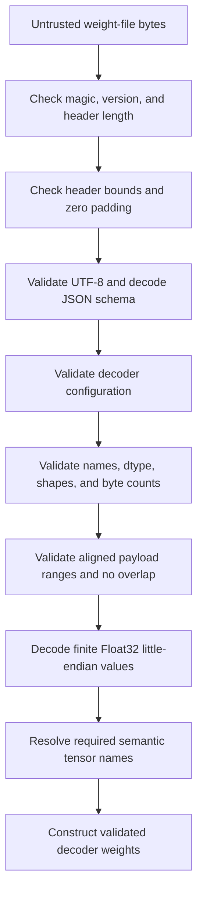

# Problem 036: Parse a Model Weight Format

## Why this exists

A weight file controls allocation sizes, tensor shapes, byte ranges, model
configuration, and every numerical value passed to the decoder. Treating its
metadata as trusted can turn one corrupt length or offset into an out-of-bounds
read, overlapping tensors, a silent transpose, or a model built with incompatible
head counts.

This lesson defines `InferenceWeight`, a small educational container used by later
mini-model fixtures. It resembles the broad idea of a metadata header followed
by raw tensor bytes, but it is not SafeTensors, GGUF, or compatible with either.
The narrow format makes every trust decision visible.

## Learning outcomes

You can:

- decode fixed-width integers explicitly as little-endian bytes;
- validate a length-delimited UTF-8 JSON header before parsing its schema;
- derive a tensor byte count from dtype and shape with checked arithmetic;
- reject duplicate names, unaligned or overlapping ranges, and payload escapes;
- decode Float32 without unsafe or unaligned typed loads;
- require named tensors before constructing a decoder block; and
- separate a convenient fixture encoder from an adversarial parser.

## Prerequisites

- Problem 002 for shape products, contiguous storage, and overflow checks.
- Problems 029-031 for the rule that producer and consumer byte conventions must agree.
- Problem 035 for the configuration and nine block-weight shapes loaded here.
- Basic UTF-8, JSON objects/arrays, and fixed-width integer notation.

## Vocabulary

- **Preamble**: fixed 20-byte prefix containing magic, version, and header length.
- **Magic**: eight identifying bytes, ASCII `LLMWGT01`.
- **Descriptor**: JSON record naming one tensor and declaring dtype, shape,
  payload-relative offset, and byte count.
- **Payload**: raw tensor bytes after the aligned header.
- **Relative offset**: byte position measured from payload start, not file start.
- **Alignment**: requirement that each Float32 tensor offset is divisible by four.
- **Overlap**: two nonempty descriptor ranges claim at least one common payload byte.
- **Trust boundary**: the point at which external bytes become typed engine data.

## Math and binary contract with worked bytes

The file layout is:

| File bytes | Field | Encoding |
| --- | --- | --- |
| `0..<8` | magic | ASCII `LLMWGT01` |
| `8..<12` | version | UInt32 little-endian, currently `1` |
| `12..<20` | JSON header length `H` | UInt64 little-endian |
| `20..<(20+H)` | header | exactly `H` UTF-8 JSON bytes |
| through next multiple of 8 | padding | zero bytes only |
| remaining bytes | payload | descriptor offsets are relative to this byte |

For version `1`, bytes `01 00 00 00` decode to UInt32 `1`. Float32 `1.0`
has bits `0x3f800000`, so its payload bytes are `00 00 80 3f`. Float32 `-2.5`
has bits `0xc0200000`, so its bytes are `00 00 20 c0`. Reading these four-byte
groups as native pointers would make alignment and host byte order implicit;
the canonical parser shifts bytes into a UInt32 and then uses `Float(bitPattern:)`.

## JSON metadata contract

The header has one model object and an array of tensor descriptors:

```json
{
  "model": {
    "modelDimension": 4,
    "hiddenDimension": 6,
    "queryHeadCount": 2,
    "keyValueHeadCount": 1,
    "headDimension": 2,
    "rotaryDimension": 2,
    "rmsNormEpsilon": 0.00001,
    "ropeBase": 100
  },
  "tensors": [
    {
      "name": "block.attention_norm.weight",
      "dtype": "f32-le",
      "shape": [4],
      "offset": 0,
      "byteCount": 16
    }
  ]
}
```

Only dtype string `f32-le` is supported. Shape dimensions are nonnegative and
their product is checked against `Int.max`. Scalars use shape `[]` and one
element; a dimension containing zero produces a zero-byte tensor. For Float32,

$$
B_{tensor}=4\prod_i d_i.
$$

The declared `byteCount` must equal this value exactly.

## Decoder configuration and required names

Model fields construct the throwing `DecoderConfiguration` from Problem 035.
That enforces positive model/hidden/head dimensions, `D=Hq*dh`, divisibility of
query heads by KV heads, rotary bounds, finite positive epsilon, and `ropeBase>1`.

The decoder loader requires exactly these semantic names before shape validation:

```text
block.attention_norm.weight
block.attention.query.weight
block.attention.key.weight
block.attention.value.weight
block.attention.output.weight
block.mlp_norm.weight
block.mlp.gate.weight
block.mlp.up.weight
block.mlp.down.weight
```

Additional tensors may be present. Required-name lookup is explicit; array
position is not a semantic name. After lookup, the Problem 035 contract validates
all nine `[out,in]` shapes and finite values.

## CPU parser path

The canonical parser performs these steps before returning typed tensors:

1. Require at least 20 bytes and compare all eight magic bytes.
2. Decode version UInt32 and header-length UInt64 with shifts.
3. Check UInt64-to-Int conversion, addition, aligned header end, and file bounds.
4. Require every alignment padding byte to be zero.
5. Validate header UTF-8, then decode the JSON schema with `JSONDecoder`.
6. Construct and validate `DecoderConfiguration`.
7. Reject empty or duplicate names and unsupported dtype strings.
8. Check every dimension product, exact byte count, nonnegative aligned offset,
   and payload-relative end with reporting-overflow arithmetic.
9. Sort nonempty ranges by offset and reject adjacent overlap.
10. Decode each Float32 from four explicit little-endian bytes and reject non-finite values.
11. Enforce caller-supplied required names and return named tensors.



No descriptor is used to index payload bytes until all descriptor ranges have
passed bounds and overlap validation.

## Independent correctness

The judge builds one valid nine-tensor decoder archive, parses it, invokes the
Problem 035 loader, and compares the complete configuration and weights. It then
independently constructs or mutates files for 12 corruptions:

- wrong magic and unsupported version;
- overflowing header length and invalid UTF-8;
- duplicate names and unsupported dtype;
- shape/byte-count mismatch and unaligned offset;
- overlapping ranges and payload escape;
- a missing required name; and
- an IEEE infinity payload.

Tests also round-trip `1`, `-2.5`, and `0.125`, exercise truncated input, and
show that a structurally valid archive can still be rejected by the model loader
for a wrong query-weight shape.

```sh
swift run inference-school check 036 --cpu
swift run inference-school check 036 --solution
```

## Performance model: bytes, work, and allocation

Let `F` be file bytes, `H` header bytes, `T` tensor count, and `N` decoded
Float32 elements. The parser reads the preamble in constant work, validates and
decodes `H` bytes of JSON, sorts `T` ranges in `O(T log T)`, and reads `4N`
payload bytes. Overall work is

$$
O(H + T\log T + N),
$$

and every payload byte is read once during Float32 conversion. The teaching API
accepts `[UInt8]`, JSON decoding allocates schema values, and each tensor allocates
a Swift `[Float]`; therefore it is not zero-copy. The fixture encoder similarly
materializes header and payload arrays. These costs are explicit baselines for a
later mapped-file or packed-weight design.

## Metal mapping

Problem 036 is CPU-only. File I/O, UTF-8/JSON validation, name lookup, and model
construction are host control work. A GPU must not be asked to interpret
untrusted descriptors. Metal kernels consume already validated buffers and
explicit shape/stride constants.

A production loader may upload or memory-map validated payload ranges, but that
does not change this trust order. No CPU parse result is labeled as a Metal path.

## Implementation checkpoints

1. Decode and test only magic, version, and header length.
2. Add aligned header-bound and zero-padding checks.
3. Distinguish invalid UTF-8 from schema-incompatible JSON.
4. Validate names, dtype, dimensions, and exact byte counts.
5. Validate all ranges and overlaps before decoding one value.
6. Decode known Float32 bit patterns explicitly little-endian.
7. Enforce required names.
8. Construct the Problem 035 block and reject model-shape mismatches.

## Controlled experiments

### One-field corruption matrix

Starting from a valid fixture, change one field at a time: version, `H`, dtype,
dimension, offset, or byte count. Prediction: each file fails before any claimed
range is decoded, and the error identifies the violated layer of the contract.

### Descriptor-order permutation

Shuffle descriptor order without changing names or offsets. Prediction: parsed
tensors and loaded weights are identical because names and ranges, not array
position, define identity.

### Header-size sweep

Add unrelated valid tensor descriptors while holding payload bytes fixed.
Prediction: JSON/range-validation time grows with header and tensor count, while
Float32 decode time remains tied to decoded payload elements.

### Truncation sweep

Truncate at every byte around the preamble, header end, alignment padding, and
final tensor. Prediction: every truncation fails deterministically; none traps
or returns a partially trusted model.

## Engine integration

Later mini-model fixtures use `P036WeightFixtureEncoder` to produce deterministic
course assets. Runtime code calls the learner/parser implementation with required
names, then `P036DecoderBlockLoader.load`. Problem 039 receives the resulting
`LoadedDecoderBlock`; it does not duplicate configuration fields or hardcode
weight orientation.

The encoder is a convenience, not evidence that the parser is safe. Corruption
tests construct bytes the encoder would never emit.

## Tradeoffs and limitations

- JSON is inspectable and larger/slower than a compact binary metadata table.
- Named tensors are robust to descriptor order and cost string storage/lookups.
- Copying to `[Float]` is simple and safe; memory mapping can reduce copies after validation.
- Rejecting non-finite weights catches fixture corruption but excludes deliberate
  non-finite research inputs.
- Version 1 supports only finite `f32-le`. It does not yet encode Q4 scales,
  tokenizer data, multiple layers, endianness variants, compression, or checksums.
- This deterministic mini-container is not a production checkpoint and must not
  be presented as compatible with an established model format.

## Hints

- Treat every multiplication and addition involving file values as overflow-prone.
- Convert offsets to absolute indices only after validating them against payload size.
- Sort ranges for overlap checks; descriptor order is arbitrary.
- Zero-byte ranges do not overlap other zero-byte or nonempty ranges.
- Decode bits, not pointers.
- Validate semantic model shapes after generic container safety.

## Canonical solution

- [Format types, fixture encoder, block loader, and corruption judge](../../Sources/InferenceSchoolCore/Problems/P036WeightContainer.swift)
- [Learner parser starter](../../Sources/InferenceSchoolExercises/P036WeightContainerExercise.swift)
- [Canonical bounds-checked parser](../../Sources/InferenceSchoolSolutions/P036WeightContainerSolution.swift)
- [Parser and loader tests](../../Tests/InferenceSchoolCoreTests/P036WeightContainerTests.swift)
- [Problem 035 block contract](../../Sources/InferenceSchoolCore/Problems/P035DecoderBlock.swift)

## Completion checklist

- [ ] Fixed fields are decoded explicitly little-endian.
- [ ] Header length, alignment padding, UTF-8, and JSON schema are validated.
- [ ] Names, dimensions, dtype, offsets, byte counts, ranges, and overlap are checked.
- [ ] Required tensors and model configuration fail explicitly.
- [ ] Float32 decoding uses no unsafe or unaligned typed loads.
- [ ] All corruption judge cases pass.
- [ ] The Problem 035 loader constructs the exact reusable configuration and weights.
- [ ] The format is described as educational and Float32-only, not as a production standard.