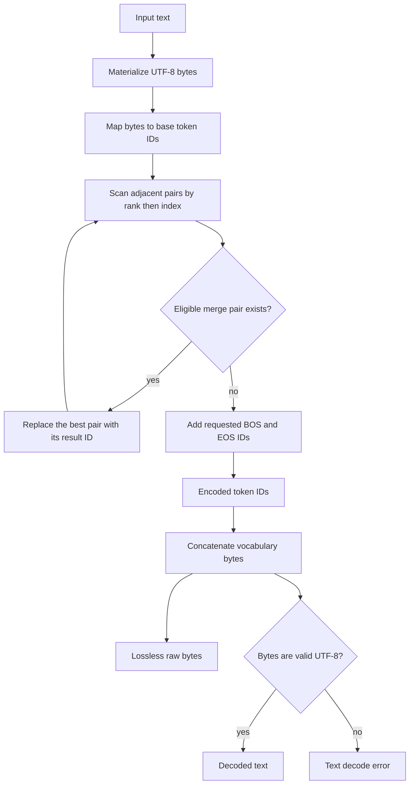

# Problem 037: Byte-Level BPE Tokenization and Detokenization

## Why this exists

The model consumes token IDs, not words or Swift `Character` values. The
checkpoint's vocabulary, merge ranks, and BOS/EOS policy define which IDs a
prompt becomes. A mathematically correct transformer paired with a whitespace
splitter is running a different input protocol and cannot match reference
inference.

This lesson implements a real byte-level byte-pair encoder. It starts from the
UTF-8 bytes of text, repeatedly applies ranked adjacent merges, and preserves a
raw-byte decode API even when the resulting bytes are not valid UTF-8. The
fixture is deterministic and structurally faithful, but deliberately tiny
compared with a production model vocabulary.

## Learning outcomes

You can:

- distinguish Unicode scalar/character boundaries from UTF-8 byte boundaries;
- define vocabulary entries as token IDs owning exact byte sequences;
- apply ranked adjacent merges with deterministic leftmost tie behavior;
- add BOS/EOS only when an explicit encoding policy requests them;
- detokenize losslessly to bytes and conditionally to valid UTF-8 text;
- reject invalid IDs and make missing-byte behavior explicit; and
- explain why tokenizer data is part of checkpoint compatibility.

## Prerequisites

- Problem 002 for indexed contiguous storage and bounds errors.
- Problem 013 for the fact that token IDs index embedding rows.
- Problem 036 for checkpoint compatibility and explicit format conventions.
- Familiarity with UTF-8 as a variable-width byte encoding.

## Vocabulary

- **Vocabulary token**: `(id, bytes)` mapping owned by the tokenizer.
- **Base byte token**: a vocabulary entry containing exactly one byte.
- **Merge pair**: adjacent token IDs `(left,right)` eligible to become one result ID.
- **Merge rank**: nonnegative priority; lower rank is applied first.
- **Leftmost tie**: if the same best-ranked pair appears more than once, merge
  its lowest sequence index first.
- **BOS/EOS**: beginning/end special IDs added by policy, not inferred from text.
- **Raw decode**: concatenate token bytes without requiring valid UTF-8.
- **Text decode**: raw decode followed by strict UTF-8 validation.

## Math and algorithm from first principles

Given UTF-8 bytes `b[0..<B]`, map each byte to a one-byte token ID. At each
iteration, inspect every adjacent token pair. Among pairs with a merge rule,
choose the smallest `(rank,leftIndex)`, replace the two IDs with the rule's
result ID, and repeat until no pair has a rule.

If sequence `t` contains pair `t[i],t[i+1]`, a valid merge requires

$$
\operatorname{bytes}(result)
=\operatorname{bytes}(t_i)\,\Vert\,\operatorname{bytes}(t_{i+1}),
$$

where `||` means byte concatenation. The tokenizer initializer verifies this,
so merging changes segmentation but never changes represented bytes.

## Worked merge sequence

The course fixture uses base-byte IDs equal to byte values. It also defines:

| ID | Bytes | Merge rank and pair |
| --- | --- | --- |
| 258 | `th` | rank 0: `(116,104)` |
| 259 | `the` | rank 1: `(258,101)` |
| 260 | ` the` | rank 2: `(32,259)` |
| 261 | UTF-8 `é` | rank 3: `(195,169)` |
| 262 | `ll` | rank 4: `(108,108)` |
| 263 | `ell` | rank 5: `(101,262)` |
| 264 | `hell` | rank 6: `(104,263)` |
| 265 | `hello` | rank 7: `(264,111)` |

For text `the the`, initial IDs are

```text
[116,104,101,32,116,104,101]
```

The left rank-0 `th` merges first, then the second rank-0 pair:

```text
[258,101,32,116,104,101]
[258,101,32,258,101]
```

Rank 1 forms both `the` tokens, and rank 2 joins the space to the second:

```text
[259,32,258,101]
[259,32,259]
[259,260]
```

For `café`, UTF-8 starts as `[99,97,102,195,169]`; rank 3 produces
`[99,97,102,261]`. The algorithm never assumes `é` is one byte.

## Vocabulary and API contract

`ByteBPETokenizer` validates:

- nonnegative unique token IDs;
- nonempty unique byte sequences;
- distinct BOS and EOS IDs present in the vocabulary;
- nonnegative unique merge ranks and unique merge pairs;
- existence of left, right, and result tokens;
- exact result-byte concatenation; and
- existence of a configured unknown-byte token, if that policy is selected.

The fixture contains all 256 one-byte tokens, BOS `256`, EOS `257`, and merge
tokens `258...265`. Its unknown policy is `.error`, but all input UTF-8 bytes are
covered. A sparse vocabulary can choose `.error` or one explicit fallback token;
fallback replacement is not lossless and is never silently enabled.

`encode` accepts a Swift `String` and `BPEEncodingOptions`. Empty input returns
`[]`, `[BOS]`, `[EOS]`, or `[BOS,EOS]` according to those booleans. `decodeBytes`
accepts a `skipSpecialTokens` policy. `decodeText` performs the same concatenation
and throws if strict UTF-8 construction fails.

## CPU reference path

1. Materialize `Array(text.utf8)`.
2. Map every byte through `initialTokenID(for:at:)`.
3. Scan adjacent pairs for the lowest merge rank; scan order provides the
   leftmost tie break.
4. Replace exactly that pair and restart the scan.
5. Add requested special IDs after all text-byte merges.
6. Decode by looking up each ID and concatenating its bytes, optionally skipping BOS/EOS.
7. For the text API only, require `String(bytes:encoding:.utf8)` to succeed.



The learner starter completes steps 1, 2, 5, 6, and 7. It is a compiling,
lossless byte tokenizer but intentionally does not perform BPE merges.

## Independent correctness

The judge uses exact expected token sequences rather than calling the canonical
encoder. It checks the worked ranked-merge sequence and repeated-pair tie,
Unicode byte merging, empty input with BOS/EOS, and a round trip containing an
emoji. It separately checks that raw decode preserves `[0xff]`, text decode
rejects that byte, invalid token IDs throw, and a sparse `.error` vocabulary
rejects an uncovered byte.

Tests pass a byte-only implementation to the shared judge and require failure,
proving whitespace or byte splitting alone is not accepted as BPE.

```sh
swift run inference-school check 037 --cpu
swift run inference-school check 037 --solution
```

## Performance model: work, bytes, and allocation

Let `B` be UTF-8 input bytes and `M` the number of successful merges. The
readable algorithm rescans up to the current token count and shifts an array on
each replacement. Worst-case work is quadratic:

$$
O(B^2),
$$

with `O(B)` token storage. Decode reads the sum of selected token byte lengths
and appends that many bytes, so it is linear in output bytes.

Production tokenizers commonly use linked structures, priority queues, or
pretokenized regions to avoid repeated full scans. This lesson keeps the
selection rule visible; optimize only after exact token parity is preserved.

## Metal mapping

Problem 037 is CPU-only. Tokenization operates on short, irregular byte
sequences with dictionary lookups, changing adjacency, and serial rank choices.
It is host preprocessing before embedding lookup. Detokenization is likewise a
small control-path operation around generated IDs.

A GPU implementation would add dispatch and synchronization complexity without
teaching an inference kernel boundary. No CPU tokenizer output is presented as
a Metal result.

## Implementation checkpoints

1. Validate vocabulary IDs, bytes, and special tokens.
2. Validate merge references, rank uniqueness, and byte concatenation.
3. Encode ASCII as base byte IDs.
4. Apply one merge and verify represented bytes are unchanged.
5. Handle repeated best pairs with leftmost tie behavior.
6. Encode multi-byte Unicode and empty input policies.
7. Decode arbitrary valid IDs to bytes.
8. Add strict text decoding and explicit error paths.

## Controlled experiments

### Merge-density sweep

Encode long repeated `th`, `the`, and `hello` strings. Prediction: token count
falls as more rules match, while the naive rescanning implementation takes more
than linear time as input grows.

### Rank intervention

Swap two dependent merge ranks in a private fixture. Prediction: final
segmentation can change even though decoded bytes remain identical. This shows
why rank order is checkpoint data, not an optimization hint.

### Unicode boundary set

Test ASCII, composed `é`, decomposed `e` plus combining accent, CJK, and emoji.
Prediction: visually similar strings can have different UTF-8 bytes and token
sequences; each valid sequence round-trips its own bytes exactly.

### Special-token policy matrix

Encode empty and nonempty input under all four BOS/EOS combinations. Prediction:
only requested IDs appear, always outside the merged text sequence.

## Engine integration

Problem 039 uses this tokenizer to turn prompt text into IDs before embedding
lookup. Problem 040 feeds each sampled token ID back into the model and uses raw
decode to accumulate output bytes; a UI may emit text only when the accumulated
prefix is valid UTF-8. Vocabulary and merge data must match the loaded model.

The course fixture gives later tests a deterministic prompt protocol. It is not
a substitute for a real checkpoint's tokenizer files.

## Tradeoffs and limitations

- Byte-level bases make arbitrary UTF-8 representable but start with more tokens
  than character-aware schemes before merges.
- Strict UTF-8 text decode reports invalid output; replacement decoding is more
  permissive and loses evidence.
- Global merging is easy to inspect; production tokenizers may apply regex
  pretokenization before BPE, changing valid merge boundaries.
- The fixture has 266 entries and eight merges. It has no normalization,
  pretokenization regex, added-token matching, or production vocabulary.
- Tokenizer compatibility includes byte sequences, IDs, ranks, and BOS/EOS
  policy together. Matching only token strings is insufficient.

## Hints

- Convert the input to UTF-8 once; do not iterate Swift characters.
- Compare candidate merges by rank, then by adjacent index.
- Apply one merge per iteration so new neighboring pairs can become eligible.
- Add special IDs after merging text bytes.
- Keep byte and text decode as separate APIs.
- Test exact IDs, not only decoded round trips; many segmentations decode to the same bytes.

## Canonical solution

- [Vocabulary, merge contracts, reusable fixture, and judge](../../Sources/InferenceSchoolCore/Problems/P037ByteBPE.swift)
- [Learner tokenizer starter](../../Sources/InferenceSchoolExercises/P037ByteBPEExercise.swift)
- [Canonical byte-level BPE](../../Sources/InferenceSchoolSolutions/P037ByteBPESolution.swift)
- [Unicode, policy, and wrong-implementation tests](../../Tests/InferenceSchoolCoreTests/P037ByteBPETests.swift)
- [Embedding lookup used next](../../Sources/InferenceSchoolCore/Problems/P013Embedding.swift)

## Completion checklist

- [ ] Vocabulary and merge invariants fail explicitly.
- [ ] Encoding begins from UTF-8 bytes, not words or characters.
- [ ] Lowest rank and leftmost tie behavior match exact expected IDs.
- [ ] Empty input and BOS/EOS policies are explicit.
- [ ] Raw-byte decode preserves invalid UTF-8 bytes.
- [ ] Text decode rejects invalid UTF-8 and invalid IDs.
- [ ] Unicode and round-trip tests pass.
- [ ] The fixture is described as educational, not checkpoint-compatible by default.