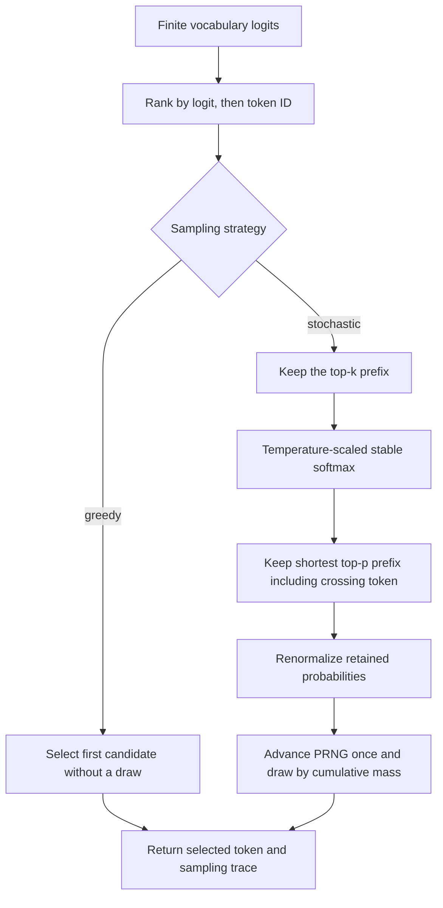

# Problem 038: Logits and Sampling

## Why this exists

The decoder produces one finite logit per vocabulary token. Turning that vector
into the next token is a policy boundary: greedy choice, temperature, top-k,
top-p, and randomness change generation behavior without changing model
weights. If filtering order, tie behavior, or random state is implicit, two
otherwise identical engines can diverge on the first generated token.

This lesson implements deterministic greedy and seeded stochastic sampling with
a complete trace. Problem 040 can reuse the API directly in its decode loop.

## Learning outcomes

You can:

- compute stable softmax over extreme finite logits;
- explain how positive temperature changes relative probabilities;
- apply top-k and nucleus top-p with explicit ordering and boundary rules;
- renormalize the retained distribution before drawing;
- implement deterministic logit ties and seeded random draws;
- distinguish greedy mode from invalid temperature-zero division; and
- inspect a trace containing retained candidates, probabilities, and draw.

## Prerequisites

- Problem 009 for max-subtracted stable softmax.
- Problem 013 for unembedding from hidden state to vocabulary logits.
- Problem 034 for near-tie argmax behavior and reproducible diagnostics.
- Problem 037 for interpreting the selected integer as a tokenizer ID.

## Vocabulary

- **Logit**: unnormalized finite score for one token ID.
- **Greedy**: choose the maximum logit without a random draw.
- **Temperature**: positive divisor applied to logits before softmax.
- **Top-k**: retain the `k` highest-ranked candidates.
- **Top-p / nucleus**: retain the shortest ranked prefix whose cumulative
  probability reaches or exceeds `p`.
- **Boundary-crossing token**: candidate that first makes cumulative probability
  meet/exceed `p`; it remains included.
- **Renormalization**: divide retained probabilities by their retained sum.
- **Sampling trace**: selected ID, retained candidates in deterministic order,
  final probabilities, and optional random draw.

## Math and probability derivation

For finite logits `z[0..<V]` and positive temperature `T`, stable probabilities are

$$
m=\max_i z_i/T,
\qquad
p_i=\frac{\exp(z_i/T-m)}{\sum_j\exp(z_j/T-m)}.
$$

Subtracting `m` does not change ratios because the same factor cancels from
numerator and denominator. Smaller positive `T` sharpens differences; larger
`T` flattens them. `T=0` is undefined. This API uses `.greedy` for the
temperature-zero policy and rejects stochastic configurations with `T<=0`.

## Worked filtering example

For logits `[2,1,0]` at `T=1`, max subtraction gives exponentials
`[1,e^-1,e^-2]`, approximately `[1,0.3679,0.1353]`. Full probabilities are
approximately `[0.6652,0.2447,0.0900]`.

With `topK=2`, discard token `2` and normalize over tokens `0,1`:

```text
token 0: 0.7311
token 1: 0.2689
```

Then `topP=0.8` keeps both: `0.7311 < 0.8`, and adding token `1` crosses the
boundary. For `topP=0.7`, only token `0` remains and is renormalized to `1.0`.

The implemented composition order is fixed:

```text
rank by (logit descending, token ID ascending)
-> top-k prefix
-> stable softmax over that prefix
-> shortest top-p prefix including crossing token
-> renormalize
-> seeded draw
```

Changing this order defines a different policy.

## Shape, dtype, and error contract

Input is a nonempty Swift `[Float]` representing contiguous Float32 logits with
shape `[V]`. Every value must be finite. Token ID is the zero-based array index.
Equal logits are ordered by smaller token ID.

Stochastic configuration requires:

- finite `temperature > 0`;
- optional `topK` in `1...V`; and
- optional finite `topP` in `(0,1]`.

Probability reduction uses Double in the canonical sampler and stores trace
probabilities as Float. Greedy returns one candidate with probability `1` and
`randomDraw=nil`; it does not advance the PRNG. Stochastic mode advances exactly
once per call, even when filtering leaves one candidate.

## Deterministic PRNG contract

`SeededGenerator` uses SplitMix64 state transitions. Each stochastic call gets a
UInt64, discards the low 11 bits, and divides the remaining 53 bits by `2^53`:

$$
u=\frac{next()\gg11}{2^{53}},\qquad 0\le u<1.
$$

Candidates are traversed in ranked order while accumulating final probabilities;
the first candidate with `u < cumulative` is selected. The last retained token
is a rounding fallback.

`SeededLogitsSampler` owns this generator. Two samplers initialized with the same
seed and called with the same sequence of stochastic requests produce identical
traces and next states. A caller that changes call count changes future draws.

## CPU reference path

1. Validate logits and strategy before reading a maximum.
2. Build `(tokenID,logit)` candidates and sort by descending logit, then ID.
3. For greedy, return the first candidate without touching the generator.
4. For stochastic mode, truncate to top-k if configured.
5. Divide by temperature in Double and compute max-subtracted softmax.
6. If top-p is configured, keep at least one candidate and include the crossing token.
7. Renormalize retained probabilities.
8. Generate one `u` and select from cumulative mass.
9. Return the selected ID, ranked retained candidates, final probabilities, and draw.



The learner starter validates all inputs and implements correct deterministic
greedy selection. Its stochastic path intentionally returns the greedy result,
so probability, trace, draw, and PRNG-state cases remain red.

## Independent correctness

The judge owns a separate Double reference implementation. It compares selected
token, ordered candidate IDs/logits, probabilities within `2e-6`, exact random
draw, and final generator state. Cases cover:

- equal and near-equal logits with lowest-ID tie order;
- logits `10000`, `0`, and `-10000` without overflow;
- composed top-k then top-p;
- a top-p boundary that must retain the second tied token;
- equal-seed reproducibility;
- empty and non-finite logits;
- temperature zero, `k>V`, and `p>1`.

A test passes an always-greedy implementation to the same judge and requires it
to fail.

```sh
swift run inference-school check 038 --cpu
swift run inference-school check 038 --solution
```

## Performance model: work, bytes, and allocation

The readable implementation sorts all `V` candidates, so work is

$$
O(V\log V)
$$

and transient storage is `O(V)` candidates and probabilities. It reads `4V`
logit bytes before allocation overhead. Softmax/filter passes are linear in the
retained top-k prefix.

Greedy selection alone can be an `O(V)` argmax with constant auxiliary storage.
Large-vocabulary production top-k can use selection algorithms or hierarchical
GPU reductions instead of a full CPU sort. This lesson keeps complete ordering
and trace evidence visible.

## Metal mapping

Problem 038 is CPU-only. The policy and seeded draw are host-side in this course.
For a real large vocabulary, transferring all logits to the CPU can dominate;
a Metal path could reduce argmax or top-k on device and transfer only candidates.
That future kernel would need deterministic tie rules and parity for retained
probabilities and must define where PRNG state lives.

No such kernel is implemented here, and the CPU sampler is not presented as a
GPU check. Optimization belongs after Problem 040 exposes actual decode timing.

## Implementation checkpoints

1. Validate empty/non-finite logits and all stochastic fields.
2. Implement greedy with smallest-ID tie order and no PRNG advance.
3. Match stable full-softmax probabilities for extreme logits.
4. Add top-k truncation and verify `k=1` and `k=V`.
5. Add top-p prefix selection with the crossing token included.
6. Renormalize and verify retained probabilities sum to one.
7. Draw once from `SeededGenerator` and return the complete trace.
8. Verify repeated sampler calls and equal-seed reproducibility.

## Controlled experiments

### Temperature sweep

For fixed logits `[2,1,0]`, compare `T=0.25,1,4`. Prediction: candidate order is
unchanged; entropy rises with temperature and the largest-token probability falls.

### Top-k boundary sweep

Sweep `k=1...V` at fixed seed with `topP=nil`. Prediction: `k=1` always selects
the greedy token but still records a stochastic draw; larger `k` can change the
selected token and retained distribution.

### Top-p boundary sweep

Use equal logits and vary `p` just below, at, and above cumulative fractions.
Prediction: the retained count changes only when the shortest prefix no longer
reaches `p`; the crossing candidate is never dropped.

### Seed and call-order experiment

Run two samplers with equal seeds, then insert one extra stochastic call into
only one stream. Prediction: traces agree before the insertion and can diverge
after it because PRNG state ownership includes call order.

### Near-tie intervention

Perturb two logits around equality. Prediction: exact equality chooses the
smaller ID; a representable positive difference changes rank. Seeded stochastic
selection may still choose either retained token.

## Engine integration

Problem 040 obtains vocabulary logits from the final normalized hidden state and
unembedding weights, then calls `SeededLogitsSampler.sample`. The selected token
is appended to the token sequence, fed through embedding and the decoder on the
next step, and passed to Problem 037 detokenization. The trace belongs in decode
diagnostics so policy divergence is distinguishable from model-logit divergence.

## Tradeoffs and limitations

- Full sorting is simple and deterministic; partial selection is faster for large vocabularies.
- CPU sampling is inspectable; device-side filtering can avoid a large logits transfer.
- Float trace probabilities are compact; Double computation reduces avoidable normalization error.
- One fixed PRNG makes tests reproducible but is not a cryptographic generator.
- Top-k-before-top-p is one explicit policy. Frameworks using another order will
  not match token-for-token even with equal logits and seeds.
- The lesson does not implement penalties, logit bias, repetition controls,
  beam search, typical sampling, or batched request-specific generators.

## Hints

- Positive temperature preserves ranking, so one deterministic sort is sufficient.
- Always subtract the maximum scaled logit before `exp`.
- Top-p retains the token that crosses the threshold.
- Renormalize after every filtering decision before drawing.
- Compare `draw < cumulative`; keep the last candidate as a rounding fallback.
- Never emulate temperature zero by dividing or clamping; call greedy mode.

## Canonical solution

- [Sampling types, SplitMix64, validation, sampler owner, and judge](../../Sources/InferenceSchoolCore/Problems/P038LogitsSampling.swift)
- [Learner greedy starter](../../Sources/InferenceSchoolExercises/P038LogitsSamplingExercise.swift)
- [Canonical filtering and seeded sampling](../../Sources/InferenceSchoolSolutions/P038LogitsSamplingSolution.swift)
- [Boundary, reproducibility, and wrong-implementation tests](../../Tests/InferenceSchoolCoreTests/P038LogitsSamplingTests.swift)
- [Stable softmax prerequisite](../../Sources/InferenceSchoolCore/Problems/P009Softmax.swift)

## Completion checklist

- [ ] Empty/non-finite logits and every invalid stochastic field throw.
- [ ] Greedy ties choose the lowest token ID and do not advance PRNG state.
- [ ] Stable probabilities remain finite for extreme logits.
- [ ] Top-k then top-p ordering and crossing-token behavior match the judge.
- [ ] Retained probabilities sum to one within tolerance.
- [ ] Equal seeds and call sequences produce equal traces and states.
- [ ] Trace contains selected ID, ordered candidates, final probabilities, and draw.
- [ ] Temperature zero is represented only by explicit greedy mode.