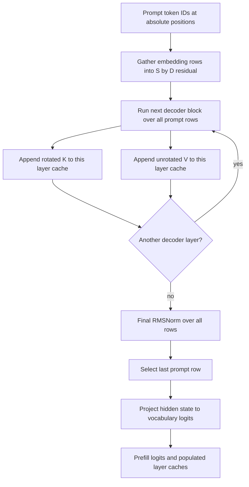

# Problem 039: Prompt Prefill

## Why this exists

A decoder cannot begin generation from prompt token IDs alone. It must gather
their embeddings, run every decoder block in checkpoint order, retain each
layer's rotated keys and values, normalize the final residual, and project the
last prompt position to vocabulary logits. A path that produces plausible
logits but omits cache writes has only delayed the same work until decode.

This lesson introduces one complete **educational mini-model** and its
multi-token execution path. It is deterministic test data, not a pretrained or
production model. Problems 040-042 reuse the same model, positions, cache, and
capture names rather than inventing parallel conventions.

## Learning outcomes

You can:

- validate a complete decoder model rather than one isolated block;
- gather `[S,D]` embeddings from token IDs and a `[V,D]` table;
- execute multiple Problem 035 blocks in order;
- append each layer's rotated K and unrotated V at absolute positions;
- select the final prompt row before unembedding to `[V]` logits;
- explain why prefill projections are GEMM-shaped; and
- account for projection FLOPs, causal attention work, weight reads, and cache writes.

## Prerequisites

- Problem 013 for embedding and tied-output semantics.
- Problems 018, 022, and 023 for integer-division GQA and contiguous KV caches.
- Problem 035 for the complete pre-norm decoder block and its captures.
- Problem 036 for checkpoint-facing `[out,in]` weights and validated tensors.
- Problem 038 for the next-token policy used after these logits.

## Vocabulary

- **Prefill**: process all prompt tokens before serial one-token generation.
- **Model-level contract**: vocabulary, embedding, layer stack, final norm, and output policy.
- **Tied output**: reuse the `[V,D]` embedding table as unembedding weights.
- **Layer cache**: K/V records belonging to one decoder layer only.
- **Absolute position**: `positionOffset + tokenIndex`, retained in cache metadata.
- **Work model**: timing-independent FLOP, byte, and projected-token counts.

## Math, model, and equations

The shared `MiniDecoderModel` contains:

```text
vocabularySize V
DecoderConfiguration(D, F, Hq, Hkv, dh, rotaryDimension, epsilon, ropeBase)
tokenEmbedding [V,D]
blocks[L]
finalNormGamma [D]
outputProjection = tiedEmbedding | independent [V,D]
```

For prompt IDs $t_0,\ldots,t_{S-1}$, gather

$$
X^{(0)}_{i,:}=E_{t_i,:}.
$$

Run the Problem 035 block in order:

$$
X^{(\ell+1)}=
\operatorname{DecoderBlock}_\ell(X^{(\ell)},p_0).
$$

During each layer, append

$$
\operatorname{cacheK}[\ell,p_0+i]=\widetilde K^{(\ell)}_i,
\qquad
\operatorname{cacheV}[\ell,p_0+i]=V^{(\ell)}_i.
$$

After the final layer,

$$
Y=\operatorname{RMSNorm}(X^{(L)},\gamma_f),
\qquad h=Y_{S-1,:},
\qquad z=W_{out}h.
$$

Only `h=Y[S-1]` is unembedded. Selecting row zero or averaging rows is a
different model output.

## Worked prompt trace

The fixture uses `V=7`, `D=4`, two layers, `Hq=2`, `Hkv=1`, `dh=2`, and tied
output weights. For prompt IDs `[1,4,2]` at `positionOffset=5`:

1. Gather embedding rows 1, 4, and 2 into `[3,4]`.
2. Layer 0 normalizes all three rows, projects Q/K/V, and rotates at positions
   `5,6,7`.
3. Layer 0 appends three `[1,2]` K records and three `[1,2]` V records.
4. Layer 1 consumes layer 0's residual output and repeats with its own weights
   and cache region.
5. Final RMSNorm returns `[3,4]`; row 2 becomes hidden `[4]`.
6. Tied unembedding computes seven dot products and returns logits `[7]`.

Both cache layers must report positions `[5,6,7]`. Layer 1 must not consume the
original embeddings; its residual input is layer 0's output.

## Shape, state, and error contract

Batch size is one and omitted. All tensors are contiguous row-major Float32.
Projection weights remain `[out,in]`, RMSNorm uses direct gamma, RoPE rotates
adjacent pairs, and GQA maps `kvHead = queryHead / (Hq/Hkv)`.

| Value | Shape |
| --- | --- |
| token IDs | `[S]` Swift integers, `S>=1` |
| embedding table | `[V,D]` |
| residual per layer | `[S,D]` |
| Q | `[S,Hq,dh]` |
| K, V | `[S,Hkv,dh]` |
| final normalized residual | `[S,D]` |
| final hidden | `[D]` |
| output weights | `[V,D]` |
| logits | `[V]` |

Model construction validates positive `V`, at least one layer, every embedding,
block, final-norm, and output shape, and every Float value. Tied output is an
explicit enum case. Independent output weights must be `[V,D]`.

The cache must match `L`, `Hkv`, and `dh`, have enough capacity, and be empty at
prefill entry. Token IDs must lie in `0..<V`; positions must be nonnegative and
must not overflow. Every layer writes exactly `S` consecutive records.

Problem 036 intentionally remains a minimal single-block archive. It validates
and loads one `DecoderBlockWeights`; this lesson constructs the complete
multi-layer educational fixture in code. It does not silently claim that the
P036 file format already represents embeddings, a layer array, or final output
weights.

## CPU reference algorithm

1. Validate the model, prompt, position range, and empty compatible cache.
2. Copy each embedding row into a contiguous `[S,D]` residual.
3. For `layer=0..<L`, call the complete Problem 035 block with `positionOffset`.
4. Slice each token's `rotatedKeys` and `values` as `[Hkv,dh]` and append them.
5. Pass the returned residual to the next layer.
6. Apply direct-gamma final RMSNorm to all rows.
7. Copy the last row to `[D]` and multiply by `[V,D]` output weights.
8. Return captures, cache counts/positions, final tensors, and the work model.



The canonical path uses Float32 arithmetic and reuses the Problem 035 solution.
The judge uses a separately implemented Double-accumulation block oracle.

## Independent correctness

The judge compares every captured boundary in every layer against its Double
oracle with absolute tolerance `6e-5` plus relative tolerance `1.2e-4`. It also
materializes the cache supplied to the implementation and compares it with the
oracle's rotated keys, unrotated values, and absolute positions. This catches an
implementation that computes correct logits using a private cache.

The judge also checks the exact work model and rejects an out-of-vocabulary ID,
a nonempty prefill cache, and an incompatible layer count. Focused tests reject
missing cache writes, wrong model tensor shapes, non-finite model values, and
unstable fingerprints.

```sh
swift run inference-school check 039 --cpu
swift run inference-school check 039 --solution
```

## Performance model: FLOPs, bytes, cache, and allocation

For one layer, projection multiply-add work is approximately

$$
2S\left(D^2+2D(H_{kv}d_h)+D^2+3DF\right).
$$

Every projection consumes an `[S,in]` activation matrix and `[out,in]` weights;
the result is `[S,out]`. That is GEMM-shaped even though the readable code uses
loops. Unlike one-token GEMV, many prompt rows can reuse each loaded weight tile.

Causal score and value work is approximately

$$
4LH_qd_h\frac{S(S+1)}{2}.
$$

Float32 cache writes are exact at

$$
B_{cache}=4\cdot2LSH_{kv}d_h.
$$

The trace reports projection FLOPs, attention FLOPs, estimated weight bytes,
cache bytes written, `L*S` K/V projection input tokens, and zero prior tokens
reprojected. Captures deliberately allocate more memory than a production
engine; Problem 041 plans reusable ranges without claiming these Swift tensors
already use an arena.

## Honest Metal mapping

Problem 039 owns control and state correctness and has no Metal check. It does
not label CPU execution as GPU prefill. Earlier lessons provide Metal kernels
for GEMM, RMSNorm, RoPE, and attention. A future GPU path would dispatch
GEMM-shaped Q/K/V and MLP projections over `S` rows, then append rotated K/V to
layer-specific device cache storage.

Diagnostic capture mode must preserve the same names and positions. Production
fusion may remove writes only after a parity path can still expose them. Grid,
threadgroup, SIMD-group, barrier, and bounds decisions belong to those earlier
kernel lessons; this lesson's new responsibility is ordered orchestration.

## Implementation checkpoints

1. Validate every model tensor and token before allocation.
2. Match the `[S,D]` embedding capture.
3. Match layer 0 captures and cache positions at offset zero.
4. Repeat at a nonzero offset and verify rotated K changes.
5. Feed layer 0 output into layer 1 and match every capture.
6. Match final RMSNorm for all rows.
7. Select only the last row and match `[V]` logits.
8. Match work counts and all invalid-state cases.

## Controlled experiments

### Prompt-length sweep

Compare `S=1,8,64`. Prediction: projection work and cache bytes grow linearly;
full causal attention grows quadratically. Projection arithmetic intensity
should improve as rows reuse weights.

### Position-offset intervention

Run equal IDs at offsets `0` and `32`. Prediction: embeddings, norms, projected
Q/K/V, and values remain equal; rotated Q/K and downstream attention can change.

### Layer-order intervention

Swap two nonidentical fixture blocks. Prediction: shape validation still passes,
but the first changed capture is layer 0 output and all later states diverge.

### Tied versus independent output

Copy the embedding to an explicit independent matrix, then perturb one row.
Prediction: all block and final-norm captures remain equal; only that token's
logit changes before argmax consequences.

Write each prediction before running the code.

## Engine integration

Problem 040 receives this populated cache and treats the token sampled from
prefill logits as the current token at absolute position `positionOffset+S`.
It appends one new record per layer without recomputing these prompt K/V values.
Problem 041 derives buffer schedules from the same dimensions. Problem 042
serializes these named captures with the model fingerprint.

## Tradeoffs

- Returning only final-position logits saves output projection work versus all-position logits.
- Full captures improve diagnosis and increase transient memory.
- Tied output reduces model bytes but is a checkpoint policy, not a universal assumption.
- A Float32 scalar path is readable; optimized prefill wants tiled GEMM and fused attention.
- Caching during prefill adds writes now to avoid repeated projections during decode.

## Hints

- Cache `rotatedKeys`, not pre-RoPE keys, and cache V without RoPE.
- Append to the layer whose weights produced the tensors.
- Keep the same `positionOffset` through every layer.
- A reshape from projection width to heads is not a transpose.
- Select `S-1` only after final RMSNorm.

## Canonical solution

- [Shared model, fixture, fingerprint, and work types](../../Sources/InferenceSchoolCore/Problems/MiniDecoderTypes.swift)
- [Prefill contract, Double oracle, and judge](../../Sources/InferenceSchoolCore/Problems/P039PromptPrefill.swift)
- [Learner starter](../../Sources/InferenceSchoolExercises/P039PromptPrefillExercise.swift)
- [Canonical prefill wrapper](../../Sources/InferenceSchoolSolutions/P039PromptPrefillSolution.swift)
- [Shared canonical CPU engine](../../Sources/InferenceSchoolSolutions/MiniDecoderCPUEngine.swift)
- [Focused tests](../../Tests/InferenceSchoolCoreTests/P039PromptPrefillTests.swift)
- [Contiguous cache contract](../../Sources/InferenceSchoolCore/Problems/KVCacheTypes.swift)

## Completion checklist

- [ ] Complete model shapes, values, output policy, and cache compatibility validate.
- [ ] Embeddings and all layer captures match the independent oracle.
- [ ] Every layer cache contains rotated K, V, and exact absolute positions.
- [ ] The next layer consumes the previous layer's output.
- [ ] Final logits come from only the last normalized prompt row.
- [ ] Work and cache-byte fields match the documented formulas.
- [ ] Experiment predictions are recorded before results.
- [ ] The fixture is described only as an educational mini-model.
- [ ] No CPU path is claimed to be Metal.