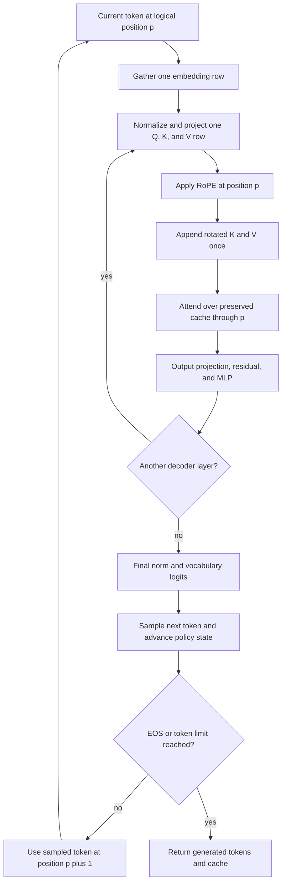

# Problem 040: Autoregressive Decode

## Why this exists

Generation is serial: the token selected now becomes the input token for the
next model step. Re-running the full prefix would repeatedly project every old
token's K and V. A real decode loop instead projects one current token, appends
one K/V record per layer, attends over existing records, and advances sampling
state exactly once.

This lesson reuses Problem 039's complete educational mini-model and cache. It
owns control flow and mutable state correctness. Earlier lessons own the
individual kernels.

## Learning outcomes

You can:

- execute a complete decoder for one current token;
- apply RoPE at the supplied absolute logical position;
- append current rotated K/V once before cached GQA attention;
- preserve every prior cache byte and avoid prior-token K/V projections;
- compare cached output with full-sequence recomputation;
- advance a seeded sampler deterministically across repeated calls; and
- implement EOS and maximum-token stopping in a generation session.

## Prerequisites

- Problem 023 for append-then-attend cached attention.
- Problem 035 for norm, projection, residual, and SwiGLU order.
- Problems 038 and 039 for sampling and the populated prompt cache.

## Vocabulary

- **Current token**: token ID embedded by this decode call.
- **Next token**: token selected from this call's output logits.
- **Logical position**: absolute position assigned to the current token.
- **Cache prefix**: previously appended records that must remain unchanged.
- **Full-recomputation oracle**: run all tokens as a prompt and inspect its last row.
- **Seed progression**: deterministic sampler state after an exact call sequence.
- **Generation session**: owner of model, cache, next position, strategy, and PRNG.

## One-token equations

For current token $t_p$ at position $p$, gather one row

$$
x^{(0)}=E_{t_p,:}.
$$

At layer $\ell$, compute direct-gamma norm and projections only for this row:

$$
q=W_qN(x),\quad k=W_kN(x),\quad v=W_vN(x).
$$

Apply adjacent-pair RoPE at absolute position $p$ and append before attention:

$$
\operatorname{cacheK}[\ell,p]=\operatorname{RoPE}(k,p),
\quad
\operatorname{cacheV}[\ell,p]=v.
$$

For query head $h$, integer-division GQA selects

$$
h_{kv}=\left\lfloor\frac{h}{H_q/H_{kv}}\right\rfloor.
$$

Cached attention reads all visible positions through $p$, then output projection,
the first residual, MLP norm, SwiGLU, down projection, and the second residual
match Problem 035. Final norm and `[V,D]` unembedding produce logits; Problem
038 selects the next token.

## Worked state transition

Suppose prefill cached prompt `[1,4]` at positions `[3,4]`. Decode current token
`2` at position `5`:

```text
before each layer: cache count 2, positions [3,4]
projected this call: one Q row, one K row, one V row
append: rotated K(5), V(5)
attention visibility: [3,4,5]
after each layer: cache count 3, positions [3,4,5]
prior K/V projection input tokens: 0
```

The selected token from these logits is input to position `6`. It is not added
to cache until that next decode call computes its layer-specific K/V.

## Shape and state contract

Batch size and sequence axis are both one in computation.

| Value | Shape |
| --- | --- |
| current token ID | scalar integer in `0..<V` |
| embedded residual | `[1,D]` |
| Q | `[1,Hq,dh]` |
| K, V | `[1,Hkv,dh]` |
| cache record | `[Hkv,dh]` per tensor per layer |
| cached attention output | `[Hq,dh]`, captured as `[1,Hq,dh]` |
| final hidden | `[D]` |
| logits | `[V]` |

The cache configuration must match model `L`, `Hkv`, and `dh`. All layer
position lists must be equal. If nonempty, their last position plus one must be
the request's logical position. Capacity must remain. The token, sampling
configuration, finite model tensors, and position are validated before mutation.

On success every layer count changes by exactly one. On contract failure no
append occurs. The canonical cache is preallocated and has stable storage.

## CPU reference algorithm

For each layer:

1. RMS-normalize the `[1,D]` residual with attention gamma.
2. Use GEMV-shaped `[out,in]` Q/K/V projections.
3. Reshape, then rotate Q and K at the exact logical position.
4. Append one rotated K and one V record for this layer.
5. Call cached online GQA attention over visible cache positions.
6. Concatenate heads, output-project, and add the incoming residual.
7. Apply MLP norm, gate/up projections, SiLU product, down projection, and residual.

After all layers, final-normalize, unembed, and call the Problem 038 sampler.
Return all captures, counts before/after, positions, sampling trace, and work fields.



## Stateful generation helper

`MiniDecoderGenerationSession` owns one model, contiguous cache, sampling
strategy, `SeededGenerator`, optional EOS ID, and next logical position.

`generate(prompt,maxNewTokens)` first prefills. If the limit is positive, it
samples the first generated token from prefill logits. Each later iteration
decodes the latest generated token and appends the selected next token. It stops
when EOS is selected or the generated count reaches the limit. `maxNewTokens=0`
returns after prefill without advancing the sampler.

Equal seeds, prompt, strategy, and limits produce equal tokens, traces, and
final PRNG state. Greedy calls do not advance the generator; stochastic calls
advance once per selected token.

## Independent correctness

The judge prefills two tokens into a cache, then performs three sequential
decode calls. After each call it appends the current token to an independent
token list and runs the complete Double prefill oracle over that full sequence.
It compares the cached path with the oracle's last row at every layer boundary,
final hidden, logits, and sampled decision.

It separately checks that:

- prior cache positions and values are byte-for-byte preserved;
- each layer grows by exactly one;
- `keyValueProjectionInputTokens == L` for each call;
- `priorKeyValueTokensReprojected == 0`; and
- candidate IDs, draw, and generator state are exact while candidate floats use tolerance.

Position gaps and invalid token IDs are rejected. Tests also inject a false
reprojection counter and require rejection.

```sh
swift run inference-school check 040 --cpu
swift run inference-school check 040 --solution
```

## Performance model: FLOPs, bytes, and cache

Per layer, projection work is the `S=1` form:

$$
2\left(D^2+2D(H_{kv}d_h)+D^2+3DF\right).
$$

At `T` visible cached tokens, attention dot and weighted-value work is roughly

$$
4H_qd_hT
$$

per layer. Weight bytes are reread for every serial token in this scalar CPU
path. Cache writes per call are fixed:

$$
B_{write}=4\cdot2LH_{kv}d_h.
$$

Cache reads grow with context. Crucially, K/V projection work for old tokens is
zero. The trace exposes that invariant directly rather than inferring it from
elapsed time.

## Honest Metal mapping

Problem 040 is canonical CPU only. No fake Metal wrapper is provided. Decode
projections are GEMV-shaped and tend to stream weights with little activation
reuse. Problem 004 owns GEMV mapping, Problem 012 norm/projection fusion,
Problem 023 cached attention, and Problems 032-033 quantized projection choices.

A future GPU decode loop should keep weights and cache device-resident, avoid a
CPU round trip between layers, and preserve append ordering. Fusing kernels is
not allowed to alter absolute positions, cache ownership, GQA division, direct
gamma, or seeded sampling call count.

## Implementation checkpoints

1. Reject token, cache, position, capacity, and sampler errors before mutation.
2. Match one-token attention norm and Q/K/V at an empty position-zero cache.
3. Match RoPE and one append per layer at a nonzero position.
4. Match cached attention with a two-token prefix.
5. Match both residuals and all MLP captures.
6. Match final norm, logits, selected token, draw, and PRNG state.
7. Repeat across several positions and preserve every prior cache element.
8. Implement EOS and maximum-token stopping.

## Controlled experiments

### Context-length sweep

Hold model and current token fixed; compare `T=1,16,256`. Prediction: projection
work and cache writes stay constant, while attention reads/work grow linearly.

### Recompute intervention

Implement a private full-prefix path for comparison. Prediction: outputs match
within tolerance, but K/V projection input tokens grow with `T` instead of
remaining exactly `L`.

### GQA sweep

Compare compatible fixtures with `Hkv=Hq`, `Hq/2`, and `1`. Prediction: query
and output projections are unchanged; K/V weight and cache bytes fall with Hkv.

### Seed call-order intervention

Insert one extra stochastic sample in only one session. Prediction: model logits
remain equal at the insertion point; later selected tokens can diverge because
PRNG ownership includes call count.

## Engine integration

The same model types and cache object flow from Problem 039 into this lesson.
Problem 041 plans the one-token intermediates separately from prefill. Problem
042 captures the complete prefill path and applies the same convention checks
that protect decode. Later profiling may choose different kernels without
changing this state machine.

## Tradeoffs

- A contiguous cache is simple; paged or ring storage changes allocation, not attention math.
- Online cached attention removes score storage; it still reads every visible K/V.
- Host sampling is inspectable; device filtering can reduce logits transfer.
- Full traces aid parity and add allocations that production mode may disable.
- Stateful sessions make ordering explicit but require one owner per request.

## Hints

- Append current K/V before attention so the token can attend to itself.
- Do not run RoPE over cached keys again.
- Use the request's absolute position, not the cache count, as the RoPE position.
- Preserve `[out,in]` projection orientation.
- Advance the stochastic generator once per sampled token, never once per candidate.

## Canonical solution

- [Decode contracts, generation result, and full-recompute judge](../../Sources/InferenceSchoolCore/Problems/P040AutoregressiveDecode.swift)
- [Learner starter](../../Sources/InferenceSchoolExercises/P040AutoregressiveDecodeExercise.swift)
- [Canonical decode wrapper and generation session](../../Sources/InferenceSchoolSolutions/P040AutoregressiveDecodeSolution.swift)
- [Shared prefill/decode CPU engine](../../Sources/InferenceSchoolSolutions/MiniDecoderCPUEngine.swift)
- [Focused stateful-generation tests](../../Tests/InferenceSchoolCoreTests/P040AutoregressiveDecodeTests.swift)
- [Cached attention implementation](../../Sources/InferenceSchoolSolutions/P023CachedAttentionSolution.swift)

## Completion checklist

- [ ] Invalid token, position, sampler, cache shape, and capacity fail before append.
- [ ] One current token is projected per layer.
- [ ] RoPE uses the exact absolute logical position.
- [ ] Each layer appends once and preserves its prior cache prefix.
- [ ] Cached captures and logits match full recomputation at several positions.
- [ ] Prior K/V projection count remains zero.
- [ ] Seed progression and sampling trace are deterministic.
- [ ] EOS and maximum-token stop policies are tested.
- [ ] CPU orchestration is not presented as a Metal kernel.