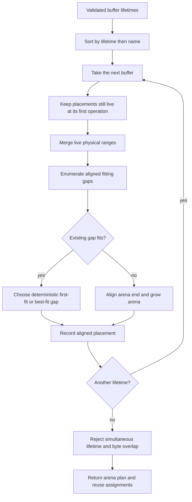

# Problem 041: Buffer Reuse and Memory Planning

## Why this exists

An inference graph can allocate far more temporary storage than is live at one
time. Q is dead after attention; an MLP buffer created later may safely reuse
part of its physical range. Repeated heap allocation in a hot path adds latency,
fragmentation, and unstable memory behavior. Reuse without a precise lifetime
model is worse: one operation can overwrite a value that another still reads.

This lesson turns prefill and decode intermediates into validated lifetimes and
assigns aligned offsets in one arena. The result is an executable plan, not just
a peak-memory estimate. The current Swift tensor engine does **not** allocate
from this arena; integrating those offsets is future work and is not implied by
a passing planner.

## Learning outcomes

You can:

- express tensor liveness as inclusive operation intervals;
- prove when two buffers may share physical bytes;
- account for alignment holes separately from requested bytes;
- implement deterministic first-fit and best-fit allocation;
- validate every placement against simultaneous liveness;
- derive prefill and one-token decode schedules from model dimensions; and
- distinguish a memory plan from an allocator-backed execution engine.

## Prerequisites

- Problem 002 for shape-to-storage and byte-address reasoning.
- Problems 039 and 040 for prefill and decode intermediate shapes.
- Problem 022 for the distinction between persistent cache capacity and transient work.

## Vocabulary

- **Lifetime**: inclusive interval `[firstOperation,lastOperation]` during which bytes are needed.
- **Arena**: one contiguous physical byte range containing all placements.
- **Placement**: `(name, offset, size, alignment, lifetime)` assignment.
- **Physical overlap**: two half-open byte ranges share at least one byte.
- **First-fit**: choose the lowest-offset aligned gap that fits.
- **Best-fit**: choose the fitting gap with least remainder, then lowest offset.
- **Naive bytes**: sum of requested sizes with no reuse or alignment padding.
- **Peak live bytes**: maximum sum of requested sizes live at an operation.

## Lifetime and aliasing math

For buffer $i$, let its inclusive lifetime be $[f_i,l_i]$ and its physical
range be $[o_i,o_i+b_i)$. Two lifetimes overlap when

$$
f_i\le l_j \quad\land\quad f_j\le l_i.
$$

Two physical ranges overlap when

$$
o_i < o_j+b_j \quad\land\quad o_j < o_i+b_i.
$$

A valid plan requires that no pair satisfies both predicates. Because operation
endpoints are inclusive, `[0,2]` and `[2,4]` are simultaneously live at
operation 2 and cannot reuse overlapping bytes. `[0,2]` and `[3,4]` may reuse.

For power-of-two alignment $a$, the next aligned offset is

$$
\operatorname{align}(x,a)=(x+a-1)\ \&\ \sim(a-1).
$$

Every addition, multiplication, and aligned-size calculation is checked for
integer overflow.

## Worked placement example

The judge owns these lifetimes:

| Name | Lifetime | Bytes | Alignment |
| --- | --- | ---: | ---: |
| a | `0...2` | 24 | 8 |
| b | `1...1` | 8 | 16 |
| c | `2...4` | 16 | 8 |
| d | `3...3` | 20 | 4 |

Deterministic first-fit produces:

```text
a -> offset 0
b -> offset 32
c -> offset 24
d -> offset 0, reusing bytes formerly used by a
```

At operation 2, `a` and `c` are both live, so `c` begins at 24. At operation 3,
`a` is dead and `d` can use offset 0. The arena is 40 bytes. Peak live requested
storage is 40 bytes and naive requested storage is 68 bytes.

Alignment means these quantities do not have a universal ordering beyond
nonnegativity. An arena can exceed `naiveByteCount` for a sparse, highly aligned
fixture even when every placement is valid. Reuse is established by actual
overlapping physical ranges assigned to disjoint lifetimes, not by assuming
`arenaByteCount < naiveByteCount` for every input.

## Input and output contract

Each `BufferLifetime` requires:

- a unique nonempty name;
- `0 <= firstOperation <= lastOperation`;
- positive `byteSize`; and
- positive power-of-two alignment.

The planner returns one placement per input plus strategy, arena size, peak live
bytes, naive bytes, and explicit `reuseAssignments`. Input order must not change
the result. Lifetimes are sorted by first operation, then last operation, then
name. Placement output follows this deterministic planning order.

Plan validation checks exact lifetime metadata, nonnegative aligned offsets,
`offset+size <= arenaByteCount`, and every pair of simultaneously live buffers.
The validator does not trust summary fields as proof of safety; it checks the
placements themselves.

## Deterministic planning algorithm

For each sorted lifetime:

1. Keep prior placements whose `lastOperation >= current.firstOperation`.
2. Convert them to physical ranges and merge touching/overlapping ranges.
3. Enumerate aligned gaps from offset zero through the current arena end.
4. For first-fit, choose the candidate with lowest offset.
5. For best-fit, choose least unused remainder, then lowest offset.
6. If no existing gap fits, align the current arena end and grow it.
7. Check `offset+size` for overflow and record the placement.

After all placements, compute naive bytes, sample inclusive liveness at every
distinct first/last operation, and report previous disjoint-lifetime placements
whose physical ranges overlap each new placement.



The planner is offline and deterministic. It does not allocate memory, run a
tensor operation, or mutate the decoder.

## Decoder-derived schedules

`MiniDecoderBufferSchedules` derives byte sizes from the shared model. Prefill
uses `S` rows; decode uses one row. Both include residual, attention norm, Q/K/V,
attention output, post-attention state, MLP norm, gate, up, gated, and down
buffers at 64-byte alignment.

The schedule names operations `0...14` and keeps residual/post-attention live
across their consumers. Prefill bytes scale with `S`; decode transient bytes do
not. `cachedTokenCount` must be positive but does not change the current decode
schedule because persistent KV cache and attention scratch are not placed in
this arena. The cache remains separately preallocated by Problems 022/039/040.

Run the report:

```sh
swift run inference-school benchmark 041 --tokens 16 --cached-tokens 16
swift run inference-school benchmark 041 --tokens 128 --cached-tokens 128
```

Despite the shared `benchmark` command family, Problem 041 reports deterministic
plans and does not claim elapsed-time performance. It prints both placements and
the fact that current Swift tensors are not allocated from them.

## Independent correctness

The judge validates canonical first-fit offsets and statistics, deterministic
best-fit output for reversed input, non-aliasing of simultaneous lifetimes, and
reuse in model-derived prefill/decode plans. It also rejects duplicate names,
non-power-of-two alignment, reversed operation ranges, and aligned-size overflow.

The contract independently checks returned placements. A malicious or mistaken
planner cannot pass merely by reporting the expected arena size.

```sh
swift run inference-school check 041 --cpu
swift run inference-school check 041 --solution
```

## Bytes, bounds, and complexity

For lifetimes $i=1\ldots n$,

$$
B_{naive}=\sum_i b_i,
\qquad
B_{peak}=\max_t\sum_{i:f_i\le t\le l_i}b_i.
$$

`B_peak` is a lower bound without alignment and fragmentation. The produced
arena may be larger. The straightforward planner filters, sorts, and merges
prior live ranges for each buffer, so worst-case work is $O(n^2\log n)$ and plan
metadata is $O(n)$. Decoder schedules are small enough that predictability and
auditable tie-breaking matter more than asymptotic optimization.

Persistent model weights and KV cache are not included in `naiveByteCount` or
`arenaByteCount`. These values describe the listed transient lifetimes only.

## Honest Metal mapping

Problem 041 is host-side planning and has no Metal kernel. In a GPU engine, the
arena could be one `MTLBuffer`; each placement becomes an offset used to create
views or passed into kernels. Alignment must satisfy both tensor representation
and Metal API requirements. GPU command ordering, not Swift lexical scope,
defines liveness.

Aliasing is unsafe across concurrently executing command buffers unless the
lifetime model includes those overlaps. Heaps and hazard tracking introduce
additional constraints. None of that is implemented here, and the report is
not evidence that a Metal engine already uses the arena.

## Implementation checkpoints

1. Validate names, intervals, sizes, alignment, and overflow.
2. Sort independently of input ordering.
3. Match the four-buffer first-fit fixture exactly.
4. Prevent reuse when lifetime endpoints touch.
5. Implement best-fit with deterministic tie-breaking.
6. Compute summaries with checked arithmetic.
7. Derive prefill and decode schedules from model dimensions.
8. Validate the final plan independently before returning it.

## Controlled experiments

### Sequence-length sweep

Run the report at `S=1,16,128`. Prediction: prefill tensor sizes and arena grow
linearly. The one-row decode arena remains unchanged because persistent cache is
outside this schedule.

### Alignment sweep

Clone a fixture with alignments `4,16,64,256`. Prediction: requested/peak bytes
stay fixed while holes and arena size can increase.

### Lifetime extension

Extend `attention_norm` through the MLP. Prediction: at least one reuse
assignment disappears and arena size may grow because a prior range remains live.

### Strategy comparison

Construct fragmented gaps and compare first-fit with best-fit. Prediction: both
plans validate and are deterministic; best-fit may reduce one fixture's arena
but is not guaranteed globally optimal.

## Engine integration

Problem 039 and 040 provide the dimensions and stage order used by these
schedules. The next integration step would replace selected `[Float]`
allocations in `MiniDecoderCPUEngine` with typed views into one aligned arena,
then rerun all numerical tests and inspect actual allocation counts. Until that
change exists, planner correctness and decoder allocation behavior are separate
claims.

## Tradeoffs and limitations

- Inclusive intervals are conservative and easy to audit; finer scheduling can expose more reuse.
- First-fit is predictable; best-fit can reduce local fragmentation but is not globally optimal.
- One arena removes allocation churn; it reserves peak capacity up front.
- Explicit offsets ease debugging; in-place operators could reduce memory further with stronger contracts.
- The schedule excludes weights, KV storage, attention score scratch, and concurrent requests.
- Arena planning is implemented; arena-backed tensor execution is not.

## Hints

- Free a prior placement only when `lastOperation < firstOperation`.
- Merge live physical ranges before searching gaps.
- Align the candidate start, not only the final arena size.
- Keep best-fit's remainder and offset tie-break explicit.
- Validate a produced plan with a separate pairwise overlap pass.

## Canonical solution

- [Lifetimes, placements, validation, schedules, and judge](../../Sources/InferenceSchoolCore/Problems/P041BufferPlanning.swift)
- [Learner starter](../../Sources/InferenceSchoolExercises/P041BufferPlanningExercise.swift)
- [Deterministic first-fit and best-fit solution](../../Sources/InferenceSchoolSolutions/P041BufferPlanningSolution.swift)
- [Focused planner and schedule tests](../../Tests/InferenceSchoolCoreTests/P041BufferPlanningTests.swift)
- [Shared mini-model dimensions](../../Sources/InferenceSchoolCore/Problems/MiniDecoderTypes.swift)

## Completion checklist

- [ ] Every lifetime field and arithmetic boundary validates.
- [ ] Input ordering cannot change either strategy's output.
- [ ] Simultaneously live buffers never overlap physically.
- [ ] Disjoint lifetimes can reuse all or part of a prior range.
- [ ] Alignment holes are reflected in actual offsets and arena size.
- [ ] Prefill and decode reports derive from the shared model.
- [ ] Persistent weights/cache are excluded explicitly.
- [ ] Experiments distinguish requested bytes, peak liveness, and arena bytes.
- [ ] No planner report is presented as an arena-backed decoder measurement.