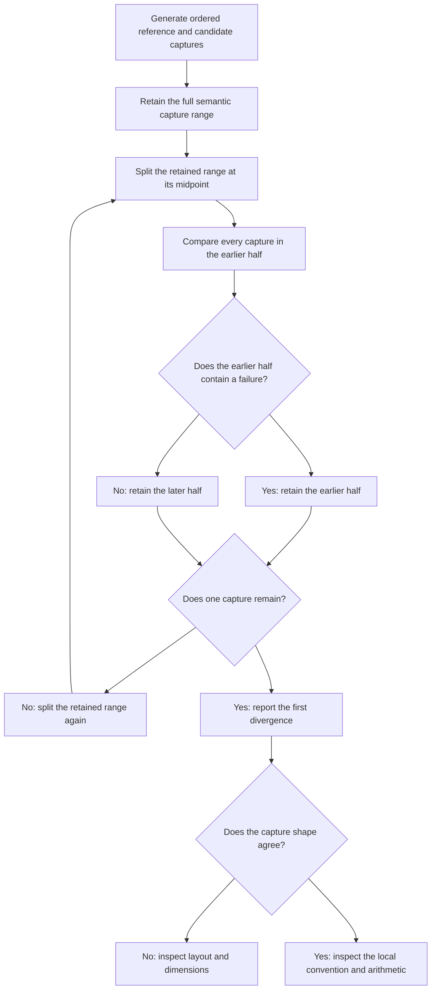

# Problem 042: Checkpoint Parity and First Divergence

## Why this exists

Final logits are a poor first debugging boundary. A wrong RMSNorm convention or
RoPE position can propagate through every later layer while still producing
finite logits and a plausible token. Comparing named intermediate tensors in
semantic order answers the useful question: where did two implementations first
stop computing the same model?

This lesson serializes captures from an independent Double-accumulation oracle
for the deterministic educational mini-model, runs the Float32 candidate engine,
and reports the first failing capture. The bundled artifact generator is not a
production checkpoint or third-party runtime. It establishes that the parity
machinery and fault localization work on known data; it does not establish
real-model parity.

## Learning outcomes

You can:

- define stable names and shapes at model semantic boundaries;
- bind a reference artifact to exact model, prompt, and position identities;
- compute maximum absolute error, RMSE, cosine similarity, and argmax agreement;
- apply combined absolute/relative elementwise tolerance;
- find the first divergence in reference capture order;
- localize deliberate RoPE and RMSNorm convention faults; and
- replace the educational artifact with captures from a trusted external implementation.

## Prerequisites

- Problem 034 for metric interpretation and convention-before-quantization diagnosis.
- Problems 035 and 039 for complete block/prefill capture boundaries.
- Problem 036 for the difference between validated bytes and model-level truth.

## Vocabulary

- **Reference artifact**: versioned JSON containing provenance, identity, tensors, and selected token.
- **Candidate**: implementation being checked against the artifact.
- **Provenance**: human-readable description of who generated reference values.
- **Fingerprint**: deterministic identity of the exact educational model configuration and weights.
- **Capture order**: serialized semantic order used to define first divergence.
- **First divergence**: first capture whose shape or values fail tolerance.
- **Convention fault**: coherent but wrong rule such as shifted RoPE positions or additive RMSNorm gamma.

## Capture schema and order

Artifact format version 1 contains:

```text
formatVersion
provenance
modelFingerprint
tokenIDs
positionOffset
captures[] = { name, shape, values }
selectedTokenID
```

JSON keys are encoded in sorted order for deterministic bytes. Capture names
must be unique and nonempty. Dimensions must be nonnegative, their checked
product must equal `values.count`, and every Float value must be finite.

Capture order is:

```text
embeddings
layer.0.residual_input
layer.0.attention_norm
layer.0.query
layer.0.key
layer.0.value
layer.0.rope.query
layer.0.rope.key
layer.0.attention
layer.0.attention_output
layer.0.post_attention
layer.0.mlp_norm
layer.0.mlp.gate
layer.0.mlp.up
layer.0.mlp.gated
layer.0.output
...same names for each later layer...
final_norm
logits
selected_token
```

This order is part of diagnosis. A dictionary can locate candidate tensors, but
the report iterates reference captures in artifact order.

## Math: error metrics and tolerance

For reference $r_i$ and candidate $c_i$ with equal shapes:

$$
E_{max}=\max_i|c_i-r_i|,
$$

$$
\operatorname{RMSE}=\sqrt{\frac{1}{N}\sum_i(c_i-r_i)^2},
$$

$$
\cos(r,c)=\frac{r\cdot c}{\|r\|_2\|c\|_2}.
$$

Both zero vectors have cosine 1; one zero and one nonzero vector have cosine 0.
Element `i` passes when

$$
|c_i-r_i|\le \epsilon_{abs}+\epsilon_{rel}|r_i|.
$$

Default tolerances are `8e-5` absolute and `1.5e-4` relative. Both must be finite
and nonnegative. A shape mismatch fails immediately and reports numerical
metrics as absent. Argmax agreement is reported for `logits` and
`selected_token`; token agreement also appears at report level. Metrics describe
differences; the elementwise tolerance determines pass/fail.

## Worked fault localization

The judge generates a reference for the default prompt at nonzero offset 4.
Three candidates are run:

1. Correct Float32 candidate: every capture passes and selected token matches.
2. RoPE candidate using `positionOffset+1`: embeddings, norms, and projected
   Q/K/V pass; first divergence is `layer.0.rope.query`.
3. Candidate using `(1+gamma)` RMSNorm instead of direct gamma: embeddings and
   residual input pass; first divergence is `layer.0.attention_norm`.

Both faults eventually change later states. Reporting only `logits` would lose
the evidence that distinguishes a positional convention from normalization.



## Identity and rejection contract

Before candidate execution, the request validates:

- the complete model and token IDs;
- nonnegative position offset;
- finite nonnegative tolerances;
- supported artifact version;
- artifact tensor names, shapes, counts, and finite values;
- exact model fingerprint; and
- exact token IDs and position offset.

A stale artifact for another weight set, a capture from another prompt, or a
different absolute position is rejected rather than compared. Missing candidate
captures and unexpected candidate names are errors, not silently skipped rows.

The fingerprint is an identity guard, not a cryptographic signature or a proof
of provenance. Provenance is retained in the report but is not automatically
trusted merely because it is a string.

## Correctness method: independent educational reference

`P042EducationalReference` runs `MiniDecoderReference.prefill`, the separately
implemented Double-accumulation oracle from Problem 039. It greedily selects a
token and converts all named tensors to Float artifact values. Its provenance is
explicitly:

```text
educational-mini-model fixture generated by Inference School's independent Double CPU oracle
```

The candidate path independently executes Float32 block operations. The two
paths share model data and contracts but do not call the same block
implementation. Deterministic JSON round-trip is tested byte for byte.

```sh
swift run inference-school check 042 --cpu
swift run inference-school check 042 --solution
```

## External reference replacement protocol

To turn this machinery into external parity evidence, replace only artifact
generation, not comparison:

1. **Freeze identity.** Export the exact model configuration and tensor values
   consumed by `MiniDecoderModel`. Record its `modelFingerprint`. For an actual
   production checkpoint, first extend the loader/model contract beyond P036's
   one-block educational archive; do not reuse a fingerprint from different data.
2. **Freeze input.** Record exact integer token IDs and absolute position offset.
   Tokenizer text alone is insufficient evidence.
3. **Implement hooks in a trusted runtime.** Capture the tensors at the names
   and semantic boundaries above, after matching `[out,in]` orientation,
   direct-gamma RMSNorm, adjacent-pair RoPE, causal mask, and integer-division GQA.
4. **Normalize layout.** Export each tensor as logical row-major Float values
   with its explicit shape. Transpose framework-native views before serialization
   when necessary; never rely on equal square dimensions to hide orientation.
5. **Emit format version 1 JSON.** Include nonempty provenance naming the runtime,
   version/commit, model source, conversion tool, and capture command. Include all
   captures exactly once and in semantic order.
6. **Bind and validate.** Decode with `expectedModelFingerprint`, then compare
   with identical token IDs and offset. Archive the artifact alongside the exact
   conversion/runtime metadata needed to regenerate it.
7. **Investigate the first failure.** Check shape/layout first, then the local
   convention at that boundary. Do not increase tolerance until the discrepancy
   has a measured numerical explanation.

The current repository does not ship such an external artifact, framework
adapter, production checkpoint, or license for model weights. Until those steps
are performed, say “educational independent-oracle parity,” not “real-model
parity.”

## Performance model: work, bytes, and diagnostic cost

For every captured Float tensor of $N_k$ elements, artifact payload is at least

$$
4\sum_k N_k
$$

raw value bytes before JSON number expansion, names, shapes, and structure.
Comparison is linear in total captured elements and stores the complete
candidate captures plus per-capture summaries. JSON is intentionally inspectable
but substantially larger and slower than a binary tensor container.

Capture mode can dominate memory relative to normal inference because values
that would die after one consumer remain retained. This is diagnostic cost. It
must not be mixed into production latency or peak-memory claims.

## Honest Metal mapping

Problem 042 is CPU-only and has no Metal check. A Metal candidate can use this
artifact format, but diagnostic mode must copy named device tensors back only
after the producing command completes. Buffer aliasing from Problem 041 means a
capture must occur before later operations overwrite its range.

GPU mixed precision and reduction order may require evidence-based tolerances by
capture class. The same first-divergence procedure still applies. No CPU result
is labeled a GPU parity result, and no tolerance is presented as universal.

## Implementation checkpoints

1. Validate version, fingerprint, prompt identity, names, shapes, values, and tolerances.
2. Produce candidate captures with exact stable names.
3. Reject missing and unexpected captures.
4. Fail shape mismatches before elementwise metrics.
5. Compute metrics in Double and elementwise combined tolerance.
6. Preserve artifact order and return its first failing name.
7. Match selected token separately from floating metrics.
8. Prove the two deliberate faults localize at their originating boundaries.

## Controlled experiments

### Tolerance sweep

Compare exact, default, and much looser tolerances. Prediction: exact comparison
may expose Float32/Double accumulation differences; default passes the correct
candidate; loose thresholds can hide deliberate faults and are therefore not a fix.

### Position identity intervention

Keep values and token IDs but change only request offset. Prediction: the
artifact is rejected before comparison, preventing misleading RoPE metrics.

### Capture removal

Remove `layer.0.rope.query` from a candidate. Prediction: comparison throws a
missing-capture error; it does not relabel the next mismatch as first divergence.

### Near-tie logits

Perturb logits within tolerance around two close maxima. Prediction: floating
metrics can pass while argmax/token agreement changes, demonstrating why both
numerical and discrete fields are retained.

## Engine integration

The capture vocabulary follows the same engine from embeddings through every
Problem 035 block, final norm, logits, and token selection. Problem 039 supplies
the independent oracle and complete model trace. A future optimized prefill or
decode path should run against the same artifact before and after fusion,
quantization, or arena integration. First divergence then identifies the
optimization boundary that changed semantics.

## Tradeoffs and limitations

- Dense captures localize faults well and cost substantial memory and I/O.
- JSON is portable and reviewable; binary tensor formats are more compact.
- One global tolerance is simple; real mixed-precision models may need justified per-capture policies.
- Fingerprints prevent accidental model mismatch; they do not authenticate provenance.
- Greedy token agreement catches discrete changes; stochastic parity also requires sampler state and policy.
- The bundled evidence covers only the deterministic educational mini-model.

## Hints

- Compare in semantic order, not alphabetic order.
- Treat a shape mismatch as a contract failure, not a large numerical error.
- Keep Float storage but accumulate metrics in Double.
- Check the earliest failing boundary before inspecting later logits.
- Preserve exact token IDs and absolute positions with every artifact.

## Canonical solution

- [Artifact, captures, validation, metrics, faults, and judge](../../Sources/InferenceSchoolCore/Problems/P042CheckpointParity.swift)
- [Learner starter](../../Sources/InferenceSchoolExercises/P042CheckpointParityExercise.swift)
- [Canonical candidate execution and comparison](../../Sources/InferenceSchoolSolutions/P042CheckpointParitySolution.swift)
- [Focused artifact and localization tests](../../Tests/InferenceSchoolCoreTests/P042CheckpointParityTests.swift)
- [Independent Double prefill oracle](../../Sources/InferenceSchoolCore/Problems/P039PromptPrefill.swift)

## Completion checklist

- [ ] Artifact bytes round-trip deterministically and validate every tensor.
- [ ] Model fingerprint, token IDs, and offset bind reference to request.
- [ ] Candidate names/shapes exactly match the ordered artifact.
- [ ] Max error, RMSE, cosine, tolerance, and argmax fields are correct.
- [ ] Correct Float32 execution passes the independent Double artifact.
- [ ] Shifted RoPE first diverges at `layer.0.rope.query`.
- [ ] Additive-gamma RMSNorm first diverges at `layer.0.attention_norm`.
- [ ] External-reference provenance and conversion steps are recorded.
- [ ] Educational parity is never described as production real-model parity.