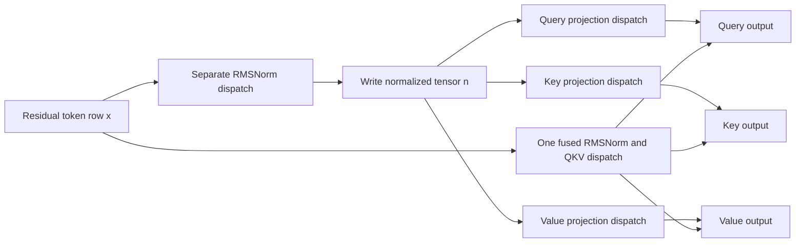

# Problem 043: Fuse RMSNorm and Q/K/V Projections

## Why this exists

Every decoder attention block normalizes one residual tensor and projects it into queries, keys, and values. A literal implementation launches RMSNorm, writes the normalized tensor, then launches three projection kernels that read it again. The arithmetic is valid, but the boundary creates an intermediate allocation, four dispatches, and extra memory traffic.

This problem fuses that subgraph. The CPU path remains readable; the Metal path performs one RMS reduction and all three projections in one dispatch. The benchmark reports measured wall-clock time separately from modeled logical traffic.

## Learning outcomes

You can:

- derive fused RMSNorm and Q/K/V without changing model semantics;
- state the `[output, input]` projection convention used by the decoder;
- identify the intermediate and dispatches removed by fusion;
- map one token to one Metal threadgroup with a shared reduction;
- account for allocation, host-to-device, device-to-host, command-buffer, and wait costs; and
- reject a fusion claim when parity or measured evidence does not support it.

## Prerequisites

- Problem 010: direct-gamma RMSNorm and epsilon placement.
- Problem 012: fusion across normalization and projection.
- Problem 014: query-head and KV-head output shapes.
- Problem 035: the decoder block's `[out, in]` weights and pre-norm ordering.

## Vocabulary

- **Subgraph fusion**: executing several connected operators without materializing every logical boundary.
- **Intermediate**: the normalized `[S,D]` tensor written by the separate path.
- **Logical traffic**: bytes implied by tensor reads and writes, independent of cache behavior.
- **Dispatch**: one encoded kernel invocation.
- **End-to-end Metal time**: host time including buffer work, submission, and synchronization.
- **GQA projection width**: query width `Hq*dh` versus key/value width `Hkv*dh`.

## Math from first principles

For token row $x_t\in\mathbb{R}^D$ and learned scale $\gamma$,

$$
r_t=\sqrt{\frac{1}{D}\sum_{j=0}^{D-1}x_{t,j}^2+\epsilon},
\qquad
n_{t,j}=\frac{x_{t,j}}{r_t}\gamma_j.
$$

With row-major weights $W_Q\in\mathbb{R}^{Q\times D}$ and $W_K,W_V\in\mathbb{R}^{K\times D}$,

$$
q_{t,o}=\sum_j W_{Q,o,j}n_{t,j},\quad
k_{t,o}=\sum_j W_{K,o,j}n_{t,j},\quad
v_{t,o}=\sum_j W_{V,o,j}n_{t,j}.
$$

Fusion substitutes the definition of $n$ inside each projection. It does not change gamma to `1+gamma`, transpose weights, or merge the three learned matrices semantically.

For $x=[3,4]$, $\gamma=[1,0.5]$, and $\epsilon=0$,

$$
r=\sqrt{(9+16)/2}=\sqrt{12.5}\approx3.5355,
$$

so $n\approx[0.8485,0.5657]$. If one query row is `[2,-1]`, its output is approximately $2(0.8485)-0.5657=1.1313$. The fused path must produce the same value without storing `n`.



## Shape, layout, and dtype contract

- Input: contiguous row-major Float32 `[S,D]`, with `1 <= S <= 64` and `D <= 256`.
- Gamma: contiguous Float32 `[D]`.
- Query weights: contiguous Float32 `[Hq*dh,D]`.
- Key/value weights: contiguous Float32 `[Hkv*dh,D]`.
- Outputs: query `[S,Hq,dh]`; key and value `[S,Hkv,dh]`.
- Combined projection width must not exceed 768.
- Epsilon must be finite and positive; every input and weight must be finite.
- Float32 accumulation is the learner and Metal contract. The judge uses an independent Double oracle and combined tolerance.

## CPU reference path

`P043FusedQKVSolution.separate` makes the normalized tensor explicit, then projects it three times. `fused` computes normalized values while accumulating projection outputs and never allocates `[S,D]` normalization storage. Both are useful: the separate path explains semantics; the fused path exposes the removed boundary.

```sh
swift run inference-school check 043 --cpu --solution
```

## Correctness method

The judge independently computes RMSNorm and each projection in Double. It covers GQA shapes, the maximum sequence and projection boundaries, nonuniform gamma, invalid ranks and shapes, zero epsilon, empty sequences, and non-finite values.

An element passes when its absolute error is bounded by `5e-5 + 1e-4*max(|actual|,|expected|)`. CPU and Metal implementations use the same judge.

```sh
swift run inference-school check 043 --solution
```

## Performance model

Let $P=H_qd_h+2H_{kv}d_h$. Projection work dominates at approximately

$$
2SDP\ \text{FLOPs}
$$

when a multiply-add counts as two operations, plus the $O(SD)$ normalization reduction and scaling.

The bundled cost model counts four separate dispatches versus one fused dispatch. The separate path allocates `4*S*D` bytes for normalized Float32 values. Its logical traffic includes writing that tensor once and reading it for three projections; the fused path removes those four normalized-tensor transfers.

This is a traffic model, not a cache-counter measurement. Run:

```sh
swift run -c release inference-school benchmark 043 --tokens 32 --iterations 20
```

The Metal timing is end-to-end and includes shared-buffer allocation, copies, submission, and a host wait.

## Metal mapping

The canonical kernel launches one 256-thread threadgroup per token. Each thread accumulates a strided subset of squared features into threadgroup memory. A tree reduction computes the row sum of squares; every thread reaches every barrier. Threads then stride over the combined Q/K/V output channels.

- Grid: `S` threadgroups.
- Threadgroup width: 256.
- Threadgroup memory: 256 Float32 partial sums.
- Device memory: input, gamma, three weight matrices, and three outputs.
- Dispatches: one.
- Bounds: host validation caps dimensions; feature and channel loops are strided.
- Synchronization: reduction barriers inside a threadgroup, then one host wait after the command buffer.

The starter kernel reaches the reduction but deliberately returns incorrect projection values until completed.

## Implementation checkpoints

1. Validate every shape, finite value, and limit before dispatch.
2. Implement the separate Float32 path and pass the oracle.
3. Remove the normalized allocation in the CPU fused path.
4. Map the RMS reduction to one threadgroup per token.
5. Route combined channels to the correct Q, K, or V weight base.
6. Reshape flat outputs into head views without copying.
7. Match the independent oracle and inspect resource accounting.
8. Benchmark only after writing a prediction.

## Controlled experiments

### Sequence sweep

Run `S=1,2,8,32,64` with fixed dimensions. Predict where launch and transfer overhead dominate and where removed traffic becomes visible.

### Head-sharing sweep

Compare MHA and GQA configurations with the same query width but fewer KV heads. Predict how $P$, output bytes, and weight bytes change.

### Boundary intervention

Compare CPU separate, CPU fused, and Metal end-to-end. Do not assume the CPU fused path is faster: recomputation and Swift loop structure can outweigh one removed allocation.

Record build configuration, machine, shape, median iterations, and whether each number is modeled or measured.

## Engine integration

Problem 047 invokes the fused QKV Metal kernel on the real layer-0 residual captured from capstone prefill, then applies RoPE and compares named values with CPU. Generation remains on the shared CPU engine; this kernel is a verified subgraph, not a complete GPU decoder.

## Tradeoffs and limitations

- Fusion saves traffic but couples operators and complicates debugging.
- One threadgroup per token is educational, not a universal production mapping.
- Large dimensions require a different reduction or tiling design.
- The kernel reads normalized input values again for each output channel; matrix tiling could improve reuse.
- End-to-end shared-buffer timing is not kernel-only GPU time.
- A modeled byte reduction does not prove a wall-clock speedup.

## Hints

- Compute inverse RMS once per token in Metal.
- Keep all threads participating in reduction barriers.
- Flatten Q, K, and V into one channel interval, then subtract the appropriate offset.
- Use decoder weights as `[output,input]`; square shapes do not make orientation irrelevant.
- Compare the first failing tensor before changing tolerance.

## Canonical solution

- [Contract, cost model, and judge](../../Sources/InferenceSchoolCore/Problems/P043FusedQKV.swift)
- [Metal host pipeline](../../Sources/InferenceSchoolCore/Metal/MetalFusedQKVPipeline.swift)
- [Learner Swift starter](../../Sources/InferenceSchoolExercises/P043FusedQKVExercise.swift)
- [Learner Metal starter](../../Sources/InferenceSchoolExercises/Metal/P043FusedQKV.metal)
- [Canonical Swift path](../../Sources/InferenceSchoolSolutions/P043FusedQKVSolution.swift)
- [Canonical Metal kernel](../../Sources/InferenceSchoolSolutions/Metal/P043FusedQKV.metal)
- [Focused tests](../../Tests/InferenceSchoolCoreTests/P043FusedQKVTests.swift)

## Completion checklist

- [ ] Separate and fused CPU values match the independent oracle.
- [ ] Metal Q, K, and V pass the same tolerance.
- [ ] Invalid shape and non-finite cases are rejected.
- [ ] The normalized intermediate and removed dispatches are derived in bytes.
- [ ] A release benchmark records shape, machine, and timing boundary.
- [ ] The result distinguishes modeled traffic from measured wall time.
- [ ] The learner can explain why this is one verified subgraph, not a full Metal engine.
