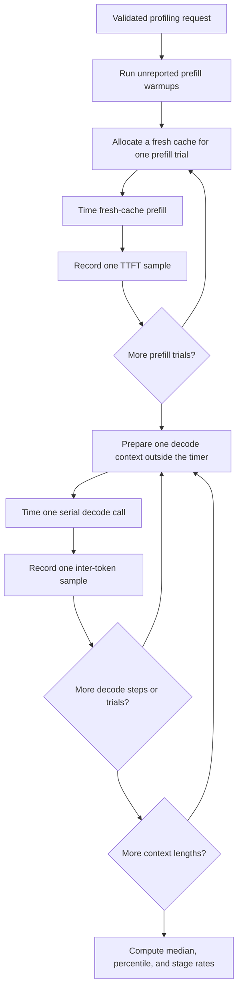

# Problem 044: Profile Prefill and Decode Separately

## Why this exists

A single tokens-per-second number combines two different workloads. Prefill processes a prompt with multi-token matrix shapes and creates the KV cache. Decode processes one new token at a time, rereads weights, and scans a growing cache. Averaging them hides whether startup latency, prompt throughput, or steady-state decode is the actual problem.

This lab times the shared CPU reference engine with a monotonic clock. It reports fresh-cache prefill trials separately from per-token decode trials at several initial context lengths.

## Learning outcomes

You can:

- define time-to-first-token, prompt throughput, and decode throughput boundaries;
- collect warmups and repeated measurements without timing prefill inside decode;
- compute median and nearest-rank percentiles;
- explain why decode context length changes attention work;
- label backend, clock, allocations, sampling, and synchronization included in a number; and
- choose an optimization target from stage-specific evidence.

## Prerequisites

- Problem 006 for prediction, measurement, and roofline discipline.
- Problem 039 for fresh-cache prompt prefill.
- Problem 040 for serial cached decode.
- Problem 041 for allocation and intermediate-lifetime costs.

## Vocabulary

- **Time to first token (TTFT)**: prompt prefill plus selection of the first generated token under a stated boundary.
- **Inter-token latency**: elapsed time for one serial decode engine call.
- **Prompt throughput**: prompt token count divided by prefill time.
- **Decode throughput**: generated token count divided by serial decode time.
- **Warmup**: unreported execution used to reach a representative runtime state.
- **Nearest-rank percentile**: sorted sample at index `ceil(p*N)-1`.
- **Context length**: number of prior tokens visible to the next decode token.

## Math from first principles

For sorted latencies $x_{(1)}\le\cdots\le x_{(N)}$, the nearest-rank percentile is

$$
P_p=x_{(\lceil pN\rceil)}.
$$

For an even number of samples, median is the mean of the two middle values. For `[10,20,30,40]` ns, median is 25 ns and nearest-rank $P_{75}$ is 30 ns.

If prefill handles $S$ prompt tokens in median time $t_p$ seconds,

$$
R_p=\frac{S}{t_p}.
$$

If one decode step has median latency $t_d$,

$$
R_d=\frac{1}{t_d}.
$$

These rates are not interchangeable. Prefill rate measures many prompt tokens in one engine call; decode rate measures a serial dependency chain.

## Shape, layout, and dtype contract

The request contains a validated `MiniDecoderModel`, nonempty in-vocabulary prompt IDs, positive context lengths, nonnegative warmups, positive measured trials, positive decode steps, and percentile in `(0,1]`.

Latency samples are UInt64 nanoseconds from `DispatchTime.uptimeNanoseconds`. Reported medians and rates use Double. Work estimates are integer FLOPs and bytes from the educational engine model; they are not hardware performance counters.

Each decode context is prepared by repeating the supplied prompt IDs to exactly `T` tokens. A fresh contiguous Float32 KV cache is populated before the measured serial steps.

## CPU reference path

The canonical profiler performs:

1. Unreported fresh-cache prefill warmups.
2. One fresh cache allocation and prefill call per measured trial.
3. Separate cache population for every decode context and trial.
4. Per-token timing around only `MiniDecoderCPUEngine.decode`.
5. Median, percentile, and rate computation after all trials.



```sh
swift run -c release inference-school profile 044 \
  --prompt-tokens 16 --trials 7 --warmup 2 --decode-steps 4
```

`benchmark 044` is an alias with the same options.

## Correctness method

Pure statistics tests establish odd/even medians and nearest-rank percentiles independently of wall-clock noise. The profiling judge then checks:

- exact sample counts;
- positive durations and rates;
- stage names `prefill.ttft` and `decode.context.T`;
- context order;
- backend label; and
- invalid percentile, warmup, trial, decode-step, and context inputs.

The judge does not require one context to be faster than another because real timing is noisy. It verifies measurement structure, not a fabricated performance ordering.

## Performance model

For the educational decoder, projection work and estimated weight bytes come from `MiniDecoderWorkModel`. Prefill's multi-token projections can reuse weights across $S$ rows. Decode reads a similar weight set for one row and attention scans cached K/V. As context $T$ grows, attention work grows approximately linearly per new token even when projection work stays fixed.

The report labels:

- real monotonic wall-clock samples;
- modeled FLOPs and estimated bytes;
- fresh-cache allocation included in prefill; and
- tensor allocation, cache append, sampling, and host execution included in decode.

No hardware counter is inferred from elapsed time.

## Metal mapping

This implemented profiler runs the CPU reference backend only. There is no Metal check for Problem 044.

To profile a future Metal engine honestly, place timestamp samples around command-buffer execution or use Instruments, preserve prefill/decode boundaries, report whether command submission and waits are included, and avoid a host timer that stops before asynchronous GPU work completes. Counter availability must be observed from the actual tool and device; this lesson does not invent GPU occupancy, bandwidth, or cache-hit values.

## Implementation checkpoints

1. Implement median and percentile statistics with known arrays.
2. Validate all counts and context lengths.
3. Warm up prefill without recording samples.
4. Allocate a fresh cache inside each measured prefill trial.
5. Populate decode context outside the per-token timer.
6. Record exactly `trials*steps` decode samples per context.
7. Convert nanoseconds to rates with explicit units.
8. Print backend, clock, and timing boundary beside results.

## Controlled experiments

### Context-length sweep

Use initial contexts `T`, `4T`, and `16T`. Predict how attention scanning changes decode latency while weight-read estimates remain similar.

### Prompt-length sweep

Hold trial count fixed and vary prompt length. Predict whether prompt tokens per second improves as fixed overhead is amortized.

### Allocation boundary

Move cache allocation outside prefill timing in a private experiment. The numerical result should not change, but TTFT should. This demonstrates why boundary labels are part of the result.

### Distribution stability

Compare one trial with at least seven. Predict how median and p95 change when transient system activity appears.

## Engine integration

The profile identifies whether the next engine change should target prompt execution, serial decode, cache traffic, or host allocation. Problem 047 reuses the same CPU engine and reports prefill and decode separately; it does not replace this multi-context profiling sweep.

## Tradeoffs and limitations

- Median is robust but hides tail latency; p95 is unstable with very few samples.
- More warmup improves runtime stability but increases experiment cost.
- Fresh-cache prefill reflects TTFT but includes allocation policy.
- CPU reference timings teach boundaries; they do not predict a future Metal backend.
- The educational model is too small for production throughput conclusions.
- Background system work can move wall-clock samples without a code change.

## Hints

- Use a monotonic clock, never wall-calendar time.
- Keep warmup samples out of the reported array.
- Rebuild the cache before each independent trial.
- Time one decode step at a time; do not divide a mixed prefill/decode session.
- Write the timing boundary before interpreting the number.

## Canonical solution

- [Contracts, statistics, work reports, and judge](../../Sources/InferenceSchoolCore/Problems/P044PrefillDecodeProfiling.swift)
- [Learner profiler](../../Sources/InferenceSchoolExercises/P044PrefillDecodeProfilingExercise.swift)
- [Canonical profiler](../../Sources/InferenceSchoolSolutions/P044PrefillDecodeProfilingSolution.swift)
- [Focused tests](../../Tests/InferenceSchoolCoreTests/P044PrefillDecodeProfilingTests.swift)

## Completion checklist

- [ ] Statistics pass hand-computed fixtures.
- [ ] Prefill and decode are measured in separate boundaries.
- [ ] Warmup and measured sample counts are explicit.
- [ ] Context lengths are reported beside per-token latency.
- [ ] Backend, clock, and included allocations are labeled.
- [ ] Modeled work is not presented as a hardware counter.
- [ ] A release profile and written prediction are recorded.
