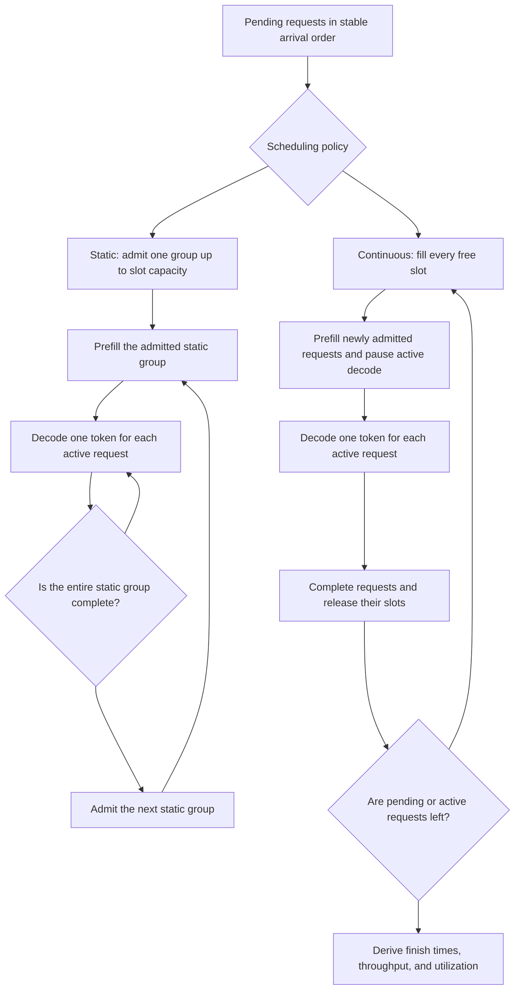

# Problem 045: Static and Continuous Batching

## Why this exists

Single-request decode leaves accelerator capacity unused when one sequence finishes before another or when requests arrive over time. Batching can improve total throughput, but scheduling policy changes queueing delay and per-request latency. A policy can improve makespan while making an already-running request finish later.

This systems lab uses a deterministic discrete-event simulator. Time is explicitly labeled as modeled scheduler units; it is not wall-clock GPU evidence. Token state remains independent for every request while static and continuous policies share the same semantic executor.

## Learning outcomes

You can:

- distinguish static groups from continuous slot refill;
- represent arrivals, prefill stalls, decode iterations, and completions as events;
- calculate makespan, request latency, throughput, and slot utilization;
- explain a throughput improvement that worsens one request's latency;
- preserve per-request token and cache ownership; and
- identify which modeled costs require real engine measurements before deployment.

## Prerequisites

- Problem 039 for prompt prefill as a distinct stage.
- Problem 040 for one serial token step per active request.
- Problems 022 and 027 for sequence-owned KV state and allocation.
- Problem 044 for separating measured latency from modeled quantities.

## Vocabulary

- **Static batching**: admit a group up to slot capacity and run it to completion before admitting another group.
- **Continuous batching**: refill slots as requests complete while other requests remain active.
- **Slot**: capacity for one active sequence in this model.
- **Iteration**: one decode token for each active request.
- **Makespan**: finish time of the final request.
- **Request latency**: finish time minus arrival time.
- **Slot utilization**: occupied slot-time divided by available slot-time.
- **Head-of-line effect**: one request delays work that could otherwise proceed.

## Math from first principles

For request $i$ with arrival $a_i$ and finish $f_i$,

$$
L_i=f_i-a_i.
$$

If the run processes $N$ prompt and generated tokens over makespan $M$ modeled units,

$$
R=\frac{N}{M}.
$$

For $C$ slots and event $e$ with duration $\Delta t_e$ and occupancy $o_e$,

$$
U=\frac{\sum_e o_e\Delta t_e}{CM}.
$$

The fixture uses two slots. Requests A and B arrive at 0; C arrives at 1. Decode lengths are 5, 1, and 5. Prefill costs one unit per maximum prompt token in the admitted group; every decode iteration costs one unit.

Static batching finishes A at 6, B at 2, and C at 16. Continuous batching admits C after B frees a slot. Its prefill pauses A, so A finishes at 11 rather than 6, while total makespan improves to 12. The fixture deliberately proves a tradeoff, not universal dominance.

## Shape, layout, and dtype contract

This problem has request records rather than tensors:

- nonempty unique string ID;
- nonnegative integer arrival time;
- nonempty integer prompt-token array;
- positive integer decode-token count;
- positive slot count; and
- nonnegative integer cost coefficients that yield positive stage durations.

Events form a contiguous integer timeline. Generated token IDs are deterministic integers from a request-local semantic function. Metrics use integer modeled units and Double rates. No duration is labeled milliseconds or nanoseconds.

## CPU reference path

The simulator stores runtime state by request ID. Static batching admits up to `slotCount`, emits one explicit prefill event, and advances that group until empty. Continuous batching refills free slots, emits a prefill event for newly admitted requests, then resumes decode for all active requests.

Each decode event records the exact token emitted for each participant. The semantic executor depends on request ID, prompt, prior generated tokens, and step so cross-request contamination is detectable.



```sh
swift run inference-school check 045 --cpu --solution
```

## Correctness method

The judge checks the exact static and continuous timelines through finish times and makespan. It also requires:

- continuous throughput greater than static throughput in the fixture;
- A's continuous latency greater than its static latency;
- request-local generated token sequences under both policies;
- total-token and throughput identities;
- utilization in `[0,1]`;
- contiguous bounded events; and
- rejection of duplicate IDs and zero slots.

The oracle computes each request's tokens independently of scheduling order.

## Performance model

Prefill duration is

$$
C_p=c_{p,0}+c_{p,t}\max_i S_i
$$

for newly admitted requests. Decode iteration duration is

$$
C_d=c_{d,0}+c_{d,r}A,
$$

where $A$ is active request count. These equations are intentionally replaceable. They let the lab isolate scheduling mechanics before introducing hardware variability.

The simulator reports modeled makespan, tokens per modeled unit, and slot utilization. It does not claim that padding to the longest prompt, linear active-request cost, or a prefill pause matches a particular production server.

## Metal mapping

There is no Metal kernel in Problem 045 because scheduling is a host-side policy. A real GPU implementation would construct batched tensor descriptors, sequence-to-slot maps, cache page tables, and command-buffer work for each iteration. It would also decide whether newly arrived prefill can interleave with decode.

Before replacing modeled units, measure prefill shapes, decode batch sizes, cache gather cost, and synchronization using the actual backend. Keep scheduler decisions on the host unless evidence supports device-side orchestration.

## Implementation checkpoints

1. Validate request identity, arrival, prompt, decode length, slots, and costs.
2. Implement a contiguous event append operation.
3. Advance idle time to the next arrival.
4. Admit requests in stable arrival order.
5. Preserve one runtime state per request ID.
6. Implement static groups to completion.
7. Implement continuous refill with explicit prefill events.
8. Derive metrics from the completed timeline and validate them.

## Controlled experiments

### Slot-count sweep

Try one, two, and four slots. Predict which workloads gain utilization and where prefill stalls dominate.

### Arrival burst

Move all arrivals to zero, then spread them apart. Predict when continuous refill becomes indistinguishable from static grouping.

### Length variance

Hold total generated tokens fixed while increasing variance among request lengths. Predict how static slot waste changes.

### Prefill cost

Increase the prompt length of late request C. Predict both makespan and the latency penalty imposed on already-running A.

Write predictions in modeled units. Do not translate them to milliseconds without a measured calibration.

## Engine integration

A production version would give each admitted request a tokenizer result, sampler state, stop policy, and KV-cache allocation, then gather active rows into the next batched decoder call. Problem 047 remains batch size one; this lab defines the scheduler boundary required to extend it without mixing sequence state.

## Tradeoffs and limitations

- Continuous batching can improve throughput while increasing latency for active requests.
- Static batches are simple and reproducible but waste slots after early completion.
- Prefill/decode interleaving policy can dominate tail latency.
- Padding and cache indirection costs are absent from the semantic executor.
- Modeled units establish causal scheduling behavior, not hardware performance.
- Fairness, priorities, cancellation, and memory admission are outside this fixture.

## Hints

- Keep pending, active, and completed states distinct.
- Use stable arrival order for equal timestamps.
- Record participants before removing completed requests.
- Set finish time after the decode event advances time.
- Recompute semantic tokens by request ID in the judge.

## Canonical solution

- [Contracts, semantic oracle, fixture, and judge](../../Sources/InferenceSchoolCore/Problems/P045BatchScheduling.swift)
- [Learner simulator](../../Sources/InferenceSchoolExercises/P045BatchSchedulingExercise.swift)
- [Canonical simulator](../../Sources/InferenceSchoolSolutions/P045BatchSchedulingSolution.swift)
- [Focused tests](../../Tests/InferenceSchoolCoreTests/P045BatchSchedulingTests.swift)

## Completion checklist

- [ ] Static and continuous fixture finish times match exactly.
- [ ] Every timeline event is contiguous and slot-bounded.
- [ ] Per-request generated tokens are schedule-independent.
- [ ] Throughput and utilization are derived from the timeline.
- [ ] The latency regression for A is explained.
- [ ] All timing quantities are labeled modeled scheduler units.
- [ ] A real-backend measurement plan is stated before hardware claims.
