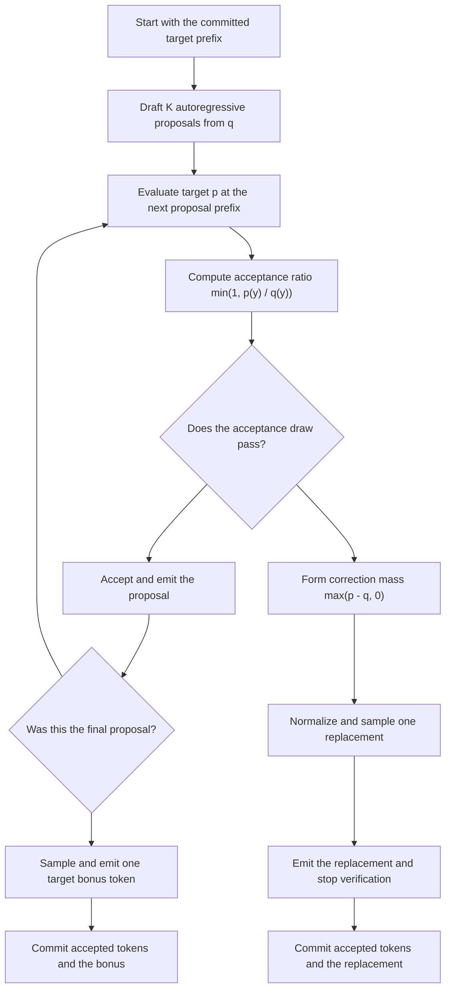

# Problem 046: Speculative Decoding

## Why this exists

Autoregressive target-model decoding has a serial dependency: token $t+1$ cannot be selected until token $t$ is known. Speculative decoding asks a cheaper draft model to propose several tokens, then verifies those proposals with the target distribution. When proposals are often accepted and target verification handles a block efficiently, one serial target step can emit several tokens.

A proposal is not accepted merely because the target also considers it likely. The accept/reject rule and rejection correction are required to preserve the target distribution.

## Learning outcomes

You can:

- generate a draft block with prefix-dependent distributions;
- compute the acceptance ratio $\min(1,p/q)$;
- sample the rejection correction proportional to $\max(p-q,0)$;
- emit a target bonus token when all proposals pass;
- prove the one-step output distribution equals the target; and
- derive when draft and verification costs can break even.

## Prerequisites

- Problem 009 for stable normalization.
- Problem 038 for deterministic categorical sampling.
- Problem 040 for the serial target-only baseline.
- Problem 044 for separating modeled speedup from measured latency.

## Vocabulary

- **Draft model**: cheaper provider with distribution $q$.
- **Target model**: distribution $p$ whose output law must be preserved.
- **Proposal block**: up to $K$ tokens sampled autoregressively from the draft.
- **Acceptance ratio**: $\alpha(y)=\min(1,p(y)/q(y))$ for sampled proposal $y$.
- **Correction distribution**: normalized positive part $[p-q]_+$ after rejection.
- **Bonus token**: target sample after all $K$ proposals are accepted.
- **Acceptance rate**: empirical or modeled probability that a proposal passes.

## Math from first principles

For proposal $y\sim q$, accept with

$$
\alpha(y)=\min\left(1,\frac{p(y)}{q(y)}\right).
$$

Accepted probability mass for token $y$ is

$$
q(y)\alpha(y)=\min(q(y),p(y)).
$$

If rejected, sample replacement from

$$
r(y)=\frac{\max(p(y)-q(y),0)}{\sum_z\max(p(z)-q(z),0)}.
$$

The total rejection probability is

$$
1-\sum_y\min(p(y),q(y))
=\sum_y\max(p(y)-q(y),0).
$$

Therefore accepted mass plus rejected-and-corrected mass is

$$
\min(p(y),q(y)) + \max(p(y)-q(y),0)=p(y).
$$

For `p=[0.25,0.75]` and `q=[0.75,0.25]`, accepted mass is `[0.25,0.25]`; rejection mass is `0.5`; correction is `[0,1]`; final output mass is `[0.25,0.75]`.

## Shape, layout, and dtype contract

A distribution provider receives the complete integer prefix and returns either logits or probabilities of exactly vocabulary size `V > 0`.

- Logits: finite Double values, normalized by max-subtracted softmax.
- Probabilities: finite nonnegative Double values with positive total mass, then normalized.
- Draft length: positive integer `K`.
- Prefix: any integer history meaningful to the provider.
- Random draws: deterministic Double values from `SeededGenerator`.
- A sampled draft token must have positive $q$ probability.

Traces retain every proposal prefix, distribution, probability, draw, acceptance decision, correction, and optional bonus.

## CPU reference path

The canonical block first samples all $K$ draft proposals autoregressively. It then verifies them in order using target distributions at each proposal prefix.

- On acceptance: emit proposal and continue.
- On rejection: sample one corrected replacement, emit it, and stop the block.
- If all pass: sample and emit one target bonus token from the prefix containing all proposals.

A separate target-only function emits the same requested number of tokens without drafting.



```sh
swift run inference-school check 046 --cpu --solution
```

## Correctness method

The judge uses exactly enumerable two-token distributions:

- accept-all proposals followed by a target bonus;
- certain rejection with correction `[0,1]`;
- algebraic one-step reconstruction of the target distribution;
- a high-acceptance cost case that crosses modeled break-even; and
- invalid `K=0` and vocabulary mismatch inputs.

The trace is part of correctness. It catches using the wrong prefix, skipping the bonus, continuing after rejection, or sampling from target rather than the correction distribution.

## Performance model

If each proposal is independently accepted with probability $a$, a block of maximum length $K$ emits an expected

$$
E[N]=\sum_{i=0}^{K}a^i
$$

tokens, including the possible bonus. The bundled modeled cost is

$$
C_s=K C_d+C_v,
$$

where $C_d$ is draft cost per token and $C_v$ is one target block-verification cost. Target-only cost for the same expected output is

$$
C_t=E[N]C_t^{(1)}.
$$

Modeled speedup is $C_t/C_s$. This assumes target verification is block-efficient. The current executable algorithm calls the target provider per proposal to expose probability semantics; it is not a measured parallel target kernel.

## Metal mapping

Problem 046 is CPU-only. A useful Metal implementation would run draft decoding, then evaluate target logits for the proposed block with prefill-like matrix shapes and a causal verification mask. It must commit KV state only through accepted proposals plus the replacement or bonus token.

GPU implementation must separately measure draft execution, target block verification, rollback or cache-copy cost, command submission, and synchronization. This lesson does not claim speedup from the CPU trace implementation.

## Implementation checkpoints

1. Normalize logits and probabilities with strict validation.
2. Sample exactly $K$ draft proposals with evolving prefixes.
3. Re-evaluate target distribution at each proposal prefix.
4. Compute and trace `min(1,p/q)`.
5. Stop at first rejection and sample normalized `[p-q]+`.
6. Emit a bonus target token after accept-all.
7. Implement a target-only baseline.
8. Verify distribution identity before evaluating cost.

## Controlled experiments

### Acceptance sweep

For fixed `K=4`, sweep modeled acceptance from 0 to 1. Predict expected emitted tokens and break-even.

### Draft-length sweep

Hold acceptance and costs fixed while changing K. Predict when extra draft work exceeds additional accepted output.

### Distribution mismatch

Move $q$ progressively away from $p$. Inspect acceptance ratios and correction mass, not only emitted tokens.

### Target verification cost

Compare a hypothetical block verification cost with $K$ independent target calls. Speculation only addresses serial target steps when block verification has a favorable shape or implementation.

## Engine integration

The providers can be backed by two decoder models sharing token IDs and stop rules. Integration requires separate draft and target KV state, accepted-prefix commit logic, and exact sampler semantics. Problem 047 does not claim speculative speedup; it supplies the target-style serial baseline and report boundary a future integration would compare against.

## Tradeoffs and limitations

- A poor draft lowers acceptance and can add work.
- A large K increases possible output per verification but wastes more rejected proposals.
- Draft and target must share vocabulary and tokenization semantics.
- Cache rollback and memory pressure can erase arithmetic gains.
- Greedy agreement is not a substitute for probability-correct stochastic verification.
- The cost model is conditional and modeled; no wall-clock speedup is bundled.

## Hints

- Save the draft distribution for every proposal; rejection needs its $q$.
- Verify proposal `i` against the prefix before that proposal.
- Consume a fresh acceptance draw even when ratio is one; deterministic traces depend on draw order.
- Stop verification immediately after correction sampling.
- Sample the bonus from target at the full accepted draft prefix.

## Canonical solution

- [Distribution math, traces, cost model, and judge](../../Sources/InferenceSchoolCore/Problems/P046SpeculativeDecoding.swift)
- [Learner implementation](../../Sources/InferenceSchoolExercises/P046SpeculativeDecodingExercise.swift)
- [Canonical implementation](../../Sources/InferenceSchoolSolutions/P046SpeculativeDecodingSolution.swift)
- [Focused tests](../../Tests/InferenceSchoolCoreTests/P046SpeculativeDecodingTests.swift)

## Completion checklist

- [ ] Accept-all emits K proposals plus one target bonus.
- [ ] First rejection emits one corrected token and stops.
- [ ] One-step output mass reconstructs the target distribution.
- [ ] Prefixes, draws, probabilities, and counts are traceable.
- [ ] Invalid dimensions and distributions are rejected.
- [ ] Break-even is derived from explicit draft and verification costs.
- [ ] Modeled speedup is never presented as measured acceleration.
