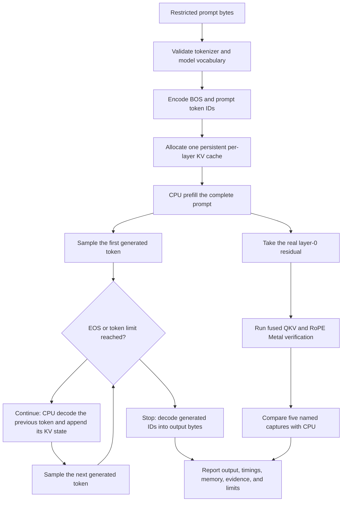

# Problem 047: Capstone Inference Engine

## Why this exists

The earlier problems are useful only if their contracts compose. This capstone takes prompt text through byte tokenization, multi-token prefill, a persistent per-layer KV cache, serial sampling and decode, byte rendering, memory planning, profiling, and named Metal parity captures.

The bundled model is deliberately small and deterministic. It has seven token IDs and synthetic Float32 weights. It proves that the course engine is connected and independently judged; it is not a pretrained language model or a production Metal inference backend.

## Learning outcomes

You can:

- enforce tokenizer/model vocabulary compatibility before inference;
- run text-to-token-to-text generation through one shared model;
- explain why the cache grows for decode inputs but not the just-selected final token;
- compare cached generation with independent full-prefix recomputation;
- report measured timings and modeled memory with explicit boundaries;
- verify a real Metal subgraph without relabeling CPU generation; and
- adopt and reject optimizations from evidence rather than feature lists.

## Prerequisites

- Problems 035-040 for model, tokenizer, sampling, prefill, and decode.
- Problem 041 for reusable arena plans.
- Problem 042 for named parity boundaries.
- Problems 043-044 for fused Metal verification and stage timing.
- Problems 045-046 for clearly scoped extensions not yet integrated into generation.

## Vocabulary

- **Compatible vocabulary**: tokenizer IDs exactly match model logits and embedding rows.
- **Generation backend**: implementation that actually computes the complete token sequence.
- **Verification slice**: limited backend execution used for parity, not generation.
- **Full-prefix oracle**: recomputes all prior tokens without using the candidate KV cache.
- **Stop reason**: EOS selection or maximum token count.
- **Arena plan**: modeled reusable intermediate address space from Problem 041.
- **Engineering report**: outputs, timings, resources, formats, evidence, and limitations together.

## Math from first principles

The capstone tokenizer maps exactly:

```text
0 EOS   1 BOS   2 a   3 b   4 c   5 space   6 period
```

For prompt `ab c.`, encoding with BOS is `[1,2,3,5,4,6]`. Every ID is in the model vocabulary `0..<7`.

Prefill computes logits after the final prompt position and populates every layer cache with $S$ entries. Sampling selects the first generated token $y_0$. That selected token is not in the cache until it becomes the input to the next decode call. After $G$ generated tokens,

$$
T_{cache}=S+\max(0,G-1).
$$

Each subsequent step computes

$$
y_i\sim\operatorname{Sample}(\operatorname{Decoder}(y_{i-1},K,V),\text{seed state}).
$$

The full-prefix oracle instead recomputes logits for `[prompt,y0,...,y(i-1)]` from scratch using the independent Double-accumulation reference. Equal sampled IDs demonstrate cache semantics, not merely repeated determinism.

## Shape, layout, and dtype contract

- Prompt bytes are restricted to ASCII `a`, `b`, `c`, space, and period. Other bytes fail rather than map to an unknown model ID.
- Tokenizer IDs are exactly `0...6`; BOS is 1 and EOS is 0.
- Model tensors are finite Float32 row-major with decoder projections `[output,input]`.
- KV cache is Float32 contiguous `[layer,position,KV head,feature]` storage.
- `maxNewTokens` is nonnegative; seed is UInt64.
- Generated IDs must remain in vocabulary and bytes must decode from those exact IDs.
- CPU and Metal capture comparison uses combined absolute/relative Float32 tolerance.

## CPU reference path

The canonical execution validates compatibility, encodes prompt bytes, allocates one cache, and runs `MiniDecoderCPUEngine.prefill`. It samples the first token from prefill logits, then repeatedly passes the previous selected token into `MiniDecoderCPUEngine.decode` with monotonically increasing absolute position.

Generated IDs are decoded while skipping BOS/EOS. Valid UTF-8 is printed as text; otherwise the report uses hexadecimal bytes. The report includes each stage time, final cache counts, weight bytes, allocated cache bytes, prefill/decode arena plans, formats, and limitations.

```sh
swift run -c release inference-school capstone --prompt "ab c." --max-tokens 4 --seed 47
```

## Correctness method

The capstone judge checks six independent concerns:

1. Exact restricted-byte tokenization and deterministic generation.
2. Cached Float32 decode against Double full-prefix recomputation on every step.
3. Cache growth and complete report invariants.
4. Explicit CPU backend and educational-model limitations.
5. Rejection of unsupported prompt bytes.
6. Rejection of incompatible tokenizer vocabularies.

Focused tests also run the actual Metal verification slice and require five named parity captures and three dispatches.

```sh
swift run inference-school check 047 --cpu --solution
swift test --filter P047CapstoneMetalVerificationTests
```

## Performance model

Real monotonic measurements include:

- prefill engine time;
- first-token sampling in TTFT; and
- each serial decode engine call.

Modeled memory includes exact Float32 model tensor bytes, allocated KV capacity, and first-fit arena sizes. The optimization comparison uses Problem 043's logical dispatch and tensor-byte model for layer-0 RMSNorm plus Q/K/V.

These categories remain separate. Arena bytes are not measured resident memory because Swift tensors do not allocate from that modeled arena. Metal resource bytes are actual buffer sizes requested by the verification pipeline, but they are not process peak RSS.

## Metal mapping

Generation runs on the CPU reference backend. When Metal is available, the capstone takes the real layer-0 residual from prefill and executes:

1. one fused RMSNorm/QKV dispatch;
2. one RoPE query dispatch; and
3. one RoPE key dispatch.

It compares these captures:

```text
layer.0.fused_qkv.query
layer.0.fused_qkv.key
layer.0.fused_qkv.value
layer.0.rope.query
layer.0.rope.key
```

The report records three command buffers, three synchronous host waits, per-call allocated shared buffers, and transfer bytes. Attention, output projection, MLP, cache updates, logits, and sampling remain on CPU. The report therefore says “Metal verification slice,” never “Metal inference backend.”



## Implementation checkpoints

1. Define an explicit tokenizer whose IDs exactly cover model vocabulary.
2. Round-trip prompt bytes before model execution.
3. Prefill one persistent cache and sample the first token.
4. Decode serially with correct token and logical-position ordering.
5. Render generated bytes without assuming UTF-8.
6. Match a full-prefix independent oracle.
7. Derive cache counts and memory fields.
8. Execute and label the Metal verification slice.
9. Record one adopted and one rejected optimization with evidence.
10. Print limitations beside results.

## Controlled experiments

### Prompt and seed repeatability

Run the same prompt and seed twice. IDs and bytes must match; wall-clock samples need not.

### Decode-length sweep

Use `max-tokens` 1, 2, 4, and 8. Predict cache counts from $S+G-1$ before running.

### Metal boundary

Run once normally and once with `--no-metal`. Generated IDs must match. Only verification captures and resource evidence should disappear.

### Arena comparison

Inspect prefill and decode arena bytes versus naive temporary bytes in code. State why this is modeled allocation evidence rather than current process memory reduction.

### Unsupported input

Try a byte outside the five-byte prompt alphabet. Predict the exact boundary at which execution fails: tokenizer compatibility before model execution.

## Engine integration

This is the cumulative educational engine. It integrates model data, tokenization, sampling, prefill, cached decode, memory planning, profiling, and a verified Metal subgraph. Problems 045 and 046 remain separately judged systems prototypes. Integrating them next would require batched model execution and separate draft/target model state, not merely calling their simulators from the capstone.

A real-model extension also requires a compatible production checkpoint loader, complete tokenizer vocabulary and merges, model-specific conventions, external reference captures, and rights to distribute the weights.

## Tradeoffs and limitations

- The seven-token fixture is connected but not linguistically meaningful.
- Restricted bytes make vocabulary compatibility explicit at the cost of general prompts.
- Float32 CPU execution is readable but not a throughput implementation.
- The Metal slice proves local numerical parity, not full-device generation.
- Per-call Metal allocation and waits are intentionally reported and currently rejected as a backend design.
- Wall-clock results are machine- and run-specific.
- Modeled arena and logical traffic values are not resident-memory or hardware-counter observations.

## Hints

- Sample the first token from prefill logits before any decode call.
- Append a generated token to cache only when it becomes the next decode input.
- Keep one seeded generator across the complete session.
- Decode bytes from token IDs, not from debug token labels.
- Make backend labels describe execution, not aspiration.
- Compare the earliest Metal capture before inspecting later values.

## Canonical solution

- [Contracts, fixture, report, independent oracle, and judge](../../Sources/InferenceSchoolCore/Problems/P047Capstone.swift)
- [Learner capstone](../../Sources/InferenceSchoolExercises/P047CapstoneExercise.swift)
- [Canonical CPU engine and Metal verification](../../Sources/InferenceSchoolSolutions/P047CapstoneSolution.swift)
- [CPU capstone tests](../../Tests/InferenceSchoolCoreTests/P047CapstoneTests.swift)
- [Metal verification tests](../../Tests/InferenceSchoolCoreTests/P047CapstoneMetalVerificationTests.swift)
- [Shared CPU engine](../../Sources/InferenceSchoolSolutions/MiniDecoderCPUEngine.swift)

## Completion checklist

- [ ] Prompt bytes round-trip through a model-compatible tokenizer.
- [ ] Cached generation matches the full-prefix independent oracle.
- [ ] Cache growth matches `S + max(0,G-1)` at every layer.
- [ ] Generated IDs, bytes, rendering, seed, and stop reason are reported.
- [ ] Prefill, TTFT, and serial decode boundaries are explicit.
- [ ] Weight, cache, and arena bytes are labeled by evidence type.
- [ ] Five Metal captures pass when a device is available.
- [ ] CPU generation is never labeled Metal inference.
- [ ] One optimization is adopted and one rejected with evidence.
- [ ] Educational-model and real-model limitations are stated.
