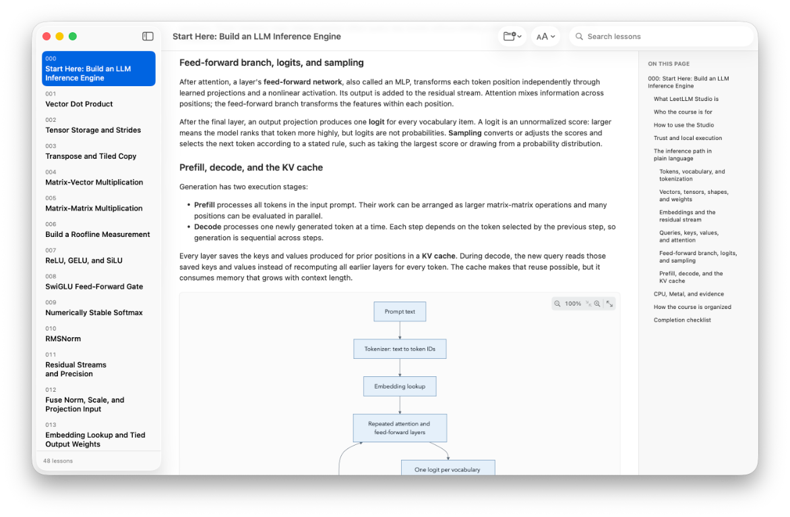

# Inference School

Inference School is a problem-based course in which every exercise contributes to one
small language-model inference engine for Apple Silicon. The problems are not
standalone interview puzzles. A dot product becomes GEMV, GEMV becomes Q/K/V
projections, those projections become attention, and the same path eventually
loads a model and generates tokens.

Each numerical operator has two required paths where a GPU mapping is part of
the lesson:

1. A readable Swift CPU implementation that acts as the correctness oracle.
2. A Metal implementation whose memory traffic, dispatch shape, and numerical
   behavior you can explain and measure.

The finish line is not merely "the tests pass." For each problem, you predict
performance, run an experiment, inspect the result, and integrate the operator
into the growing engine.

## How you use it

Inference School Studio is the primary learning environment. It is a native macOS app
with a searchable lesson reader, editable Swift and Metal source files,
out-of-process checks, persistent completion lists, diagrams, math rendering,
and text scaling from 80% to 200%. The command line exposes the same lessons,
learner files, judges, and benchmarks.



From the repository root, package and open the Studio:

```sh
scripts/package-studio.sh debug
open "dist/Inference School Studio.app"
```

The packaging script creates an ad hoc signed, sandboxed app for local use. It
does not produce a Developer ID signature or a notarized distribution.

It opens at the reader-only orientation lesson `000`. Read
[Start Here](docs/START-HERE.md) for setup, local-execution boundaries, and the
intended learning loop. Problems 001 through 047 are runnable, including the
final profiling and systems module.

The packaged Studio is signed with App Sandbox. The first runnable lesson asks
you to choose a dedicated build folder through the macOS folder picker. Editable
sources, compiler output, and generated learner executables stay under that
folder. The Studio host has the client entitlement required by WebKit on
supported macOS releases; its lesson, diagram, and editor assets are bundled,
and built-in checks do not upload learner code. Command-line checks are
separate: they run with the permissions of your terminal session.

## Companion book

The complete course is available as a 545-page PDF and a reflowable EPUB with
native diagrams, exercises, and chapter-end solutions:

[Download the Inference School Companion PDF](dist/Inference-School-Companion.pdf)

[Download the Inference School Companion EPUB](dist/Inference-School-Companion.epub)

Rebuild and verify it with:

```sh
make -C Book check
open "dist/Inference-School-Companion.pdf"
open "dist/Inference-School-Companion.epub"
```

The book toolchain requires Python 3, Pandoc, LuaLaTeX, latexmk, and
Ghostscript. The complete verification command also requires EPUBCheck.
Intermediate book files remain excluded from Git; the published PDF and EPUB
are versioned so readers can download them directly from the repository.

## Project status

This repository contains the complete runnable 47-problem curriculum and its
educational capstone inference engine:

- Problem 001: Vector Dot Product
- Problem 002: Tensor Storage and Strides
- Problem 003: Transpose and Tiled Copy
- Problem 004: Matrix-Vector Multiplication
- Problem 005: Matrix-Matrix Multiplication
- Problem 006: Build a Roofline Measurement
- Problem 007: ReLU, GELU, and SiLU
- Problem 008: SwiGLU Feed-Forward Gate
- Problem 009: Numerically Stable Softmax
- Problem 010: RMSNorm
- Problem 011: Residual Streams and Precision
- Problem 012: Fuse Norm, Scale, and Projection Input
- Problem 013: Embedding Lookup and Tied Output Weights
- Problem 014: Q/K/V Projections and Head Views
- Problem 015: Rotary Position Embeddings
- Problem 016: Causal Attention for One Head
- Problem 017: Multi-Head Attention
- Problem 018: MHA, MQA, and GQA
- Problem 019: Online Softmax Attention
- Problem 020: Tiled Fused Attention
- Problem 021: Sliding-Window Attention
- Problem 022: Preallocate and Append K/V
- Problem 023: Cached Single-Token Attention
- Problem 024: KV Layout Shootout
- Problem 025: Shared KV Heads
- Problem 026: Ring-Buffer Sliding Cache
- Problem 027: Paged KV Allocation
- Problem 028: Quantized KV Cache
- Problem 029: Symmetric INT8 Quantization
- Problem 030: Per-Channel and Groupwise Scales
- Problem 031: Pack and Unpack INT4
- Problem 032: Dequantize Then GEMV
- Problem 033: Fused Q4 GEMV
- Problem 034: Quantization Error Propagation
- Problem 035: One Decoder Transformer Block
- Problem 036: Parse a Model Weight Format
- Problem 037: Tokenization and Detokenization
- Problem 038: Logits and Sampling
- Problem 039: Prompt Prefill
- Problem 040: Autoregressive Decode
- Problem 041: Buffer Reuse and Memory Planning
- Problem 042: Checkpoint Parity and First Divergence
- Problem 043: Fuse RMSNorm and Q/K/V Projections
- Problem 044: Profile Prefill and Decode Separately
- Problem 045: Static and Continuous Batching
- Problem 046: Speculative Decoding
- Problem 047: Capstone Inference Engine
- CPU and Metal starter implementations
- Separate canonical CPU and Metal solutions
- A shared correctness judge
- Vector-dot, roofline, KV-layout, fused-Q4-GEMV, buffer-plan, fused-QKV,
  prefill/decode profile, and capstone report commands

The capstone runs the complete educational model on the CPU reference backend
and executes fused QKV plus RoPE as an explicitly labeled Metal verification
slice. It does not claim a pretrained model or complete Metal generation.

## Requirements

- An Apple Silicon Mac
- macOS 15 or newer
- Xcode or the Xcode command-line tools with Swift and Metal

Verify the local tools:

```sh
swift --version
xcrun --find metal
```

## Command reference

```sh
swift run inference-school list
swift run inference-school learn 001
swift run inference-school show 004
swift run inference-school check 004 --cpu
```

Learner checks are expected to fail value cases before you implement an
exercise. For problems with a Metal stage, implement both the Swift exercise
and its matching starter kernel, then run:

```sh
swift run inference-school check 004 --metal
swift run inference-school check 004
```

The canonical implementations let you verify the harness itself:

```sh
swift run inference-school check 004 --solution
swift test
```

Use a release build for measurements:

```sh
swift run -c release inference-school benchmark 001
swift run -c release inference-school benchmark 006
swift run -c release inference-school benchmark 024
swift run -c release inference-school benchmark 033
swift run inference-school benchmark 041 --tokens 128 --cached-tokens 128
swift run -c release inference-school benchmark 043 --tokens 32 --iterations 20
swift run -c release inference-school profile 044 --prompt-tokens 16 --trials 7
swift run -c release inference-school capstone --prompt "ab c." --max-tokens 4
```

## Course map

Start with [Problem 000](Problems/000-start-here/README.md), which defines the
course workflow and core model vocabulary. Then use
[Anatomy of One Token](docs/ONE-TOKEN.md) as a compact map of the complete
inference path before the course takes it apart. Keep the
[Math Primer](docs/MATH-PRIMER.md) nearby and read only the section needed for
the current problem.

The complete sequence is in [The Curriculum](docs/CURRICULUM.md). It moves
through:

1. Tensor storage, reductions, GEMV, GEMM, and performance measurement
2. Activations, SwiGLU, softmax, normalization, and fusion
3. Embeddings, Q/K/V, RoPE, and several forms of attention
4. KV-cache layouts, paging, windows, sharing, and quantization
5. Weight quantization and fused low-bit matrix-vector kernels
6. Model loading, tokenization, prefill, decode, sampling, and memory planning
7. Profiling, batching, speculative decoding, and a measured capstone engine

## Repository layout

```text
Problems/                    Full tutorials and required experiments
Sources/InferenceSchoolCore/         Judges and reusable host-side infrastructure
Sources/InferenceSchoolExercises/    Files the learner edits
Sources/InferenceSchoolSolutions/    Canonical answers, kept out of the exercise module
Sources/InferenceSchoolCLI/          list, show, check, and benchmark commands
Sources/InferenceSchoolStudio/       Native macOS lesson reader and workbench
Tests/                       Tests for judges, infrastructure, and answers
Web/                         Source and lockfiles for bundled browser resources
Book/                        Companion-book generator and publication checks
Packaging/                   App metadata and sandbox entitlements
docs/                        Course design, roadmap, math, and system context
```

The teaching and completion rules are documented in
[docs/COURSE-DESIGN.md](docs/COURSE-DESIGN.md).

## Security

Inference School executes learner code. The packaged Studio confines that work to an
App Sandbox and a user-selected folder, but command-line checks inherit the
permissions of the terminal that launches them. Read [Start Here](docs/START-HERE.md)
before running checks, and report vulnerabilities according to
[SECURITY.md](SECURITY.md).

## License

Inference School is licensed under the [Apache License 2.0](LICENSE). Dependency
attributions are recorded in [THIRD_PARTY_NOTICES.md](THIRD_PARTY_NOTICES.md)
and included in packaged Studio builds.
