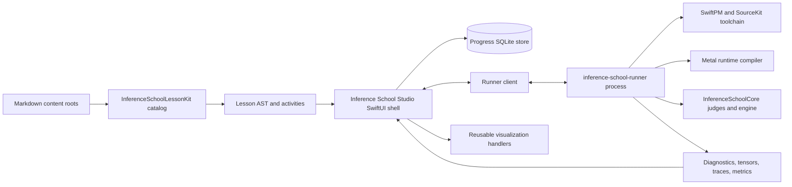

# Inference School Studio: Product and Implementation Plan

## Status

This document defines the target product, framework architecture, lesson format,
execution model, migration path, and quality bar for turning the existing
terminal course into a complete macOS learning playground.

The current repository is the curriculum and executable reference. The app must
reuse it rather than create a second set of lessons, tests, or inference rules.

As of 2026-07-13, the repository already has:

- 47 complete Markdown chapters;
- Swift exercise and canonical solution targets;
- shared judges for Problems 001-047;
- runtime-compiled Metal exercises where the curriculum requires them;
- a CLI for discovery, checking, benchmarking, profiling, and the capstone;
- 243 passing tests; and
- no app shell, Markdown catalog, editor integration, runner protocol,
  visualization framework, or progress store.

The delivery phases below describe the app and framework work. They do not
reclassify the completed terminal curriculum as unfinished.

## Decision summary

Inference School Studio will be:

- a native macOS application with a SwiftUI shell;
- an offline-first lesson reader, code workbench, visualization environment,
  judge, benchmark console, and inference laboratory;
- backed by an isolated local runner process for editable Swift and Metal code;
- driven by Markdown files discovered from configured content roots;
- usable with a plain Markdown lesson and progressively enhanced by optional
  fenced directives for quizzes, editable code, diagrams, traces, benchmarks,
  and inference controls;
- built on the existing `InferenceSchoolCore` contracts and judges; and
- a generic course framework underneath a Inference School-specific content pack.

The initial downloadable app should be Developer ID signed and distributed
outside the Mac App Store. Live compilation of arbitrary learner-authored Swift
requires the local Swift toolchain and a child runner process. A sandboxed App
Store build may later provide reading, quizzes, and precompiled demonstrations,
but it cannot be the primary product while editable Swift is a core promise.

## Product promise

A learner should be able to move continuously through this loop without leaving
the app:

```text
understand -> predict -> implement -> compile -> inspect -> measure -> explain
```

For an operator lesson, that means the learner can:

1. Read the derivation with rendered math and a worked example.
2. Manipulate shapes, layouts, and values in an interactive diagram.
3. Commit to a prediction before seeing a benchmark result.
4. Type Swift or Metal in a real multi-file editor.
5. Compile and receive line-level diagnostics.
6. Run visible and hidden correctness cases through the same judge as the
   canonical implementation.
7. Inspect tensors, errors, thread mappings, memory traffic, and timing.
8. Run the changed component in a model or inference scenario where applicable.
9. Explain the result and compare it with an explicit rubric.
10. Revisit the concept later through retrieval questions and transfer tasks.

The finish line is engineering judgment, not a green checkmark.

## Audience

The primary learner is a software engineer who can read code but does not yet
have a reliable mental model of transformer inference or GPU execution. The app
must also support:

- students learning systems and machine-learning infrastructure;
- experienced CPU engineers moving to GPU kernels;
- ML engineers who use frameworks but want to understand runtime behavior;
- instructors authoring private or public lesson packs; and
- contributors extending this course with new model architectures or hardware
  experiments.

No prior Metal experience is assumed. The app should not hide the Swift, MSL,
math, memory model, or measurement boundary in order to appear approachable.

## Product principles

### One cumulative machine

The app visualizes one engine being assembled. A completed artifact should
appear in the engine map and be reused later. Lessons are not disconnected code
puzzles.

### CPU semantics before GPU optimization

The readable CPU implementation remains the semantic oracle. Metal is compared
against it with explicit tolerance and reduction-order reasoning.

### Evidence before optimization

Prediction, measurement, and interpretation are first-class saved artifacts.
The app must distinguish measured values, modeled values, and assumptions.

### Shapes, layouts, dtypes, and units are always visible

Every tensor view and performance result should expose its shape, strides,
dtype, accumulation dtype, byte count, and units where applicable.

### Deterministic assessment owns deterministic facts

Compilers, judges, reference captures, and profilers assess executable claims.
An optional AI tutor may ask questions or explain diagnostics, but it must not
replace deterministic grading or silently invent a verdict.

### Markdown is the source of truth

Adding a Markdown file to a watched lesson root must make it appear in the UI
without editing a Swift registry. Plain Markdown is a valid read-only lesson.
Interactivity is progressive enhancement, not a requirement for discovery.

### Offline by default

Lessons, code, compilation, Metal execution, progress, and the educational model
must work without an account or network connection. Learner code stays local
unless the learner explicitly exports or shares it.

The educational fixture, its algorithms, and any future bundled weight assets
are versioned with the app and content pack. Updating them is a content migration
that must rerun deterministic judges and either preserve or explicitly revise
expected outputs. Offline does not mean that old attempts are silently rejudged
against a newer fixture.

## Scope and non-goals

The first complete release includes:

- the 47 existing lessons;
- Markdown, GFM tables, syntax-highlighted code, KaTeX math, and Mermaid;
- editable Swift and Metal exercises;
- multiple-choice and multiple-select questions;
- structured correctness results and compiler diagnostics;
- tensor, matrix, attention, cache, quantization, GPU, and performance diagrams;
- release benchmarks with saved predictions;
- an inference lab over the educational mini-model;
- local progress, attempt history, notes, and evidence export;
- author mode with folder discovery and hot reload; and
- a documented content-pack format.

The first release does not promise:

- arbitrary untrusted code execution as a security boundary;
- an App Store-compatible live Swift compiler;
- a production pretrained model runtime;
- full Metal generation when only a verification slice exists;
- high-stakes secret examinations in a local Markdown file; or
- 47 bespoke screens that cannot be reused by future lessons.

## Deferred future scope: web edition

**Decision:** a browser edition is feasible, but it is deferred and is not part
of the delivery phases in this plan. The native macOS app remains the primary
product because a web edition would either provide a reduced learning experience
or require substantial execution infrastructure while still failing to match the
local Swift and Metal workflow.

The viable web architecture is not a SwiftUI port. If this scope is revisited,
the preferred design is:

- a new TypeScript browser application for navigation, lesson rendering,
  editing, diagrams, quizzes, progress, and runner event presentation;
- the existing Markdown lessons as the single content source;
- generated catalog data from `InferenceSchoolLessonKit` rather than a second independent
  parser for lesson metadata and directives;
- reuse of the existing browser-native CodeMirror and Mermaid packages;
- the versioned `RunRequest` and `RunEvent` contract exposed through a transport
  appropriate to each execution backend; and
- optional precompiled Swift WebAssembly modules for portable CPU reference
  demonstrations, not as the foundation of the browser UI.

Swift WebAssembly can run code that has already been cross-compiled to Wasm. It
is useful for deterministic CPU operators, reference inference, and interactive
visualizations. It does not by itself compile arbitrary Swift source entered by
a learner in the browser. Shipping a Swift compiler, SwiftPM environment,
package filesystem, diagnostics pipeline, and execution controls into the
browser would be a separate large project.

Wasm also does not preserve the Metal part of the course. Browser GPU compute
uses WebGPU and WGSL rather than Metal and MSL. Porting the kernels to WGSL would
create and maintain a second implementation, judge surface, performance model,
and teaching target. It may be valuable for a distinct cross-platform GPU
course, but it is not equivalent to this Apple Silicon and Metal curriculum.

The possible execution models and their compromises are:

| Model | Editable Swift | Metal | Offline | Principal compromise |
| --- | --- | --- | --- | --- |
| Static reader or PWA | No | No | Yes | Lessons and passive activities only |
| Precompiled Swift/Wasm | No; fixed CPU modules only | No | Yes | Cannot judge arbitrary learner Swift |
| Web UI plus local Mac companion | Yes | Yes | Yes after installation | Still requires installing and trusting local software |
| Web UI plus remote Mac runner | Yes | Possible | No | Security, isolation, capacity, latency, and operating cost |
| WebGPU and WGSL rewrite | No | No; a different GPU API | Yes | Creates a second curriculum rather than preserving this one |

If full execution is ever required, the web client should depend on a single
runner abstraction with interchangeable precompiled-Wasm, local-companion, and
remote transports. The existing JSONL protocol is the starting boundary; the
browser transport could use streamed HTTP, server-sent events, or WebSockets
without moving judge ownership into the UI.

This scope should be reconsidered only when the native product is mature and
there is evidence that browser access justifies one of these explicit product
compromises: a reduced reader/demo edition, a required local companion, or the
cost and security obligations of a controlled remote Mac execution service.
Until then, web work is limited to browser components that directly improve the
native app and remain reusable later.

## Learner experience

### Main window

The desktop layout is a resizable three-region workspace rather than a landing
page:

1. **Curriculum sidebar**: course, module, lesson status, search, bookmarks, and
   review queue.
2. **Lesson canvas**: prose, math, tables, diagrams, inline questions, and
   checkpoints.
3. **Workbench**: tabs for Code, Tests, Tensors, GPU, Performance, and Inference.

The workbench can dock on the right or bottom and can enter a focused full-window
mode. The lesson remains at the relevant checkpoint when the learner runs code.

The toolbar exposes familiar commands with icons and tooltips:

- Run or Check;
- Stop;
- Reset checkpoint;
- Reveal next hint;
- Compare with canonical;
- save snapshot; and
- open the current file in an external editor.

### Lesson canvas

The lesson canvas supports:

- a sticky section outline;
- rendered inline and display math;
- code samples with line references into the workbench;
- tables that remain readable at narrow widths;
- glossary popovers on defined terms;
- expandable derivations and hints;
- inline quizzes with answer-specific explanations;
- authored Mermaid diagrams;
- data-bound interactive visualizers; and
- checkpoint buttons that configure the workbench for the next task.

Reading position is stored per lesson and per content version.

### Code workbench

The code workbench provides:

- multi-file tabs for Swift and Metal;
- syntax highlighting, bracket matching, search, multi-cursor editing, and
  keyboard-first navigation;
- SourceKit-LSP diagnostics and completion for Swift;
- Metal compiler diagnostics mapped back to source lines;
- learner, starter, and canonical diffs;
- a visible run configuration and fixture selector;
- per-case judge output rather than a single pass/fail light;
- stdout and stderr with output limits;
- cancellation and execution timeout; and
- snapshots that let a learner compare two implementations or experiments.

The editor should use an established editor engine. The implementation spike
should compare a bundled Monaco editor bridged through `WKWebView` with a mature
native TextKit-based component. Hand-building a basic `TextEditor` into a code
editor is outside the quality bar.

### Multiple-choice activities

Questions are used for retrieval and misconception diagnosis, not filler. Each
choice can define its own explanation and misconception tag. The learner must
commit before feedback appears.

Supported forms are:

- single choice;
- multiple select;
- numeric answer with units and tolerance;
- ordering steps;
- match shape to operation; and
- prediction before execution.

Confidence is recorded separately from correctness. A confidently wrong answer
enters the review queue sooner than an uncertain correct answer.

### Inference lab

The inference lab is an inspectable execution surface, not a chat mockup. It
contains:

- prompt input and exact UTF-8 bytes;
- tokenizer steps and token IDs;
- sampling controls for greedy, temperature, top-k, top-p, and seed;
- a generated-token timeline;
- separate prefill and decode timing;
- per-layer KV-cache growth;
- stage-level memory and dispatch accounting;
- an engine graph highlighting the active stage;
- named tensor captures with CPU/reference/Metal comparison;
- attention heatmaps and causal/window masks;
- a CPU versus available Metal parity panel; and
- explicit backend and model limitations.

Changing an operator in the learner workspace can rebuild and run the capstone
against the same deterministic scenario. The app must continue to label current
generation as the CPU reference backend and the fused-QKV/RoPE path as a Metal
verification slice until the implementation genuinely changes.

## Visualization system

The visualization layer is driven by structured data emitted by the runner. It
must not scrape terminal prose.

### Reusable visualizers

1. **Scalar and vector explorer**: values, products, partial sums, and rounding.
2. **Tensor inspector**: shape, strides, dtype, contiguous ranges, logical index,
   and physical offset.
3. **Matrix operation explorer**: select an output cell and highlight the input
   row, input column, multiply-add sequence, and operation count.
4. **Reduction tree**: lanes, partial values, barriers, inactive padded lanes,
   and reduction order.
5. **Threadgroup map**: grid, threadgroups, SIMD groups, memory spaces, and
   synchronization timeline.
6. **Activation and normalization plot**: function curve, input distribution,
   epsilon, scale, and accumulation precision.
7. **Attention explorer**: Q/K dot products, scaling, mask, row maximum,
   probabilities, weighted V, and materialized versus online state.
8. **KV-cache explorer**: logical positions, physical layout, GQA head mapping,
   ring wraparound, pages, allocation, and quantized bytes.
9. **Quantization explorer**: ranges, scales, groups, integer codes, packed
   nibbles, reconstruction error, cosine similarity, and first divergence.
10. **Memory arena view**: buffer lifetimes, aligned ranges, reuse, peak live
    bytes, and fragmentation.
11. **Roofline and benchmark plot**: arithmetic intensity, ceilings, measured
    points, confidence intervals, and measurement boundary.
12. **Inference trace**: tokenizer, embedding, layers, cache, final norm, logits,
    sampler, and generated token.

Visualizers accept stable schema versions so future lessons can reuse them by
declaring data, not by adding a new screen.

### Diagram behavior

Every diagram must support:

- keyboard selection;
- VoiceOver labels and a tabular fallback;
- color-independent encoding;
- reduced-motion mode;
- value inspection without hover;
- reset and deterministic replay; and
- export as PNG plus accessible data as CSV or JSON.

## Markdown-first lesson framework

### Content roots

`LessonCatalog` discovers lessons from any number of content roots:

- the built-in Inference School content pack;
- the repository's `Problems/` directory in author mode;
- user-selected folders stored as security-scoped bookmarks;
- unpacked or installed `.leetcourse` packs; and
- a future read-only remote catalog downloaded only with explicit consent.

Each root is scanned recursively for `.md` files. Hidden directories, build
outputs, and configurable ignore patterns are skipped. File-system changes
produce catalog updates without restarting the app.

Discovery and execution are separate capabilities:

| Lesson form | Appears automatically | Needs app code | Needs learner trust |
| --- | --- | --- | --- |
| Plain Markdown | Yes | No | No |
| Markdown with quizzes or declarative diagrams | Yes | No, when using an existing generic handler | No |
| Self-contained Swift snippet with declared tests | Yes | No, when using the generic snippet evaluator | Run confirmation |
| Repository-backed exercise | Yes | No UI code; requires a trusted workspace and supported command evaluator | Yes |
| New interaction or execution kind | Yes as readable Markdown | One reusable handler before it becomes interactive | Depends on capability |

A newly discovered lesson is never hidden because its executable capability is
unavailable. The UI renders it and explains which activity cannot run. This is
how plain Markdown remains first-class without pretending every arbitrary code
contract can be inferred from prose.

### Plain Markdown fallback

A file containing only this is already a lesson:

```markdown
# Why GEMV dominates one-token decode

The rest of the lesson is ordinary Markdown.
```

Metadata is inferred in this order:

| Field | Preferred source | Fallback |
| --- | --- | --- |
| ID | front matter `id` | content-pack namespace plus relative path |
| Title | front matter `title` | first H1, then filename |
| Order | front matter `order` | leading numeric path component, then lexical |
| Module | front matter `module` | parent directory |
| Summary | front matter `summary` | first prose paragraph |
| Tags | front matter `tags` | empty |
| Prerequisites | front matter `prerequisites` | empty |

The app must render a lesson even when optional metadata is absent. Author mode
shows suggestions without treating a plain lesson as invalid.

For stable progress across file moves, authors should add an explicit ID. A
path-derived ID remains a supported fallback, with a warning before a move would
orphan progress.

### Optional front matter

Richer navigation uses common YAML front matter:

```yaml
---
formatVersion: 1
id: inference-school.014
title: Q/K/V Projections and Head Views
order: 14
module: positions-and-attention
prerequisites: [inference-school.002, inference-school.004, inference-school.005]
tags: [attention, shapes, gqa]
estimatedMinutes: 90
contentVersion: 1
capabilities: [swift, tensor-visualizer]
---
```

Front matter is optional. It must never be the reason an otherwise valid
Markdown document disappears.

### Progressive enhancement through fenced directives

Interactive blocks remain valid Markdown code fences. Outside Inference School Studio,
they degrade to visible, inspectable text rather than proprietary binary data.

An inline quiz can be authored in one file:

````markdown
```quiz {#qkv-output-width}
schemaVersion: 1
prompt: With Hq=8, Hkv=2, and dh=64, what are the Q and K widths?
select: one
choices:
  - id: a
    text: Q=512, K=128
    explanation: Query and KV heads use their own head counts.
  - id: b
    text: Q=128, K=512
    explanation: This swaps Hq and Hkv.
answer: a
misconceptions:
  b: swapped-query-and-kv-heads
```
````

An editable snippet can also remain entirely in Markdown:

````markdown
```swift {#head-index .exercise evaluator="swift-snippet"}
func headAndFeature(column: Int, headDimension: Int) -> (Int, Int) {
  // Your code here
}
```

```tests {for="head-index" visibility="visible"}
schemaVersion: 1
- input: [130, 64]
  output: [2, 2]
- input: [63, 64]
  output: [0, 63]
```
````

A repository-backed exercise can bind the editor to an existing file and judge:

````markdown
```exercise {#p014-cpu}
schemaVersion: 1
language: swift
file: Sources/InferenceSchoolExercises/P014QKVProjectionExercise.swift
evaluator: inference-school-check
arguments: ["014", "--cpu"]
visualizers: [tensor, matrix-operation]
```
````

Other built-in directive kinds are:

- `quiz`, `numeric`, `ordering`, and `prediction`;
- `swift`, `metal`, `exercise`, and `tests`;
- `mermaid`, `tensor`, `matrix`, `attention`, `kv-cache`, and `quantization`;
- `benchmark`, `roofline`, and `trace`; and
- `inference`.

Unknown directives render as ordinary code blocks and produce an author-mode
warning. This lets newer content remain readable in older app versions.

Every directive kind has a published schema defining required fields, optional
fields, references, output bindings, and supported schema versions. Version 1 is
assumed only for early author previews; `inference-school-lesson pack` writes an explicit
`schemaVersion`. A newer unsupported version falls back to a code block and an
author warning rather than partial execution. Directive schemas and sample
documents are validated in CI.

### Generic handlers, not lesson-specific screens

The app registers handlers by activity kind, such as `quiz`, `swift-snippet`,
`tensor`, or `inference`. A new lesson using an existing kind requires no Swift
UI code and no registration. A genuinely new interaction type requires one new
generic handler, after which any lesson can use it.

This is the boundary that makes the framework extensible without allowing a
Markdown file to inject arbitrary UI code.

### Content packs

A course pack has this optional structure:

```text
MyCourse/
  course.yml                 optional metadata and capabilities
  Lessons/
    001-introduction.md
    002-first-operator.md
  Assets/                    images, data, reference captures
  Workspace/                 optional SwiftPM starter workspace
  Tests/                     optional private/local harnesses
```

With no `course.yml`, the folder name becomes the course title and all Markdown
files are still discovered. A pack manifest adds namespacing, versioning,
minimum app version, declared capabilities, and signing information.

Markdown-only packs are inert content and need no trust prompt. Packs that ask
to compile code, execute commands, or access a workspace declare those
capabilities and require explicit learner trust.

For example:

```yaml
formatVersion: 1
id: example.my-course
title: My Custom Course
version: 1.0.0
minimumAppVersion: 1.0.0
capabilities:
  - read
  - compile-swift
  - compile-metal
  - execute-workspace-command
```

Third-party packs default to `read`. Compilation and workspace commands remain
disabled until the learner reviews the requested capabilities. A manifest does
not make executable content safe; it makes the request visible and enforceable.

### Author workflow

Author mode provides:

- Open Course Folder;
- live catalog and lesson reload;
- front-matter and directive diagnostics;
- duplicate-ID and broken-link checks;
- a section-outline and accessibility audit;
- activity preview with fixture data;
- `inference-school-lesson validate`, `preview`, `test`, and `pack` CLI equivalents;
- content-version and progress-migration previews; and
- a generated compatibility report for the minimum app version.

Adding a new `.md` file to a watched folder must make it visible immediately.
No `Course.swift` edit, app rebuild, or manual menu entry is permitted.

## Execution architecture

### Why execution is out of process

Learner code can crash, loop forever, allocate excessive memory, call `exit`, or
trigger a GPU failure. It must not execute in the UI process.

The app communicates with a `inference-school-runner` process using versioned JSON Lines
messages over pipes. The runner owns workspace preparation, compilation,
execution, cancellation, output limits, and structured result capture.

The runner is a separately signed executable bundled inside the app. The app
launches it on demand, performs a protocol-version handshake, and replaces it as
one unit during app updates. It does not bundle the Swift toolchain. If the
runner is missing, incompatible, or cannot launch, reading, quizzes, notes, and
declarative diagrams remain available while executable activities show one
actionable setup state.

The packaged app also applies App Sandbox to the Studio, runner, and generated
learner executable. A security-scoped bookmark carries the user's explicit
build-folder grant across the runner boundary. The Studio host has the client
entitlement required by WebKit, while its content remains bundled and built-in
checks do not upload learner code. The runner currently inherits the Studio
sandbox, including that entitlement. Process separation still matters for
crash recovery and cancellation. Executing code supplied by an untrusted
third-party pack may require a stronger resource-isolation boundary, such as a
disposable VM or a remote runner, and is not silently enabled.

### Swift execution

The app requires an installed compatible Xcode Swift toolchain. The runner
reads the active developer directory from `xcode-select` and invokes the
toolchain's `swiftc` directly; it does not invoke SwiftPM or nested
`sandbox-exec` while building learner code.

At launch and whenever toolchain settings change, the app records the developer
directory, Swift version, target architecture, and Metal compiler availability.
If no compatible toolchain is found, it offers Retry and Read-Only Mode and
shows the exact missing prerequisite. A toolchain setup failure is never
reported as a learner-code diagnostic.

For repository-backed lessons, the runner maintains a fixed learner workspace
inside the folder granted through the macOS picker. Learner edits are real files in that
workspace. A run performs an incremental build and executes the same judges as
the CLI.

For a self-contained Markdown snippet, the runner generates a small ephemeral
SwiftPM target from the starter, support types, and declared tests. Compilation
diagnostics are mapped to the original lesson block and line numbers.

The runner must support:

- debug correctness builds;
- explicit release benchmark builds;
- incremental build caching keyed by workspace and toolchain;
- clean rebuild;
- timeout and cancellation;
- maximum stdout/stderr and artifact size;
- deterministic environment variables; and
- structured diagnostics, tests, captures, and metrics.

### Metal execution

Metal source continues to compile at runtime through
`MTLDevice.makeLibrary(source:options:)`. The runner, not the UI, owns the Metal
device, command queue, pipeline, dispatch, and result buffers.

Compiler diagnostics are normalized into the same source-diagnostic schema as
Swift. Metal exercises can rerun without rebuilding the Swift app when only MSL
changes.

The UI must show:

- selected device;
- function name;
- grid and threadgroup dimensions;
- buffer bindings and byte counts;
- compile and pipeline creation time;
- command-buffer status;
- CPU/reference parity; and
- measured timing boundary.

### Judge integration

The current `ProblemRunner` mapping is private to `InferenceSchoolCLI`. It must be
extracted into a reusable runtime boundary or exposed through a structured CLI
mode. The first migration should add:

- a public problem/activity registry shared by CLI and runner;
- `inference-school check ... --format jsonl`;
- stable IDs for stages and cases;
- typed diagnostics and attachments; and
- no terminal-string parsing in the app.

Judges remain in `InferenceSchoolCore`. The app must not reproduce expected values,
tolerances, or hidden cases.

### Runner protocol

Representative messages are:

```text
RunRequest
  runID, lessonID, activityID, workspace, mode, toolchain, limits

RunEvent
  accepted
  buildStarted / buildFinished
  diagnostic
  caseStarted / casePassed / caseFailed
  tensorSnapshot
  traceEvent
  benchmarkSample
  stdout / stderr
  completed / cancelled / timedOut / crashed
```

Every event includes a schema version and run ID. Large tensors and traces are
written as bounded artifacts and referenced by URL rather than copied through a
pipe.

## System architecture



### Proposed modules

| Module | Responsibility |
| --- | --- |
| `InferenceSchoolLessonKit` | Markdown parsing, front matter, directives, discovery, validation, content packs |
| `InferenceSchoolRunnerProtocol` | Codable requests, events, diagnostics, artifacts, schema versions |
| `InferenceSchoolRuntime` | Shared problem registry, judge adapters, benchmark and inference scenarios |
| `InferenceSchoolVisualizationKit` | Tensor, GPU, attention, cache, quantization, performance, inference views |
| `InferenceSchoolProgressStore` | Attempts, evidence, mastery, notes, content-version migrations, export |
| `inference-school-runner` | Toolchain discovery, workspace builds, Metal execution, process limits |
| `inference-school-lesson` | Validate, preview, test, index, and package author content |
| `InferenceSchoolStudio` | SwiftUI navigation, lesson canvas, workbench, settings, accessibility |
| `InferenceSchoolContent` | Built-in Markdown, assets, starter workspace, fixtures, and pack metadata |

The macOS app should be a thin Xcode app target over local Swift packages. The
framework, runner protocol, runtime, and authoring tools remain testable with
SwiftPM.

## Core data model

```text
CoursePack
  id, version, title, roots, capabilities, trust

LessonDocument
  id, sourceURL, contentVersion, title, order, module, prerequisites
  markdownAST, activities, assets, diagnostics

LessonActivity
  id, kind, configuration, required, dependencies

Attempt
  lessonID, activityID, contentVersion, startedAt, completedAt
  sourceSnapshot, answer, runIDs, hintLevel

Evidence
  prediction, judgeReport, benchmarkReport, reflection, attachments

Mastery
  lessonID, requiredActivityStates, reviewSchedule, misconceptionTags
```

Progress is keyed by explicit lesson and activity IDs plus content version. The
store must support schema migrations and JSON export. It must never edit lesson
source files to record learner state.

Two versions serve different purposes:

- `revisionHash` is computed from the source and invalidates render caches on
  every edit.
- `contentVersion` is author-controlled and changes when the learning or
  assessment contract changes.

Prose corrections do not invalidate evidence. Adding an optional activity
preserves prior completion. Removing an activity archives its attempts rather
than deleting them. Renaming or replacing an activity requires an explicit
old-ID to new-ID migration; without one, prior evidence is retained as stale and
is never silently assigned to a different task. `inference-school-lesson validate` checks
these migrations against the previous published pack.

## Pedagogical model

### Worked example to independent transfer

Each major concept follows a fading-scaffold sequence:

1. fully worked numerical example;
2. partially completed example with prompts;
3. implementation checkpoint with visible tests;
4. hidden edge cases through the shared judge;
5. controlled experiment requiring a prediction;
6. explanation against a rubric; and
7. transfer task using a new shape, layout, or constraint.

### Completion is evidence-based

A generic lesson declares required activities. For the existing operator and
kernel lessons, completion normally requires:

- concept retrieval complete;
- CPU judge passing;
- Metal judge and parity passing when applicable;
- prediction saved before benchmark reveal;
- benchmark run in release mode;
- interpretation submitted; and
- integration checkpoint complete.

The app shows these as evidence, not as an arbitrary percentage based on scroll
position.

### Hint ladder

Hints are staged:

1. restate the invariant or contract;
2. point to the relevant shape, equation, or diagnostic;
3. show pseudocode or a reduced case;
4. reveal a localized canonical diff; and
5. reveal the complete solution with an explanation.

Hint use is recorded for review scheduling but does not shame or lock out the
learner.

### Review and retention

The review queue uses authored concept questions and prior misconception tags.
It should schedule short retrieval tasks after completion and later transfer
questions, while remaining transparent and configurable. The initial algorithm
can be a simple deterministic interval model; it should not pretend to infer
mastery from opaque engagement metrics.

## Inference School migration plan

### Preserve one source of truth

The following current ownership remains authoritative:

- lesson prose: `Problems/*/README.md`;
- problem behavior and judges: `Sources/InferenceSchoolCore`;
- learner code: `Sources/InferenceSchoolExercises`;
- canonical code: `Sources/InferenceSchoolSolutions`;
- real Metal pipelines: `Sources/InferenceSchoolCore/Metal`; and
- inference reports and fixtures: the existing problem contracts.

`Course.availableProblems` and the CLI's private `ProblemRunner` are current
duplication points. The migration replaces hand-maintained UI metadata with the
Markdown catalog and moves execution routing into `InferenceSchoolRuntime`, shared by
CLI and app.

The migration order is:

1. Build the catalog from Markdown and prove it discovers all 48 readable lessons.
2. Make `Course` a compatibility facade over a generated catalog snapshot, then
  remove the handwritten 47-entry metadata array.
3. Extract the CLI's execution switch into `InferenceSchoolRuntime` and make both the
  CLI and runner use it.
4. Add a CI test that catalog IDs, supported runtime activities, source files,
  and judges agree.

The UI may not introduce a parallel problem registry while this migration is in
progress. Generic inline snippets use the generic compiler evaluator and need no
per-lesson runtime entry. Existing repository-backed problems use the shared
Inference School runtime registry because their typed judges are intentionally code.

### Lighthouse vertical slices

Before converting all lessons, build three complete lessons:

Their content and executable contracts already exist. App-specific work does
not: none currently has app directives, editor integration, interactive
visualizers, or persisted activity state. Problem 001 has CPU and Metal paths;
Problem 014 is CPU-only and is selected for its shape pedagogy; Problem 047 has
CPU generation plus five fused-QKV/RoPE Metal parity captures.

#### Problem 001: execution slice

Proves:

- Markdown rendering;
- Swift editing and incremental compilation;
- shared CPU judge;
- Metal editing and runtime compilation;
- reduction-tree and threadgroup visualization;
- prediction-before-benchmark; and
- progress persistence.

#### Problem 014: conceptual visualization slice

Proves:

- shape and head-count controls;
- Q/K/V matrix and head-view diagrams;
- multiple-choice misconception feedback;
- tensor snapshots and index-to-offset inspection;
- `Hq != Hkv` behavior; and
- direct reuse of a plain Markdown chapter with optional directives.

#### Problem 047: systems slice

Proves:

- editable prompt and sampling controls;
- tokenizer and generated-token trace;
- prefill/decode timing separation;
- KV-cache growth and memory accounting;
- named capture comparison;
- real Metal verification reporting; and
- honest backend and fixture labeling.

The current `CapstoneReport` already exposes prompt and generated token IDs,
stage timings, final per-layer cache counts, memory accounting, and five named
Metal captures for fused Q, K, V and rotated Q, K. It does not yet emit the full
per-stage tensor stream, attention heatmaps, or cache mutation events needed by
the target inference lab. Phase 5 includes that trace instrumentation; the UI
must not synthesize missing captures.

Do not begin 47-screen production before these slices demonstrate that the
generic framework can express all three.

### Conversion by reusable family

After the lighthouse lessons, migrate by visualization family:

1. tensors and dense algebra: 002-006;
2. activations, normalization, and fusion: 007-012;
3. embeddings, RoPE, and attention: 013 and 015-021;
4. KV-cache systems: 022-028;
5. quantization: 029-034;
6. model assembly and diagnostics: 035-043; and
7. profiling, scheduling, speculation, and capstone: 044-047.

Each family should add or improve generic handlers, then apply them across its
lessons. A request for a one-off screen triggers an architecture review.

## Delivery phases

### Phase 0: architecture spikes

Deliver:

- toolchain discovery;
- one editable Swift file compiled out of process;
- one learner Metal kernel compiled at runtime;
- JSONL diagnostics and judge output;
- an editor-engine comparison; and
- a threat-model document.

Exit criteria:

- a syntax error maps to the correct editor line;
- an infinite learner loop can be cancelled without losing the app;
- a Metal compile error and parity failure are distinct;
- P001 passes through the real judge; and
- the bundled-runner deployment works in a signed development app; and
- the editor choice is recorded from measured diagnostic latency,
  accessibility, keyboard behavior, and implementation cost.

### Phase 1: Markdown framework and reader

Deliver:

- `InferenceSchoolLessonKit`;
- recursive discovery from multiple roots;
- optional front matter and fallback inference;
- CommonMark/GFM, KaTeX, code, tables, and Mermaid rendering;
- hot reload;
- search and section outline; and
- author diagnostics.

Exit criteria:

- all 47 current chapters render;
- adding a plain `.md` file makes it appear without restart;
- duplicate IDs and broken assets are reported;
- an unknown directive degrades to readable code; and
- no Swift course registry is required for navigation;
- directive schemas are versioned and validated; and
- `Course` is generated from or backed by the Markdown catalog rather than a
  handwritten 47-entry list.

### Phase 2: activity and progress framework

Deliver:

- quizzes, numeric answers, ordering, and predictions;
- generic activity-handler registry;
- attempt/evidence store;
- notes, bookmarks, and review queue;
- content-version migration; and
- progress export/import.

Exit criteria:

- activity IDs remain stable across prose edits;
- plain lessons remain valid;
- answer-specific explanations and misconception tags work; and
- completion is computed from declared evidence, not scroll position.

### Phase 3: code workbench and runner

Deliver:

- multi-file editor;
- SourceKit-LSP bridge;
- runner protocol and process;
- app-managed SwiftPM workspaces;
- Swift and Metal diagnostics;
- structured judge results;
- reset, diff, snapshots, cancellation, and output limits; and
- JSONL mode in the existing CLI/runtime.

Exit criteria:

- P001 works end to end from starter to CPU and Metal pass;
- learner changes never mutate bundled canonical content;
- a runner crash does not terminate the app;
- release and debug runs are visibly distinct; and
- all existing CLI tests remain green;
- CLI and app runner use the same exported activity registry; and
- a CI test prevents catalog, source-path, and runtime activity drift.

### Phase 4: visualization platform

Deliver:

- versioned tensor and trace schemas;
- tensor, matrix, reduction, threadgroup, attention, cache, quantization,
  memory, and performance visualizers;
- accessible tabular fallbacks; and
- exportable artifacts.

Exit criteria:

- P014 can explain every flat-column to head/feature mapping interactively;
- materialized, online, and tiled attention can consume the same trace schema;
- diagrams remain usable with keyboard, VoiceOver, and reduced motion; and
- visualizer data comes from execution or authored fixtures, not duplicated
  expected-value logic.

### Phase 5: inference laboratory

Deliver:

- P047 scenario controls;
- tokenization, sampling, prefill, decode, cache, memory, and capture views;
- changed-workspace inference runs;
- deterministic comparisons; and
- saved reports.

Exit criteria:

- the current release capstone scenario is reproducible;
- all five existing Metal captures are visible with errors and tolerances;
- CPU generation and Metal verification labels cannot be conflated; and
- learner modifications can be localized to the first divergent capture; and
- new tensor, attention, and cache events are emitted by instrumented execution
  rather than reconstructed from UI assumptions.

### Phase 6: full curriculum conversion

Deliver:

- reader coverage for all 48 lessons and runtime activities for Problems 001-047;
- consistent prediction, benchmark, and reflection checkpoints;
- prerequisite and engine-map navigation;
- staged hints and canonical diffs; and
- review questions and transfer tasks.

Exit criteria:

- every lesson satisfies its declared completion contract;
- every applicable code path uses the existing shared judge;
- every measured value names its boundary and units;
- every lesson remains readable as Markdown outside the app; and
- no lesson requires a bespoke navigation entry.

### Phase 7: authoring ecosystem and hardening

Deliver:

- `inference-school-lesson` CLI;
- course-folder templates;
- `.leetcourse` packaging and capability declarations;
- signed first-party packs;
- update and rollback support;
- crash recovery and autosave;
- performance, accessibility, localization, and privacy audits; and
- public framework documentation.

Exit criteria:

- an author can add and preview a plain Markdown lesson in under five minutes;
- an author can create a quiz or self-contained Swift snippet without app code;
- malformed content cannot make the catalog disappear;
- executable third-party content never runs without explicit trust; and
- a content-pack update preserves or intentionally migrates learner progress.

## Testing strategy

### Framework tests

- parser golden files for plain Markdown, front matter, and every directive;
- a catalog test that discovers exactly the 47 built-in chapters without
  reading `Course.availableProblems`;
- discovery tests for add, edit, move, delete, duplicate IDs, and ignored paths;
- fallback metadata and content-version tests;
- schema compatibility and unknown-version fallback tests;
- malformed-content recovery;
- asset and link validation; and
- pack compatibility and capability tests.

### Runner tests

- Swift success, syntax error, type error, crash, timeout, cancellation, and
  excessive output;
- Metal success, compile failure, missing function, dispatch failure, and parity
  failure;
- JSONL schema compatibility;
- toolchain changes and incremental cache invalidation;
- workspace isolation and reset; and
- structured artifact size limits.

### App tests

- navigation and restoration;
- editor-to-diagnostic line mapping;
- quiz and evidence state transitions;
- visualizer snapshots plus semantic accessibility tests;
- keyboard-only completion of a lighthouse lesson;
- VoiceOver labels and table fallbacks;
- offline startup and execution; and
- crash recovery with unsaved learner code.

### Curriculum tests

- every built-in lesson parses with no error diagnostics;
- every referenced activity handler exists;
- every declared activity and visualizer passes its published schema;
- every referenced source and asset resolves;
- every canonical judge passes;
- every starter fails substantive cases rather than setup;
- benchmark directives use release mode and name units;
- inference captures match current contracts; and
- all Markdown remains readable without the app.

## Quality and learning metrics

Product telemetry is opt-in and must never upload source code. Local metrics are
available to the learner regardless of telemetry consent.

### Product quality

- time from install to first successful canonical run;
- time from Run to first diagnostic and to final verdict;
- runner crash and timeout rates;
- lesson render and catalog reload latency;
- accessibility audit results;
- percentage of runs with correctly labeled debug/release and CPU/Metal modes;
  and
- data-loss incidents, with a target of zero.

### Learning efficacy

The course should be evaluated through pilot studies, not engagement alone:

- pre-course and post-course concept inventory;
- delayed retrieval after one and four weeks;
- transfer tasks with unseen shapes, layouts, or bottlenecks;
- ability to predict a performance crossover before measurement;
- ability to identify the first numerical divergence;
- ability to explain prefill versus decode tradeoffs; and
- qualitative observation of where learners misuse diagrams, hints, or tests.

Completion rate and time-on-task are diagnostic signals, not proof of learning.

Evaluation proceeds in two stages. First, a formative pilot with 8-12 learners
uses the three lighthouse lessons to find usability and misconception failures.
Second, an outcome study uses a sample size chosen by a documented power
analysis, a preregistered concept inventory, delayed retrieval, and unseen
transfer tasks. Rubrics and success thresholds are fixed before examining the
results. The product does not claim improved learning until that evidence exists.

## Accessibility and inclusion bar

- full keyboard operation;
- VoiceOver order and meaningful labels;
- no information encoded by color alone;
- high-contrast and color-vision-safe palettes;
- reduced motion and paused animation;
- scalable type without clipped code controls;
- prose width suitable for sustained reading;
- captions and transcripts for any future video;
- diagrams with equivalent data tables; and
- error language that identifies the contract rather than judging the learner.

## Security and trust model

There are three content levels:

1. **Passive**: Markdown, images, quizzes, and declarative diagrams. Safe to open.
2. **Local code**: learner-authored snippets and built-in signed exercises. Runs
   only after an explicit action in the separate runner.
3. **Privileged pack**: commands, workspace scripts, or bundled executable test
   support. Requires a capability review and explicit trust.

No discovered lesson auto-runs code. The packaged app adds App Sandbox, an
explicit user-selected executable folder, a separate process, timeout, output
cap, contained source validation, and an environment allowlist. The Studio host
has a WebKit-required client entitlement, and the runner currently inherits it.
Learner code can still modify the selected folder and consume local CPU, memory,
GPU, or network resources. Truly untrusted executable packs may require a VM or
controlled remote execution service with stronger resource limits.

## Risks and mitigations

| Risk | Consequence | Mitigation |
| --- | --- | --- |
| Dynamic Swift compilation under App Sandbox | SwiftPM and `xcrun` cannot perform the learner build in the sandbox | Compile the fixed course module graph with the selected Xcode toolchain's `swiftc`; place output in a picker-authorized executable folder |
| UI duplicates the CLI's 47-case routing | Drift and contradictory results | Extract a shared runtime registry and structured output before broad UI work |
| Rich directives make Markdown proprietary | Lessons become unreadable elsewhere | Use valid fenced blocks, graceful fallback, and optional enhancement |
| Every lesson requests custom UI | Framework becomes 47 hardcoded screens | Versioned generic handlers and family-based conversion |
| Learner code hangs or crashes | UI instability or data loss | Separate runner, autosave, timeout, cancellation, output and artifact limits |
| Third-party lessons execute malicious code | Selected-folder damage, network access, or resource exhaustion | No auto-run, App Sandbox, signed built-ins, explicit folder grant, and VM/remote boundary for stronger resource isolation |
| Visualizations display invented expectations | Learner trusts a second oracle | Bind to runner traces, authored fixtures, or existing judge/reference captures |
| Benchmarks become misleading | Learner learns false performance rules | Release-only gate, warmup, repeated samples, units, machine metadata, explicit boundaries |
| Progress breaks when content changes | Loss of learner history | Explicit IDs, activity IDs, content versions, migration preview, export |
| App becomes visually impressive but instructionally weak | Interaction does not improve transfer | Worked-example fading, retrieval, prediction, explanation rubrics, and pilot studies |

## Indicative staffing and sequence

The architecture spike should happen before committing to a schedule. A
reasonable planning assumption for the complete 47-lesson product is:

- two macOS/Swift systems engineers;
- one engineer focused on editor, rendering, and visualization;
- one learning designer/content engineer;
- part-time product design, accessibility, and GPU review; and
- six to twelve months depending on the depth of lesson-specific traces and
  visual assets.

A credible public MVP is smaller: the framework plus Problems 001, 014, and 047
as complete lighthouse lessons. It should prove the learning and authoring model
before the team scales content production.

Indicative sequence, subject to the Phase 0 measurements:

1. Weeks 1-3: runner, editor, rendering, and trace-schema spikes.
2. Weeks 4-9: Markdown catalog, reader, activities, and progress.
3. Weeks 10-17: workbench plus the Problem 001 execution slice.
4. Weeks 18-23: visualization platform plus Problem 014.
5. Weeks 24-29: inference instrumentation plus Problem 047.
6. Remaining schedule: family-based conversion, authoring tools, accessibility,
   hardening, and efficacy studies.

These are planning ranges, not commitments. Phase 0 can change them materially.

## Definition of the new standard

Inference School Studio is ready to claim a higher teaching standard only when all of the
following are true:

- a learner can derive, implement, run, inspect, measure, and explain an operator
  in one coherent environment;
- every automated verdict is tied to an executable contract;
- every optimization claim distinguishes model, measurement, and assumption;
- diagrams expose real shapes, values, traces, and resource counts;
- the cumulative engine shows exactly where each lesson's artifact is used;
- adding a plain Markdown lesson requires no app code or registry edit;
- adding common interactivity requires only declarative Markdown directives;
- the editor and runner survive incorrect learner code without losing work;
- the entire core experience works offline;
- accessibility is equivalent, not an afterthought;
- external authors can validate and package courses with the same tools; and
- pilot evidence shows transfer to unseen engineering problems, not merely
  completion of familiar fixtures.

That combination, rather than feature count or visual polish alone, is the
product's defensible standard.
